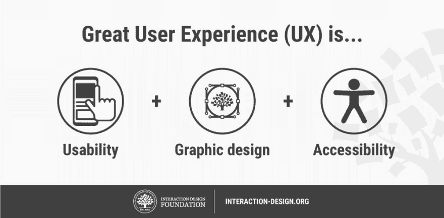

# 全球无障碍意识日的重要性是什么？

> 原文：<https://dev.to/eduardoramos/what-is-the-importance-of-global-accessibility-awareness-day-54e4>

联合国估计，全世界有超过 10 亿人患有某种形式的残疾，随着未来几年人口老龄化，这一数字预计将迅速上升。

再加上 10%患有色盲的人，你会开始明白为什么易访问性如此重要——不仅仅是出于道德和法律原因，也是为了让你的产品能够充分发挥潜力。你需要设计易访问性！

我认为这是设立全球无障碍意识日(GAAD)的绝佳理由。

GAAD 在每年 5 月的第三个星期四举行，旨在提高开发人员、设计师和其他创作者的意识，更加关注全球 10 亿残疾人的数字可访问性和包容性。

**如何支持 GAAD？**

了解如何参与 GAAD 的最佳方式是通过全球无障碍宣传日网站本身。他们列出了您可以支持的各种方式，包括:

*   现场活动
*   虚拟事件
*   网络研讨会
*   游戏堵塞
*   英国广播公司访问所有地区的实时流

你可以报名参加在线课程，在本周及以后提高你的可访问性意识，比如这个[可访问性:如何为所有人设计](https://www.interaction-design.org/courses/accessibility-how-to-design-for-all?ep=idf-gaad&utm_source=devto)。

有许多显而易见的伦理原因表明可访问性很重要，但最终，残疾人应该拥有与更广泛人群相同的权利，这包括他们参与数字世界、从中学习和交流的能力。

当我们承担起无障碍设计的责任时，我们为残疾人创造了更多使用数字技术的机会，同时扩大了我们的市场份额，支持工作场所的多样性和包容性。

如果你因为经济原因而忽视了无障碍设计，这意味着你不仅在大多数情况下是非法的，而且在你能从无障碍设计中获得的商业价值方面也是短视的。

虽然所有的创作者都有他们自己的设计和开发积压，公平地说，在这一点上，没有真正的借口为什么你不应该尽一切可能为易访问性设计。

设计师有责任——不仅对他们的职业，而且对用户和社会——设计无障碍的数字解决方案。全球无障碍意识日在这方面做得很好。