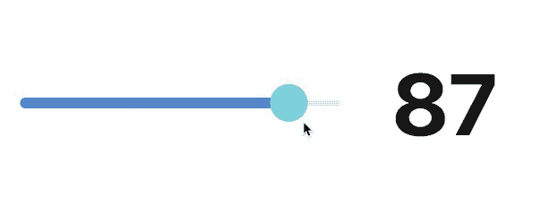
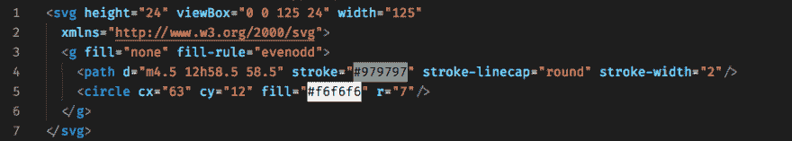

# 使用 SVG 在 React 中制作复杂的滑块

> 原文：<https://dev.to/darthknoppix/make-a-complex-slider-in-react-using-svg-4779>

## 使用 React 和 Pose 创建与 SVG 的复杂交互

* * *

React 的用途远比您想象的多，让我们利用 React 和 Pose 从 SVG 创建一个交互式滑块，对用户拖动它做出响应。

[](https://res.cloudinary.com/practicaldev/image/fetch/s--DTxFAshl--/c_limit%2Cf_auto%2Cfl_progressive%2Cq_66%2Cw_880/https://blog.sethcorker.com/conteimg/2019/07/responsive-toggle.2019-07-05-7_06_10-pm-2.gif)

<figcaption>SVG 滑块在动作</figcaption>

React 非常适合以声明的方式操作 HTML，使其易于理解和预测。React 可以做你所期望的一切，但是有一些很酷的应用你可能没有尝试过。SVG 对于现代 web 开发来说是完美的，因为它们是一种矢量格式，可以适合任何设备的屏幕，看起来很棒，但是它们有一种超能力。SVG 是有效的 HTML，可以和其他标记一起内联创建。这意味着我们可以使用 React 的强大功能来动态操作 SVG，我们还可以利用动画库姿势来使它变得简单有趣。

## 我们在制造什么？

我制作了一个幻灯片来展示一些关键技术，你可以利用它们来获得你想要的效果。

简单的 SVG 是在 Sketch 中创建的，然后每个参数都被识别并替换为 props。

滑块 SVG inline:

```
<svg
  height="24"
  viewbox="0 0 125 24"
  width="125"
  xmlns="http://www.w3.org/2000/svg"
>
  <g fill="none" fill-rule="evenodd">
    <path
      d="m4.5 12h58.5 58.5"
      stroke="#979797"
      stroke-linecap="round"
      stroke-width="2"
    ></path>
    <circle cx="63" cy="12" fill="#f6f6f6" r="7"></circle>
  </g>
</svg> 
```

滑块来源:

[](https://res.cloudinary.com/practicaldev/image/fetch/s--68ZQ9rm1--/c_limit%2Cf_auto%2Cfl_progressive%2Cq_auto%2Cw_880/https://blog.sethcorker.com/conteimg/2019/07/Screenshot-2019-07-05-at-7.34.41-pm.png)

<figcaption>SVG 滑块标记</figcaption>

**提示:** *根据您用来生成 SVG 的工具，您可能会得到更多的标签，我通过对它运行 ImageOptim 来去除这些标签。*

### 使用 React 来控制 SVG

我们可以很容易地识别可以改变的笔画和填充。这条路有点神秘。`d`属性包含绘制路径的信息。每个字母是一个命令，例如 ***m** 是 **moveto** 并接受(x y)坐标。*你可以在 [W3 规范中了解更多关于每个命令的功能。](https://www.w3.org/TR/SVG11/paths.html#PathDataGeneralInformation)

确定路径的哪些部分需要参数化需要一些反复试验，但最终我还是做到了。在最终版本中，我把路径分成了两个独立的路径，命令被更改为创建一条贝塞尔曲线而不是一条简单的线，这使得计算更容易理解，也意味着贝塞尔曲线更容易得到。

确定了每个参数的最终版本如下所示:

```
<svg
  height={HEIGHT}
  viewBox={`0 0 ${WIDTH}  ${HEIGHT}`}
  width={WIDTH}
  xmlns="http://www.w3.org/2000/svg"
>
  <g fill="none" fillRule="evenodd">
    <path
      d={`
      M ${START_X},${CENTER_Y}
      S ${(x - START_X) * 0.5},${y}
        ${x},${y}
      `}
      stroke={leftColour}
      strokeLinecap="round"
      strokeWidth="4"
    />
    <path
      d={`
      M ${x},${y}
      S ${x + (END_X - x) * 0.5},${y}
        ${END_X},${CENTER_Y}
    `}
      stroke={rightColour}
      strokeLinecap="round"
      strokeWidth="2"
    />
    <SliderKnob
      cx={CENTER_X}
      cy={CENTER_Y}
      r="7"
      fill={knobColour}
      onValueChange={{ x: onXChange, y: onYChange }}
    />
  </g>
</svg> 
```

大写的变量是常量，如`HEIGHT`、`WIDTH`、`START_X`、`START_Y`等

实现运动的重要变量是`x`和`y`。我们需要跟踪`SliderKnob`，这样我们就可以移动两条路径的端点。命令`S`用于创建曲线并接受参数( *x2 y2 x y* )。贝塞尔控制点或系数给了我们一条从线的起点到我们正在移动的旋钮的曲线。这完成了大部分困难的工作，现在我们需要让它具有交互性。

### 使滑块响应事件

姿势代码比弄清楚当坐标改变时如何让 SVG 绘制要容易得多。

```
const SliderKnob = posed.circle({
  draggable: true,
  dragBounds: {
    left: MIN_X,
    top: -CENTER_Y + MARGIN * 2,
    bottom: CENTER_Y - MARGIN * 2,
    right: MAX_X
  },
  dragEnd: {
    y: 0,
    transition: { type: "spring", damping: 80, stiffness: 300 }
  }
}); 
```

我们将`draggable: true`添加到 config 对象中以启用拖动，并设置边界以确保用户不能使用`dragBounds`将其拖离页面。更容易设置常数和基于这些的一切，它也减少了重新渲染的次数，如果这些值被作为道具传入。

提示:*为了更加灵活，可以创建一个工厂，返回一个给定了一组自定义常量的组件。*

`dragEnd`属性用于将旋钮重置为`y=0` so，并使用弹簧动画制作动画。这就是当我们松开鼠标时，产生一个松散的弹回的原因。

### 跟踪 X 和 Y

为了确保释放鼠标时 x 位置不会重置为 0，并使用 x 和 y 作为参数来控制 SVG，我们需要引入一些状态。这是通过对每个坐标使用`useState`钩子来完成的。

```
// Keep track of X and Y for svg path positioning
const [x, setX] = React.useState(0);
const [y, setY] = React.useState(0);

const onXChange = v => {
  setX(v + CENTER_X);
  // Send a percentage to onChange/1
  onChange(Math.floor(((v - MIN_X) * 100) / (MAX_X - MIN_X)));
};

const onYChange = v => {
  setY(v + CENTER_Y);
}; 
```

`onXChange`事件将计算百分比并调用一个`onChange`回调函数，这样父节点就知道了滑块的 X 位置，因为如果我们不能将它与任何东西挂钩，那还有什么用呢！

最后一个组件可以这样使用:

```
<Slider
  rightColour="#E1EDEB"
  leftColour="#5285CC"
  onChange={setValue}
  knobColour="#7DD2DB"
/> 
```

我制作了`rightColour`、`leftColour`(对应于形成滑块轨道的线条)和`knobColour`道具，这样我们就可以在不同的主题中重用滑块。

[https://codesandbox.io/embed/i1drh](https://codesandbox.io/embed/i1drh)

<figcaption>An interactive slider, complete with code, for your delight</figcaption>

现在你有了它，一个可以使用 React、Pose 和 SVG 拖动的交互式滑块。我希望你学到了一些东西，或者至少在这个过程中获得了乐趣。

## 外卖

SVG 非常灵活，所有主流浏览器都支持它，它们非常强大，因为你可以像操作网络上的其他元素一样操作它们。如果你想用 CSS 调整 SVG 或者用 React 做一些更复杂的事情，没有什么可以阻止你。Pose 是一个很棒的动画库，可以很容易地制作包括 SVG 在内的 HTML 元素的动画，所以你应该试一试。还有一些有用的事件，比如拖动，我们在滑块中使用它来使它具有交互性。

如果你想看看另一个更真实的例子，使用 Pose 来制作普通 HTML 动画。看一看， **[用姿势](https://dev.to/darthknoppix/animate-your-react-app-with-pose-492a)** 动画化你的 React 应用程序，它涵盖了一些易于交付的调整，以创造一个看起来很棒的体验。

* * *

*   查看[完整源代码，svg-slider-pose repo](https://github.com/Darth-Knoppix/svg-slider-pose) 。
*   了解更多关于[开始使用姿势](https://popmotion.io/pose/learn/popmotion-get-started/)的信息。