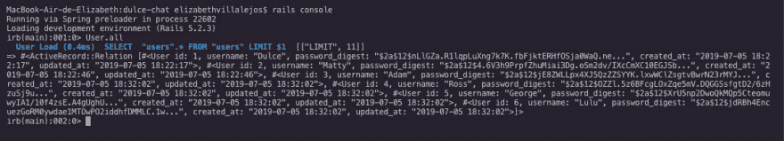
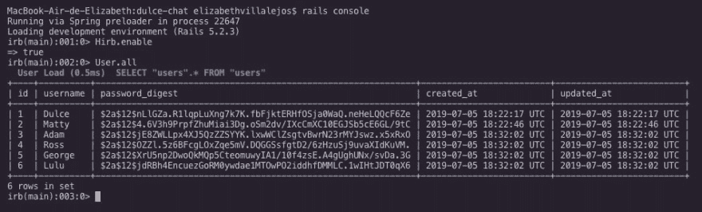

# 如何简化阅读 Rails 控制台

> 原文：<https://dev.to/misselliev/how-to-simplify-reading-your-rails-console-4fig>

当你试验你的代码时，Rails 控制台是一个很好的工具，但是如果我们有很多数据，它会变得有点复杂和耗时。

目前我正在开发一个聊天应用程序，在创建用户时，控制台的输出变得有点冗长，因为它都被打乱了。

## 今天我学会了

您可以通过在 gem 文件中添加一个名为 hirb 的 gem 来解决这个问题。

Hirb 是一个“迷你视图框架”,它根据输出控制台的类型对其进行格式化。所以你从这样的东西:

对此:

安装之后，运行 rails 控制台命令并在控制台上编写 Hirb.enable。

提示:使用控制台时，确保 H 是大写字母。对于添加到 gemfile 小写 hirb 没关系。

就这样，你准备好了。

你今天学到了什么？