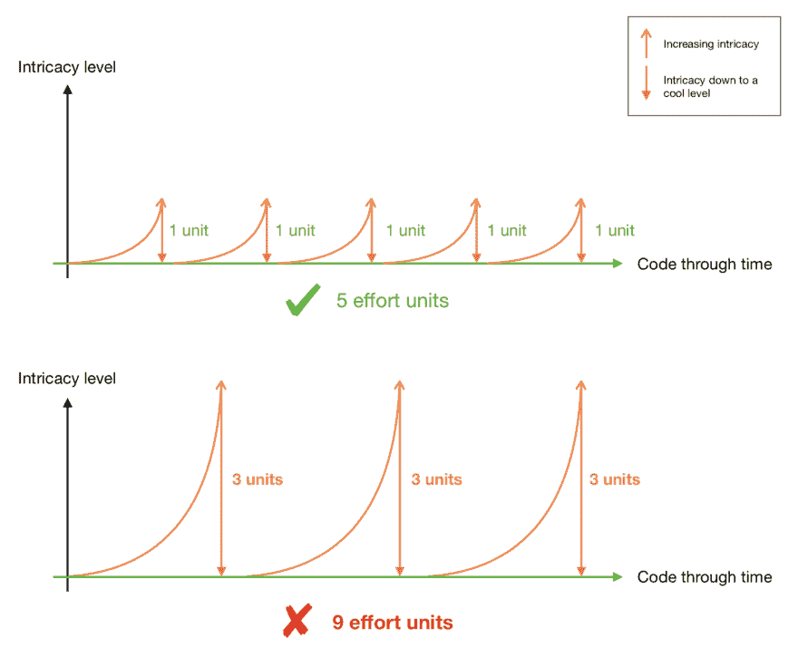

# 🙋🏽再见再见拖延

> 原文：<https://dev.to/keywinf/procrastination-get-out-of-my-room-3m80>

一些开发人员相信他们以后会有空闲和时间来处理补丁。这是一个严重的错误。

我的个人开发经验比其他任何东西都更让我明白隐藏在拖延背后的指数定律:你等待的越多，你就会后悔的越多。对于要做的小事来说尤其如此。

如果你觉得你的代码变得太复杂了，立即改变它:就像你在为用餐者管理愤怒的煮意大利面一样去做。

在丢弃令人毛骨悚然的东西之前三思；)