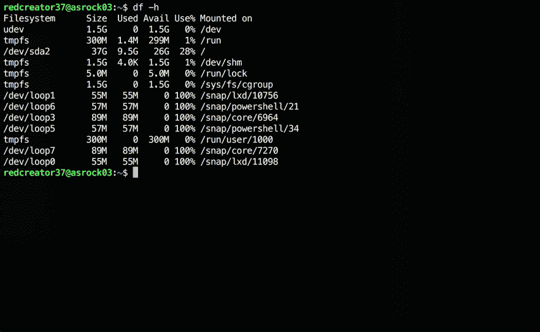
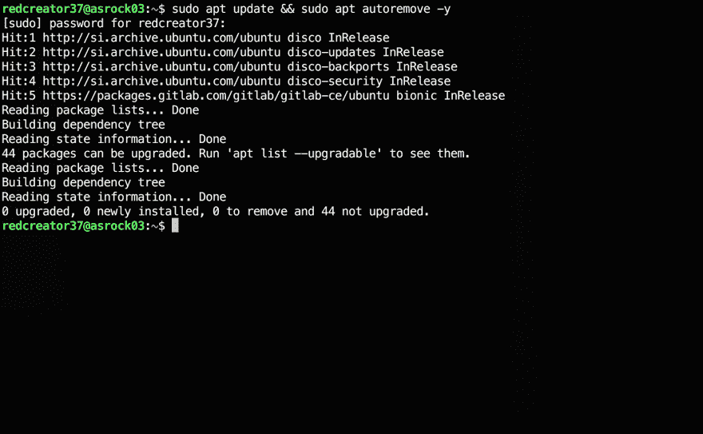
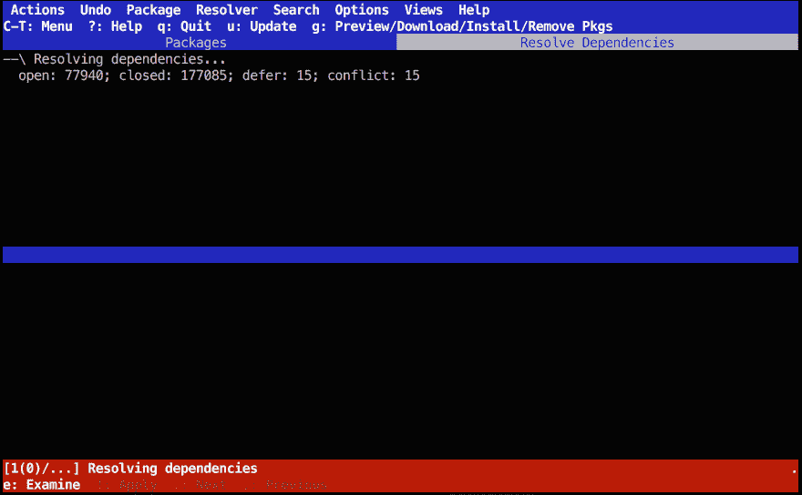
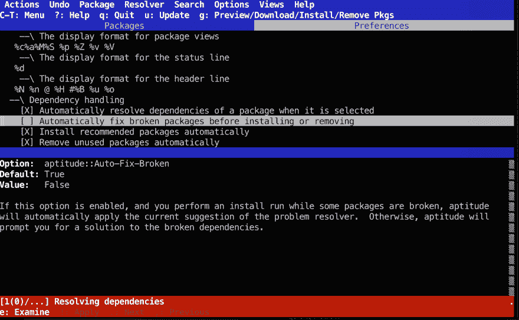
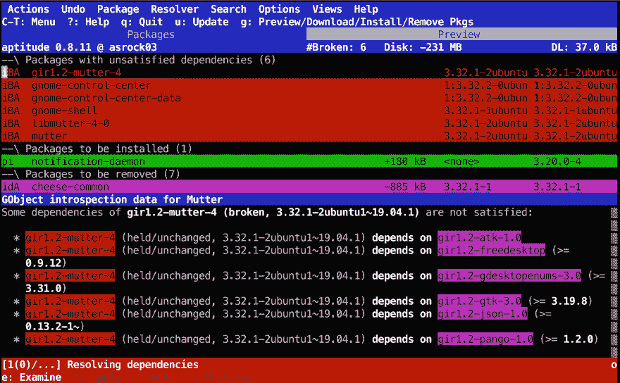
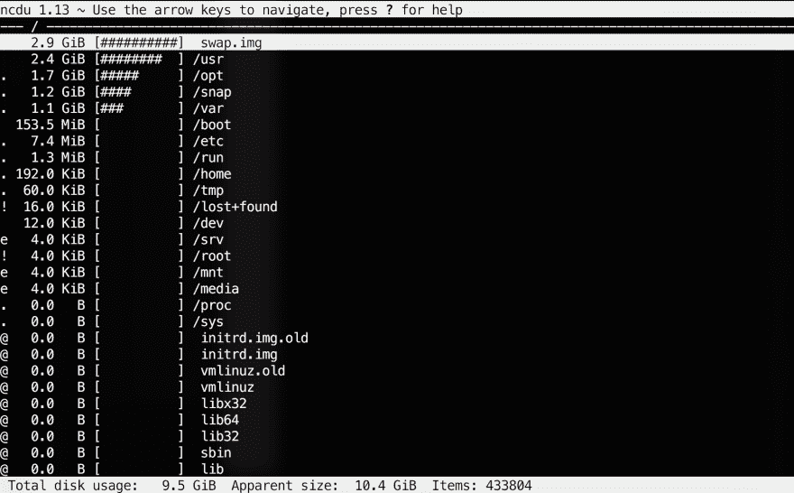

# 释放 Ubuntu 服务器上的空间

> 原文：<https://dev.to/redcreator37/freeing-up-space-an-a-ubuntu-server-526c>

这是我第一次发帖子。如果我使用了错误的标签或做了一些奇怪的格式化，请告诉我。非常感谢。

我有一个小型的 Ubuntu 服务器。一个带有 40 GB 硬盘的 nettop<sup>【1】</sup>，我用它来试验 Linux 的东西(因为我不太在乎它是否坏了)并托管一个 GitLab 实例。

40 GB 的磁盘实际上是一个旧的笔记本电脑，这个 nettop 附带了一个 300 GB 的磁盘，我把它放在了我的旧笔记本电脑上(也许不是一个好主意)，现在我懒得再次更换驱动器并重新安装所有软件(特别是在我的笔记本电脑上)。一个副作用是，服务器比以前慢了很多，因为它运行的是已经开始显示其年龄的旧 SATA I 驱动器(更不用说它还一直过热)。

*[1]上网本是指用作多媒体存储设备或机顶盒的小型电脑。大约 10 年前，在流媒体服务成为主流之前，它们非常普遍，人们希望能够在电视上观看电影，而不必刻录到 DVD 上。*

* * *

所以这将是一篇关于当我试图在 Ubuntu 驱动的服务器上释放一些空间时我通常会做的事情的文章。也许对某人会有用😉。

我要做的第一件事是 SSH 进入服务器并检查可用空间:

```
ssh redcreator37@192.168.xxx.xxx
df -h 
```

<svg width="20px" height="20px" viewBox="0 0 24 24" class="highlight-action crayons-icon highlight-action--fullscreen-on"><title>Enter fullscreen mode</title></svg> <svg width="20px" height="20px" viewBox="0 0 24 24" class="highlight-action crayons-icon highlight-action--fullscreen-off"><title>Exit fullscreen mode</title></svg>

这里我用 *df -h* 命令检查磁盘空间。-h 开关用于以 GB 而不是块为单位显示空间。以下是输出结果:

[](https://res.cloudinary.com/practicaldev/image/fetch/s--Dwh9DGaK--/c_limit%2Cf_auto%2Cfl_progressive%2Cq_auto%2Cw_880/https://thepracticaldev.s3.amazonaws.com/i/yc8jbwmdb8ny6dw05o3i.png)

如果仔细观察，可以看到磁盘上有 26gb 的可用空间:

```
/dev/sda2    37G   9.5G   26G   28%  / 
```

<svg width="20px" height="20px" viewBox="0 0 24 24" class="highlight-action crayons-icon highlight-action--fullscreen-on"><title>Enter fullscreen mode</title></svg> <svg width="20px" height="20px" viewBox="0 0 24 24" class="highlight-action crayons-icon highlight-action--fullscreen-off"><title>Exit fullscreen mode</title></svg>

您可能已经注意到，尽管该磁盘被标记为 40 GB，但总磁盘容量为 37gb(这里我们必须考虑许多因素)。

虽然 26 GBs 仍然是一个很大的存储空间，但我想摆脱我不再使用的旧文件和软件包。其中许多是我为了编译程序而安装的库，有两个在我停止运行这些程序后忘记删除了。这里我们要做的第一件事是更新包缓存并删除未使用的包(autoremove 命令)。

[](https://res.cloudinary.com/practicaldev/image/fetch/s--j4GKm4Y4--/c_limit%2Cf_auto%2Cfl_progressive%2Cq_auto%2Cw_880/https://thepracticaldev.s3.amazonaws.com/i/wl4hn330x155hc540d9m.png)

显然没有未使用的软件包可以删除，但是有 44 个软件包可以升级。我稍后会这样做，因为我会先删除我不再需要的东西(所以我不会在稍后升级和删除这些东西)。如果您一直在关注，您可能已经注意到命令末尾的-y 开关。这个开关只是告诉 apt 跳过任何确认提示，这有时弊大于利，所以要明智地使用它(并且可以随意修改我在这里使用的 apt 命令，特别是如果它们有问题的话)。

在这一点上，我们可以找出我们想要移除的所有包的名称，然后用 *sudo 来移除*或者使用 Aptitude 这样的工具来搜索包，并检查任何损坏的依赖项。

用 *sudo aptitude* 运行 Aptitude(可以用*sudo Aptitude-y*安装)。使用 arror 键浏览软件包列表，并使用-(连字符)标记要删除的软件包。我选择了一些我知道不会再使用的包，现在有 6 个坏包...😐我已经选择检查包，我开始注意到我真的应该把原来的驱动器放回去-它开始通过数据库检查包的关系，这真的花了很多时间。

[](https://res.cloudinary.com/practicaldev/image/fetch/s--arfxVbGM--/c_limit%2Cf_auto%2Cfl_progressive%2Cq_auto%2Cw_880/https://thepracticaldev.s3.amazonaws.com/i/rbnlxjcp4qkdpg9nzgos.png)

更糟糕的是，它甚至在某个时候挂起来了。我猜我只是让它删除包，破坏依赖关系或没有。我试着按 g 来启动操作(移除包)，但什么也没做。它只是放了一条信息“试图修复损坏的软件包…”在我面前，完全僵住了。甚至底部红色状态栏右侧的小进度指示器也停止了工作，光标消失了，菜单快捷方式(CTRL + T)也不起作用了...好吧，是时候重启了...令人惊讶的是，按几次 CTRL + C 确实有效，并终止了 Aptitude 进程。我再次启动了 Aptitude，这次在设置中禁用了自动包解析(CTRL + T，选择选项菜单，首选项)

[](https://res.cloudinary.com/practicaldev/image/fetch/s--XbHBm6Br--/c_limit%2Cf_auto%2Cfl_progressive%2Cq_auto%2Cw_880/https://thepracticaldev.s3.amazonaws.com/i/wfcq8uxblj802qceie4k.png)

现在我只能希望这能解决问题。让我们再试一次(**如果你的电脑没有这台慢，但仍然有反应，按 g 开始操作**)。这确实起作用了——这次不是只显示消息，而是有一个应用按钮，我按下它跳过了扫描过程。现在我至少知道是哪些包导致了问题:

[](https://res.cloudinary.com/practicaldev/image/fetch/s--Bpwy0D1P--/c_limit%2Cf_auto%2Cfl_progressive%2Cq_auto%2Cw_880/https://thepracticaldev.s3.amazonaws.com/i/v151v82ffg1ostwb7yp6.png)

我已经告诉它通过选择每一个并按-(减号)来移除破损的包。因为我在这里删除了所有与 GUI 相关的东西，所以这些都没用了。您还可以从包菜单中选择其他操作(如果您错过了，可以通过 CTRL + T 访问菜单)。现在我们准备好了(再按一次 g，应该可以了)。您通常可以让它做自己的事情，除非您的软件包配置出现了非常糟糕的情况(在这种情况下，您可能需要确认一些事情)。

在等待一段时间后，它应该工作并删除所有选中的包(当然，做你指示它做的其他事情)。如果您想看看我们释放了多少空间，您可以再次运行 *df -h* ，但是如果还没有任何巨大的改进，请不要感到惊讶。我们现在(终于)可以升级软件包了。快速*升级& &远程升级*。之后，运行*sudo apt clean&&sudo apt auto clean&&sudo apt auto remove*(您也可以将-y 开关附加到这些选项上，以跳过任何确认提示，或者根据需要单独运行它们)。

至此，我们已经基本完成了包管理部分。你可以做的其他事情是运行 *dpigs* (来自 debian-goodies 包)来找出哪些包占用了最多的磁盘空间。

最后但同样重要的是，我们可以通过搜索巨大的文件和目录来释放大量的空间。一个很好的工具是 ncdu(du 命令的 ncurses 版本)。运行 *ncdu /* 开始扫描大文件。这可能需要一段时间，因为它必须扫描整个/驱动器。

[](https://res.cloudinary.com/practicaldev/image/fetch/s--LLluhOLs--/c_limit%2Cf_auto%2Cfl_progressive%2Cq_auto%2Cw_880/https://thepracticaldev.s3.amazonaws.com/i/u1q3b7qm9z7gn49cgvft.png)

您可以浏览目录结构，找到每个目录中最大的文件。如果你发现一个非常大的文件，你想删除只需按 d，选择是，它应该消失了。

最常见的空间消耗者之一是旧版本的 Linux 内核和日志，如果没有一些简洁的脚本来检查和删除它们，它们会堆积起来。至于内核，总是保留一两个旧版本作为后备，以防最新版本出现问题。任何合适的软件包管理器都应该处理好这个问题，但是如果由于某种原因没有处理好，你可能会删除很多过时的内核(你这样做是自担风险的，所以不要责怪 Linux 神奇地不再工作了)，并确保你重新配置 GRUB 以避免以后的引导问题。

虽然不多，但我希望这篇文章能对某人有所帮助。这是我在 DEV.to 上的第一篇文章，我欢迎任何建议。如果你有问题或者在我的文章中发现了错误，请随时留下评论🙂