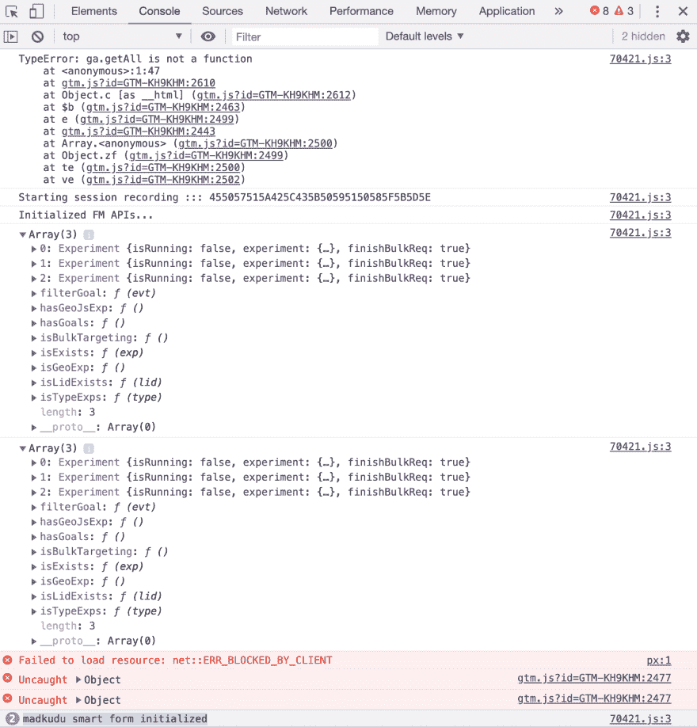
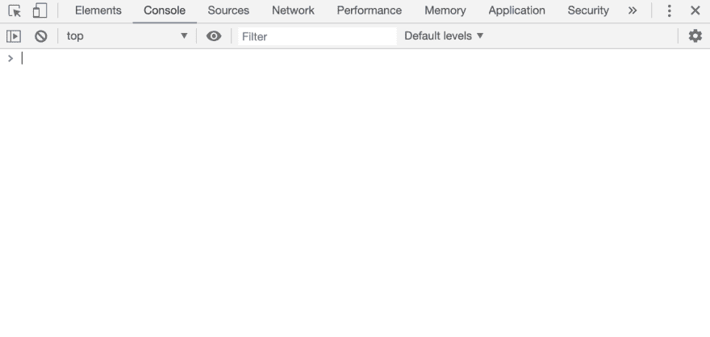
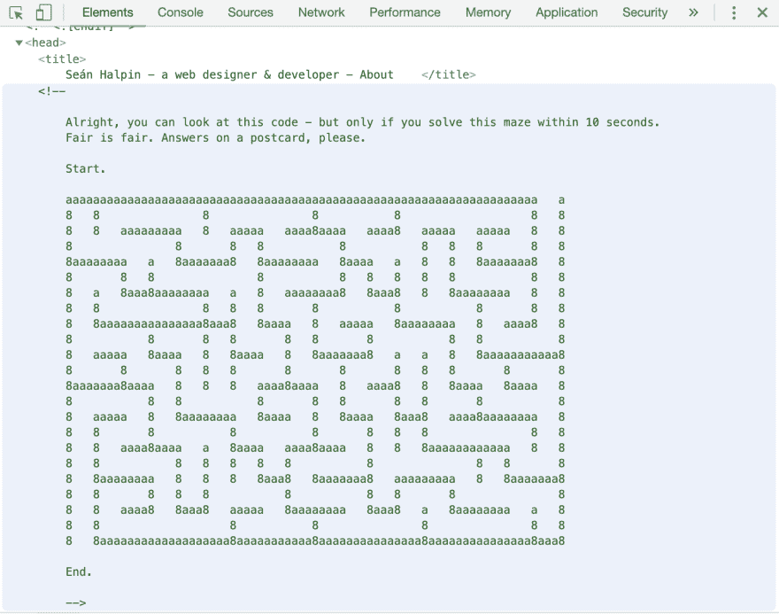

# AYDT - 01(你是不是在做这个)——迈向忍者之地的一步。

> 原文：<https://dev.to/chintukarthi/aydt-01-are-you-doing-this-one-step-towards-ninja-land-3eb8>

当你犯了一个错误，改变你的视角，从不同的角度看待它。错误让你变得聪明。

**乌龟大师**曾经说过，

[](https://res.cloudinary.com/practicaldev/image/fetch/s--t3eBvHR4--/c_limit%2Cf_auto%2Cfl_progressive%2Cq_auto%2Cw_880/https://thepracticaldev.s3.amazonaws.com/i/snctkcvvldebh9zz2jao.jpg)

无论在什么领域，当你带着事故教给你的教训前进时，事故会让你变得更强大。编码也是。

在我开始编码的最初阶段，我在理解编码的基本概念时遇到了困难。

一路上，我学到了一些零碎的东西，让我比之前的版本领先一步。

在这个编码系列中，我将解释在编写一段代码时要记住的基本事情。

### **你在做 This❓-清算控制台！**

大多数开发人员使用日志来测试他们的代码是否按照预期的方式运行。这是一种很好的调试方式，但是，我们中的一些人在将代码转移到生产环境时没有清除日志。

类似这样的事情，

在 Javascript 中

```
console.log("I failed to clear my logs ☹️"); 
```

Enter fullscreen mode Exit fullscreen mode

在 Java 中，

```
System.out.print("I failed to clear my logs here too!!! ☹️"); 
```

Enter fullscreen mode Exit fullscreen mode

一旦你开始掌握这门语言，你可以找到更多的调试方法。

您可以在不清除日志的情况下将代码投入生产。当然，它不会对功能产生任何影响。但是，这是一种好的做法吗？

问问你自己。

把自己当成一个用户。你会欣赏以下哪一款游戏机？

这个？

[](https://res.cloudinary.com/practicaldev/image/fetch/s--pt8cC1RL--/c_limit%2Cf_auto%2Cfl_progressive%2Cq_auto%2Cw_880/https://thepracticaldev.s3.amazonaws.com/i/0o76q29303swrfqsilet.png)

还是这个？

[](https://res.cloudinary.com/practicaldev/image/fetch/s--pFwogSOT--/c_limit%2Cf_auto%2Cfl_progressive%2Cq_auto%2Cw_880/https://thepracticaldev.s3.amazonaws.com/i/36mzmbooi3nda2ws3bi7.png)

"**通过清除日志使你的代码干净。仅仅因为用户看不到，并不意味着我们可以认为这是理所当然的。**

### **奖励提示:**

在浏览一个网页开发者的作品集时，我发现了这个。

[](https://res.cloudinary.com/practicaldev/image/fetch/s---AI1X_kU--/c_limit%2Cf_auto%2Cfl_progressive%2Cq_auto%2Cw_880/https://thepracticaldev.s3.amazonaws.com/i/tx8r0tknejzqcn4fh0up.png)

很棒吧？😉

你可以在这里的网站的开发工具中检查它:[http://seanhalpin.io/](http://seanhalpin.io/)

这就是你吸引用户的方式😎

下次您试图在控制台中记录一些东西时，

请记住:住在世界上某个地方的一个开发伙伴会看你的代码。🤪

封面图片提供:[https://www.codeninja.com.sg/](https://www.codeninja.com.sg/)