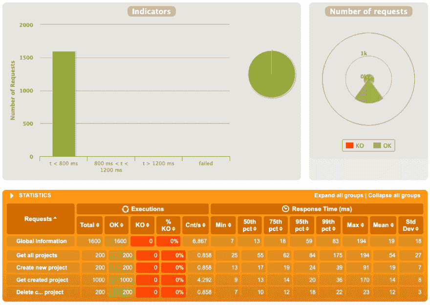
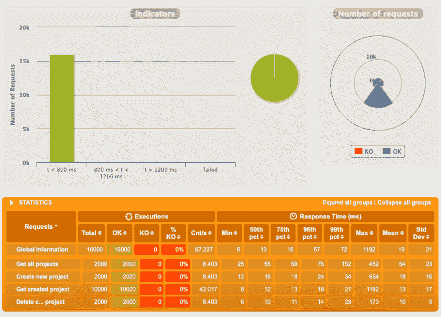
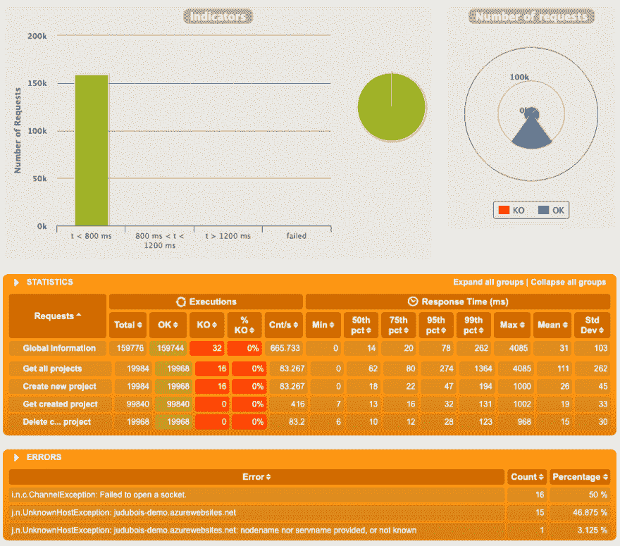
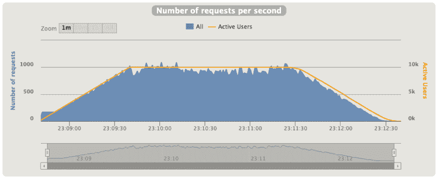
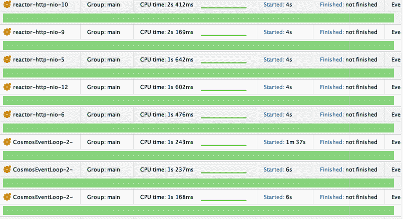
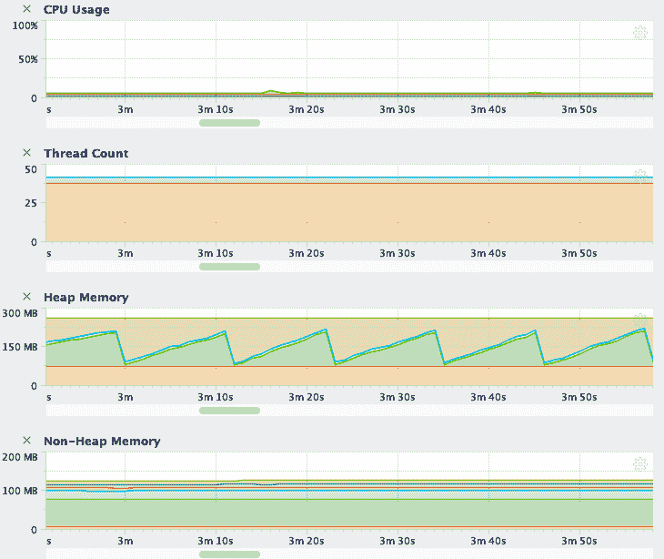

# 使用 Spring Webflux 和新的 CosmosDB API v3 实现完全反应

> 原文：<https://dev.to/azure/going-full-reactive-with-spring-webflux-and-the-new-cosmosdb-api-v3-1n2a>

## 去满无功？

在 Spring Boot 和 MongoDB 上发表了这篇[博客文章后，我决定移植这篇文章，以便“充分反应”:](https://dev.to/azure/deploying-a-spring-boot-mongodb-application-to-azure-web-apps-cosmosdb-52ki)

*   从标准的 Spring Web stack 迁移到 Spring Webflux，Spring Web flux 使用 project Reactor 来拥有一个反应式 API。
*   使用 SQL API 从带有 MongoDB API 的 CosmosDB 迁移到最新的 CosmosDB SDK。如果你想了解更多关于 CosmosDB 的信息，这里有文档。

这篇文章的想法是，我们应该从数据库到 Web 层完全反应，这样我们就可以研究所需的 API，并看看这个架构的性能和可伸缩性。

## 给新的 Azure CosmosDB SDK 注入活力

**请注意**这个用的是最新的 Azure CosmosDB SDK，还没有完成，所以这个帖子也是那个 SDK 的全球首发预览，可以测试一下，讨论一下。我(Julien Dubois)直接与微软的 SDK 团队联系，所以如果您有任何意见或问题，请不要犹豫，发表在本文上，或者直接与我联系！

*   这个新的 SDK 在[https://github.com/Azure/azure-cosmosdb-java/tree/v3](https://github.com/Azure/azure-cosmosdb-java/tree/v3)有售。
*   在撰写本文时，文档和示例应用程序还没有准备好。
*   如果你使用的是以前的 SDK，请注意 Maven `artifactId`已经改变，这个 SDK 现在可以在[com . Microsoft . azure:azure-cosmos](https://search.maven.org/artifact/com.microsoft.azure/azure-cosmos/3.0.0/jar)获得。

由于这是一些新的代码，您可能会遇到一些问题。例如，我写这篇博客时发现了这个问题，我[在这里提出了一个解决方案](https://github.com/Azure/azure-cosmosdb-java/pull/222)。但是正如你将在这篇博文中看到的，这个新的 API 比以前的好得多，并且表现得非常好。

## 使用新的 CosmosDB SDK 进行 CRUD

关于新的 CosmosDB SDK 的真正令人敬畏的消息是，它使用 project Reactor，如 Spring Webflux，而不是以前版本中老化的 RxJava v1 API。这意味着它将返回`Mono`和`Flux`对象，而这些正是 Spring Webflux 所喜欢的，所以集成这两者将会非常顺利和容易。

整个演示项目可在[https://github.com/jdubois/spring-webflux-cosmosdb-sql/](https://github.com/jdubois/spring-webflux-cosmosdb-sql/)获得，但是让我们集中在[存储库层](https://github.com/jdubois/spring-webflux-cosmosdb-sql/blob/master/src/main/java/io/github/jdubois/asynccosmos/repository/ProjectRepository.java)上，因为这是所有 CosmosDB SDK 神奇之处所在。

### CosmosDB 配置和连接

为了保存我们的配置，我们创建了一个特定的 [Spring Boot 配置属性类](https://github.com/jdubois/spring-webflux-cosmosdb-sql/blob/master/src/main/java/io/github/jdubois/asynccosmos/config/ApplicationProperties.java)。这用于我们的[存储库层](https://github.com/jdubois/spring-webflux-cosmosdb-sql/blob/master/src/main/java/io/github/jdubois/asynccosmos/repository/ProjectRepository.java)，看起来像这样:

```
ConnectionPolicy connectionPolicy = new ConnectionPolicy();
connectionPolicy.connectionMode(ConnectionMode.DIRECT);

client = CosmosClient.builder()
    .endpoint(accountHost)
    .key(accountKey)
    .connectionPolicy(connectionPolicy)
    .build(); 
```

重要的是，它使用“直接模式”连接策略，而不是默认的“网关”策略:在我们的测试中，这显然产生了巨大的差异，因为我们的反应式代码对于网关来说可能太高效了，并且很快就泛滥了。所以我们有很多到网关的连接错误，当我们切换到直接模式时，这些错误就消失了:如果你可以使用它，在这个“反应式”场景中非常强烈地推荐它。

在`init()`方法中(此处可用的，我们还做了两次阻塞调用来创建数据库及其容器。这里有几个有趣的调整:

*   我们的容器没有索引策略，因为我们使用了`indexingPolicy.automatic(false);`。默认情况下，CosmosDB 会对所有存储对象的所有字段进行索引，这在插入过程中会产生很大的开销。我们的测试不需要这个，但是我们也认为它太激进了，应该针对每个特定的用例进行调整。
*   使用`database.createContainerIfNotExists(containerSettings, 400)`以 400 的默认 RU/s 创建容器。小心这个设置，因为如果设置的太高，很快就会花费很多钱。奇怪的是，在 MongoDB API 中它被设置为`1000`,而在 SQL API 中它被默认为`400`——但无论如何，这是一个如此重要的设置，修复它比依赖默认值要好。
*   在做`new CosmosContainerProperties(CONTAINER_NAME, "/id");`的时候，我们用我们的`id`作为分区键。这就是为什么将使用`container.getItem(id, id)`获得一个条目:第一个参数是`id`，第二个是分区键，恰好也是`id`。这样做很好，在我们的演示中，`Project`确实应该用来划分所有内容，所以这具有商业意义。

### 创建、查找和删除项目

对于简单的操作，当我们有一个条目的`id`(和分区键)时，我们可以直接使用一个简单的 API，例如创建:

```
public Mono<Project> save(Project project) {
    project.setId(UUID.randomUUID().toString());
    return container.createItem(project)
        .map(i -> {
            Project savedProject = new Project();
            savedProject.setId(i.item().id());
            savedProject.setName(i.properties().getString("name"));
            return savedProject;
        });
} 
```

由于没有提供 ORM，我们需要手动将返回结果映射到我们的域对象。对于更大的对象来说，这是相当多的样板代码，但这是这种技术的共性。当然，好消息是，在这种情况下我们可以很容易地返回一个`Mono<Project>`，这正是 Spring Webflux 想要的。

### 查询

执行 SQL 查询有点复杂，这里有两个问题:

*   由于我们的`id`也是我们的分区键，我们必须允许跨分区查询，以便使用`options.enableCrossPartitionQuery(true);`获得所有数据。这当然有性能成本。
*   因为我们想要分页的数据，所以我们在 SQL 查询中使用了`TOP 20`来只获取 20 项，而不是淹没系统。

下面是生成的代码:

```
FeedOptions options = new FeedOptions();
options.enableCrossPartitionQuery(true);

return container.queryItems("SELECT TOP 20 * FROM Project p", options)
    .map(i -> {
        List<Project> results = new ArrayList<>();
        i.results().forEach(props -> {
            Project project = new Project();
            project.setId(props.id());
            project.setName(props.getString("name"));
            results.add(project);
        });
        return results;
    }); 
```

**在试图限制返回值的数量时要小心**，因为您可能会尝试使用`options.maxItemCount(20)`来配置`FeedOptions`实例。这是行不通的，而且相当棘手:

*   该查询返回分页的值，`maxItemCount`实际上是每页中值的数量。这来自 CosmosDB API(事实上，这是查询时在下面使用的 HTTP 头的名称)，所以这个名称中有一些逻辑，但这肯定会引起麻烦，因为这个名称是误导性的。所以，如果你把它设置为`20`，这意味着你仍然可以在小页面中得到你的整个项目列表，这将是非常昂贵的。
*   请注意，文档没有说明默认的`maxItemCount`是什么，但是它被硬编码为 100。
*   正是因为这个 API，我们的查询返回了一个`Flux<List<Project>>`而不是一个`Flux<Project>`:我们有一个页面流，而不仅仅是一个流。

## 性能测试

至少我们到达了性能测试！我们将在 Spring Boot 和 MongoDB 上做一些类似于[博客帖子的事情，这样你可以看到两个结果，但是不要比较苹果和橘子，因为另一个应用程序是使用](https://dev.to/azure/deploying-a-spring-boot-mongodb-application-to-azure-web-apps-cosmosdb-52ki) [JHipster](https://www.jhipster.tech/) 创建的。JHipster(还)不完全支持反应式编程，所以 Spring Webflux 是手工编写的，因此非常不同:

*   JHipster 应用程序具有安全性、审计和度量:这些都消耗了相当多的性能，但是如果您想在生产中部署真正的应用程序，它们是必不可少的。我们的 Spring Weblux 演示要简单得多。
*   此外，JHipster 提供了几个我们在 Spring Webflux 演示中没有的性能调整，例如如果使用[加力](https://github.com/jhipster/generator-jhipster/issues/9934)。

因此，尽管比较这两种应用程序很有意思，但请记住，它们并不完全是一对一的。

### 准备生产

正如我们在 Spring Boot/MongoDB 的博文中所做的，我们使用提供的 Maven 插件在 [Azure Web Apps](https://azure.microsoft.com/en-us/services/app-service/?WT.mc_id=devto-blog-judubois) 上部署了应用程序(参见 pom.xml 中的[)。](https://github.com/jdubois/spring-webflux-cosmosdb-sql/blob/master/pom.xml#L60)

### 测试场景

我们的测试场景是用 Gatling 制作的，可以在[https://github . com/jdubois/spring-web flux-cosmosdb-SQL/blob/master/src/test/Gatling/user-files/simulations/projectgatlingtest . Scala](https://github.com/jdubois/spring-webflux-cosmosdb-sql/blob/master/src/test/gatling/user-files/simulations/ProjectGatlingTest.scala)上找到。这是一个简单的脚本，模拟用户使用 API:创建、查询和删除项目。

### 运行 100 个用户

我们的第一个测试有 100 个用户，正如预期的那样，一切都运行得很好，因为没有太多的并发请求:

[](https://res.cloudinary.com/practicaldev/image/fetch/s--kvWMdbAu--/c_limit%2Cf_auto%2Cfl_progressive%2Cq_auto%2Cw_880/https://thepracticaldev.s3.amazonaws.com/i/pil647rechfszf4g6qgy.png)

没什么好看的，继续前进吧！

### 打算 500 个用户

达到 500 个用户很有趣:它仍然工作得很好，但是我们有 3 个错误:

[](https://res.cloudinary.com/practicaldev/image/fetch/s--Rg4wuHmG--/c_limit%2Cf_auto%2Cfl_progressive%2Cq_auto%2Cw_880/https://thepracticaldev.s3.amazonaws.com/i/ol3xx4524lt4tcktfbwr.png)

这是因为在 CosmosDB 上删除条目是一项开销很大的操作(它使用的内存比 5 RU 多一点)，所以在应用程序满负荷时这样做意味着我们达到了 API 极限。这是拥有比传统的 Spring Web 框架更高性能和更稳定的应用程序的结果:我们对后端的打击更大，我们需要考虑到这一点。

### 达到 1000 个用户

为了超过 500 个用户，我们需要增加我们的 CosmosDB RU/s，就像我们对 Spring Web 所做的那样。在这里，1，200 RU/s 似乎足够了，但老实说，我们将它提高到了 5，0000 RU/s，因此我们在其余的测试中不必担心这一点。

[](https://res.cloudinary.com/practicaldev/image/fetch/s--dxCbYBHk--/c_limit%2Cf_auto%2Cfl_progressive%2Cq_auto%2Cw_880/https://thepracticaldev.s3.amazonaws.com/i/k2uj7dgzqqy7mpxm4dm4.png)

同样，一切顺利，没有任何问题，让我们扩大规模！

### 万名用户

去 10，000 个用户有一个有趣的副作用:我们的加特林测试开始失败，在客户端。所以我们不得不在我们的负载测试机器上增加`ulimit`:这很正常，但是在 Spring Web 上没有发生，所以这里我们再次看到完全反应是有影响的，因为它对于我们的负载测试机器来说运行得太快了。尽管如此，我们还是有一些客户端错误，因为 Gatling 找不到我们服务器的主机名:这就是为什么我们不能访问 20，000 个用户的原因...

在达到 5，000 个用户后，我们也开始出现一些服务器错误:这些基本上与客户端相同，服务器上打开了太多文件。由于我们使用的是 Azure Web Apps，我们不能修改服务器上的任何东西，但是我们可以轻松地扩展它。从我们的测试来看，似乎 2/3 的服务器就足够了，但是我们使用了 5 台以确保万无一失。请注意，对于 Spring Web，我们使用了 20 台服务器:同样，这两个测试也不是一对一的，应该进行改进，但是很明显，我们使用了更少的资源。

[](https://res.cloudinary.com/practicaldev/image/fetch/s--azi4XyJN--/c_limit%2Cf_auto%2Cfl_progressive%2Cq_auto%2Cw_880/https://thepracticaldev.s3.amazonaws.com/i/zbukn4b3r7uwggmnnwnm.png)

另请注意，我们的第 99 百分位性能非常出色，我们可以在一分钟内轻松扩展到 1，000 个请求/秒，图表非常清晰:

[](https://res.cloudinary.com/practicaldev/image/fetch/s--1FiTAMtP--/c_limit%2Cf_auto%2Cfl_progressive%2Cq_auto%2Cw_880/https://thepracticaldev.s3.amazonaws.com/i/42iktgwydenn48pb8roh.png)

## 剖析

由于我们的图表看起来一切都很好，但我们的负载测试工具阻止我们进一步深入，我们决定用 [YourKit](https://www.yourkit.com/) 做一些分析，以确保我们没有任何阻碍或阻碍我们进一步深入。

在本地机器上运行 5，000 个用户，我们可以看到没有线程阻塞:

[](https://res.cloudinary.com/practicaldev/image/fetch/s--qnUN4paP--/c_limit%2Cf_auto%2Cfl_progressive%2Cq_auto%2Cw_880/https://thepracticaldev.s3.amazonaws.com/i/3gkg33i2tcg6gjte2a0n.png)

此外，我们的 CPU 使用率极低，线程数稳定，内存低且稳定:

[](https://res.cloudinary.com/practicaldev/image/fetch/s--KXTT7X9f--/c_limit%2Cf_auto%2Cfl_progressive%2Cq_auto%2Cw_880/https://thepracticaldev.s3.amazonaws.com/i/ta27kg4a2eiaucfk86rz.png)

我们还运行了一些 YourKit 分析来寻找瓶颈、锁或内存密集型对象:我们不告诉你细节，因为我们什么也找不到！

## 结论和最终想法

通过“完全反应式”，我们获得了许多优势:

*   应用程序启动更快，使用更少的 CPU 和内存。
*   它具有非常稳定的吞吐量。
*   它很容易扩展。

然而，一切都不完美:

*   代码就多了，相当复杂，需要很好的技术背景。
*   一切都需要无阻塞:这在这个简单的用例中很棒，但在现实生活中要复杂一点。例如，我喜欢使用 Spring Cache:它易于使用，并且使用 Memcached 或 Redis 服务器可能比扩展 Cosmos DB 要便宜得多。但是由于这是一个阻塞操作，我们不能在这里使用它！
*   只有当有大量用户时，人们才会对“完全反应式”感兴趣。如果你每秒只有 500 个请求，你可能过度工程化了。

我们还初步体验了 CosmosDB SDK 的新 v3 版本:我们证明了它在高负载下工作得非常好，并且我们有幸让它与 Spring Webflux 的反应式框架一起工作。
肯定还有一些漏洞，还有一些 API 需要改进，例如:

*   它不使用 setter/getter，例如，我们使用`options.maxItemCount(20)`来设置最大项目计数，使用`options.maxItemCount()`来获取该计数。我个人觉得这个不太好用。
*   我觉得奇怪的是，要创建一个项目，您只需使用`container.createItem(project)`给出一个 POJO，但是如果您需要读取该项目，您会收到一个`CosmosItemResponse`，然后需要手动创建 POJO。我认为我们可以有一些自动 POJO 映射器，就像我们对 MongoDB 所做的那样。
*   对于查询，我们可以有一个流畅的查询生成器

因为还有时间改进 API，所以请花时间阅读演示代码，并提供反馈:在这篇文章上添加评论，发送 Twitter 消息...不要犹豫，我很乐意与微软的 SDK 团队交流反馈。