# 使用 Selenium 和 Python 假设进行自动化测试

> 原文：<https://dev.to/lambdatest/using-selenium-and-python-hypothesis-for-automation-testing-32p3>

当涉及到测试软件产品时，各种形式的测试，例如单元测试、集成测试、发布测试等。在 SDLC(软件开发测试周期)的不同阶段执行。然而，开发人员面临的一个主要挑战是提出测试用例&测试套件，它们可以帮助验证代码的每个方面，以便他们能够实现最大的代码覆盖率。

想出能够覆盖角落场景或边缘场景的独特的单元测试用例是一项巨大的任务。即使开发人员能够识别场景，他也必须编写大量代码来实现目标。很多时候，这会导致复制测试用例，并修改(添加/删除)几行代码来产生新的测试用例。这就是[假设，Python 测试库](https://hypothesis.readthedocs.io/en/latest/)可以用于创建单元测试的地方，这些单元测试易于编写并且在执行时功能强大。尽管这使得单元测试变得很容易，但美妙之处在于你不会想到的边缘测试用例。在我们详细了解 Python 和 Selenium 中的假设测试之前，我们先来看看一个重要的方面，叫做**基于属性的测试**，它构成了假设 Python 库的基本前提。

## 基于属性的测试概述

当您计划将基于属性的测试合并到您的测试策略中时，您应该利用 Python 测试的假设。单元测试和基于属性的测试之间有很大的区别。在单元测试中，的开发人员提供输入以验证代码的功能。将输出与预期输出进行比较，基于比较结果，测试被宣布为通过/失败。

另一方面，基于属性的测试是关于在各种各样的输入中测试程序。对于基于属性的测试，配备了生成器的库用于生成测试的输入值。这也可以通过使用单元测试来实现，但是开发人员将不得不编写更多的代码来适应不同类型的输入值。基于属性的测试最初是由 Haskell 中的 QuickCheck 框架引入的。在单元测试中，输入是手动提供的，即通过代码，因此有可能会错过某些测试场景(尤其是边缘场景)。这就是基于属性的测试在不同类型和输入范围的代码验证中发挥作用的地方。

*   单元测试–提供一个输入(如 0，1，2，…)并得到一个结果(如 1，2，4，…)。)
*   基于属性的测试——输入描述(如所有 int)和必须保持的条件描述(如结果是 int)

## 什么时候使用基于属性的测试？

您可能会争辩说，进行单元测试对您来说已经足够了，因为您能够使用单元测试代码来发现代码中的 bug。虽然这种说法在某些情况下可能足够了，但基于属性的测试在彻底测试您的代码时可能更有用，因为它甚至考虑了大多数边缘测试用例。就单元测试和基于属性的测试而言，没有明显的赢家，理解基于属性的测试的利弊很重要。

***嘿，你在检查浏览器的兼容性吗 [CSS Rebeccapurple color](https://www.lambdatest.com/web-technologies/css-rebeccapurple?utm_source=devto&utm_medium=organic&utm_campaign=jun15_rn&utm_term=rn&utm_content=web_technologies) ，这是 CSS 颜色模块 Level 4 中添加的新颜色，更好的说法是“css-rebeccapurple”是一种带有红色色调的紫色，以 CSS 大师和 web 开发人员 Rebecca Skinner 的名字命名。***

### 基于属性的测试的优势

1.  作为一名开发人员，您可以使用这种方法得出无限数量的测试用例。可以生成的测试数量受到您可以投资于测试的时间和用于生成测试用例的机器的能力的限制。
2.  Python 测试的 Hypothesis 等强大的库可以用来生成基于属性的测试。使用像测试策略这样的特性，开发人员可以用最少的代码实现进行大量的测试。
3.  如前所述，基于属性的测试最适合于边缘场景的开发和测试。

### 基于属性的测试的缺点

1.  由于测试用例是使用库的功能/特性随机生成的，比如使用 Selenium 进行 Python 测试的假设，因此一些重要的边缘场景可能会被遗漏。
2.  学习和掌握用于基于属性的测试的工具/库涉及到大量的学习曲线。因此，使用这些库编写代码有时会是一个很大的挑战。
3.  找到能够满足您的测试需求的属性是另一个挑战。然而，一旦你掌握了基于属性的测试的艺术(使用一些库，比如 Hypothesis，用于 Python 测试)，这个问题可能就不成立了。

总是建议使用基于属性的测试，以及单元测试来获得最大的结果。

[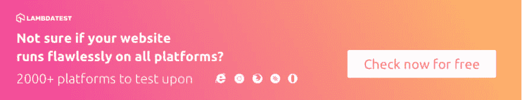](https://accounts.lambdatest.com/register/?utm_source=devto&utm_medium=organic&utm_campaign=jun15_rn&utm_term=rn)

## 假设一个 Python 测试库

到目前为止，我们已经看到了基于属性的测试相对于传统的基于实例的测试的优势。在基于实例的测试方法中，有一个测试输入“I”被传递给被测函数，测试函数的结果与预期结果进行比较。您可能无法实现完整的测试穷举，因为实现依赖于开发人员的理解。您的测试代码可能不够健壮，无法覆盖所有类型的测试输入。

通过基于属性的测试和假设，测试穷举性和测试健壮性是可能的，Python 测试库可用于有效的属性测试。

使用假设，你可以从一个例子源中编写参数化的测试。它生成简单易懂的示例，可以测试代码的各个方面(尤其是代码可能失败的地方)。

因为您能够测试更多的边缘测试用例，所以您可以用更少的工作量在代码中找到更多的 bug。在本文的后续章节中，我们将详细介绍 Python 测试的假设特性。

我们将利用 **pytest 和 Selenium 进行假设 Python 测试**。如果你还不知道 pytest 是如何工作的，可以看看我们在[pytest&Selenium web driver](https://www.lambdatest.com/blog/test-automation-using-pytest-and-selenium-webdriver/?utm_source=devto&utm_medium=organic&utm_campaign=jun15_rn&utm_term=rn)上的博客！

Hypothesis 与 Selenium 和 Python(版本 2.7 及以上)兼容，并支持 py.test、unittest 和 Nose 等流行的测试框架。为了实现，我们使用 PyCharm IDE(社区版),可以从[这里](https://www.jetbrains.com/pycharm/download/#section=windows)下载。一旦你安装了 Selenium 和 Python，pytest 您应该使用下面的命令安装 Python 测试的假设。

**皮普安装假设** [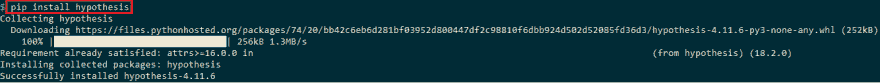](https://res.cloudinary.com/practicaldev/image/fetch/s---sdpEuSh--/c_limit%2Cf_auto%2Cfl_progressive%2Cq_auto%2Cw_880/https://www.lambdatest.com/blog/wp-content/uploads/2019/05/image1-1.png)

现在，您已经用 Selenium 安装了 Python 测试的假设，让我们来看看一个非常简单的问题，它展示了单元测试以及基于参数化的 pytests 的缺点。在下面的程序中，我们计算两个数的和:

```
 A simple pytest to add two numbers

import pytest
import pytest_html

# Define a function which takes two arguments as integers and adds the two numbers
def sum_of_numbers(number_1, number_2):
    return number_1 + number_2

# A simple test case to verify the sum_of_numbers function
# Since it is a pytest testcase, the test function should start with test_
def test_verify_sum_of_numbers():
    assert sum_of_numbers(2, 3) == 5 
```

<svg width="20px" height="20px" viewBox="0 0 24 24" class="highlight-action crayons-icon highlight-action--fullscreen-on"><title>Enter fullscreen mode</title></svg> <svg width="20px" height="20px" viewBox="0 0 24 24" class="highlight-action crayons-icon highlight-action--fullscreen-off"><title>Exit fullscreen mode</title></svg>

这个实现是不言自明的，一旦执行上面的 pytest 代码来测试 sum_of_numbers() API，就会导致 PASS。

[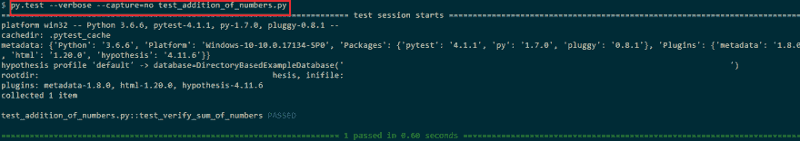](https://res.cloudinary.com/practicaldev/image/fetch/s--_HN6S9BJ--/c_limit%2Cf_auto%2Cfl_progressive%2Cq_auto%2Cw_880/https://www.lambdatest.com/blog/wp-content/uploads/2019/05/image2.png)

为了针对不同类型的输入测试 sum 功能，我们需要遵循复制-粘贴机制，其中 sum_of_numbers()被提供了不同的输入值。由于这不是一个可伸缩的方法，我们利用 pytest 中的参数化 fixtures 特性。使用参数化的 fixtures，我们可以通过向测试用例添加更多的输入值来测试更多的场景。

```
 A simple pytest to add two numbers

import pytest
import selenium
import pytest_html

# Define a function which takes two arguments as integers and adds the two numbers
def sum_of_numbers(number_1, number_2):
    return number_1 + number_2

# A simple test case to verify the sum_of_numbers function
# Since it is a pytest testcase, the test function should start with test_
#def test_verify_sum_of_numbers():
#    assert sum_of_numbers(2, 3) == 5

#A more scalable approach is to use Parameterized Fixtures
@pytest.mark.parametrize('number_1, number_2, expected_output',[(1,2,3),
                        (4,5,9), (6,-1,5), (-5,-4,-9)])
def test_verify_sum_of_numbers(number_1, number_2, expected_output):
        assert sum_of_numbers(number_1, number_2) == expected_output 
```

<svg width="20px" height="20px" viewBox="0 0 24 24" class="highlight-action crayons-icon highlight-action--fullscreen-on"><title>Enter fullscreen mode</title></svg> <svg width="20px" height="20px" viewBox="0 0 24 24" class="highlight-action crayons-icon highlight-action--fullscreen-off"><title>Exit fullscreen mode</title></svg>

输出如下所示。所有的测试用例都通过了，因为输入数字的相加等于预期的输出。

[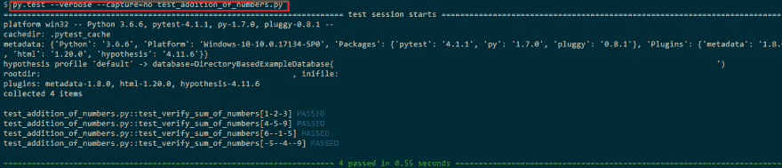](https://res.cloudinary.com/practicaldev/image/fetch/s--9Jm-7UN8--/c_limit%2Cf_auto%2Cfl_progressive%2Cq_auto%2Cw_880/https://www.lambdatest.com/blog/wp-content/uploads/2019/05/image3-1.png)

虽然我们可以通过参数化的 fixtures 添加更多的测试输入，但是可能会有遗漏重要场景的情况。此外，输入和输出变量可能存在一定程度的模糊性。以 sum_of_numbers()函数为例，它的输入和输出可能会有很多混乱。其中一些提到如下:

*   输入参数可以是整数吗，比如 int，或者也可以是 float？
*   输入参数可以容纳的最大值是多少，在下溢/上溢情况下应该发生什么？
*   输入值可以是 float 类型吗？如果可以，它可以与 int 输入类型结合使用吗？

我们在基于示例的测试中遇到的问题的解决方案可以通过使用假设来解决，使用假设你可以编写基于属性的测试。使用 Hypothesis，您可以用 pytest 之类的测试框架编写测试，并根据大量所需的输入数据测试您的实现。更多细节，请参考 Python 测试库 Hypothesis 的官方文档。

## 假设——策略，装饰者，&更多

假说的主干是基于著名的原则**‘大多数事情应该容易产生，一切都应该可能’**。基于这一原则，Python 测试的假设提供了处理大多数内置类型的策略，这些类型带有约束或调整输出的参数。假设还提供了高阶策略，利用这些策略，人们可以[编写有效的测试用例](https://www.lambdatest.com/blog/17-lessons-i-learned-for-writing-effective-test-cases/?utm_source=devto&utm_medium=organic&utm_campaign=jun15_rn&utm_term=rn)来处理更复杂的场景。

简单地说，你可以说你把你的需求给了策略模块，它根据你的需求返回不同的输入值(用于测试)。在上面提到的例子中，策略的输入应该是两个整数的要求。构建策略的功能是假设策略模块的一部分。

现在您已经对假设中的策略有了一些了解，我们通过使用假设(Python 库)合并更多的输入数据集来重写上面的测试代码。修改后的代码如下所示:

```
 ''' Addition of numbers using pytest & Hypothesis '''
import pytest

''' Import the Hypothesis module '''
import hypothesis

from hypothesis import given

''' Strategies are the backbone of Hypothesis. In our case, we will use the integer strategy '''
import hypothesis.strategies as strategy

# Define a function which takes two arguments as integers and adds the two numbers
def sum_of_numbers(number_1, number_2):
    return number_1 + number_2

''' @given is the decorator '''
''' We use the integer Strategy as testing is performed only on integer inputs '''

@given(strategy.integers(), strategy.integers())
def test_verify_sum_of_numbers(number_1, number_2):
    assert sum_of_numbers(number_1, number_2) == number_1 + number_2 
```

<svg width="20px" height="20px" viewBox="0 0 24 24" class="highlight-action crayons-icon highlight-action--fullscreen-on"><title>Enter fullscreen mode</title></svg> <svg width="20px" height="20px" viewBox="0 0 24 24" class="highlight-action crayons-icon highlight-action--fullscreen-off"><title>Exit fullscreen mode</title></svg>

为了执行代码，可以使用–hypothesis-show-statistics 选项和普通的 py.test 命令。我们使用的命令是

```
py.test --capture=no --hypothesis-show-statistics < file-name.py > 
```

<svg width="20px" height="20px" viewBox="0 0 24 24" class="highlight-action crayons-icon highlight-action--fullscreen-on"><title>Enter fullscreen mode</title></svg> <svg width="20px" height="20px" viewBox="0 0 24 24" class="highlight-action crayons-icon highlight-action--fullscreen-off"><title>Exit fullscreen mode</title></svg>

如下面的输出快照所示，我们已经进行了两次测试，每次都生成 100 个不同的输入。使用假设，可能的测试运行的默认数量是 100。

[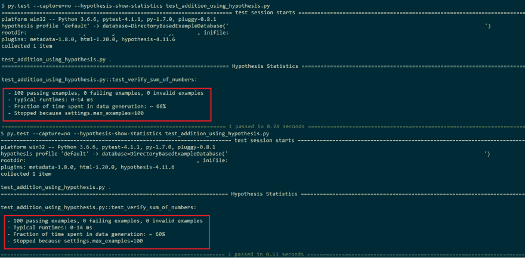](https://res.cloudinary.com/practicaldev/image/fetch/s--RirVAFCz--/c_limit%2Cf_auto%2Cfl_progressive%2Cq_auto%2Cw_880/https://www.lambdatest.com/blog/wp-content/uploads/2019/05/image5-1.png)

让我们对基于假设库的附加测试代码进行代码演练。基本函数 **[sum_of_numbers()]** 计算两个数之和，如果保持不变的话。测试 sum 功能的代码被修改为使用假设。

@given 充当假设中的入口点，装饰器帮助将接受参数的特定测试函数转换成随机测试。在我们的例子中，测试只考虑整数输入。因此，@given decorator 有两个参数，都是整数策略。@given 的语法如下:

`hypothesis.given(*given_arguments, **given_kwargs)`

关于@given 装饰器的更多细节可以从[这里](https://hypothesis.readthedocs.io/en/master/details.html#hypothesis.given)获得

在下一行中，我们从假设中导入@strategies。@strategies 主要用于测试数据的生成。要查看在 Python 和 Selenium 中为执行假设测试构建策略可用的所有函数，请参考 **hypothesis.strategies** 模块。在我们的例子中，我们使用了整数策略。假设中有许多内置策略，您也可以为更复杂的输入组合更高阶的策略。内置策略的一些示例如下:

二进制、布尔、复数、构建、字符、复数、复合、数据、日期、日期时间、小数、延迟、字典、电子邮件、浮点、固定字典、分数、from_regex、from_type、frozensets、iterables、整数、just、lists、none、nothing、one_of、置换、random_module、randoms、recursive、register_type_strategy、runner、sampled_from、sets、shared、timedeltas 等。

涵盖每一个策略超出了本博客的范围，因此我们建议你看一下策略的官方文档。

***嘿，你是在检查浏览器对 [CSS 区域的兼容性吗](https://www.lambdatest.com/web-technologies/css-regions?utm_source=devto&utm_medium=organic&utm_campaign=jun15_rn&utm_term=rn&utm_content=web_technologies)，这是一种将内容流入网站多个元素的方法。它也用于通过赋予某些元素更多的重要性来改变页面的版式。***

## 将“冗长”选项&@示例装饰器投入使用

作为一名开发人员，在查看了使用假设的代码的输出后，您可能会感到困惑。在每个测试代码中，都有用于测试的输入参数/输入值。在上面的例子中，执行了 100 次测试运行；但是没有关于 sum_of_numbers()函数的输入值的信息。为了实现这个目标，我们将详细级别设置为 verbose。我们需要导入@settings 装饰器来设置详细程度。

作为一名开发人员，在查看了使用假设的代码的输出后，您可能会感到困惑。在每个测试代码中，都有用于测试的输入参数/输入值。在上面的例子中，执行了 100 次测试运行；但是没有关于 sum_of_numbers()函数的输入值的信息。为了实现这个目标，我们将详细级别设置为 verbose。我们需要导入@settings 装饰器来设置详细程度。

```
……………………………………..
from hypothesis import given, settings, Verbosity
…………………………………………………………….
…………………………………………………………..
@settings(verbosity=Verbosity.verbose)
…………………………………………………………….
………………………………………………………….. 
```

<svg width="20px" height="20px" viewBox="0 0 24 24" class="highlight-action crayons-icon highlight-action--fullscreen-on"><title>Enter fullscreen mode</title></svg> <svg width="20px" height="20px" viewBox="0 0 24 24" class="highlight-action crayons-icon highlight-action--fullscreen-off"><title>Exit fullscreen mode</title></svg>

确保将@settings decorator 与@given decorator 一起使用，即@settings 应该在@given decorator 之前设置。如果不这样做，您将会遇到一个错误，显示为`‘hypothesis.errors.InvalidArgument: Using @settings on a test without @given is completely pointless’`。我们对现有的实现做了另外一个修改，将测试运行的数量扩展到 500。这可以通过将@settings 对象的 max_examples 值设置为 500 来实现。

@settings 模块的 Verbosity & max_examples 值必须在一个地方修改，否则会导致错误(如下面的代码片段所示)。

```
……………………………………..
from hypothesis import given, settings, Verbosity
…………………………………………………………….
…………………………………………………………..
@settings(verbosity=Verbosity.verbose)
@settings(max_examples=500)
………………………………………………………….
………………………………………………………….
………………………………………………………….. 
```

<svg width="20px" height="20px" viewBox="0 0 24 24" class="highlight-action crayons-icon highlight-action--fullscreen-on"><title>Enter fullscreen mode</title></svg> <svg width="20px" height="20px" viewBox="0 0 24 24" class="highlight-action crayons-icon highlight-action--fullscreen-off"><title>Exit fullscreen mode</title></svg>

如果您试图使用上面的实现来装饰@settings 装饰器，您将会遇到一个错误，说明

```
hypothesis.errors.InvalidArgument: test_verify_sum_of_numbers has already been decorated with a settings object. 
```

<svg width="20px" height="20px" viewBox="0 0 24 24" class="highlight-action crayons-icon highlight-action--fullscreen-on"><title>Enter fullscreen mode</title></svg> <svg width="20px" height="20px" viewBox="0 0 24 24" class="highlight-action crayons-icon highlight-action--fullscreen-off"><title>Exit fullscreen mode</title></svg>

修改后的工作实现如下(更改用黄色标记)。

```
''' Addition of numbers using pytest & Hypothesis '''
import pytest

''' Import the Hypothesis module '''
import hypothesis

from hypothesis import given, settings, Verbosity

''' Strategies are the backbone of Hypothesis. In our case, we will use the integer strategy '''
import hypothesis.strategies as strategy

# Define a function which takes two arguments as integers and adds the two numbers
def sum_of_numbers(number_1, number_2):
    return number_1 + number_2

''' @given is the decorator '''
''' We use the integer Strategy as testing is performed only on integer inputs '''

@settings(verbosity=Verbosity.verbose, max_examples=500)
@given(strategy.integers(), strategy.integers())

def test_verify_sum_of_numbers(number_1, number_2):
    assert sum_of_numbers(number_1, number_2) == number_1 + number_2 
```

<svg width="20px" height="20px" viewBox="0 0 24 24" class="highlight-action crayons-icon highlight-action--fullscreen-on"><title>Enter fullscreen mode</title></svg> <svg width="20px" height="20px" viewBox="0 0 24 24" class="highlight-action crayons-icon highlight-action--fullscreen-off"><title>Exit fullscreen mode</title></svg>

下面是执行的屏幕截图，其中我们获得了关于用于测试的输入值的信息，并且测试运行的数量现在是 500(而不是 100)。

[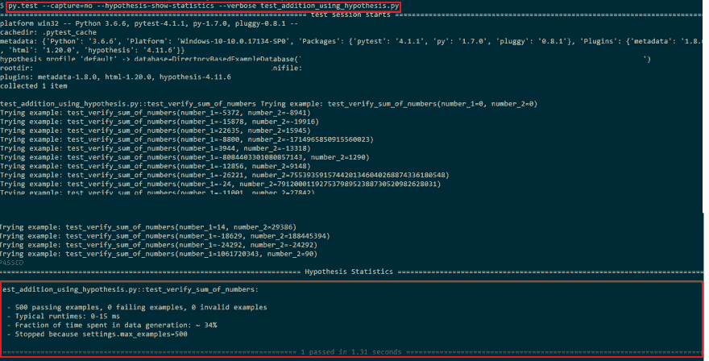](https://res.cloudinary.com/practicaldev/image/fetch/s--wXyENB62--/c_limit%2Cf_auto%2Cfl_progressive%2Cq_auto%2Cw_880/https://www.lambdatest.com/blog/wp-content/uploads/2019/05/image7.png)

尽管代码是针对不同范围的输入值进行测试的，但是您可能想要考虑限制输入变量可以包含的最小和最大值。您可以通过将输入变量的 min_value & max_value 设置为@strategy 装饰器的一部分来实现这一点。修改后的工作实现如下(更改用黄色标记)。

```
''' Addition of numbers using pytest & Hypothesis '''
import pytest

''' Import the Hypothesis module '''
import hypothesis

from hypothesis import given, settings, Verbosity

''' Strategies are the backbone of Hypothesis. In our case, we will use the integer strategy '''
import hypothesis.strategies as strategy

# Define a function which takes two arguments as integers and adds the two numbers
def sum_of_numbers(number_1, number_2):
    return number_1 + number_2

''' @given is the decorator '''
''' We use the integer Strategy as testing is performed only on integer inputs '''

@settings(verbosity=Verbosity.verbose, max_examples=500)
@given(strategy.integers(min_value=1, max_value=20), strategy.integers(min_value=5, max_value=100))

def test_verify_sum_of_numbers(number_1, number_2):
    assert sum_of_numbers(number_1, number_2) == number_1 + number_2 
```

<svg width="20px" height="20px" viewBox="0 0 24 24" class="highlight-action crayons-icon highlight-action--fullscreen-on"><title>Enter fullscreen mode</title></svg> <svg width="20px" height="20px" viewBox="0 0 24 24" class="highlight-action crayons-icon highlight-action--fullscreen-off"><title>Exit fullscreen mode</title></svg>

根据更改，变量 number_1 和 number_2 可以按照以下条件保存值

**编号 _1 :** 编号 _ 1 GTE 1&LTE 20
T3**编号 _2 :** 编号 _2 GTE 5 & LTE 100

我们还在执行代码时启用了–verbose 选项，更新后的命令如下，输出显示了 min_value & max_value 对输入参数的影响(用于测试)。

```
py.test --capture=no –verbose --hypothesis-show-statistics < file-name.py > 
```

<svg width="20px" height="20px" viewBox="0 0 24 24" class="highlight-action crayons-icon highlight-action--fullscreen-on"><title>Enter fullscreen mode</title></svg> <svg width="20px" height="20px" viewBox="0 0 24 24" class="highlight-action crayons-icon highlight-action--fullscreen-off"><title>Exit fullscreen mode</title></svg>

[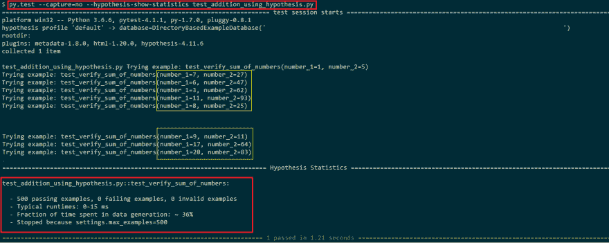](https://res.cloudinary.com/practicaldev/image/fetch/s--jw709LSt--/c_limit%2Cf_auto%2Cfl_progressive%2Cq_auto%2Cw_880/https://www.lambdatest.com/blog/wp-content/uploads/2019/05/image6.png)

## Python 的带假设的状态测试

使用 Hypothesis 作为 Python 测试库的主要优点是自动生成可用于测试代码的测试数据。即使当您使用@given 装饰器时，您也必须编写大量的测试。假设中的状态测试能够生成完整的测试和测试数据。作为一名开发人员，您只需指定基本的操作，假设将试图找到可能导致失败的序列。

假设中有两种类型的状态测试 API——称为**基于规则的状态机**的高级 API 和称为**通用状态机**的低级 API。基于规则的状态机更受欢迎，因为它们对用户更友好。 **RuleBasedStateMachine** 是 hypothesis.stateful 模块的一部分。

```
class hypothesis.stateful.RuleBasedStateMachine 
```

<svg width="20px" height="20px" viewBox="0 0 24 24" class="highlight-action crayons-icon highlight-action--fullscreen-on"><title>Enter fullscreen mode</title></svg> <svg width="20px" height="20px" viewBox="0 0 24 24" class="highlight-action crayons-icon highlight-action--fullscreen-off"><title>Exit fullscreen mode</title></svg>

```
State machines can carry a bunch of types of data called as Bundles, and there can be a set of rules that can push data out of Bundles and onto the Bundles. For more information about Rule based state machines, you can refer the official documentation of <a href="https://hypothesis.readthedocs.io/en/latest/stateful.html" rel="noopener nofollow" target="_blank">Stateful testing with Hypothesis.</a> 
```

<svg width="20px" height="20px" viewBox="0 0 24 24" class="highlight-action crayons-icon highlight-action--fullscreen-on"><title>Enter fullscreen mode</title></svg> <svg width="20px" height="20px" viewBox="0 0 24 24" class="highlight-action crayons-icon highlight-action--fullscreen-off"><title>Exit fullscreen mode</title></svg>

***嘿，你在检查浏览器的兼容性吗 [CSS resize 属性](https://www.lambdatest.com/web-technologies/css-resize?utm_source=devto&utm_medium=organic&utm_campaign=jun15_rn&utm_term=rn&utm_content=web_technologies)，css-resize 是一个快速简单的解决方案，允许用户使用鼠标调整元素大小。***

## 使用带有 LambdaTest Selenium 网格的假设进行自动跨浏览器测试

到目前为止，在本假设 Python 测试教程中，我们已经讨论了关于假设的主要方面，以及如何使用假设中可用的装饰器来验证代码。让我们看看如何使用 pytest with Hypothesis 来测试 Python 和 Selenium，以便对您的网站/web 应用程序执行[自动化跨浏览器测试](https://www.lambdatest.com/selenium-automation?utm_source=devto&utm_medium=organic&utm_campaign=jun15_rn&utm_term=rn)。[跨浏览器测试](https://www.lambdatest.com/?utm_source=devto&utm_medium=organic&utm_campaign=jun15_rn&utm_term=rn)是在不同的浏览器、操作系统和设备组合中测试你的网站/网络应用。

LambdaTest 提供了一个包含 3000 多个真实浏览器的 Selenium 网格，帮助您使用 Selenium 对[浏览器兼容性测试](https://www.lambdatest.com/feature?utm_source=devto&utm_medium=organic&utm_campaign=jun15_rn&utm_term=rn)进行自动化测试。你也可以[通过在云服务器上托管的虚拟机(Virtual Machines)的帮助下与这些浏览器实时交互来执行手动跨浏览器测试](https://www.lambdatest.com/blog/34-ways-to-save-time-on-manual-cross-browser-testing/?utm_source=devto&utm_medium=organic&utm_campaign=jun15_rn&utm_term=rn)。我将向您展示如何利用 LambdaTest 通过 Python 和 Selenium 进行自动化测试。

[](https://res.cloudinary.com/practicaldev/image/fetch/s--MsasFw8r--/c_limit%2Cf_auto%2Cfl_progressive%2Cq_auto%2Cw_880/https://www.lambdatest.com/blog/wp-content/uploads/2019/04/cta-img.png)

在云网格上运行 PYTHON 脚本

3000 多种浏览器和操作系统

[免费注册](https://accounts.lambdatest.com/register/)

为了用假设进行跨浏览器测试，我们设计了一个测试代码，在 Chrome & Firefox 浏览器上测试一个给定的 URL，例如[https://www.lambdatest.com](https://www.lambdatest.com?utm_source=devto&utm_medium=organic&utm_campaign=jun15_rn&utm_term=rn)。验证应该在 **Mozilla Firefox 浏览器版本 64.0 和谷歌 Chrome 浏览器版本 71.0** 上进行。您必须在各自的浏览器中启动测试 URL，并在网站加载后关闭浏览器实例。

在我们看实现之前，如果你一步一步地跟着我，那么我建议你在 [LambdaTest](https://www.lambdatest.com?utm_source=devto&utm_medium=organic&utm_campaign=jun15_rn&utm_term=rn) 上创建一个帐户，因为我们将在 LambdaTest 上使用 Selenium Remote WebDriver。下面是在 LambdaTest Selenium 网格上使用 Hypothesis、Python 测试库的整体实现。

```
import pytest
from selenium import webdriver
from selenium.webdriver.chrome.options import Options
from selenium.webdriver.common.keys import Keys
from time import sleep
import urllib3
import warnings

#Set capabilities for testing on Chrome
ch_caps = {
    "build" : "Hypothesis - Testing on Chrome",
    "name" : "Hypothesis - Verification of URL on Chrome",
    "platform" : "Windows 10",
    "browserName" : "Chrome",
    "version" : "71.0",
}

#Set capabilities for testing on Firefox
ff_caps = {
    "build": "Hypothesis - Testing on Firefox",
    "name": "Hypothesis - Verification of URL on Firefox",
    "platform" : "Windows 10",
    "browserName" : "Firefox",
    "version" : "64.0",
}

# Visit https://accounts.lambdatest.com/profile for getting the access token
user_name = "your-user-name"
app_key = "access key generated from LambdaTest dashboard"

class CrossBrowserSetup(object):
    global web_driver

    def __init__(self):
        global remote_url

        urllib3.disable_warnings(urllib3.exceptions.InsecureRequestWarning)
        # web_driver = webdriver.Remote(command_executor=remote_url, desired_capabilities=ch_caps)
        remote_url = "https://" + user_name + ":" + app_key + "@hub.lambdatest.com/wd/hub"

    def add(self, browsertype_1, browsertype_2):
        print(browsertype_1)
        print(browsertype_2)
        if (browsertype_1 == "Chrome") or (browsertype_2 == "Chrome"):
            web_driver = webdriver.Remote(command_executor=remote_url, desired_capabilities=ch_caps)
        if (browsertype_1 == "Firefox") or (browsertype_2 == "Firefox"):
            web_driver = webdriver.Remote(command_executor=remote_url, desired_capabilities=ff_caps)
        self.driver = web_driver
        self.driver.get("https://www.lambdatest.com")
        print(self.driver.title)
        #sleep(1)
        web_driver.close()
        web_driver.quit()

# Property-based Tests
from hypothesis import given, example
import hypothesis.strategies as strategy

@given(strategy.just("Firefox"), strategy.just("Chrome"))

def test_add(browsertype_1, browsertype_2):
    cbt = CrossBrowserSetup()
    cbt.add(browsertype_1, browsertype_2) 
```

<svg width="20px" height="20px" viewBox="0 0 24 24" class="highlight-action crayons-icon highlight-action--fullscreen-on"><title>Enter fullscreen mode</title></svg> <svg width="20px" height="20px" viewBox="0 0 24 24" class="highlight-action crayons-icon highlight-action--fullscreen-off"><title>Exit fullscreen mode</title></svg>

因为我们使用 LambaTest 上的 Selenium 网格设置，所以您需要正确的用户名组合来访问他们的网格。你可以通过点击**按键图标**在[自动化仪表板](https://automation.lambdatest.com?utm_source=devto&utm_medium=organic&utm_campaign=jun15_rn&utm_term=rn)上找到这些值。现在，用您的凭证替换变量**用户名** & **app_key** 。在我们执行测试的设置中，我们可以并行执行两个测试。让我们对上面的实现做一个代码演练

开始时，我们导入必要的包，例如 selenium、pytest、time、urllib3 等。一旦导入了必要的模块，我们就可以设置执行测试的浏览器的功能。您可以访问 LambdaTest [所需功能生成器](https://www.lambdatest.com/capabilities-generator/?utm_source=devto&utm_medium=organic&utm_campaign=jun15_rn&utm_term=rn)来生成所需的浏览器功能。在 add 函数中，我们使用远程 Webdriver API 启动所需的浏览器实例。远程 Webdriver API 有两个重要的参数——**command _ executor 和 desired _ capabilities。**

**command_executor** 是设置 Selenium 网格的远程 URL，desired_capabilities 是应该出现在被测浏览器中的功能列表。要了解关于 Selenium WebDriver API 和 pytest 的更多信息，您可以访问我们的其他博客，这些博客更详细地讨论了这个主题。

一旦所需的先决条件完成，我们就利用假设库来提出 Python 和 Selenium 所需的测试。如条带化实现所示，**@策略、@给定&@示例**装饰器是从假设、Python 测试库中导入的。测试代码 **[test_add()]** 由两个字符串参数组成。由于测试只能在 Firefox & Chrome 上执行，我们使用@given 装饰器将输入参数限制为**“Firefox”**&**“Chrome”**。我们使用了**hypothesis . strategies . just()**模块来满足需求。

```
………………………………………………………………………
………………………………………………………………………
………………………………………………………………………
# Property-based Tests
from hypothesis import given, example
import hypothesis.strategies as strategy

@given(strategy.just("Firefox"), strategy.just("Chrome"))

def test_add(browsertype_1, browsertype_2):
    cbt = CrossBrowserSetup()
    cbt.add(browsertype_1, browsertype_2) 
```

<svg width="20px" height="20px" viewBox="0 0 24 24" class="highlight-action crayons-icon highlight-action--fullscreen-on"><title>Enter fullscreen mode</title></svg> <svg width="20px" height="20px" viewBox="0 0 24 24" class="highlight-action crayons-icon highlight-action--fullscreen-off"><title>Exit fullscreen mode</title></svg>

您可以使用标准命令执行代码，输出如下所示:

```
py.test --capture=no --hypothesis-show-statistics < file-name.py > 
```

<svg width="20px" height="20px" viewBox="0 0 24 24" class="highlight-action crayons-icon highlight-action--fullscreen-on"><title>Enter fullscreen mode</title></svg> <svg width="20px" height="20px" viewBox="0 0 24 24" class="highlight-action crayons-icon highlight-action--fullscreen-off"><title>Exit fullscreen mode</title></svg>

[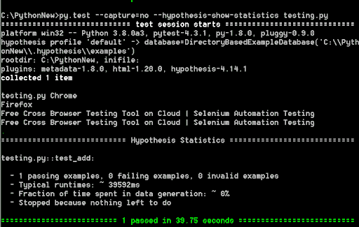](https://res.cloudinary.com/practicaldev/image/fetch/s--2EHtRQ0P--/c_limit%2Cf_auto%2Cfl_progressive%2Cq_auto%2Cw_880/https://www.lambdatest.com/blog/wp-content/uploads/2019/05/tandard-command.png)

为了验证输出，您应该访问 LambdaTest 上的 Automation 部分，并根据浏览器功能数组中分配的名称定位测试。由于这是一个 pytest 代码，请确保文件名应该以 test_ 开头。由于执行是在远程 Selenium 网格上完成的，您应该访问[自动化仪表板](https://automation.lambdatest.com/?utm_source=devto&utm_medium=organic&utm_campaign=jun15_rn&utm_term=rn)来检查测试的状态，下面是在 Firefox(版本 64.0)上执行的测试的截图。

在执行上述假设 Python 测试的自动化脚本后，我们可以观察到我们的测试在 Google Chrome 和 Mozilla Firefox 上并行成功运行。

[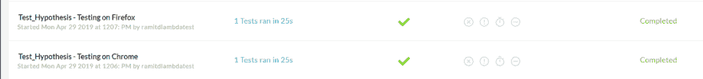](https://res.cloudinary.com/practicaldev/image/fetch/s--4m1tgQcv--/c_limit%2Cf_auto%2Cfl_progressive%2Cq_auto%2Cw_880/https://www.lambdatest.com/blog/wp-content/uploads/2019/05/pasted-image-0-10.png)

当你在 LambdaTest 的自动化仪表板上点击这些测试时。你会发现测试细节。

1.  Google Chrome 中的假设 Python 测试

[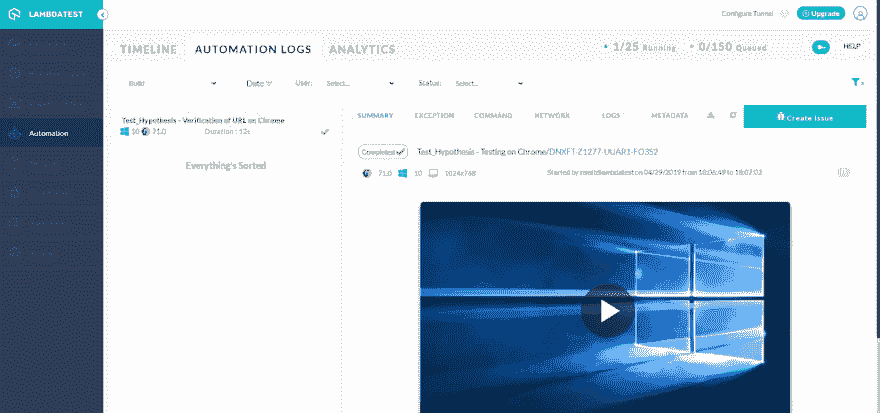](https://res.cloudinary.com/practicaldev/image/fetch/s--fDkvYuMz--/c_limit%2Cf_auto%2Cfl_progressive%2Cq_auto%2Cw_880/https://www.lambdatest.com/blog/wp-content/uploads/2019/05/pasted-image-0-11.png)

1.  Mozilla Firefox 中的假设 Python 测试

[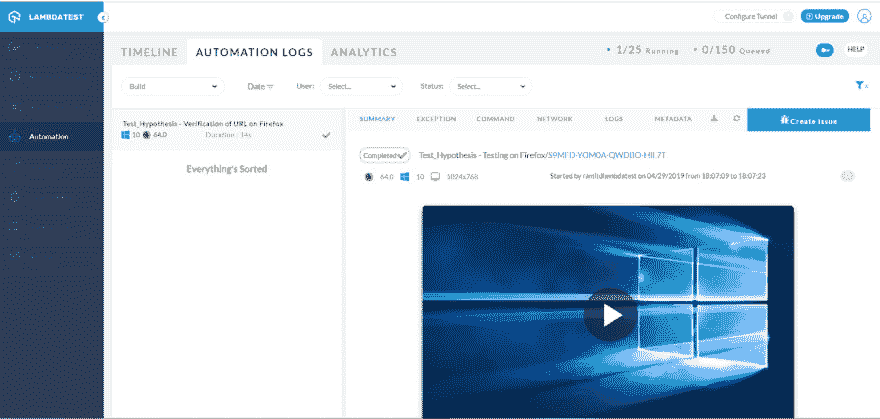](https://res.cloudinary.com/practicaldev/image/fetch/s--QuBA07pv--/c_limit%2Cf_auto%2Cfl_progressive%2Cq_auto%2Cw_880/https://www.lambdatest.com/blog/wp-content/uploads/2019/05/pasted-image-0-12.png)

## 结论

在许多情况下，您可能希望通过跨不同的输入值测试来对代码进行彻底的验证。假设，Python 测试库在这些情况下会很方便，因为它可以生成大量的测试数据，这些数据可以用于执行普通测试以及边缘类型测试。基于您的需求，您应该选择正确的策略和装饰，以便减少您在测试代码实现和执行中的总工作量。

您还可以使用假设来优化使用 pytest &[unittest with Selenium](https://www.lambdatest.com/blog/parallel-testing-in-selenium-webdriver-with-python-using-unittest/?utm_source=devto&utm_medium=organic&utm_campaign=jun15_rn&utm_term=rn)编写的测试。使用 pytest &假设，Python 的跨浏览器测试也是可能的。简而言之，假设是一个强大的&灵活的库，当你计划进行基于属性的测试时，应该考虑它。

最初发布:[**LambdaTest**T3】](https://www.lambdatest.com/blog/using-selenium-and-python-hypothesis-for-automation-testing/?utm_source=devto&utm_medium=organic&utm_campaign=jun15_rn&utm_term=rn)

[](https://accounts.lambdatest.com/register/?utm_source=dev&utm_medium=Blog&utm_campaign=Himanshu-05072019&utm_term=Himanshu)

**相关岗位**:

[**2019 年测试自动化 Top 5 Python 框架**](https://www.lambdatest.com/blog/top-5-python-frameworks-for-test-automation-in-2019/?utm_source=devto&utm_medium=organic&utm_campaign=jun15_rn&utm_term=rn)

[**为 Selenium 自动化脚本生成 Pytest 报告**](https://www.lambdatest.com/blog/pytest-report-generation-for-selenium-automation-scripts/?utm_source=devto&utm_medium=organic&utm_campaign=jun15_rn&utm_term=rn)