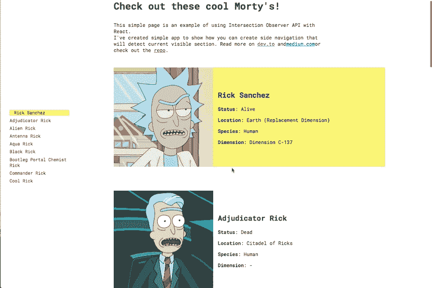
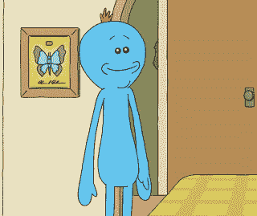
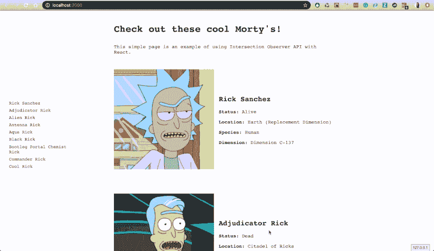
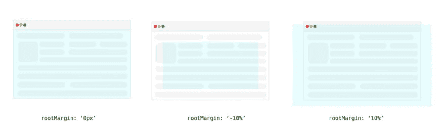
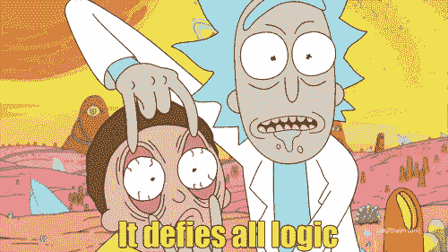
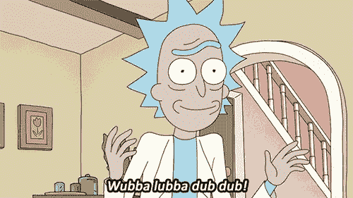

# 使用 React 和交叉点观察器创建截面导航

> 原文：<https://dev.to/maciekgrzybek/create-section-navigation-with-react-and-intersection-observer-fg0>

* * *

# 用 React 和路口观察器创建路段导航

## 简介

对于工作中的最后一个项目之一，我必须创建一个基于导航的部分。当您滚动到页面的特定部分时，它会突出显示正确的导航项目。在做了一些阅读和研究后，我想我可以使用交叉点观察器 API。这是一个非常棒的浏览器原生 API，每当所需元素出现在视窗中时都会触发一个事件。你可以在这里阅读更多相关信息[。](https://developer.mozilla.org/en-US/docs/Web/API/IntersectionObserver/observe)

今天我想向你们展示我从那个项目中学到的东西。在本教程中，我们将构建一个迷你页面，其中将包含来自不同维度的不同类型的 Ricks 的描述(？).检查工作中的 [demo](https://maciekgrzybek.github.io/react-section-navigation/) 和 [github repo](https://github.com/maciekgrzybek/react-section-navigation) 。

[](https://res.cloudinary.com/practicaldev/image/fetch/s--eLedIn8l--/c_limit%2Cf_auto%2Cfl_progressive%2Cq_66%2Cw_880/https://cdn-images-1.medium.com/max/2000/1%2AsYSTAKaGQL0MjqjDmv_MIw.gif)

这几乎是我在工作中创建的项目的精确副本(尽管我很想这样做，但我不会创建 Rick 和 Morty 网站)。不管怎样，让我们开始吧。

[](https://i.giphy.com/media/DgLsbUL7SG3kI/giphy.gif)

## 我们开始吧

**样板文件**

首先，我们将从创建我们的项目脚手架开始。我们将使用[创建 React 应用](https://facebook.github.io/create-react-app/)。如果你以前用过，我就不用解释它的优点了。如果你没有迅速改正错误，去项目网站看看。在你的终端上运行这个:

```
 $ npx create-react-app rick-morty-section-navigation
    $ cd rick-morty-section-navigation
    $ npm start 
```

嘣，我们开始了——工作样板。让我们清除一些我们在这里不需要的默认内容。删除并移动一些文件，这样你的项目结构看起来就像这样。

```
 rick-morty-section-navigation
    ├── README.md
    ├── node_modules
    ├── package.json
    ├── .gitignore
    ├── public
    │   ├── favicon.ico
    │   ├── index.html
    │   └── manifest.json
    └── src
        ├── index.js
        └── components
            ├── App.js
            └── app.css 
```

不要忘记删除对已删除文件(index.css、serviceWorker.js 等)的引用。

**数据**

至于数据层，我决定用 Rick 和 Morty API(因为为什么不呢？).点击这里查看一下吧——这是完全免费的，有很多关于我最喜欢的电视节目的信息。另外，还有一个 GraphQL 端点，我们将使用它来代替经典的 REST API。

继续安装 [urql](https://github.com/FormidableLabs/urql) 、 [graphql](https://github.com/graphql/graphql-js) 和 graphql-tag。对于 React 应用程序来说，Urql 是一个非常棒的 GraphQL 客户端，你可以把它作为一个组件或者钩子来使用(现在非常热门)。

```
 $ npm install --save urql graphql 
```

现在让我们将我们的应用程序组件包装在 urql provider 中。这真的很简单，用 API URL 创建一个客户端，并将其传递给提供者。

```
 // src/index.js
    import React from 'react';
    import ReactDOM from 'react-dom';
    import App from './components/App';
    import {Provider, createClient} from 'urql';

    const client = createClient({
      url: 'https://rickandmortyapi.com/graphql/',
    });

    ReactDOM.render(
        <Provider value={client}>
          <App />
        </Provider>,
        document.getElementById('root')); 
```

现在，您可以开始从端点查询数据。

```
 // src/compoments/App.js
    import React from 'react';
    import {useQuery} from 'urql';
    import gql from 'graphql-tag';

    const getCharacters = gql`
      query AllCharacters{
        characters(filter: {name: "rick"}) {
          info {
            count
          }
          results {
            id
            name
            image
            species
            status
            location {
              name
            }
            origin {
              dimension
            }
          }
        }
      }
    `;

    export default function App() {
      const [res] = useQuery({
        query: getCharacters,
      });
    if (res.fetching || typeof res.data === 'undefined') {
        return (
          <div>Loading page...</div>
        );
      } else {
        return (
          <div>
                {
                  res.data.characters.results.map((item) => {
                    return (
                      <>
                        <div>
                          
                        </div>
                        <div className="character-block__text">
                          <h2>{data.name}</h2>
                          <p><b>Status</b>: {data.status}</p>
                          <p><b>Location</b>: {data.location ? data.location.name : '-'}</p>
                          <p><b>Species</b>: {data.species}</p>
                          <p><b>Dimension</b>: {data.origin.dimension || '-'}</p>
                        </div>
                      </>
                    );
                  })
                }
          </div>
        );
      }
    } 
```

让我们看看这里发生了什么:

*   我们创建一个简单的 API 查询

*   在我们的应用程序组件中，我们使用`useQuery`从 API 中获取数据

*   如果 URQL 仍在获取数据，我们将返回加载组件，

*   如果 URQL 已经获取了数据，我们将遍历结果并返回字符块列表

**结构**

我们有一些简单的数据，但这显然是不够的。在我们添加一些样式并创建两个主要组件——导航和角色之前，让我们考虑一下状态。为了让它工作，我们需要一个活跃的/当前的角色状态在顶部组件中。

```
 // src/compoments/App.js

    *import* React, {useState} *from* 'react';
    ...
    ...
    const [activeCharacter, setActiveCharacter] = useState(); 
```

现在我们可以传递状态，以及将状态更新到子组件的方法。

```
 // src/components/Navigation.js

    import React from 'react';

    export function Navigation({items, activeCharacter}) {
      function renderItems() {
        return items.map((item) => {
          const activeClass = activeCharacter === item.name
            ? 'navigation-list__item--active'
            : '';
          return (
            <li
              key={item.name}
              id={item.name}
              className={`navigation-list__item ${activeClass}`}>{item.name}</li>
          );
        });
      }
      return (
        <ul className="navigation-list">{renderItems()}</ul>
      );
    }

    // src/components/Character

    import React from 'react';

    export function Character({
      data,
      activeCharacter,
      setActiveCharacter,
    }) {
      const activeClass = activeCharacter === data.name
        ? 'character-block--active'
        : '';

    return (
        <div
          className={`character-block ${activeClass}`}
          id={data.name}>
          <div>
            
          </div>
          <div className="character-block__text">
            <h2>{data.name}</h2>
            <p><b>Status</b>: {data.status}</p>
            <p><b>Location</b>: {data.location ? data.location.name : '-'}</p>
            <p><b>Species</b>: {data.species}</p>
            <p><b>Dimension</b>: {data.origin.dimension || '-'}</p>
          </div>
        </div>
      );
    }

    // src/components/App.js

    ...

    import {Navigation} from './Navigation';
    import {Character} from './Character';

    export default function App() {

    ...

    if (res.fetching || typeof res.data === 'undefined') {
        return (
          <div>Loading...</div>
        );
      } else {
        const characters = res.data.characters.results.slice(0, 9);
        return (
          <>
            <div className="page-wrapper">
              <aside className="sidebar">
                <Navigation
                  items={characters}
                  activeCharacter={activeCharacter}/>
              </aside>
              <div className="content">
                <div className="page-intro">
                  <h1 className="page-title">Check out these cool Morty&apos;s!</h1>
                  <p>This simple page is an example of using Intersection Observer API with React.
                  </p>
                </div>
                {
                  characters.map((item) => {
                    return (
                      <Character
                        key={item.name}
                        activeCharacter={activeCharacter}
                        data={item}
                        setActiveCharacter={setActiveCharacter}/>
                    );
                  })
                }
              </div>
            </div>
          </>
        );
      } 
```

还有，我们来添加一些基本的样式(别忘了在 app.js 中导入):

```
 /* Mobile styles */
    * {
      box-sizing: border-box;
    }
    body {
      color: #282c34;
      font-family: 'Roboto Mono', monospace;
      padding: 0;
      margin: 0;
      width: 100%;
      position: relative;
      overflow-x: hidden;
    }
    .page-title {
      margin-bottom: 2rem;
    }
    .page-intro {
      max-width: 700px;
      margin-bottom: 3rem;
    }
    .page-wrapper {
      padding: 20px 15px 20px;
      width: 100%;
      max-width: 1300px;
      display: flex;
    }
    .sidebar {
      display: none;
    }
    .character-block {
      display: flex;
      margin-bottom: 2rem;
      transition: .3s;
      flex-direction: column;
    }
    .character-block--active {
      background: #faf575;
    }
    .character-block__image {
      width: 100%;
    }
    .character-block__text {
      padding: 1rem;
    }

    /* Tablet landscape styles */
    @media screen and (min-width: 768px) {
      .page-wrapper {
        padding-bottom: 120px;
      }
      .sidebar {
        display: flex;
        flex: 1;
      }
      .content {
        flex: 2.1;
      }
      .character-block {
        flex-direction: row;
      }
      .character-block__image {
        margin-right: 2rem;
        display: flex;
        align-self: center;
      }
      .character-block__text {
        padding: 0 1rem;
        align-self: center;
      }

    .navigation-list {
        position: fixed;
        top: 50%;
        transform: translate3d(0,-50%,0);
        left: -10px;
        list-style: none;
      }
      .navigation-list__item {
        font-size: 0.9rem;
        max-width: 200px;
        margin-bottom: 0.5em;
        transition: .3s;
        cursor: pointer;
      }
      .navigation-list__item:hover {
        padding-left: 5px;
        background: #faf575;
      }
      .navigation-list__item--active {
        background: #faf575;
        padding-left: 15px;
      }
    }

    /* Tablet vertical styles */
    @media screen and (min-width: 1024px) {
      .sidebar {
        min-width: 250px;
      }
      .content {
        flex: 2.5;
      }
    }
    /* Desktop styles */
    @media screen and (min-width: 1140px) {
      .sidebar {
        min-width: 250px;
      }
      .character-block {
        margin-bottom: 5rem;
      }
      .character-block__image {
        margin-right: 2rem;

      }
      .character-block__text {
        align-self: center;
      }
    } 
```

到目前为止，一切顺利。如果您按照说明进行操作，您应该会得到类似下面的内容:

[](https://res.cloudinary.com/practicaldev/image/fetch/s--U6CnKV2h--/c_limit%2Cf_auto%2Cfl_progressive%2Cq_66%2Cw_880/https://cdn-images-1.medium.com/max/5760/1%2AuS6iYKSwY_2j3YlxsEc7NA.gif)

一点也不酷，只是一堆垃圾。为了使它更具交互性，我们需要添加交叉点观察器，以检测哪个风险部分当前位于中间，并使其成为活动部分。

## 路口观察器 API

交集观察者 API 到底是什么？它允许观察元素与视口或祖先元素的交集。我们可以用它来确定，例如，目标是否对用户可见。该 API 真正的优点是它不会导致回流/布局垃圾化，这是一个非常常见的性能问题(查看 [this](https://gist.github.com/paulirish/5d52fb081b3570c81e3a) 以供参考)。

如果您想了解更多关于交叉点观察器的信息，我鼓励您阅读 [MDN 文档](https://developer.mozilla.org/en-US/docs/Web/API/Intersection_Observer_API)。

**代码**

我们已经讨论了理论，现在让我们来看实际的代码。我们希望为每个角色组件添加一个观察点，以检测它是否与视口相交。

```
 // src/components/Character.js

    import React, {useEffect, useRef} from 'react';

    import React from 'react';

    export function Character({
      data,
      activeCharacter,
      setActiveCharacter,
    }) {
      const activeClass = activeCharacter === data.name
        ? 'character-block--active'
        : '';
     const characterRef = useRef(null);

    useEffect(() => {
        const handleIntersection = function(entries) {
          entries.forEach((entry) => {
            if (entry.target.id !== activeCharacter && entry.isIntersecting) {
              setActiveCharacter(entry.target.id);
            }
          });
        };
        const observer = new IntersectionObserver(handleIntersection);
        observer.observe(characterRef);
        return () => observer.disconnect(); // Clenaup the observer if 
        component unmount.
      }, [activeCharacter, setActiveCharacter, data, characterRef]);

    return (
        <div
          className={`character-block ${activeClass}`}
          id={data.name}
          ref={characterRef}>
          <div>
            
          </div>
          <div className="character-block__text">
            <h2>{data.name}</h2>
            <p><b>Status</b>: {data.status}</p>
            <p><b>Location</b>: {data.location ? data.location.name : '-'}</p>
            <p><b>Species</b>: {data.species}</p>
            <p><b>Dimension</b>: {data.origin.dimension || '-'}</p>
          </div>
        </div>
      );
    } 
```

让我们看看这里发生了什么:

*   添加了 useEffect 挂钩

*   已定义 handleIntsersection 方法，该方法将在每次交叉点事件发生时被触发。如果入口目标与视口相交，该函数会将其 ID 设置为一个新的 activeCharacter，并将状态提升到父组件

*   已创建新的交叉点观察器实例(handleIntsersection 作为回调)

*   已调用观察者方法，引用当前字符包装(使用了 useRef 挂钩)

现在，每次角色组件变得可见时，它都会触发观察者回调，并设置新的活动角色。但是我们不希望截面一到达视口就被激活。我们的目标是视窗的中心。为此，我们可以将 [rootMargin](https://developer.mozilla.org/en-US/docs/Web/API/IntersectionObserver/rootMargin) 配置传递给观察者。该属性使用类似 CSS 的语法，并允许我们扩展或缩小元素触发回调的区域。

[](https://res.cloudinary.com/practicaldev/image/fetch/s--0BJPbSLZ--/c_limit%2Cf_auto%2Cfl_progressive%2Cq_auto%2Cw_880/https://cdn-images-1.medium.com/max/2400/1%2A4WszXIeN2asgwQ7xQ02qRg.jpeg)

简而言之:当我们的元素进入蓝色区域时，事件将被触发。我们希望蓝色区域的高度为 1px，并放置在视口的中心。让我们添加一些代码。

```
 // src/components/App.js

    export default function App() {

    ...

    const [pageHeight, setPageHeight] = useState();

    useEffect(() => {
        setPageHeight(window.innerHeight);
        window.addEventListener('resize', (e) => {
          setTimeout(() => {
            setPageHeight(window.innerHeight);
          }, 300);
        });
      }, []);

    ...

    } 
```

我们在这里用 useState 将页面高度设置为一个状态。同样，在调整窗口大小时，我们希望更新状态以确保是最新。为了提高性能，我们用 setTimeout 方法包装它，以消除函数的抖动。现在来更新一下 Character.js。

```
 export function Character({
      data,
      activeCharacter,
      setActiveCharacter,
      pageHeight
    }) {

    ...

    const observerMargin = Math.floor(pageHeight / 2);
    useEffect(() => {

    const observerConfig = {
          rootMargin: `-${pageHeight % 2 === 0 ? observerMargin - 1 :    
    observerMargin}px 0px -${observerMargin}px 0px`,
        };
        const handleIntersection = function(entries) {
          entries.forEach((entry) => {
            if (entry.target.id !== activeCharacter && entry.isIntersecting) {
              setActiveCharacter(entry.target.id);
            }
          });
        };
        const observer = new IntersectionObserver(handleIntersection, observ);
        observer.observe(characterRef);
        return () => observer.disconnect(); // Clenaup the observer if 
        component unmount.
      }, [activeCharacter, setActiveCharacter, data, characterRef]);

    ...

    } 
```

我们将页面高度作为道具传递给 Character.js 组件，计算正确的 rootMargin 并将其作为配置对象传递给新的 IntersectionObserver。

```
 // pageHeight === 700
    rootMargin: '349px 0px 350px 0px'
    // pageHeight === 701
    rootMargin: '350px 0px 350px 0px' 
```

这样，我们可以确保目标区域的高度始终为 1 像素，并且位于中心。至此，您应该有了一个几乎完全可用的示例。多酷多简单啊，对吧？

[](https://i.giphy.com/media/yjI5G3pE3NH3O/giphy.gif)

注意:要使其在 Internet Explorer 浏览器上工作，请安装[交叉点观察器聚合填充](https://github.com/w3c/IntersectionObserver/tree/master/polyfill)和[反应应用聚合填充](https://github.com/facebook/create-react-app/tree/master/packages/react-app-polyfill)。

## 可点击的链接

我们需要添加的最后一件事是一个可点击的链接功能。我们将使用 React 的 createRef API 和原生 scrollIntoView 方法。

```
 // src/components/App.js

    ...

    if (res.fetching || typeof res.data === 'undefined') {
        return (
          <div>Loading...</div>
        );
      } else {
        const characters = res.data.characters.results.slice(0, 9);

       const refs = characters.reduce((refsObj, character) => {
          refsObj[character.name] = createRef();
          return refsObj;
        }, {});

        const handleCLick = (name) => {
          refs[name].current.scrollIntoView({
            behavior: 'smooth',
            block: 'center',
          });
        };   

       return (
          <>
            <div className="page-wrapper">
              <aside className="sidebar">
                <Navigation
                  items={characters}
                  activeCharacter={activeCharacter}
                  handleCLick={handleCLick}/>
              </aside>
              <div className="content">
                <div className="page-intro">
                  <h1 className="page-title">Check out these cool Morty&apos;s!</h1>
                  <p>This simple page is an example of using Intersection Observer API with React.
                  </p>
                </div>
                {
                  characters.map((item) => {
                    return (
                      <Character
                        key={item.name}
                        activeCharacter={activeCharacter}
                        data={item}
                        setActiveCharacter={setActiveCharacter}
                        refs={refs}/>
                    );
                  })
                }
              </div>
            </div>
          </>
        );
      }

    // src/components/Navigation.js
    import React from 'react';

    export function Navigation({items, activeCharacter, handleCLick}) {
      function renderItems() {
        return items.map((item) => {
          const activeClass = activeCharacter === item.id
            ? 'navigation-list__item--active'
            : '';
          return (
            <li
              key={item.name}
              id={item.name}
              onClick={() => handleCLick(item.name)}
              className={`navigation-list__item ${activeClass}`}>{item.name}</li>
          );
        });
      }
      return (
        <ul className="navigation-list">{renderItems()}</ul>
      );
    }

    // src/components/Character.js
    import React, {useEffect} from 'react';

    export function Character({
      data,
      activeCharacter,
      setActiveCharacter,
      pageHeight = 100,
      refs,
    }) {
      const observerMargin = Math.floor(pageHeight / 2);
      const activeClass = activeCharacter === data.id
        ? 'character-block--active'
        : '';
      useEffect(() => {
        const observerConfig = {
          rootMargin: `-${pageHeight % 2 === 0 ? observerMargin - 1 : observerMargin}px 0px -${observerMargin}px 0px`,
        };
        const handleIntersection = function(entries) {
          entries.forEach((entry) => {
            if (entry.target.id !== activeCharacter && entry.isIntersecting) {
              setActiveCharacter(entry.target.id);
            }
          });
        };
        const observer = new IntersectionObserver(
            handleIntersection,
            observerConfig);
        observer.observe(refs[data.name].current);
        return () => observer.disconnect(); // Clenaup the observer if 
        component unmount.
      }, [activeCharacter, setActiveCharacter, observerMargin, refs, data, pageHeight]);

    return (
        <div
          className={`character-block ${activeClass}`}
          ref={refs[data.name]}
          id={data.id}>
          <div>
            
          </div>
          <div className="character-block__text">
            <h2>{data.name}</h2>
            <p><b>Status</b>: {data.status}</p>
            <p><b>Location</b>: {data.location ? data.location.name : '-'}</p>
            <p><b>Species</b>: {data.species}</p>
            <p><b>Dimension</b>: {data.origin.dimension || '-'}</p>
          </div>
        </div>
      );
    } 
```

让我们仔细检查这一大块代码，看看刚刚发生了什么:

1.  我们为每个角色创建了一个带有引用的对象，并将其传递给角色组件，以便稍后用正确的元素引用填充它

2.  我们已经创建了一个方法来处理导航链接上的 Click 事件，并将它传递给导航组件，并将其附加到每个链接元素

3.  在 Character.js 中，我们移除了 createRef API，改为将 Ref 分配给 refs 对象，并使用 refs[data.name]。观察者中作为目标元素的电流

## 这就是所有的乡亲

如您所见，在 React 项目中设置交叉点观察器非常简单。显然，有一些现成的组件具有这种功能，我鼓励您使用它们。我只是觉得向您展示 API 的实际工作方式会很好。

我希望你喜欢这个教程，如果你有任何问题或意见，请在评论区告诉我。

[](https://i.giphy.com/media/l41lI4bYmcsPJX9Go/giphy.gif)