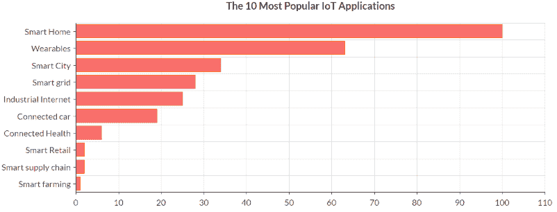

# 关于 IOT 应用程序开发的 5 个神话

> 原文：<https://dev.to/adalycoder/5-myths-about-iot-app-development-1ajf>

物联网(IoT)是我们这个时代最有前途和讨论最多的技术主题之一。我们决定揭示为什么这个问题得到如此多的炒作，并驱散一些关于物联网应用程序开发的流行神话。

物联网描述了完全互联世界的概念，其中所有物理设备都与全球网络相连。当谈到“东西”时，普通用户会想到电脑、平板电脑、智能手机和可穿戴设备。更有经验的用户也可以添加智能住宅和智能城市技术。

事实上，这个概念要先进得多，不仅包括“事物”，还包括大量产生的数据。

物联网领域最近一直在增加。这可以用三个因素来解释:

1.  移动设备数量的快速增长。根据思科的报告，2003 年大约有 5 亿台设备，而 2010 年只有 125 亿台。七年间，人均联网设备数量增长了 2250%,并且自那以后还在继续增长。

2.  传感器成本的降低。
    90 年代初，传感器的平均价格在 20-25 美元之间。来自 [TheAppSolutions](https://theappsolutions.com/) 的应用程序开发专家称，到 2020 年，每个传感器的常规成本约为 5 美元。今天的价格不到一美元。

3.  数据存储技术的发展。
    物联网最大的问题是收集、保存和分析“物”产生的数据。云存储技术的发展使得管理大数据成为可能。
    物联网正在快速发展，并影响着互联设备硬件和软件的重大转变。然而，物联网的核心思想不仅仅是收集信息。它涉及双向通信，物联网设备发回分析后的信息，用户可以根据这些信息做出决策。

目前这项技术仍处于发展过程中。完全成型还需要几年时间，但是所有的构件都已经就位。

在这场革命中，智能手机并不是最后的归属。目前，应用解决方案团队正在开展此类项目，作为物联网应用开发公司，我们面临着一些常见的误区。

## 神话#1 物联网是一项未来技术

一个普遍的误解是，物联网是科幻电影中的东西，或者至少是刚刚开始成熟的技术。事实上，这只是下一个技术步骤。但是引发物联网革命的大量事物(微处理器、微控制器、传感器、iBeacons、RFID 等。)，已经存在并被广泛使用。

例如，让我们看看你的智能手机:

物联网所做的是进一步发展现有技术，并添加新的功能、能力和信息结构。

## 神话#2 物联网连接整个世界

在普通消费者的印象中，实际的物联网是所有设备相互连接并相互“对话”的世界。你的照明系统向安全系统提供信息，告诉车库门打开，所有这些都在智能手机应用程序中你的指纹的距离内。此外，所有这些系统都与汽车传感器、医疗保健等系统进行通信。

就目前而言，情况并非如此。不过，在最近的功能方面，行业需要克服一些挑战。我们主要讨论的是安全性、互操作性和带宽。但根据 Gartner 的研究，前景令人眼花缭乱。今天，平均每个家庭拥有大约 5 台设备，但在未来几年，这个数字将增加到 500 台。

## 神话之三。IOT 应用程序开发成本

事实上，物联网应用程序的开发过程与其他任何应用程序都非常相似。

让我们更深入地了解“如何开发物联网应用”的整个过程。在这条路径的起点有一个或几个传感器。他们收集材料，并借助 Wi-Fi、蓝牙或任何其他网络连接将其发送到物联网应用层。接收到的数据可以存储在内部，或者该层将其发送到云数据存储。在某些情况下，数据量是巨大的，你需要开发一个算法来分析或购买现有的解决方案。

在移动应用程序的帮助下，用户可以访问所有这些信息。我们的用户界面/UX 设计师致力于简化这种信息流，确保用户获得快速便捷的体验。

应该澄清的是，所描述的过程显示了一些基本的工作流程，并且取决于业务目标和场景。该物联网组件至少需要 3-6 周的额外时间。非物联网 app 休息时间也一样。

为了降低成本和优化花费的时间，我们的团队可以确保使用预构建的组件和选定的物联网平台进行开发。这种方法在应用程序开发的初始阶段和构建 MVP 时特别有用。

## 神话之四。物联网是关于“事物”和应用的

因此，我们有传感器，使所有的“东西”连接到全球网络。我们可以轻松地为每个平台使用定制应用。开发一个 IOT app 够吗？答案是否定的。在整个过程中，由“事物”产生的数据和分析起着关键作用。

如今，处理这样的信息阵列是一个主要的技术挑战。许多公司将这些复杂的场景导向物联网云平台。对于小型部署，有些服务可能是部分免费的，甚至是免费的。

该模型允许以下内容:

对设备进行注册，并对其进行管理和监控；
收集和存储大量设备的数据；
用大数据工作；
向其他系统、设备和应用发送数据；
处理和响应演出设备事件。
为分公司发展做出巨大贡献的思科公司，目前正致力于“雾计算”概念。根据定义，雾扩展了云，因此它可以更接近物联网中产生数据的东西。称为雾节点的特殊设备可以安装在每一个物联网设备上。

雾不会取代云，而是为了优化可用资源而进行的协作。

雾计算允许:

在生产地附近分析时间最敏感的数据。
将部分数据发送到云端进行长期存储。

## 神话之五。物联网引发了安全和隐私问题

新技术通常包含滥用甚至数据泄露的可能性。保密和安全问题是重中之重。关于数据安全的工作正在几个层次上进行。当数据在云中或设备之间移动时，可以采用隐私增强技术基础设施标准进行保护。此外，一些政府法规要求对信息进行保护，而不管信息存储在什么位置。

安全模型包括:

可靠和安全的操作系统；
认证和访问控制；
唯一标识符；
强大的应用安全。
我们还实施了安全计划开发的三个步骤。在进行安全性测试时，您可以将它们用作检查清单:

风险评估
漏洞扫描
数据隐私保护检查。

## 外卖

根据 Gartner 的数据，今年物联网设备的数量比 2015 年增加了 30%,总数达到 64 亿件。增长率确实是巨大的。对于任何企业的成功来说，注意和把握这些趋势以在竞争中立于不败之地是至关重要的。

App Solutions 团队随时准备与您合作，克服误解和疑虑，创造真正创新的产品。根据 web analytics，以下是十大最受欢迎的物联网应用。

