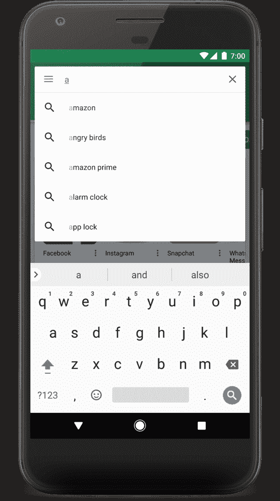
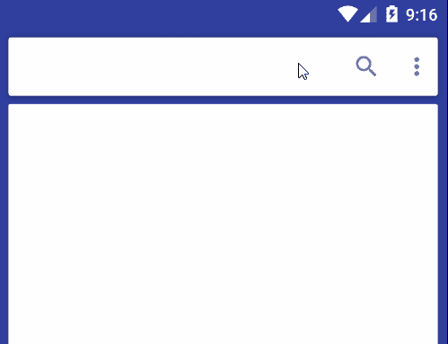

# 使用 Xamarin 的浮动材料搜索视图。机器人

> 原文：<https://dev.to/fanmixco/floating-material-search-view-with-xamarin-android-3pd3>

开发应用程序是编程界的新趋势，但如果你没有任何图形设计背景，用**材料设计**设计出好看又时尚的应用程序可能会有点复杂。

最近，我开始[重新设计](https://www.behance.net/gallery/81946027/Tipicos-Salvadorenos-Material-Design)我的一些应用程序，就像一本[食谱](https://play.google.com/store/apps/details?id=tk.supernova.tipsal&hl=nl)；然而，我面临着许多问题，因为我想实现一些材料设计的最新趋势，如**浮动搜索视图**，例如:

[](https://res.cloudinary.com/practicaldev/image/fetch/s--Txi5Vffy--/c_limit%2Cf_auto%2Cfl_progressive%2Cq_auto%2Cw_880/https://developer.android.cimg/search/search-ui.png)

图一。[谷歌](https://developer.android.com/guide/topics/search/search-dialog)某应用的搜索对话框截图。

我同意有多种解决方案，尤其是如果你正在用 Android Studio 开发应用程序，例如:

*   [浮动搜索视图](https://github.com/arimorty/floatingsearchview)。
*   [材料搜索栏](https://github.com/mancj/MaterialSearchBar)。

和许多其他的，但是在 Xamarin，你的选择是相当有限的；从技术上来说，最好的选择是相当老的[浮动搜索视图](https://github.com/xamarin/XamarinComponents/tree/master/Android/FloatingSearchView)。我甚至运行了例子，我得到的第一件事是一个*漂亮的警告*，这个控件是为旧版本的 Android (6-7)设计的，当我试图使用它时，我不能，因为我得到了许多错误。

我的下一个想法是绑定一个库，我决定使用这个[材料搜索栏](https://github.com/mancj/MaterialSearchBar)，从技术上来说，VS 不喜欢它，因为我面临几个[问题](https://stackoverflow.com/questions/56725489/error-cs0115-onbindviewholderobject-int-no-suitable-method-found-to-ove/)。我在一个坚硬的地方和石头之间感到因为我不知道该怎么做，但因为我有一些 Java 背景和 Android Studio 的知识，我决定去狂野一下，*逆向工程*库，从头重新写！

现在，这是我的结果，我希望你会喜欢它，并帮助你建立下一代的应用程序！

* * *

### **第一步。从 NuGet 下载软件包:**

[](https://www.nuget.org/packages/Xamarin-MaterialSearchBar/)

* * *

### **第二步。在 XML 中定义您的控件**

```
<tk.supernovaic.MaterialSearchBar.MaterialSearchBar
    style="@style/MaterialSearchBarLight"
    app:mt_speechMode="true"
    app:mt_hint="Custom hint"
    app:mt_maxSuggestionsCount="10"
    android:layout_width="match_parent"
    android:layout_height="wrap_content"
    android:id="@+id/searchBar" /> 
```

<svg width="20px" height="20px" viewBox="0 0 24 24" class="highlight-action crayons-icon highlight-action--fullscreen-on"><title>Enter fullscreen mode</title></svg> <svg width="20px" height="20px" viewBox="0 0 24 24" class="highlight-action crayons-icon highlight-action--fullscreen-off"><title>Exit fullscreen mode</title></svg>

* * *

### **第三步。定义您的活动**

编辑您正在工作的活动(**appcompactivity**)并添加以下部分:

*   `MaterialSearchBar.IOnSearchActionListener` **界面**用于读取栏中的按钮动作。
*   创建一个`MaterialSearchBar`类型的对象。
*   创建一个收听你的酒吧的听众。

*示例代码:*

```
public partial class YourClassActivity : AppCompatActivity, MaterialSearchBar.IOnSearchActionListener
{    
    private MaterialSearchBar MSearchBar { get; set; }

    protected override void OnCreate(Bundle savedInstanceState)
    {
        base.OnCreate(savedInstanceState);

        MSearchBar = FindViewById<MaterialSearchBar>(Resource.Id.searchBar);

        MSearchBar.SetOnSearchActionListener(this);

        MSearchBar.AddTextChangeListener(new MaterialSearchBarListener());
    }

    void MaterialSearchBar.IOnSearchActionListener.OnButtonClicked(int p0)
    {
        switch (p0)
        {
            case MaterialSearchBar.ButtonNavigation:
                Drawer.OpenDrawer((int)GravityFlags.Left);
                break;
            case MaterialSearchBar.ButtonSpeech:
                break;
            case MaterialSearchBar.ButtonBack:
                MSearchBar.DisableSearch();
                break;
        }
    }
}

public partial class YourClassActivity
{
    private class MaterialSearchBarListener : Java.Lang.Object, ITextWatcher
    {
        public void AfterTextChanged(IEditable s)
        {

        }

        public void BeforeTextChanged(ICharSequence s, int start, int count, int after)
        {

        }

        public void OnTextChanged(ICharSequence s, int start, int before, int count)
        {

        }
    }
} 
```

<svg width="20px" height="20px" viewBox="0 0 24 24" class="highlight-action crayons-icon highlight-action--fullscreen-on"><title>Enter fullscreen mode</title></svg> <svg width="20px" height="20px" viewBox="0 0 24 24" class="highlight-action crayons-icon highlight-action--fullscreen-off"><title>Exit fullscreen mode</title></svg>

现在你知道了！

[](https://res.cloudinary.com/practicaldev/image/fetch/s--_8kegixt--/c_limit%2Cf_auto%2Cfl_progressive%2Cq_66%2Cw_880/https://raw.githubusercontent.com/mancj/MaterialSearchBar/master/art/preview.gif)

我有更复杂的例子，比如如何在我的 [Wiki](https://github.com/FANMixco/Xamarin-SearchBar/wiki) 中创建你的**定制适配器**或者样式化它。欢迎访问，并提供自己的想法！

我想亲自感谢为这个图书馆写基础的曼苏尔·纳沙耶夫。

### 关注我:

| 商务化人际关系网 | 油管（国外视频网站） | 照片墙 | 网络先知 | 分享您的故事 |
| --- | --- | --- | --- | --- |
| [](https://bit.ly/3xLCmvb) | [](https://youtube.com/c/FedericoNavarrete) | [](https://www.instagram.com/federico_the_consultant) | [](https://redcircle.com/shows/cyber-prophets) | [](https://redcircle.com/shows/sharing-your-stories) |

[](https://www.buymeacoffee.com/fanmixco)