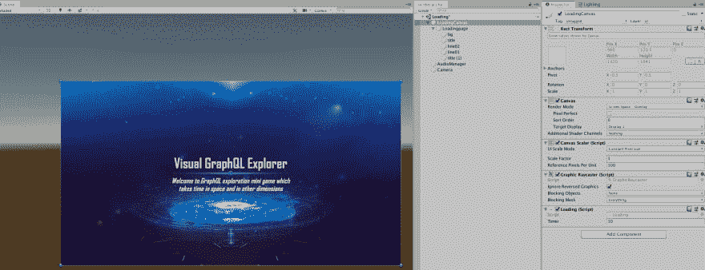
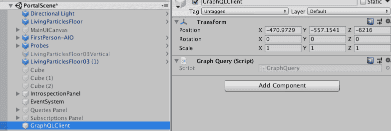
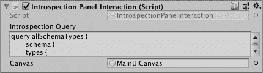

# 用 Unity3d 引擎试用 GraphQL

> 原文：<https://dev.to/vladimirnovick/trying-out-graphql-with-unity3d-engine-565>

GraphQL 是一项了不起的技术，像风暴一样席卷了全世界。越来越多的公司正在转向使用 GraphQL 而不是 REST APIs，因为 GraphQL 解决了太多的问题。

简而言之，GraphQL 是一种用于 API 的查询语言。它使您能够从客户端查询您的单个 API 端点，并定义您想要获得的数据的形式。在服务器上，您定义一个模式——数据的形状以及如何解析这些数据。无论是从数据库、微服务还是以任何你想要的方式。

更酷的是，GraphQL 为您提供了订阅功能，因此您可以通过 WebSockets 获得实时数据，并轻松构建现代 web 和移动应用程序。如果你有兴趣了解更多关于 GraphQL 的知识，你可以查看关于如何在各种网络和移动客户端上使用 GraphQL 的教程。
另外，你可以在我的 [Youtube 频道](https://www.youtube.com/c/VladimirNovickDev)上查看我前段时间做的 GraphQL Bootcamp

如果你一直在 twitter 上关注我 [@VladimirNovick](https://twitter.com/VladimirNovick) 你可能知道我正在从事 Web、移动、AR、VR 和物联网领域的工作。

特别是在 VR 和 AR 领域，我一直在使用 Unity3d 引擎，所以我最近很好奇我是否可以在 Unity3d 中使用 GraphQL 来处理实时排行榜之类的事情。

经过长时间寻找 Unity3d 的 graphql 客户端，我可以在 C#中使用它，并且它将在 Unity engine 中得到支持，我发现[确实是一个基本的客户端](https://github.com/Gazuntype/graphQL-client-unity)，我将它用于下面的演示。

[https://www.youtube.com/embed/zwdZC0tL-rI](https://www.youtube.com/embed/zwdZC0tL-rI)

那么这个演示中发生了什么呢？我有三个场景:

第一个只是一个加载屏幕，这里我只显示了 10 秒计时器的基本加载屏幕。所以这里什么都没发生。

[](https://res.cloudinary.com/practicaldev/image/fetch/s--Nl8fMA99--/c_limit%2Cf_auto%2Cfl_progressive%2Cq_auto%2Cw_880/https://thepracticaldev.s3.amazonaws.com/i/1opjw9ifsvpdeqww682j.png)

下一个加载的屏幕是`HasuraSpaceDemo`

我用了 [FPS All in One](https://assetstore.unity.com/packages/tools/input-management/first-person-all-in-one-135316) 第一人称控制器和[科幻模块化走廊](https://assetstore.unity.com/packages/3d/environments/sci-fi/modular-sci-fi-corridor-142811)演示场景。对于门户网站，我使用了 [KTK 灯光](https://assetstore.unity.com/packages/vfx/particles/ktk-lightning-effects-volume1-40978)资产来减少粒子效果的工作时间，但基本上，它只是使用一堆灯光资产的 Unity 手里剑粒子系统。对于 UI 和门户场景，我使用了[科幻 UI 包](https://assetstore.unity.com/packages/2d/gui/icons/sci-fi-ui-pack-psd-138176)和[活体粒子](https://assetstore.unity.com/packages/vfx/particles/spells/living-particles-105817)。场景中的音乐来自[黑暗科幻资产](https://assetstore.unity.com/packages/audio/music/electronic/dark-sci-fi-music-pack-49862)

`HasuraSpaceDemo`用来展示 GraphQL 可以用在任何类型的游戏中。如果你走进门户网站，你可以输入任何 GraphQL 端点 URL。当你这样做时，你被“传送”到不同的- `Portal`场景。

我有处理 UI 的`UIManager`脚本:

```
using System.Collections;
using System.Collections.Generic;
using UnityEngine;
using UnityEngine.UI;

public class UIManager : Singleton<UIManager>
{
    public string graphQLEndpoint;
    public GameObject graphQLCanvas;

    private void Start()
    {
        DontDestroyOnLoad(gameObject);
    }

    // Start is called before the first frame update
    public void LoadPortalScene()
    {
        GameManager.Instance.loadPortalScene();
    }

    public void setGraphQLEndpoint(Transform inputField)
    {
        graphQLEndpoint = inputField.GetComponent<InputField>().text;
    }

} 
```

Enter fullscreen mode Exit fullscreen mode

正如你所看到的，这个脚本有两个公共方法——第一个用来加载门户场景，第二个用来设置`graphQLEndpoint`以便在下一个场景中使用。

为了在下一个场景中使用 GraphQL，我所做的是，首先，使用 [graphql-client-unity](https://github.com/Gazuntype/graphQL-client-unity) 包中的`GraphQLQuery`脚本，并将其设置在场景中新的空游戏对象上，称之为`GraphQLClient`

[](https://res.cloudinary.com/practicaldev/image/fetch/s--MpFKICG5--/c_limit%2Cf_auto%2Cfl_progressive%2Cq_auto%2Cw_880/https://thepracticaldev.s3.amazonaws.com/i/zhqwzsry300rmfaw1bq9.png)

然后，我需要添加一个面板，将有互动。这个想法是，当我用文本“GraphQL 模式自省”接近一个面板时，我将进入 Box Collider，它将触发`IntrospectionPanelInteraction`脚本中的`OnTriggerStay`方法。

当我们的`IntrospectionPanelInteraction`脚本启动时，我们设置 GraphQuery URL、显示结果的画布以及画布内容:

```
 void Start()
    {
        if (UIManager.Instance)
        {
            UIManager.Instance.graphQLCanvas = canvas;
        }

        GraphQuery.url = UIManager.Instance.graphQLEndpoint;

        fp = FindObjectOfType<FirstPersonAIO>();
        content = canvas.GetComponent<UICanvas>().Content;
    } 
```

Enter fullscreen mode Exit fullscreen mode

所以当我们在碰撞器边界内时，`OnTriggerStay`功能正在运行。

```
 private void OnTriggerStay(Collider other)
    {
        if (!canvas.activeSelf)
        {
            canvas.SetActive(true);
            runIntrospectionQuery();
        }
        InteractionController.Instance.disableInteraction(fp);
    } 
```

Enter fullscreen mode Exit fullscreen mode

查询执行如下:

```
 void runIntrospectionQuery()
    {
        Debug.Log("Query");
      GraphQuery.onQueryComplete += DisplayResult;
      GraphQuery.POST(introspectionQuery);

    } 
```

Enter fullscreen mode Exit fullscreen mode

查询本身被定义为字符串公共变量，并且在编辑器中可见:

[](https://res.cloudinary.com/practicaldev/image/fetch/s--pBkToaDs--/c_limit%2Cf_auto%2Cfl_progressive%2Cq_auto%2Cw_880/https://thepracticaldev.s3.amazonaws.com/i/0maz2tpccfo6f79k29rk.png)

最终的`IntrospectionPanelInteraction`脚本看起来像这样:

```
using System.Collections;
using System.Collections.Generic;
using graphQLClient;
using Newtonsoft.Json;
using Newtonsoft.Json.Linq;
using UnityEngine;
using UnityEngine.UI;

public class IntrospectionPanelInteraction : MonoBehaviour
{

    [Tooltip("This is the query call that gives me introspection details)]
    [TextArea]
    public string introspectionQuery;

    public GameObject canvas;
    private FirstPersonAIO fp;
    private Text content;
    void Start()
    {
        if (UIManager.Instance)
        {
            UIManager.Instance.graphQLCanvas = canvas;
        }

        GraphQuery.url = UIManager.Instance.graphQLEndpoint;

        fp = FindObjectOfType<FirstPersonAIO>();
        content = canvas.GetComponent<UICanvas>().Content;
    }
    // Start is called before the first frame update
    private void OnTriggerStay(Collider other)
    {
        if (!canvas.activeSelf)
        {
            canvas.SetActive(true);
            runIntrospectionQuery();
        }
        InteractionController.Instance.disableInteraction(fp);
    }

    private void OnTriggerExit(Collider other)
    {
        if (canvas.activeSelf)
        {
            canvas.SetActive(false);
            InteractionController.Instance.enableInteraction(fp);
        }
    }

    void runIntrospectionQuery()
    {
        Debug.Log("Query");
        GraphQuery.onQueryComplete += DisplayResult;
        GraphQuery.POST(introspectionQuery);

    }

    public void DisplayResult()
    {
        string data = ParseData(GraphQuery.queryReturn, "__schema");
        canvas.gameObject.GetComponentInChildren<ScrollRect>().normalizedPosition = new Vector2(0, 1);
        Debug.Log(data);
        content.text = data;
    }

    void OnDisable()
    {
        GraphQuery.onQueryComplete -= DisplayResult;
    }

    string ParseData(string query, string queryName){
        JObject obj = JsonConvert.DeserializeObject<JObject>(query);
        return JsonConvert.SerializeObject(obj["data"][queryName], Formatting.Indented);
    }

} 
```

Enter fullscreen mode Exit fullscreen mode

# 总结

你可以想象这是一个非常简单的例子，我只是在 Unity engine 中尝试 GraphQL。此外，要获得订阅、实时查询等还有很长的路要走。我正在做实验，我很想知道 GraphQL 在 Unity3d 或 Unreal engine 中的用例是什么。我可以看到它对排行榜、高分、应用内购买、游戏内广告等非常有用。

请让我在 Twitter 上知道你在 Unity3d 中看到的 GraphQL 用法。