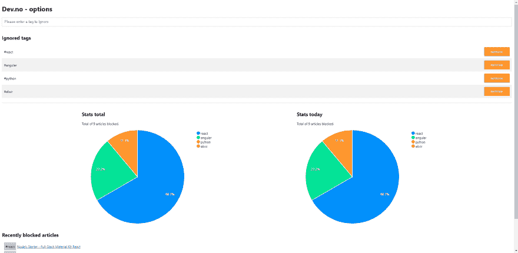

# 我创建了一个扩展，可以让你忽略 dev.to 上的标签

> 原文：<https://dev.to/kaos/i-created-an-extension-that-lets-you-ignore-tags-on-dev-to-ipb>

我在关注#webdev 和#vue 标签，但是我的 feed 充满了#react、#python 和#angular 帖子。我不关心这些，但是很多文章都贴了多个标签，比如#react、#webdev。

那我们该怎么办？
等到 dev.to 引入忽略标签的选项？
跟随标签，将其相关性设置为-999？
因为我们是懒惰的开发者，所以只有一个选择。写自己的扩展\ *(ツ)* /。

## [引入开发编号](https://chrome.google.com/webstore/detail/devno-ignore-tags-on-devt/lhmeebcadjglnpfbmfodipgelbbpidmg)

那么它是如何工作的呢？
这个扩展本质上可以分解成这个小片段

```
const tags = ['react', 'python']; // hardcoded tags list for demo purposes
tags.forEach(tag => {
    var tagElements = Array.from(
      document.querySelectorAll(`.single-article .tags a[href='/t/${tag}']`)
    );

    tagElements.forEach(tagElement => {
      // the whole article is located 2 elements above (parent.parent);
      var articleElement = tagElement.parentElement.parentElement;
      articleElement.style.display = "none";      
    });
  }); 
```

为了更好地理解这个片段，让我们看看一篇文章在 dev.to 主页上的样子，并将其分解为我们需要关注的基本元素。

```
<div class="single-article single-article-small-pic">
  <!-- removed -->
  <div class="tags">
    <a href="/t/javascript"><span class="tag">#javascript</span></a>
    <a href="/t/webdev"><span class="tag">#webdev</span></a>
    <a href="/t/tutorial"><span class="tag">#tutorial</span></a>
    <a href="/t/discuss"><span class="tag">#discuss</span></a>
  </div>  
  <!-- removed -->
</div> 
```

然后，标签“反应”可以例如用下面的选择器
`.single-article .tags a[href='/t/react']`来定位。

然后可以通过调用`.parentElement`两次来访问整篇文章。

该扩展也有一个选项 UI，它是用 vue 构建的，在这里你可以管理被忽略的标签和查看一些不错的统计数据。我对现在的样子不是很满意，所以可以随便拍个 PR :)
[](https://res.cloudinary.com/practicaldev/image/fetch/s--ieYrRbaz--/c_limit%2Cf_auto%2Cfl_progressive%2Cq_auto%2Cw_880/https://thepracticaldev.s3.amazonaws.com/i/i96hnsqopm4hojzkxtwd.PNG)

一旦 dev.to 推出忽略标签的选项，这个扩展就可能过时。

顺便说一下，这是开源的，所以一定要检查回购和[下载扩展](https://chrome.google.com/webstore/detail/devno-ignore-tags-on-devt/lhmeebcadjglnpfbmfodipgelbbpidmg)。

##  [凯-奥斯瓦尔德](https://github.com/kai-oswald) / [开发编号](https://github.com/kai-oswald/dev.no)

### 忽略开发者标签的 Chrome 扩展

<article class="markdown-body entry-content container-lg" itemprop="text">

# dev.no

忽略开发者标签的 Chrome 扩展

[下载链接](https://chrome.google.com/webstore/detail/devno-ignore-tags-on-devt/lhmeebcadjglnpfbmfodipgelbbpidmg)

</article>

[View on GitHub](https://github.com/kai-oswald/dev.no)