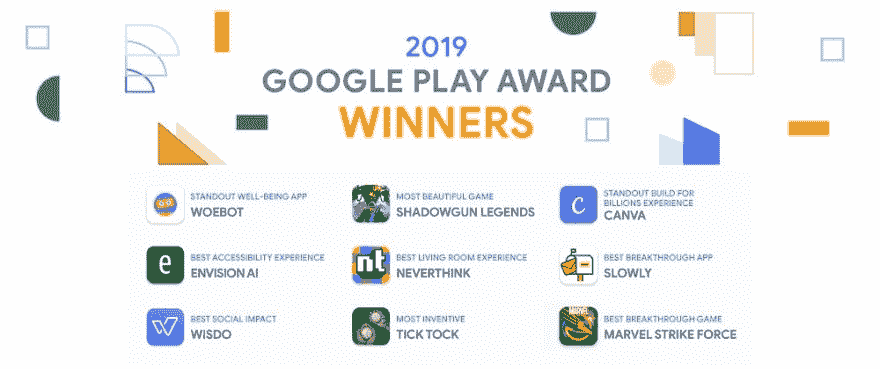

# 2019 年 Google Play 大奖获奖安卓应用

> 原文：<https://dev.to/marieweaver132/award-winning-android-apps-in-2019-google-play-awards-368h>

 
每年，谷歌都会祝贺那些参与开发“获奖”应用的人——无论是开发者、企业家还是一家[安卓应用开发公司](https://www.hiddenbrains.co.uk/android-apps-development.html)。他们强调了在 Android 上努力追求质量和推动创新的努力和个人。

该奖项专门颁发给不同的类别，从游戏，娱乐，福祉等。总共有九个类别，其中的标准包括整体质量，强大的设计，技术性能和创新，以选择获胜者。谷歌的各个团队在第一阶段共同挑选了被提名者。

每年的 Google Play 奖项背后的目的是表彰和庆祝在其专业领域取得卓越成就的开发人员。该奖项突出了谷歌 Play 商店上的精英中的精英，并为其他最佳实践开发者树立了榜样。

对于个人来说，这是一个很好的应用程序列表，可以让好奇的人尝试一下，看看是什么让他们如此特别。这也为企业家雇佣 Android 应用程序开发人员并开始开发自己的应用程序提供了灵感。

在今年的提名中，阵容将重点放在精神健康上，包括 Woebot 和 Wisdo 等应用程序，woe bot 提供认知行为治疗工具，Wisdo 允许你分享你的故事或在群体中结识新朋友，范围从身体积极，母亲，找到你的梦想工作等等。

让我们继续，进入列表:

Woebot 实验室的 woe bot
woe bot 每周发送超过一百万条信息，帮助用户应对日常压力和挑战，如抑郁、焦虑、关系问题、拖延、孤独、悲伤、成瘾、疼痛管理等症状。Woebot 每天都与用户保持联系，并通过基于久经考验的方法的实用技术指导他们，如认知行为疗法(CBT)、正念和辩证行为疗法(DBT)。

### [Envision AI](https://play.google.com/store/apps/details?id=com.letsenvision.envisionai&hl=en_US) 由 Envision Technologies BV

用 Envision 看看你不能做什么，这是最快最可靠的应用程序，它在人工智能和 OCR 的帮助下描述了你周围的视觉世界。Envision 是在视觉障碍社区的帮助下精心设计的，旨在为盲人和低视力者带来最好的辅助应用程序。阅读 60 多种语言的文本，使用放大镜，扫描条形码或您的环境等等。

### [从不思考](https://play.google.com/store/apps/details?id=com.neverthink)由从不思考

观看 YouTube 是我们的全职工作，我们的团队每天都会在互联网上搜索最新、最好的视频，这样您就再也不用考虑看什么了。有超过 45 个人策划的频道，帮助你跟上最新的趋势和新闻，学习新的东西，并被互联网上最怪异的视频所震惊。

### [坎瓦](https://play.google.com/store/apps/details?id=com.canva.editor)由坎瓦

Canva 是一款多功能的图形设计应用程序，它是一个标志制作器和海报制作器，视频编辑器，可用于设计您的 Instagram 高亮封面、Instagram 故事或帖子，为脸书、Pinterest 和 Twitter 等社交网络创建横幅，甚至可以制作生日邀请或婚礼邀请。可在您的手机和电脑上使用，因此您可以随时随地回到您的设计中

### [漫威打击力量](https://play.google.com/store/apps/details?id=com.foxnextgames.m3) by FoxNext Games

在 MARVEL Strike Force 游戏中，您可以在这款充满动作、视觉震撼的免费手机或平板电脑游戏中与盟友和主要对手并肩作战。当你进入对抗全新敌人威胁的战略战斗时，通过集合终极小队来领导冲锋，包括蜘蛛侠、奇异博士、格鲁特、火箭浣熊、洛基、毒液、埃莱克特拉、美国队长和钢铁侠。是时候战斗了！几个小时。

### [滴答](https://play.google.com/store/apps/details?id=com.OtherTales.TickTock)由其他故事互动而来

滴答声:两个人的故事是一个怪异的两个玩家合作的益智游戏。每位玩家都需要在自己的移动设备(手机或平板电脑)上安装游戏副本才能玩。也可以用电脑(PC 或 Mac)跨平台玩。平均游戏时间 2.5 分钟

### [Wisdo](https://play.google.com/store/apps/details?id=com.wisdo.android.wisdo) 由 Wisdo 有限公司

Wisdo 是一个生活指南，在那里你可以找到并联系到去过那里的人。分享你独特的旅程，发现与你同路的人，并找出你错过了什么对你来说重要的事情。从身体积极性到焦虑或母性，有了 Wisdo，你永远不会孤单。而前方的路总是更清晰。

### [影枪传说](https://play.google.com/store/apps/details?id=com.madfingergames.legends&hl=en) -由 Wisdo 有限公司

Shadowgun 为您提供史诗故事战役、竞技 PvP 或合作多人游戏，所有这些都在一个 FPS MMO 动作游戏中。游戏有惊人的图形和良好的目标控制保证！

### [慢慢](https://play.google.com/store/apps/details?id=com.slowlyapp&hl=en)-连接世界

慢慢地让你满足笔友从你的智能手机！找一个和你有共同爱好的人，写一封信，收集世界各地的邮票。说出你的想法——一次一个字母！

*结论*
这是雇佣安卓开发者并开始实现你的应用梦想的最佳时机。目前，市场需要创新的 Android 应用程序来满足客户的需求。就今天而言，开发一个能吸引观众的 Android 应用程序是最好的投资。