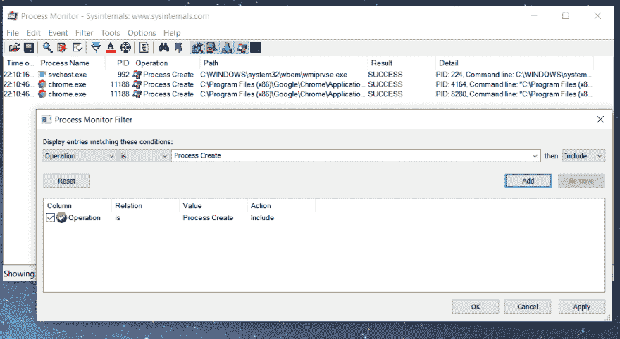
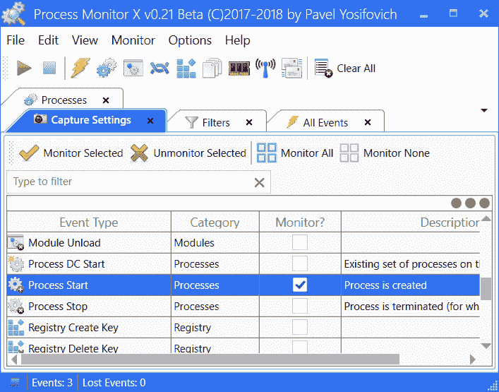
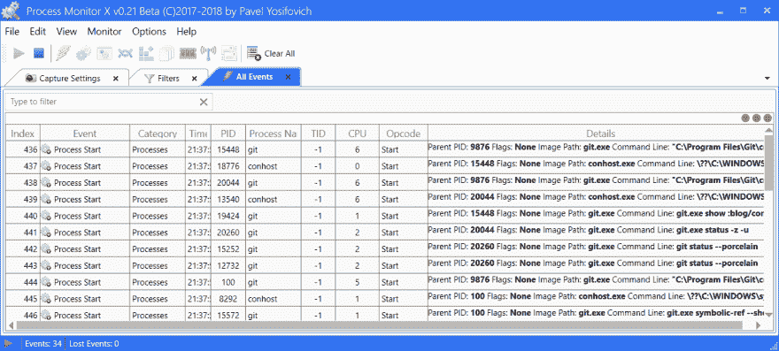

# 监控新流程的创建

> 原文：<https://dev.to/jarekprzygodzki/monitoring-new-process-creation-568>

监控流程创建和终止事件是您工具箱中的一项有用技能。本文由两部分组成。第一部分介绍了不同平台的现有工具。第二部分解释了这些工具如何在内部工作。

# 介绍工具

## Linux

### forkstat

Forkstat 监视进程 fork()、exec()和 exit()活动。它是成熟的，并且可以在大多数发行版的存储库中获得。使用 Linux netlink 连接器收集进程活动。

```
# Ubuntu\Debian
sudo apt install forkstat
sudo forkstat -e exec
Time     Event   PID Info   Duration Process
21:20:15 exec   3378                 sleep 10

sudo forkstat -e exec,exit
Time     Event   PID Info   Duration Process
21:21:30 exec   3384                 sleep 10
21:21:40 exit   3384      0  10.003s sleep 10 
```

需要 root 权限(或 CAP_NET_ADMIN 功能)。由科林·伊恩·金开发。

### 执行监听(eBPF)

execsnoop 跟踪进程执行。它的工作原理是动态跟踪一个执行的内核函数。
见密件抄送[你的操作系统安装说明](https://github.com/iovisor/bcc/blob/master/INSTALL.md)。在 Ubuntu 上，从 Ubuntu Bionic (18.04)开始，bcc 的版本可以在标准的 Ubuntu 存储库中获得。这些工具安装在`/sbin`(Ubuntu 18.04 中的`/usr/sbin`)中，扩展名为-bpfcc。

```
sudo apt-get install bpfcc-tools linux-headers-$(uname -r)

sudo execsnoop-bpfcc 
PCOMM            PID    PPID   RET ARGS
sleep            5380   5379     0 /usr/bin/sleep 10 
```

最初由[布兰登·格雷格](http://www.brendangregg.com/)创作。

### execsnow

基于 eBPF 的 execsnoop 处理器。仍然相关，因为它除了 awk 之外没有其他依赖项，并且可以在较旧的 Linux 内核版本(3.2 以上)上工作。

```
wget https://raw.githubusercontent.com/brendangregg/perf-tools/master/execsnoop \
    -O /usr/local/bin/execsnoop  && chmod +x /usr/local/bin/execsnoop

execsnoop 
```

在许多较新的系统上不工作，请首先尝试 execnoop(eBPF)。

## 窗口

### 过程监控

[*进程监视器*](https://docs.microsoft.com/en-us/sysinternals/downloads/procmon) ，是 *Sysinternals 套件*的一部分，是一个用于 Windows 的高级监视工具，可以用来跟踪进程创建事件。可以作为独立的可执行文件从项目网站下载，也可以使用 chocolatey 软件包管理器安装:`choco install procmon`。也是 [Sysinternals 套件](https://chocolatey.org/packages/sysinternals)包的一部分。最初由马克·鲁西诺维奇和布莱斯·科斯威尔创作

[](https://res.cloudinary.com/practicaldev/image/fetch/s--VtMtj8M9--/c_limit%2Cf_auto%2Cfl_progressive%2Cq_auto%2Cw_880/https://thepracticaldev.s3.amazonaws.com/i/rh1v2gogj4saq3hlnhxj.png)

### ProcMonX

[过程监控 X](https://github.com/zodiacon/ProcMonX) (ProcMonX)是由 [Pavel Yosifovich](https://twitter.com/zodiacon) 创造的 ProcMon 的替代产品。ProcMonX 提供了与 ProcMon 类似的活动信息，但增加了更多的事件，如网络、ALPC 和内存。可以从这里下载独立的可执行文件。

[](https://res.cloudinary.com/practicaldev/image/fetch/s--wwZhjPef--/c_limit%2Cf_auto%2Cfl_progressive%2Cq_auto%2Cw_880/https://thepracticaldev.s3.amazonaws.com/i/s2d7bpyl8tb78mbcdnl0.png)

[](https://res.cloudinary.com/practicaldev/image/fetch/s--8MNBV83P--/c_limit%2Cf_auto%2Cfl_progressive%2Cq_auto%2Cw_880/https://thepracticaldev.s3.amazonaws.com/i/qtp8mduq0kprkyz1cuuh.png)

### PowerShell

Microsoft Scripting Guy， [Ed Wilson](https://edwilson.com/) 展示了 PowerShell 可以用来监控进程创建。

```
Register-CimIndicationEvent `
    -ClassName Win32_ProcessStartTrace `
    -SourceIdentifier "ProcessStarted"

Get-Event | `
    Select timegenerated, `
        @{L='Executable'; E = {$_.sourceeventargs.newevent.processname}}

TimeGenerated       Executable
-------------       ----------
12.06.2019 22:28:19 ps.exe
12.06.2019 22:29:13 bash.exe
12.06.2019 22:29:13 bash.exe
12.06.2019 22:29:13 bash.exe
12.06.2019 22:29:13 git.exe
12.06.2019 22:30:47 chrome.exe
12.06.2019 22:30:48 chrome.exe

# Cleanup
get-event | Remove-Event
Get-EventSubscriber | Unregister-Event 
```

详见[这篇](https://devblogs.microsoft.com/scripting/use-powershell-to-monitor-for-process-startup/)文章。

## macOS

### dtrace

`sudo newproc.d`将使用 [DTrace](http://dtrace.org) 来跟踪所有新的进程。如果[系统完整性保护](https://support.apple.com/en-us/HT204899)开启，则不起作用。

```
sudo newproc.d
dtrace: system integrity protection is on, some features will not be available

dtrace: failed to compile script /usr/bin/newproc.d: line 22: probe description proc:::exec-success does not match any probes. System Integrity Protection is on 
```

El Capitan 引入了一种称为系统完整性保护的安全机制，以帮助确保没有恶意方可以修改操作系统，这严重限制了 DTrace 的功能。

SIP 必须部分禁用

```
csrutil enable --without dtrace # disable dtrace restrictions only 
```

重新启动，DTrace 开始工作。

## 这些工具是如何工作的

### Forkstat

Forkstat 使用内核 [Netlink](https://en.wikipedia.org/wiki/Netlink) 连接器接口来收集进程活动。它允许程序通过套接字连接接收进程事件的通知，如 fork、exec、exit、core dump 以及进程名称、UID、GID 或 SID 的更改。

使用默认参数，forkstat 将报告 fork、exec 和 exit 事件，但是-e 选项允许指定一个或多个 fork、exec、exit、core、comm、clone、ptrce、uid、sid 或所有事件。当一个 fork 事件发生时，forkstat 将报告父进程和子进程的 PID 和进程名，这样就可以很容易地识别进程的来源。Forkstat 试图跟踪一个进程的生命周期，并在可能的情况下记录进程退出的持续时间。请注意，如果系统负载过重，forkstat 可能会错过事件。Netlink 连接器还需要 root 权限(或使用 CAP_NET_ADMIN 功能)。

Netlink 是一种 Linux 内核 IPC 机制，支持用户空间进程与内核或多个用户空间进程之间的通信。Netlink 套接字是实现这种通信的原语。
`CONFIG_PROC_EVENTS`内核选项启用了`Process Events Connector`，它通过一个 Netlink 套接字向用户公开进程事件，并于 2005 年由 Matt Helsley 在[这个](https://lwn.net/Articles/157150/)补丁中引入。

Forkstat 的源代码在这里是，但它非常像 C，因为它设法混淆了相对简单的概念。

为了让用户空间了解不同的流程事件，我们必须

*   制作一个 netlink 套接字并绑定它
*   向内核发送`PROC_CN_MCAST_LISTEN`消息，让它知道我们想要接收事件
*   通过从套接字读取数据报来接收事件
*   解析事件数据并提取相关的流程信息

```
sock, _ := unix.Socket(unix.AF_NETLINK,
    // used interchangeably with SOCK_RAW
    unix.SOCK_DGRAM, unix.NETLINK_CONNECTOR)
addr := &unix.SockaddrNetlink{
        Family: unix.AF_NETLINK, Groups: C.CN_IDX_PROC, Pid: uint32(os.Getpid())}
unix.Bind(sock, addr)
send(sock, C.PROC_CN_MCAST_LISTEN)
for {
    p := make([]byte, 4096)
    nbytes, from, _ := unix.Recvfrom(sock, p, 0)
    nlmessages, _ := syscall.ParseNetlinkMessage(p[:nbytes])
    for _, m := range nlmessages {
            if m.Header.Type == unix.NLMSG_DONE {
                // netlink uses the host byte order
                cnhdr := (*C.struct_cn_msg)(unsafe.Pointer(&m.Data[0]))
                ptr := uintptr(unsafe.Pointer(cnhdr))
                ptr += unsafe.Sizeof(*cnhdr)
                pe := (*C.struct_proc_event)(unsafe.Pointer(ptr))
                switch pe.what {
                case C.PROC_EVENT_EXEC:
                    e := (*C.struct_exec_proc_event)(unsafe.Pointer(&pe.event_data))
                    fmt.Printf("Process started: PID %d\n", e.process_pid)
                case C.PROC_EVENT_EXIT:
                    e := (*C.struct_exit_proc_event)(unsafe.Pointer(&pe.event_data))
                    fmt.Printf("Process exited: PID %d\n", e.process_pid)
                }
            }
            }
    }

} 
```

就是这样！唯一的问题是 [`exec_proc_event`](https://github.com/torvalds/linux/blob/v5.0/include/uapi/linux/cn_proc.h#L80) 包含的数据很少。我们可以尝试立即从`/proc/<PID>`中读取进程信息，但这并不可靠(这太不靠谱了)。有一个风险是，当我们读取进程信息时，该进程已经完成，或者甚至另一个进程获取了它的 PID。完整的例子是这里的。

### 执行监听(eBPF)

execsnoop 是 BCC 的一部分。这是一套使用 eBPF tracing: infrastructure 来动态检测内核的工具。它允许定义在内核中运行的程序。在这里了解 eBPF [或者阅读](http://www.brendangregg.com/blog/2019-01-01/learn-ebpf-tracing.html)[execnoop 源代码](https://github.com/iovisor/bcc/blob/master/tools/execsnoop.py)。唯一的缺点是这些工具需要新的内核。

### execsnow

从 Brendan Gregg 的[性能工具](https://github.com/brendangregg/perf-tools)集合中破解。它跟踪`stub_execve()`或`do_execve(`，并以字符串数组的形式遍历`%si`寄存器。点击查看作者博客[的详细内容。](http://www.brendangregg.com/blog/2014-07-28/execsnoop-for-linux.html)

### 过程监控

*进程监视器* (ProcMon)在启动时安装一个内核驱动程序，它在系统范围内监视用户区域的进程。驱动 API 提供了内核例程 [`PsSetCreateProcessNotifyRoutine`](https://docs.microsoft.com/en-us/windows-hardware/drivers/ddi/content/ntddk/nf-ntddk-pssetcreateprocessnotifyroutine) / [`PsSetCreateProcessNotifyRoutineEx`](https://docs.microsoft.com/en-us/windows-hardware/drivers/ddi/content/ntddk/nf-ntddk-pssetcreateprocessnotifyroutineex) ，允许软件在 Windows 内核中监控进程的创建和终止事件。这里没有代码，但是[这个](https://github.com/microsoft/Windows-driver-samples/blob/41c29cb92feff490270b4ce31f67d7baddecc457/general/obcallback/README.md)来自 Windows 驱动程序工具包(WDK) 10 的例子很接近我们想要的。

### ProcMonX

ProcMonX 通过[微软使用](https://github.com/microsoft/perfview/blob/master/documentation/TraceEvent/TraceEventLibrary.md)[Windows(ETW)](https://docs.microsoft.com/pl-pl/windows/win32/etw/event-tracing-portal)(一种自 Windows 2000 以来就存在的诊断和日志记录机制)事件跟踪。diagnostics . tracing . trace event库。

### PowerShell

PowerShell 示例使用了 WMI ( [Windows 管理规范](https://en.wikipedia.org/wiki/Windows_Management_Instrumentation))和 [`Win32_ProcessStartTrace`](https://docs.microsoft.com/en-us/previous-versions/windows/desktop/krnlprov/win32-processstarttrace) 事件。

创建自己的监控工具只需要几行代码

```
/*
 * csc procmon_wmi.cs
 */
using System;
using System.Management;

class ProcessMonitor
{
    static public void Main(String[] args)
    {
        var processStartEvent = 
            new ManagementEventWatcher("SELECT * FROM Win32_ProcessStartTrace");
        var processStopEvent = 
            new ManagementEventWatcher("SELECT * FROM Win32_ProcessStopTrace");

        processStartEvent.EventArrived += 
            new EventArrivedEventHandler(
                delegate (object sender, EventArrivedEventArgs e)
        {
            var processName = e.NewEvent.Properties["ProcessName"].Value;
            var processId = e.NewEvent.Properties["ProcessID"].Value;

            Console.WriteLine("{0} Process started. Name: {1} | PID: {2}", 
                DateTime.Now, processName, processId);
        });

        processStopEvent.EventArrived += 
            new EventArrivedEventHandler(
                delegate (object sender, EventArrivedEventArgs e)
        {
            var processName = e.NewEvent.Properties["ProcessName"].Value;
            var processId = e.NewEvent.Properties["ProcessID"].Value;

            Console.WriteLine("{0} Process stopped. Name: {1} | PID: {2}", 
                DateTime.Now, processName, processId);
        });

        processStartEvent.Start();
        processStopEvent.Start();

        Console.ReadKey();
    }
} 
```

## macOS

### dtrace

DTrace 是用于 Solaris、macOS 和 FreeBSD 的动态跟踪框架。你可以在这里了解更多 [DTrace 工具](http://www.brendangregg.com/dtrace.html)和阅读 newproc.d 源代码[。](https://opensource.apple.com/source/dtrace/dtrace-168/DTTk/Proc/newproc.d.auto.html)