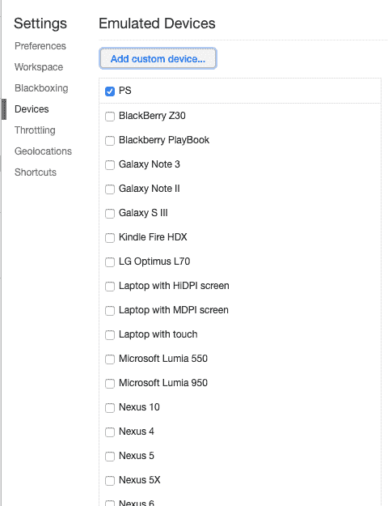
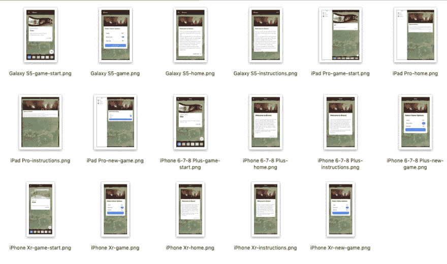

# 使用角度和量角器自动化 App Store 屏幕截图

> 原文：<https://dev.to/walkingriver/automating-app-store-screen-shots-with-angular-and-protractor-1ei4>

软件开发人员很懒，我是指好的方面。我从 1981 年开始写软件，从 1995 年开始专业写作。在这将近 40 年的时间里，我对这个职业有所了解。其中最重要的一点是:开发人员不喜欢执行重复的任务。当我们发现一项任务必须反复完成时，我们倾向于发明一种方法来自动化它。我最近的重复性任务是为我的移动应用程序生成截图，然后提交给苹果应用商店。我在这篇文章中概述的技术同样适用于 Android，但问题源于 App Store。所以这是我的重点。

正如我之前所写的，我制作了一款名为 *Bravo 的普通手机游戏！*。它是使用 Ionic 框架用 TypeScript 编写的。我最近把它升级到了 Ionic 4，用电容代替了 Cordova。进行得相当顺利，我[在另一篇帖子](https://walkingriver.com/ionic-3-to-4)中描述了这次经历。一旦我完成了，下一步就是将应用提交到 Google Play 和苹果应用商店。谷歌的提交很顺利，但苹果拒绝了新的二进制文件，因为我没有提供更新、更大的 iPhones 的截图。

过去，我总是通过在 iOS simualtor 中运行应用程序，导航到我想要显示的每个页面，然后手动截图来创建这些截图。我想到应该有一种方法来自动完成这项任务。我还认为，对于应用商店来说，图片不需要 100%像素完美，一个接近的近似值可能就可以了。

幸运的是，Ionic/Angular 应用程序为我需要的一切提供了“开箱即用”的支持:

*   自动页面导航，由量角器提供。
*   屏幕截图，也由量角器提供。
*   移动仿真，由 Chrome 提供。

将这些东西放在一起并自动拍摄我想要显示的每个页面似乎是一件非常简单的任务。

TLDR:如果你对最终的解决方案感兴趣，我的页面对象和量角器配置文件完整地显示在下面。

# 自动化页面导航

首先，我需要确定我是否可以在我的移动应用程序中启动一个特定的页面。这很容易，因为量角器几乎免费给你。下面是启动我的应用程序的默认屏幕并确保其标题正确的初始测试代码。

```
 describe('default screen', () => {
    beforeEach(() => {
      return page.navigateTo('/home');
    });
    it('should have a title saying Bravo', async () => {
      const title = await page.getPageOneTitleText();
      expect(title).toEqual('Bravo!');
    });
  }); 
```

<svg width="20px" height="20px" viewBox="0 0 24 24" class="highlight-action crayons-icon highlight-action--fullscreen-on"><title>Enter fullscreen mode</title></svg> <svg width="20px" height="20px" viewBox="0 0 24 24" class="highlight-action crayons-icon highlight-action--fullscreen-off"><title>Exit fullscreen mode</title></svg>

这是支持导航的页面对象背后的代码。

```
 navigateTo(destination) {
    return browser.get(destination);
  } 
```

<svg width="20px" height="20px" viewBox="0 0 24 24" class="highlight-action crayons-icon highlight-action--fullscreen-on"><title>Enter fullscreen mode</title></svg> <svg width="20px" height="20px" viewBox="0 0 24 24" class="highlight-action crayons-icon highlight-action--fullscreen-off"><title>Exit fullscreen mode</title></svg>

# 屏幕截图

接下来，我可以对我导航到的每个页面进行屏幕截图吗？这也只需要几分钟的网络搜索就能找到答案。量角器的浏览器对象有一个名为`takeScreenshot()`的方法，返回一个`Promise<string>`。promise 解析时的字符串内容是 PNG 格式的图像数据，用 Base64 编码。剩下的工作就是将数据写入本地文件。我添加到 page 对象类中的这段代码实现了这一点。

```
async takeScreenshot(destination: any) {
  const png = await browser.takeScreenshot();
  const deviceName = await this.getDeviceName();
  const fileName = `${deviceName}${destination}.png`.replace(/\//g, '-',);
  this.writeScreenShot(png, fileName);
}

async getDeviceName() {
  const config = await browser.getProcessedConfig();
  const capabilities = config.capabilities || {};
  const chromeOptions = capabilities.chromeOptions || { mobileEmulation: { device: 'browser' } };
  const mobileEmulation = chromeOptions.mobileEmulation || { device: 'browser' };
  const deviceName = mobileEmulation.device || mobileEmulation.deviceName || 'unknown';
  console.log('Test Device:', deviceName);

  return deviceName;
}

// abstract writing screen shot to a file
writeScreenShot(data, filename) {
  var stream = fs.createWriteStream(filename);
  stream.write(new Buffer(data, 'base64'));
  stream.end();
} 
```

<svg width="20px" height="20px" viewBox="0 0 24 24" class="highlight-action crayons-icon highlight-action--fullscreen-on"><title>Enter fullscreen mode</title></svg> <svg width="20px" height="20px" viewBox="0 0 24 24" class="highlight-action crayons-icon highlight-action--fullscreen-off"><title>Exit fullscreen mode</title></svg>

`takeScreenshot()`函数告诉浏览器做它该做的事情，然后检索测试设备名。

`getDeviceName()`函数获取当前正在执行的测试的量角器配置，并深入研究设备名称。设备名和请求的页面(即`destination`参数)被组合起来生成一个文件名。

然后，文件名和图像数据被发送到`writeScreenShot()`函数。大声呼喊 *ng-book* 提供的解决方案。

当然，没有错误处理，甚至没有完成后的回调。它似乎做了正确的事情，它不会被用作生产代码。

下面是修改后的`navigateTo()`函数。

```
 async navigateTo(destination) {
    await browser.get(destination);
    await this.takeScreenshot(destination);
  } 
```

<svg width="20px" height="20px" viewBox="0 0 24 24" class="highlight-action crayons-icon highlight-action--fullscreen-on"><title>Enter fullscreen mode</title></svg> <svg width="20px" height="20px" viewBox="0 0 24 24" class="highlight-action crayons-icon highlight-action--fullscreen-off"><title>Exit fullscreen mode</title></svg>

现在，每当我的一个测试导航到一个页面时，量角器都会要求 Chrome 截图，然后将截图写入我项目的根文件夹。图像文件的名称将是模拟设备和正在呈现的页面的组合。

此时，您可能对这个仿真设备很好奇。

# 移动设备仿真

最后，我需要确保我的截图有合适的大小和外观。同样，找到这些信息只花了几分钟，尽管我遇到了一个问题。不是所有我需要截图的手机都在那里。

你可以通过打开 Chrome 开发者工具，然后打开`Settings`面板，获得所有内置命名设备的列表。到达后，点击左侧的`Devices`。

[](https://res.cloudinary.com/practicaldev/image/fetch/s--e-5MCs0---/c_limit%2Cf_auto%2Cfl_progressive%2Cq_auto%2Cw_880/https://walkingriver.com/assets/img/2019-07-03-21-01-08.png)

当使用 Chrome 作为测试浏览器时，量角器可以使用这里列出的任何设备。提交到 App Store 所需的三种设备尺寸中的两种已经存在。

*   iPhone 6/7/8 Plus
*   iPad Pro

在测试过程中配置量角器来使用这些设备就像在`protractor.conf.js`和`exports.config`对象中添加一些 JSON 一样简单。如果这个对象已经有了一个`capabilities`字段，简单地用`multiCapabilities`数组替换它，如下所示。确保保留现有的`capabilities`对象，并将其添加到`multiCapabilities`数组中。

```
 multiCapabilities: [
    {
      browserName: 'chrome',
      chromeOptions: {
        mobileEmulation: {
          'deviceName': 'iPhone 6/7/8 Plus'
        }
      }
    }, {
      browserName: 'chrome',
      chromeOptions: {
        mobileEmulation: {
          'deviceName': 'iPad Pro'
        }
      }
    }] 
```

<svg width="20px" height="20px" viewBox="0 0 24 24" class="highlight-action crayons-icon highlight-action--fullscreen-on"><title>Enter fullscreen mode</title></svg> <svg width="20px" height="20px" viewBox="0 0 24 24" class="highlight-action crayons-icon highlight-action--fullscreen-off"><title>Exit fullscreen mode</title></svg>

不幸的是，iPhone Xr 并不是 Chrome 数据库中的默认设备之一。通过创建具有适当功能和分辨率的定制设备，这一问题得到了解决。

据苹果公司称，iPhone Xr 的像素分辨率为 1242 x 2688。但是，它的像素比为 3.0。设备像素比(或 dpr)是设备的物理分辨率与其逻辑分辨率之间的关系。这是一种奇特的说法，iPhone Xr 报告自己为 414 x 896 像素，但实际上硬件是 1242 x 2688(每个测量值乘以其 dpr)。

这是一种冗长的说法，即这些是我需要提供给量角器色选项下的值。而对于另外两部手机，我只需要提供它们的名称，对于这一部，我需要创建一个定制设备，并指定它的指标。

```
browserName: 'chrome',
    chromeOptions: {
      args: ['--user-agent="Mozilla/5.0 (iPhone; CPU iPhone OS 8_0 like Mac OS X) AppleWebKit/600.1.3 (KHTML, like Gecko) Version/8.0 Mobile/12A4345d Safari/600.1.4"'],

      mobileEmulation: {
        "device": 'iPhone Xr',
        "deviceMetrics": {
          "width": 414,
          "height": 896,
          "pixelRatio": 3.0
        }
      }
    }
  } 
```

<svg width="20px" height="20px" viewBox="0 0 24 24" class="highlight-action crayons-icon highlight-action--fullscreen-on"><title>Enter fullscreen mode</title></svg> <svg width="20px" height="20px" viewBox="0 0 24 24" class="highlight-action crayons-icon highlight-action--fullscreen-off"><title>Exit fullscreen mode</title></svg>

我通过从一个 iPhone X 复制设置得到了`args`，然后为 iPhone Xr 提供了`deviceMetrics`。

# 结果

一旦我在`protractor.conf.ts`中指定了我的所有设备，剩下的唯一事情就是为每个页面创建一个测试，它只是导航到那个页面。一旦到了那里，屏幕截图就会被自动获取和写入。

结果非常好。我最终得到了一个装满大小合适的图片的文件夹。

[](https://res.cloudinary.com/practicaldev/image/fetch/s--jk3XrRdW--/c_limit%2Cf_auto%2Cfl_progressive%2Cq_auto%2Cw_880/https://walkingriver.com/assets/img/2019-07-04-22-31-21.png)

从那里，我所要做的就是把它们上传到 iTunes Connect，我成功地做到了。

# 结论

如果你已经到了这一步，我希望你喜欢它，我希望你能利用这些信息。

这比我预期的多花了几个小时，但是我对结果很满意。

我觉得越来越多的应用最终会成为渐进式网络应用(PWAs ),不再有必要和苹果一起跳过这些关卡。然而，总会有一些人希望他们的混合应用程序出现在应用程序商店中。这需要截屏，也许这篇文章会让这变得不那么麻烦。

下面是完整的`protractor.conf.js`和`app.po.ts`文件。你觉得合适就用吧。

# 量角器. conf.js

```
// Protractor configuration file, see link for more information
// https://github.com/angular/protractor/blob/master/lib/config.ts

const { SpecReporter } = require('jasmine-spec-reporter');

exports.config = {
  allScriptsTimeout: 11000,
  specs: [
    './src/**/*.e2e-spec.ts'
  ],
  multiCapabilities: [
    {
      browserName: 'chrome',
      chromeOptions: {
        mobileEmulation: {
          'deviceName': 'iPhone 6/7/8 Plus'
        }
      }
    }, {
      browserName: 'chrome',
      chromeOptions: {
        mobileEmulation: {
          'deviceName': 'iPad Pro'
        }
      }
    }, {
      browserName: 'chrome',
      chromeOptions: {
        mobileEmulation: {
          'deviceName': 'Galaxy S5'
        }
      }
    }, {
      browserName: 'chrome',
      chromeOptions: {
        args: ['--user-agent="Mozilla/5.0 (iPhone; CPU iPhone OS 8_0 like Mac OS X) AppleWebKit/600.1.3 (KHTML, like Gecko) Version/8.0 Mobile/12A4345d Safari/600.1.4"'],

        mobileEmulation: {
          "device": 'iPhone Xr',
          "deviceMetrics": {
            "width": 414,
            "height": 896,
            "pixelRatio": 3.0
          }
        }
      }
    }],
  directConnect: true,
  baseUrl: 'http://localhost:4200/',
  framework: 'jasmine',
  jasmineNodeOpts: {
    showColors: true,
    defaultTimeoutInterval: 30000,
    print: function () { }
  },
  onPrepare() {
    require('ts-node').register({
      project: require('path').join(__dirname, './tsconfig.e2e.json')
    });
    jasmine.getEnv().addReporter(new SpecReporter({ spec: { displayStacktrace: true } }));
  }
}; 
```

<svg width="20px" height="20px" viewBox="0 0 24 24" class="highlight-action crayons-icon highlight-action--fullscreen-on"><title>Enter fullscreen mode</title></svg> <svg width="20px" height="20px" viewBox="0 0 24 24" class="highlight-action crayons-icon highlight-action--fullscreen-off"><title>Exit fullscreen mode</title></svg>

# 应用程序

```
import { browser, by, element } from 'protractor';
import * as fs from 'fs';

export class AppPage {
  async navigateTo(destination) {
    await browser.get(destination);
    await this.takeScreenshot(destination);
  }

  async takeScreenshot(destination: any) {
    const png = await browser.takeScreenshot();
    const deviceName = await this.getDeviceName();
    const fileName = `${deviceName}${destination}.png`.replace(/\//g, '-',);
    this.writeScreenShot(png, fileName);
  }

  async getDeviceName() {
    const config = await browser.getProcessedConfig();
    const capabilities = config.capabilities || {};
    const chromeOptions = capabilities.chromeOptions || { mobileEmulation: { device: 'browser' } };
    const mobileEmulation = chromeOptions.mobileEmulation || { device: 'browser' };
    const deviceName = mobileEmulation.device || mobileEmulation.deviceName || 'unknown';
    console.log('Test Device:', deviceName);

    return deviceName;
  }

  // abstract writing screen shot to a file
  writeScreenShot(data, filename) {
    var stream = fs.createWriteStream(filename);
    stream.write(new Buffer(data, 'base64'));
    stream.end();
  }

  getTitle() {
    return browser.getTitle();
  }  

  getPageOneTitleText() {
    return element(by.tagName('app-instructions')).element(by.deepCss('ion-title')).getText();
  }  
} 
```

<svg width="20px" height="20px" viewBox="0 0 24 24" class="highlight-action crayons-icon highlight-action--fullscreen-on"><title>Enter fullscreen mode</title></svg> <svg width="20px" height="20px" viewBox="0 0 24 24" class="highlight-action crayons-icon highlight-action--fullscreen-off"><title>Exit fullscreen mode</title></svg>

# 参考文献

*   [离子框架](https://ionicframework.com)
*   [电容器](https://capacitor.ionicframework.com/)
*   [行走的布拉沃河！](https://bit.ly/ios-bravo)

# 反馈赞赏

你有什么意见或问题吗？我在这篇文章中犯了什么错误吗？在推特上告诉我。我是 [@walkingriver](https://twitter.com/walkingriver) 。