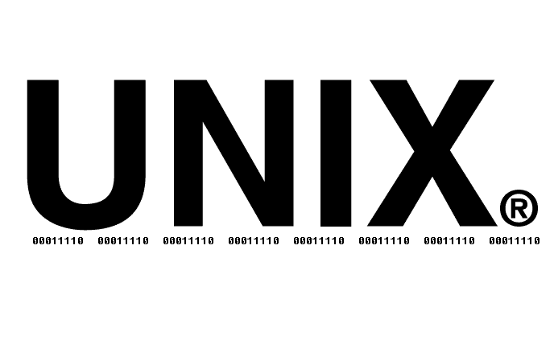
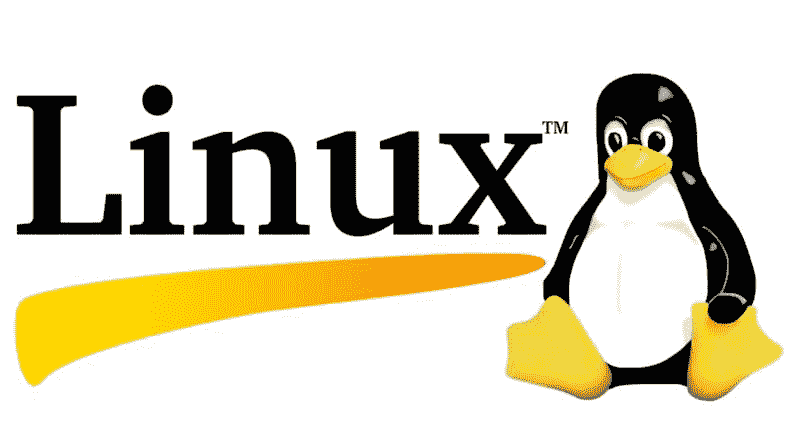
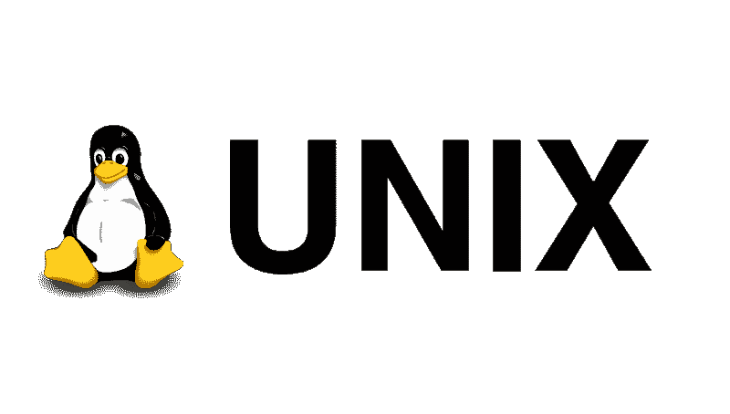

# Linux 真的是类 Unix 操作系统吗？？Linux 的诞生。

> 原文：<https://dev.to/jay_tillu/is-linux-really-a-unix-like-operating-system-the-birth-of-linux-4hgi>

我刚刚开始学习 Linux，当我读了几个关于 Linux 的博客时，他们中的许多人都说 Linux 是一个类似 Unix 的操作系统。但是当我在谷歌上搜索 Linux 如何像 Unix 操作系统时，我没有得到任何明确的文章可以给我精确的答案。在花了将近一天的时间四处寻找之后，我得到了答案。所以我想让我们把我得到的答案写下来，这样将来当任何人有同样的问题时，他/她就不会面临和我一样的麻烦。😊

> ***脑海中出现的疑问。*T3】**
> 
> *1。Linux 和 Unix 有多像操作系统？？*
> *2。两者有什么相似之处吗？？*
> *3。Unix 是否与 Linux 共享任何代码？？*
> *4。Linux 是否受到 Unix 概念的启发？？*

*那么让我们得到答案……*😉

## 诞生于 Unix 操作系统

* * *

如果你想了解 Unix 和 Linux 之间的关系，那么你必须知道 Unix 的诞生。

20 世纪 60 年代中期，麻省理工学院、贝尔实验室和通用电子公司正在开发一种叫做 ***Multics*** 的新操作系统，这是一种用于阿格-645 大型计算机的分时操作系统。

虽然 Multics 引入了几项重大创新，但它也解决了一些问题。尽管 Multics 是一个非常强大且功能丰富的操作系统，但使用它并不容易，而且它的体积也很大，非常 T2。

因此，贝尔实验室的一小组程序员决定利用他们的 Multics 经验，创建一个名为 ***Unics*** 的新操作系统。在解决 Multics 问题的同时，他们还在 Unics 操作系统中引入了一些新功能。所以你也可以说 Unics 是 Multics 的升级版。

> 在 20 世纪 70 年代，team 将操作系统命名为 Unics(uniplex ed Information and Computing Service)，它是从它的 predeccor Multics 派生而来的，代表(多路复用信息和计算机服务)。后来联合国新闻中心改名为**Unix *。*

最初，Unix 是一个单任务系统。Unix 的第一个版本是用*汇编语言*编写的。C 语言诞生后，Unix 团队决定用 C 语言重写整个操作系统。c 语言使它有别于市场上所有其他的操作系统。用 C 语言重写后，Unix 变得更加强大，它还支持****多用户*** 和 ***联网*** 功能。*

 *在 20 世纪 70 年代，操作系统很少是可移植的。由于它们的低级源语言，操作系统与制造它们的硬件平台紧密相连。但是在用 C 语言重写之后，Unix 现在可以移植到许多硬件体系结构上。

由于其巨大的 ***能力、便携性、联网、多任务、*** 和 ***多用户*** 能力，Unix 在大学、学术机构、研究中心和办公室中变得非常流行。Unix 中引入的许多概念仍然被广泛使用。

## Linux 的诞生与开源

* * *

从 20 世纪 70 年代到 80 年代，几乎每个主要的大学、研究院和研究中心都在他们的计算机中使用 Unix。随着 Unix 越来越受欢迎，它的商业业务也上升了。

但是 Unix 不是开源的，如果你想使用它，你必须从所有者美国电话电报公司那里购买许可证。此外，您也无法访问 Unix 的源代码。这意味着你不能根据自己的需要修改操作系统。

就像 Windows 和 macOS 一样，你无法接触到操作系统的源代码。你可以使用他们给你的操作系统。

随着时间的增长，程序员希望操作系统的环境更加开放，他们可以根据自己的需要修改任何东西。他们想要完全控制操作系统。对此的回应是 Linux 的诞生。

Linus Torvalds 是赫尔辛基大学计算机科学专业的学生。Linus 在大学里每天都使用 Unix。他对 Unix 的强大功能和特性感到惊讶和鼓舞，但由于 Unix 是一个专有的操作系统，他想开发自己的操作系统。

基本上，他创建了内核(操作系统的心脏)，并将其命名为 **Linux** 。但是在创建内核之后，Linus 开源了它。因为这是一个爱好，而不是一个商业产品，他想知道别人对它的看法。这意味着现在任何人都可以毫无顾虑地获得内核代码并阅读、使用和修改它。不知不觉中，他永远改变了操作系统的世界。他在 1991 年完成了内核的第一个版本。第一个内核是为 32 位系统架构设计的。

> ***[Linux 内核源代码](https://github.com/torvalds/linux)***

但是我们都知道内核是操作系统的一部分，对于一个完整的工作操作系统，Linus Torvalds 需要一些软件在上面运行。幸运的是，计算机爱好者理查德·斯托尔曼创建了一个致力于自由软件的程序员团队，他称之为**自由软件基金会**。*自由软件基金会*相信制作可以自由学习、修改和发布的软件。他们完全开放源代码，这样其他人可以帮助改进。*自由软件基金会*在 GNU GPL(通用公共许可证)下发布自由软件。

自由软件基金会开发了一堆软件，如文本编辑器 [Emacs](https://www.gnu.org/software/emacs/) ，命令行界面 [Bash](https://www.gnu.org/software/bash/) 。1991 年，*自由软件基金会*要使其成为成熟的操作系统，唯一缺少的就是内核。但是在 Linus Torvalds 创造了内核并开源之后，自由软件理查德·斯托尔曼的梦想实现了，Linux 成为了世界上第一个自由开源的操作系统。

由于 Linux 内核是开源的，许多程序员、爱好者和爱好者访问源代码，并帮助使其更加可靠、安全和功能丰富。一个接一个的人加入了这个社区，他们都尽自己所能让它变得更好。今天，Linux 拥有世界上最大的社区之一。它是世界上最安全、使用最广泛的操作系统。

28 年过去了，但是 Linus Torvalds 仍然公开地在 Linux 上工作。但是现在是社区的努力使得 Linux 成为世界上最强大、最可靠、功能最丰富、最安全的操作系统。自 1991 年以来，来自大约 1300 家公司的 14000 多名开发人员为 Linux 内核做出了贡献，其中包括英特尔、三星、IBM、Red Hat、Linaro 和 SUSE 等大型科技巨头。

今天，Linux 可用于几乎所有平台，包括个人电脑、智能手机、嵌入式设备、服务器、超级计算机、大型机等。Android 内核是基于 Linux 的，世界 500 强超级计算机都是由 Linux 驱动的，互联网上运行的网站十个有九个是由 Linux 服务器驱动的(包括谷歌、亚马逊、脸书、Instagram)。由于它的安全性和开源性，许多政府机构、大学、研究中心和学术界广泛接受它。

由于 kernel 可以自由使用、修改和分发，许多人下载了它，并通过使用它创建了他们自己版本的 Linux 操作系统。Linux 操作系统的不同版本也称为 ***Linux 发行版*** 或 ***Linux 发行版*** (简称)。今天[distrowatch.com](https://distrowatch.com/)列出了市场上 312 个独特的 Linux 发行版。大部分是免费的像 [Ubuntu](https://ubuntu.com/) 、 [Fedora](https://getfedora.org/) 、 [Mint](https://linuxmint.com/) 、 [CentOS](https://www.centos.org/) 、 [Debian](https://www.debian.org/) ，也有一些是付费的，像[红帽企业](https://www.redhat.com/en)在免费分发上提供支持。

## Linux 和 Unix 的相似之处

* * *

> ***3。Unix 是否与 Linux 共享任何代码？？*T3】**

*   不要！！Unix 不与 Linux 共享任何代码。

> ***1。Linux 和 Unix 有多像操作系统？？*T3】**

*   是的，这是真的，Linux 不与 Unix 共享任何代码。但是 Linux 内核的设计更像 Unix 内核。Linus Torvalds 有意识地希望操作系统表现得像 Unix 一样。 你也可以看到很多 Linux 的概念都是受 Unix 的启发。

> ***4。Linux 是否受到 Unix 概念的启发？？*T3】**

*   是的，Linux 深受一些 Unix 概念的启发。比如利用小积木来生产更有价值的东西。它意味着编写做一件事并且做得很好的小程序。后来，这些程序与被称为*、【管道】、*、【重定向】、*的机制结合在一起，因此一个程序的输出成为另一个程序的输入，随着数据的流动，最终会获得更大的价值。*

*   由于 Linux 和 Unix 都遵循 POSIX(可移植操作系统标准)，所以两者都是可移植操作系统。

*   和 Unix 一样，Linux 也是基于 ***多用户、多任务、安全*** 和 ***联网*** 的概念。

*   就像 Unix 一样，Linux 也拥有真正的 ***强大的安全特性*** 。这使它成为世界上最安全的操作系统之一。

> 所以我希望你得到你的为什么 LINUX 像操作系统一样被称为 UNIX 的答案？？但是如果你有任何问题，请随时问我。如果我错过了什么，请告诉我，我很乐意向你学习。相信我，学习颤振将是你最好的选择之一。
> 
> 想和我联系吗？以下是链接。我很乐意成为你的朋友。😊
> [Twitter](https://twitter.com/jay_tillu)
> [脸书](https://www.facebook.com/jaytillu.1314/)
> [insta gram](https://www.instagram.com/jay.tillu/)
> [Medium](https://medium.com/jay-tillu)
> 或者直接发邮件给我[jayviveki13@gmail.com](mailto:jayviveki13@gmail.com)*