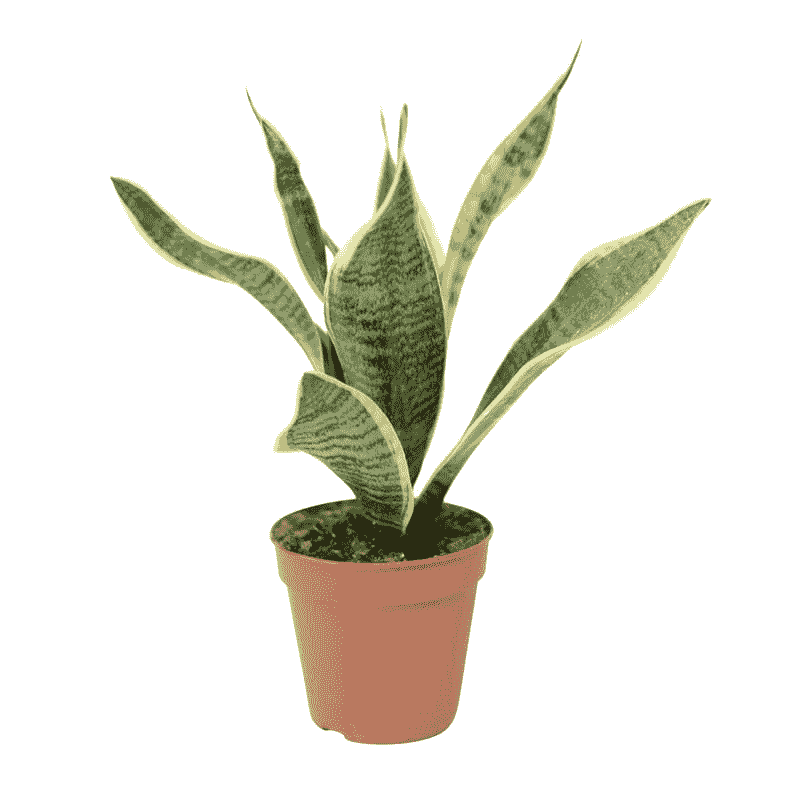

# 想成为更好的开发者？照顾好自己的睡眠！

> 原文：<https://dev.to/damcosset/want-to-be-a-better-developer-take-care-of-your-sleep-1def>

## 简介

当今世界的一切都与生产力和速度有关。每件事都必须快速完成，因为一天只有这么多小时，我们牺牲的第一件事往往都是一样的:**睡眠**。

这篇文章将描述一些你可以在生活中实施的关键事情，以提高你的睡眠质量，改善你的夜晚。我不必说高质量的睡眠是绝对重要的。这些年来，平均睡眠时间严重减少。有些人甚至会让你相信有规律的 5 小时睡眠没有任何问题。你甚至可以在这个世界上取得成功。对一些人来说，睡眠已经成为生产力的敌人。扯淡。科学不这么认为。

当你睡眠不足时，你不仅反应慢，创造力差，效率也低，成就也少。

*   1997 年一项关于外科医生的研究发现，睡眠不足的外科医生比休息时多犯约 20%的错误，多花约 14%的时间(T2 和 T3)。睡眠不足会降低大脑的葡萄糖含量。灰质利用葡萄糖作为燃料。葡萄糖的减少对大脑中涉及解决问题和高级思维的部分更为重要。

*   不睡一晚会让我们像 T2 糖尿病患者一样对胰岛素有抵抗力。这种激素的下降会导致体重增加、衰老迹象和性欲下降。

所以，如果没有高质量的睡眠，我们就无法达到最佳表现。那是不可能发生的。无论你认为自己在睡眠不足的状态下有多好，都比不上你在休息好的时候有多好。

为什么睡眠如此重要？部分原因是因为醒着是分解代谢，而睡眠是合成代谢*。*

 **   分解代谢:分子与氧气结合，导致它们分解。
*   **合成代谢**:分解代谢的对立面。它从更小的单位构建分子。

当我们睡觉时，我们的身体在自我修复。你这是在给自己造势。你的身体对抗衰老的迹象，增强你的免疫和肌肉系统。

所以，让我们看看你如何改善你的睡眠，感觉更好，并提高你的表现。

## 光

光是好的，光是坏的。为了理解光线对我们睡眠的影响，我们首先需要谈谈褪黑激素。

褪黑激素是一种调节体内生物钟的激素，生物钟告诉我们什么时候睡觉。它具有强大的复兴和抗氧化性能。生产受到光线的严重影响。太阳下山了，褪黑激素上升了，你就犯困了。

你应该尽量增加白天的曝光量。事实上，人们在早上暴露在明亮的光线下，晚上会产生更多的褪黑激素。

你在屏幕前需要做的另一件事。你可能听说过屏幕产生的蓝光效应。这些蓝光实际上抑制了褪黑激素的释放。所以，睡觉前 1 小时，忘记你的屏幕。

最后，睡在漆黑的房间里。光线也被我们的皮肤吸收，黑暗的夜晚光线也会影响褪黑激素的产生。

## 计时

#### 你的生理节奏

我已经提到了你体内的生物钟，也叫做你的*生理节奏*。重要的是，你要尊重你的生物钟，每晚在同一时间 30 分钟内上床睡觉。这将使你入睡和醒来容易得多。

很多人选择在工作日减少工作量，在周末赶上进度的策略。事实是，这完全破坏了你的生理节奏。你的身体不知道明天是周日，稍后释放褪黑激素是可以的，因为我们想熬夜。它适应不了那么快！

#### 早睡早起！

然后，你应该早点睡觉和醒来。一项研究发现早起的学生比夜猫子有更高的学习成绩。为什么会这样？

我们人类是白天活动的动物。我们白天很活跃。我们是狩猎采集者，被设定在日落时睡觉，因为在中午醒来对幸存的掠食者来说不是一个好计划。几千年来，我们就是这样生活的。我们还没有时间去改变我们人类关于睡眠的默认设置。

早睡很重要的第二个原因是利用晚上 10 点到凌晨 2 点之间的神奇睡眠窗口。这是我们的身体达到褪黑激素和人类生长激素分泌峰值的时候。这意味着在此期间你的睡眠会更深，更有活力！

## 生活方式

关于你生活方式的一些事情。

#### 咖啡因

首先，你摄入的咖啡因。你可能知道咖啡因会影响睡眠，但你可能不知道为什么:

咖啡在分子水平上与腺苷非常相似。腺苷是我们清醒时大脑产生的。当它达到某一点时，我们会感到困倦。因为咖啡因与腺苷非常接近，所以它进入了腺苷应该去的受体。腺苷不能进入这些受体，所以你不会感到疲劳。

一般来说，下午 4 点后避免摄入咖啡因。

#### 练功

锻炼是改善睡眠的另一个好方法。当你运动时，你会在肌肉组织中产生微小的撕裂。那些微泪需要你的身体来修复。这导致了睾丸激素和人类生长激素等激素的释放。你的身体正在进行的修复工作创造了一个更深、更有恢复力的睡眠。

#### 镁

你可以做的另一件很酷的事情是以奶油的形式使用镁。镁平衡血糖水平，镇静神经系统，放松肌肉。所有这些都会带来更高质量的睡眠。

*注意:避免口服补充剂，因为大部分益处会在消化过程中丧失。*

#### 沉思

最后，冥想会帮助你睡得更好。冥想被证明可以释放令人感觉良好的内啡肽。它还与较低的压力水平有关。

## 觉寺

最后一部分将献给你的*眠寺*。为了确保你有高质量的睡眠，一个专门从事这项活动的地方将会极大地改善你的夜晚。

#### 干净、新鲜的空气

空气清新的卧室是高质量睡眠的地方。为什么？

空气中有*离子*，带电荷的原子。带负电荷的离子是好的，因为它们氧化霉菌、寄生虫和有毒的化学气体。但是，随着时间的推移，空气变得不新鲜，因为氧气含量减少，离子失去了负电荷。

植物是绝佳的天然空气过滤器！植物吸收二氧化碳，释放氧气，给离子充上负电荷。

有两种很棒的室内植物可以放在你的卧室里帮助解决这个问题:

*   英国常春藤:被美国宇航局发现是最好的空气过滤室内植物(地狱耶！)，排出氧气并吸收甲醛，不幸的是，甲醛是一种有害的神经毒素，在工业化国家太普遍了。
*   婆婆的舌头:需要最少的水和光才能茁壮成长。非常适合黑暗的卧室😉最牛逼的事？夜间将二氧化碳转化为氧气，大多数植物在白天都这样做。

 
*婆婆的舌头:室内植物王国里最坏的母狗。🤘*

#### 非工作区

最后，不要把工作带到卧室。这将导致你的皮质醇水平飙升，皮质醇是一种与压力和失眠相关的激素。它还会让你的大脑将你的卧室与工作和活动联系起来，当你希望它与睡眠联系起来的时候。

## 结论

当我听到有人提倡 4 小时睡眠，或者提出睡眠不足是成功的必备条件时，我很难过，也有点生气。牺牲你的睡眠是我们赢得时间的第一件事，因为这是最容易牺牲的事。我们认为它只影响我们。事实是，它对很多事情都有影响，包括我们的人际关系和工作。

帮自己一个忙，照顾好自己，照顾好自己的睡眠。不容易，但是回报是值得的！所以今晚，从简单开始，宣布你的卧室为无屏幕区，带上一本好的旧纸质书😉

找点乐子

#### 来源:

*   [睡眠剥夺对胰岛素的影响](https://www.sleepfoundation.org/articles/link-between-lack-sleep-and-type-2-diabetes)

*   肖恩·史蒂文森的《睡得更聪明》*