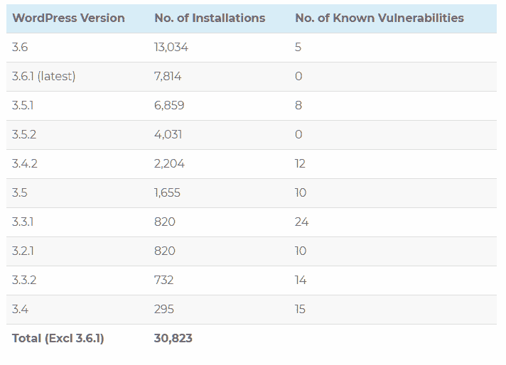

# WordPress 安全团队如何保护 WordPress 核心

> 原文：<https://dev.to/educationecosystem/how-wordpress-security-team-protects-wordpress-core-5d47>

你有没有想过是什么让 WordPress 变得安全？如果你这样做了，那么我们会让你了解 WordPress 安全是如何工作的。

WordPress 是排名第一的内容管理系统。但是，这也使它成为黑客的头号目标。

来自美国的网络安全专家 Jpolansky 也有类似的想法。他的工作围绕着[网络监控](https://www.education-ecosystem.com/jpolansky/l9kjy-how-to-perform-network-analysis-using-wireshark-snort-and-so/Lp5gG-how-to-perform-network-analysis-using-wireshark-sn/)，重点是如何理解网络数据和威胁身份。根据他的说法，WordPress 的受欢迎程度使其成为理想的黑客目标，而 WordPress 安全团队和道德黑客的工作就是找到漏洞并修复它们！

### WordPress 不安全吗？

WordPress 是最容易受到攻击的内容管理系统之一。超过 70%的 WordPress 网站都有某种形式的漏洞。

然而，在 70%被感染的 WordPress 网站中，只有 10%是由于 WordPress 核心缺陷造成的。最重要的是，这些网站被黑客攻击是因为它们使用的是旧的 WordPress 版本，没有更新到更安全的 WordPress 版本。

 
来源:wpwhitesecurity.com

大多数黑客攻击都是零日漏洞，WordPress 团队一发布就修复了这些漏洞。

黑客攻击也是因为网站使用了不好的主题、插件或主机。即使是粗心的最终用户也会使他们的网站不安全，容易被黑客攻击。

简而言之，WordPress 并不安全。背后的原因是它的生态系统。它是不同方面的累积，包括用户、插件和主题，这意味着大多数 WordPress 网站都是易受攻击的。

### 安全发布

WordPress 发布周期是 WordPress 每个版本改进的核心。

它从核心团队的形成开始，然后讨论特征。一旦确定了特性，就进入开发阶段。接下来，他们发布测试版来测试构建，并找出与之相关的任何错误。发布候选之后是发布。

WordPress 版本编号决定了它是主要版本还是安全版本。

所有主要版本都以前两个数字序列开始。这意味着 5.0，4.9，3.5 等等。都是主要版本。

但是，次要版本旨在提供关键的错误和漏洞修复。

那么，这对 WordPress 用户来说意味着什么呢？他们不仅要更新到主要版本，还要不断更新到次要版本。次要版本旨在确保安全性，无论如何都不应该被忽视。如果安全发布没有被管理员关闭，它们会被自动推送到 WordPress 网站。

### WordPress 安全团队的角色

那么，是谁让 WordPress core 免受所有漏洞和黑客攻击呢？这是“WordPress 安全团队”

安全团队由大约 50 名专家组成——一组安全研究人员和首席开发人员。他们的工作是与世界各地的其他安全团队合作，并确保他们在漏洞被黑客利用之前修复漏洞。

安全团队采取积极主动的方法，始终确保尽快提出并修复潜在的漏洞。

### WordPress 核心有多安全？

多年来，WordPress 经历了许多大大小小的版本。

WordPress 遵循 OWASP 以确保 WordPress 保持同样的安全级别。

OWASP 是针对 web 应用程序安全的开放 Web 应用程序安全项目。这是一个由社区驱动的极其全面的项目。

10 大 OWASP 威胁已经包含在 WordPress 中。它们包括以下内容。

*   注射
*   会话管理和中断认证
*   跨站点脚本(XSS)
*   不安全的直接对象引用
*   敏感数据暴露
*   安全错误配置
*   缺少功能级访问控制
*   使用组件的已知漏洞
*   跨站点请求伪造(CSRF)
*   未经验证的转发和重定向。

除了十大威胁之外，OWASP 还处理其他安全问题。作为一个 WordPress 用户，你根本不应该担心主要的漏洞。

如果你想帮助 WordPress 安全，你应该学习道德黑客基础知识。你可以获得道德黑客的基础知识，并成长为一名安全专家——也许有一天可以帮助保护 WordPress core！
WordPress 安全作为一个过程
WordPress 生态系统是巨大的。它由插件和主题组成，由无数第三方开发者开发。插件和主题的代码质量也决定了你的网站是否安全。

作为管理员，你需要正确地保护你的网站。您还可以使用 Sucuri、WordFence 和防弹插件来自动化站点的大部分安全性。这些插件或服务将 WordPress 的安全性作为一个过程提供。WordPress 安全是一个巨大的话题，许多公司都在努力保护你的网站！

### 接下来是什么？

WordPress 的安全性对于所有用户和网站本身都是至关重要的。考虑到 30%的在线网站是使用它开发的，如果它保持安全，那么大部分互联网都是安全的。

那么，你对 WordPress 的安全性有什么看法？

请在下面评论并告诉我们。