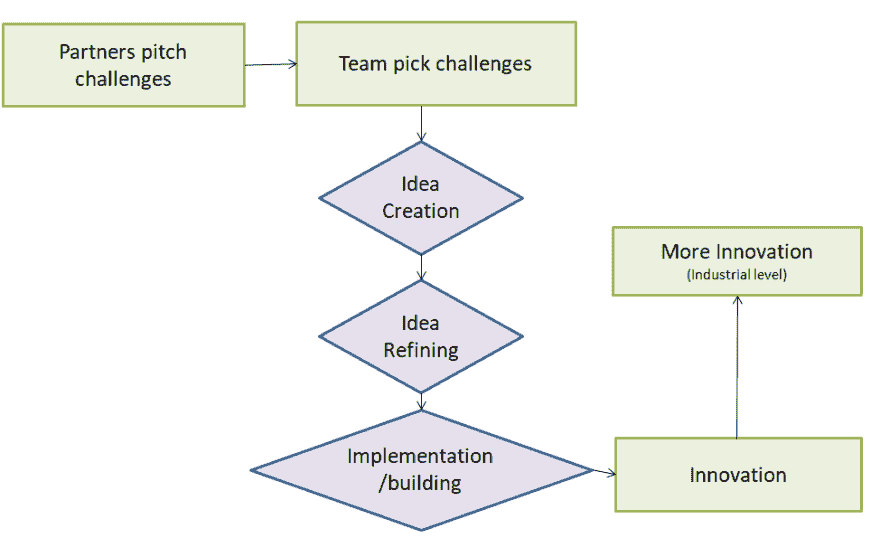

# 黑客马拉松——组织和寻找创新

> 原文：<https://dev.to/anu27580168/hackathon-organizing-finding-innovation-2mki>

### 黑客马拉松—组织&发现创新

—阿南特·龙格塔

#### 目录

1.  介绍

2.  目标

2.1 从封闭式创新到开放式创新

2.2 公司/组织的方法

1.  成功黑客马拉松的秘诀

3.1 动机和一致的目标。

3.2 准备阶段。

3.3 挑战。

3.4 公司的参与。

3.5 活跃和多学科人员的存在。

1.  结论

2.  参考

### 1。介绍

黑客马拉松这个词由两个词组成，“黑客”和“马拉松”，其中“黑客”指的是编程，“马拉松”指的是活动的有限时间范围。黑客马拉松作为一个术语形成于 20 世纪 90 年代末，当时它被用来描述一种将想法产生和编程相结合的活动，以在有限的时间范围内为现有的挑战创造新的解决方案。它是如此强烈地起源于 It 社区，在那里多学科的团队紧密地合作来创造新的东西。

Hackathon 致力于为组织在现代世界中遇到的挑战提供答案:快速的技术发展、全球化和熟练劳动力的移动性等等。这些黑客马拉松的核心思想是打破组织在创新过程中的界限。

这是一种基于共同创造和开放式创新的特殊类型的活动，是现代创新的典范，在新千年的第一个十年已经在全世界流行。

### 2。目标

作为活动的黑客马拉松已经变得流行，但这些安排纯粹是为了实践开放式创新吗？组织渴望加入黑客马拉松运动，并从共同创造和开放创新中获得切实的成果。

#### 2.1 封闭式创新转向开放式创新

封闭创新模式基于这样一种假设，即所有的关键发明和技术都应该严格地在组织的范围内开发。创新和新技术只能用于组织自身的目的，让创新流出组织是有风险的——即使这些根本没有用于商业目的。

然而，在现代世界中，全球化是日常生活的一部分，技术的发展比以往任何时候都更快，高技能人员正在从一个组织转移到另一个组织。

可以说，封闭式创新的基线不再有效，传统的创新和价值创造模式已经过时。

#### 2.2 公司/组织的方法

公司可以从各种角度接近黑客马拉松。如果公司缺乏内部创新，他们可能想加入黑客马拉松来获得可以提炼为创新的想法。如果公司在创新方面没有困难，他们可以从营销或招聘的角度来看待这个事件。

创意在创新中是微不足道的，因为要将创意转化为创新，并将创新融入到业务中，还有很多事情要做。

> 图 1:黑客马拉松如何工作的基本概述

### 3。成功的黑客马拉松秘诀

本章的进一步目的是为那些正在考虑安排私人黑客马拉松或加入公共黑客马拉松的组织提供发展思路，或成功举办黑客马拉松的秘诀。这些想法也可以在组织中使用，这些组织考虑他们对创新的立场和方法，或者在他们经历的黑客马拉松中反映他们的行动。

#### 3.1 激励与目标一致。

根据研究，成功的主要因素之一是有明确的动机和一致的目标。这一步需要在决定加入任何特定的黑客马拉松之前完成，只有在这些被设定和同意之后，才应该决定哪种类型的黑客马拉松活动将会以最好的方式支持动机和目标——这是与定义目标一样重要的一步。正如采访中提到的，仅仅加入黑客马拉松就需要大量的资源，因此是组织的一项重大投资。为了从投资中获得最大收益，建议组织特别关注他们的动机和目标，并选择合适的黑客马拉松来支持这些。如果没有清晰的动机和目标就决定加入，那么黑客马拉松的投资和体验很容易失败。

#### 3.2 准备阶段

给定必要的时间，在准备阶段要考虑与活动本身的成功相关的各种重要因素。首先，需要充分考虑参与者面临的挑战，以便与设定的目标保持一致。如果动机和目标是开放式创新，这应该是所有准备工作中最重要的:如果没有对参与者的适当挑战，就不可能想象挑战会导致任何合理的想法来进一步完善。如果没有一个有趣的挑战，公司在活动中为自己创造的形象也不会有利于营销或招聘。

#### 3.3 挑战

动机和目标应该指导挑战的定义。如果只关注营销和招聘，那么挑战必须既有趣又简单。因此，挑战的目标是建立一个理想的组织形象，并吸引尽可能多的人参加挑战。然而，如果动机是纯粹的内向开放式创新，公司应该将挑战与他们的创新过程联系起来，这样就可以相应地支持内部创新。

#### 3.4 公司的参与

许多公司都为参与者准备了营销配件:t 恤、帽衫等等。根据采访，这在创建组织的正面形象方面发挥了重要作用。实际准备还包括支持实际挑战的任务。

在为黑客马拉松做准备时，有很多实际问题需要注意。准备工作确实比预计的要花更多的时间。根据这些采访，出现了与黑客马拉松的成功相关的三个不同的准备领域:准备挑战以支持为活动设定的目标，准备会场的展台以支持先前的，以及准备需要注意的各种类型的实际问题。这些准备工作应在适当的时间和严格程度下完成，以支持为活动设定的目标。

#### 3.5 活跃的、多学科的人的存在

活动对合适人选的需求是由黑客马拉松的潜力引导的，在这种情况下，这种潜力似乎与动机的来源完全相同:招募、营销和开放式创新。能够从业务和技术两个方面回答问题并帮助参与者解决他们面临挑战时可能遇到的障碍的人员。

这意味着组织必须既容易接近，又主动接近参与者，以积极支持他们。

#### 4。结论

本论文的开发任务是从开放式创新的角度介绍一个成功的黑客马拉松的要素，并为组织提供一个整体的、实用的食谱。对于那些计划在未来组织内部黑客马拉松或参加公开黑客马拉松的组织来说，提供的方法是作为组织发展的实用工具。

组织加入黑客马拉松有三个不同的动机，即营销、招募和开放式创新。

营销是最受欢迎的动机，一半受访组织将其作为加入的主要兴趣，另一半作为次要原因。这意味着每个组织都有营销的想法。以开放式创新为动力，分为内向型开放式创新和外向型开放式创新。

关于这一主题的理论大多基于对大型组织的研究，这些理论已经被推广到适用于所有的组织，无论是大型组织还是小型组织，现代组织还是传统组织。通过分析组织为活动设定的目标，这些发现得到了支持，因为目标与动机直接相关。

组织有可能围绕公共黑客马拉松中产生的想法继续创新过程。根据这一论点，需要一个关于如何采取下一步行动的明确计划。这个计划必须在真正的黑客马拉松活动之前完成，这样它才能传达给参与者，整个过程才能无缝地继续。如果组织只是在黑客马拉松活动之后才开始计划，那就太晚了，因为想法和细化行动之间的差距很容易变得太大。

基本上，这篇论文汇集了大量关于创新和黑客马拉松的信息，提供了有趣的见解。论文为组织在实践中使用提供了清晰的开发思路。然而，许多关于黑客马拉松组合的有趣而重要的问题仍然没有被触及——沙盒中仍然有足够的空间。

#### 参考文献

*   [https://en.wikipedia.org/wiki/Hackathon](https://en.wikipedia.org/wiki/Hackathon)
*   [https://hackathon.guide/](https://hackathon.guide/)
*   [http://yourdideasarertrible . com/the-ultimate-guide-to-corporate-hackathons/](http://yourideasareterrible.com/the-ultimate-guide-to-corporate-hackathons/)