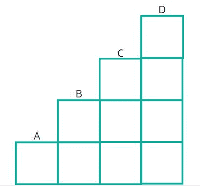
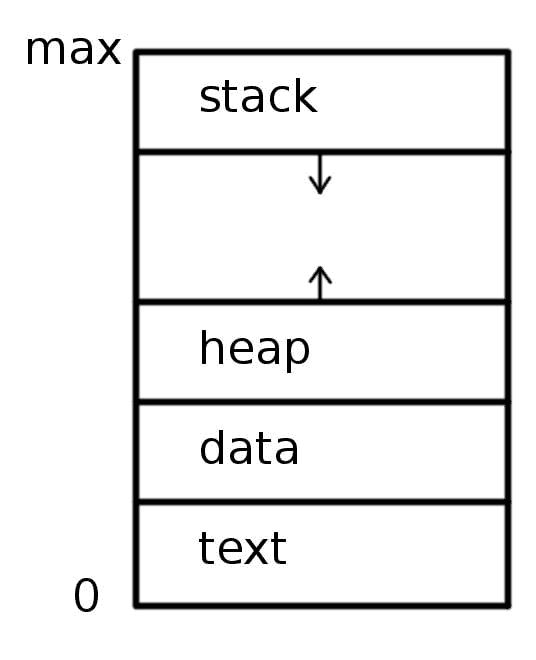
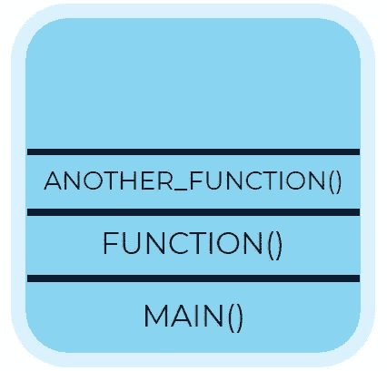
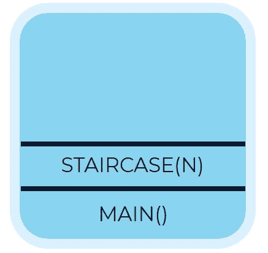
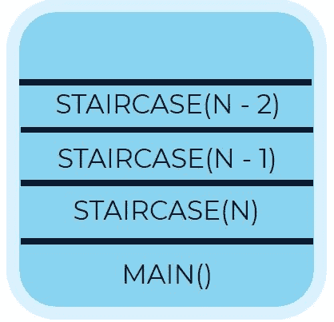
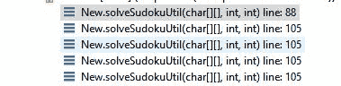

# 让我们集思广益回溯

> 原文：<https://dev.to/akarshan96/let-s-brainstorm-backtracking-jln>

回溯有时会令人困惑，使用回溯来解决问题甚至会是一件乏味的工作。通过这篇文章，让我们来解码如何写回溯算法。

### 1。必备知识

**1。递归**
回溯最重要的前提是**递归**。虽然初学者通常忽略这一点，但通过这篇文章，让我们改变一下视角。让我们学习递归。

[](https://i.giphy.com/media/3ov9jQX2Ow4bM5xxuM/giphy.gif)

通俗地说，递归就是一个函数用不同的参数从自身调用自身。这样一个调用自己的函数叫做**递归函数**。

```
def function(a):
    b = # perform calculations or operations on a
    function(b) 
```

但是我们不希望它永远继续下去，所以我们将引入一个基条件来停止递归永远继续下去。这就是我们所说的基本情况。递归函数可以有多个基本用例。

```
def function(a):
    if a == # some base value
        return #some value
    b = # perform calculations or operations on a
    function(b) 
```

我们来讨论一下**楼梯**的问题。这里是[环节](https://leetcode.com/problems/climbing-stairs/)。在这个问题中，我们需要找出爬上楼梯顶部的方法，我们可以一次爬 1 或 2 级台阶。让我们从楼梯的顶端开始，用递归来解决这个问题。

[](https://res.cloudinary.com/practicaldev/image/fetch/s--REQTnwaO--/c_limit%2Cf_auto%2Cfl_progressive%2Cq_auto%2Cw_880/https://thepracticaldev.s3.amazonaws.com/i/z0g01h51090qji4877oi.JPG)

所以我们有以下几种爬楼梯的方法:

1.  **接地** -1 步→ **A** -1 步→ **B** -1 步→ **C** -1 步→ **D**
2.  **接地** -2 步→ **B** -1 步→ **C** -1 步→ **D**
3.  **接地** -1 步→ **A** -2 步→ **C** -1 步→ **D**
4.  **接地** -2 步→ **B** -2 步→ **D**
5.  **接地** -1 步→ **A** -1 步→ **B** -2 步→ **D**

对于这个问题，我们需要考虑基本情况。基本情况是我们知道某个输入的函数输出的情况。

在递归中，我们试图将一个问题分解成子问题，当我们遇到基本情况时，我们将输出返回给调用当前函数实例的函数实例。我们将在下一节讨论这一点。

回到这个问题，我们知道如果楼梯的顶部是 1，路的数量将总是 1，如果栈的顶部是 2，路的数量将总是 2。这里我们有两个基本案例，我们的工作已经完成了一半。

```
# n: no. of staircase def staircase(n):
    if n == 1:
        return 1
    if n == 2:
        return 2

    staircase() 
```

下一件事是找到 n 的新值，记住我们需要把这个问题转化为子问题。所以，一次我们可以爬一步或两步。如果我爬 1 级，铰孔的级数将是 **n - 1** ，如果我爬 2 级，铰孔的级数将是 **n - 2** 。我们可以再爬 n - 1 和 n - 2，每次走 1 或 2 步。所以，如果我已经爬了一级楼梯，如果我再多走一级，就剩下 n - 3 级了，如果我走 2 级，就剩下 n - 4 级了。这种情况一直持续到我们成为 1 或 2。

我们把问题归纳成子问题。现在楼梯函数看起来像这样。

```
# n: no. of staircase def staircase(n):
    if n == 1:
        return 1
    if n == 2:
        return 2

    result = staircase(n - 1) + staircase(n - 2)
    return result 
```

该函数的每个实例都会将结果的值返回给它的前一个实例，当我们访问第一个实例时，该函数会将结果的最终值返回给它的调用函数。

**2。调用堆栈**

[](https://i.giphy.com/media/tTMhcdiREv2W4/giphy.gif)

现在，我们来谈谈递归发生时，幕后发生了什么。每一个被执行的程序都被转换成进程，每个进程在内存中看起来都像下面的
[](https://res.cloudinary.com/practicaldev/image/fetch/s--Zci2Ta2A--/c_limit%2Cf_auto%2Cfl_progressive%2Cq_auto%2Cw_880/https://thepracticaldev.s3.amazonaws.com/i/o6l64fgysf677hypantb.jpg)

我们只需要关注堆栈。每个进程在内存中维护一个堆栈，也称为**调用堆栈**。在程序执行过程中需要执行或调用的每个函数都被压入这个堆栈，当它完成执行时，它被弹出调用堆栈。例如，如果我们有下面的代码。

```
def another_function(a, b):
    return a + b

def function(a, b):
    a = b % a
    b += 1
    return another_function(a, b)

if__name__== "__main__":
    function(10, 20) 
```

因此，我们的调用堆栈将如下所示:

[](https://res.cloudinary.com/practicaldev/image/fetch/s--vZYR-RdG--/c_limit%2Cf_auto%2Cfl_progressive%2Cq_auto%2Cw_880/https://thepracticaldev.s3.amazonaws.com/i/8go5jf94wcsvxtsrcxr1.JPG)

首先被调用的 main 函数将在堆栈的最后，最近被调用的另一个 _function 将在顶部。

让我们先睹为快，看看递归函数阶梯的调用堆栈。我们知道楼梯问题的不同子问题。我们有 n 个楼梯，所以堆栈看起来像:
[](https://res.cloudinary.com/practicaldev/image/fetch/s--bm8F8vYG--/c_limit%2Cf_auto%2Cfl_progressive%2Cq_auto%2Cw_880/https://thepracticaldev.s3.amazonaws.com/i/cqinbcamdbdbpelxnn0r.JPG) 
然后我们再次调用带有参数 n - 1 的楼梯，带有参数的函数将随后调用带有参数 n - 2 的函数。当我们到达基本情况时，栈顶的函数将被执行并弹出栈。
[](https://res.cloudinary.com/practicaldev/image/fetch/s--_1oFV82---/c_limit%2Cf_auto%2Cfl_progressive%2Cq_auto%2Cw_880/https://thepracticaldev.s3.amazonaws.com/i/5hzsnayvy7k7k1vurbx7.JPG) 
现在，栈中递归函数的每一个实例都可以看作是我们做出的一个选择。`staircase(n - 2)`表示我们选择走两步，`staircase(n - 1)`表示我们选择走一步。调用堆栈维护函数的所有状态或实例，参数是我们在调用它之前所做的选择。下面是数独求解程序执行期间调用堆栈的一个例子。
T13T15】

### 2。解码回溯

**1。大图**
[](https://i.giphy.com/media/fDO2Nk0ImzvvW/giphy.gif) 
上一节我们学习了递归和调用栈。现在让我们用它们写一个回溯算法。我们从 3 个基本规则开始。
**做出选择**
在这一部分，我们只是从选择空间中做出选择，而不关心它的有效性。我们根据正在解决的问题设定选择空间。

*   对于 N 皇后问题，我们必须把皇后放在 N×N 的棋盘上，这样就不会有两个皇后互相攻击，我们的选择是棋盘上的每一个方格坐标。
*   对于需要解决数独游戏的数独解算器,选项是需要填入空白单元格的数字 1 - 9。
*   对于[迷宫问题](https://leetcode.com/problems/the-maze)我们必须穿过一条路径到达目标，选择是可用方块的坐标。

一旦我们做出选择，我们现在需要验证它。如果递归函数的当前实例用完了选择，那么**回溯**将开始起作用。然后，我们将回溯到调用堆栈顶部的递归函数实例，该函数调用了当前函数，因为当前函数用尽了所有选择并完成了执行。然后，我们回溯的函数将做出下一个选择，并试图改变要调用的连续函数的命运。

**验证选择**
现在，我们需要验证我们做出的每一个选择，如果选择有效，我们递归调用函数并传递下一个点作为参数，我们需要为其做出另一个选择。

*   对于 N 皇后问题，如果皇后不在同一行、列或对角线上，则选择有效。
*   对于[数独解算器](https://leetcode.com/problems/sudoku-solver/)，如果我们放在空白单元格中的数字没有出现在相同的行、列和 3×3 的正方形中，则选择有效。
*   对于[迷宫问题](https://leetcode.com/problems/the-maze)如果我们选择的路径或坐标没有被阻挡，则选择有效。

设定目标
我们需要指定目标，否则算法会一直运行下去。目标告诉我们，通过满足约束条件的当前选择，问题现在得到了解决。我们可以通过提及迭代使用的指针的最终位置来告诉算法目标已经达到。

*   对于 [N 皇后问题](https://leetcode.com/problems/n-queens/)，当指针到达最后一列或 n - 1 列(假设索引从 0 开始)时，就达到了目标。
*   对于[数独解算器](https://leetcode.com/problems/sudoku-solver/)，当指针到达 n - 1，n - 1 坐标时，就达到了目标(假设索引从 0 开始)。
*   对于[迷宫问题](https://leetcode.com/problems/the-maze)，当指针到达 n - 1，n - 1 坐标(假设索引从 0 开始)时，就达到了一个目标。

所有 3 个步骤完成后，瞧，回溯算法就完成了。
**2。把碎片拼在一起**
理论够了，让我们用回溯法写一个数独解算器。

大多数回溯算法的结构如下:

```
def is_valid(n):
   # write the constraints here 
def algo_util(n):
    # we set goal here 
    # we make choices here 
    # we validate choices by calling is_valid 
    # we determine whether to recursively call algo_util with the new point as parameter. 
    # we return solution to driver function 
def driver_function(n):
    # calls algo_util with first basic choice. 
```

让我们实现上面的代码结构来解决数独。从驱动函数开始，我们需要从第一个单元格(0，0)开始数独。`sudoku_util`是上面模板中的`algo_util`函数。

```
def driver_function(n):
     sudoku_util(0, 0) 
```

我们将从设定目标开始。目标是如果我们到达数独的最后一个单元格(8，8)。

```
# i is iterating row and j is iterating column def sudoku_util(i, j):
    if j > 8:
        j = 0
        i += 1

    if i == 9:
        return True 
```

设定目标后，让我们考虑选择，我们可以在每个单元格中添加 1 - 9

```
# check element already exist
# If entry exists the recursively calling the function with next coordinates. if board[i][j] != '.':
    return sudoku_util(i, j + 1)

else:
    for num in ["1", "2", "3", "4", "5", "6", "7", "8", "9"]:
# Here are the choices we make from choice space. 
```

让我们通过验证选择来继续这个功能。

```
for num in ["1", "2", "3", "4", "5", "6", "7", "8", "9"]:
    if is_valid(i, j, num): # check for choice validity
        board[i][j] = num
            if sudoku_util(i, j + 1): # recursively call the function with next coordinate
                return True # inform previous function instance that the choice
            else:
                 board[i][j] = '.' 
```

为了给棺材钉上最后一颗钉子，我们需要编写 is_valid 函数来验证我们所做的选择。

```
def is_valid(i, j, number):

            # check that row
            for col in range(n):
                if board[i][col] == number:
                    return False

            # check that column
            for row in range(m):
                if board[row][j] == number:
                    return False

            x = (i // 3) * 3
            y = (j // 3) * 3

            # check that box
            for row in range(x, x + 3):
                for column in range(y, y + 3):
                    if board[row][column] == number:
                        return False

            return True 
```

我们结束了。

[](https://i.giphy.com/media/RrVzUOXldFe8M/giphy.gif)

以下是完整的代码:

```
 board= [] # global variable 
        def is_valid(i, j, number):

            # check that row
            for col in range(n):
                if board[i][col] == number:
                    return False

            # check that column
            for row in range(m):
                if board[row][j] == number:
                    return False

            x = (i // 3) * 3
            y = (j // 3) * 3

            # check that box
            for row in range(x, x + 3):
                for column in range(y, y + 3):
                    if board[row][column] == number:
                        return False

            return True

        def sudoku_util(i, j):
            if j > 8:
                j = 0
                i += 1

            if i == 9:
                return True

            # check element already exist
            if board[i][j] != '.': 
                return sudoku_util(i, j + 1)

            else:
                for num in ["1", "2", "3", "4", "5", "6", "7", "8", "9"]:
                    if is_valid(i, j, num):
                        board[i][j] = num
                        if sudoku_util(i, j + 1):
                            return True
                        else:
                            board[i][j] = '.'

        def driver_function(sudoku):
            # type sudoku: List[List[str]]
            board = sudoku
            sudoku_util(0, 0) 
```

以下是使用回溯解决的其他问题。
[maze . py](https://github.com/akarshan96/Coding-Problems/blob/master/Maze.py)
[nqueens . py](https://github.com/akarshan96/Coding-Problems/blob/master/NQueens.py)

快乐编码:)