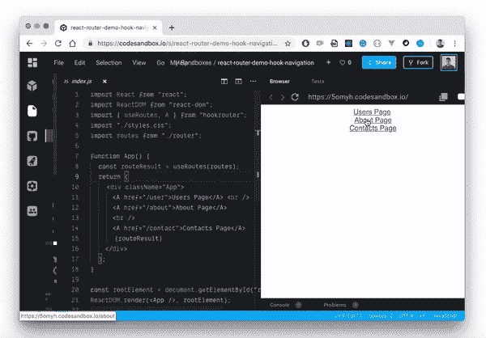
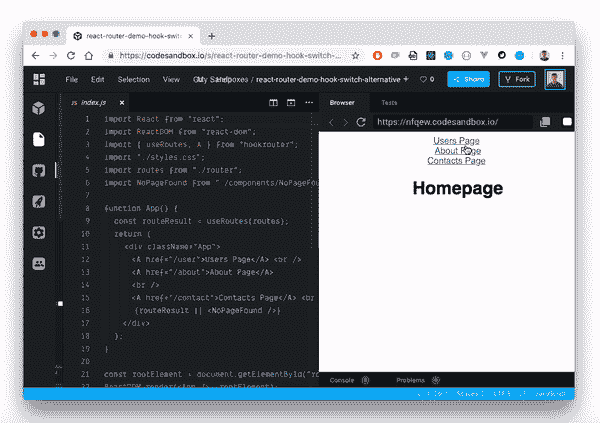
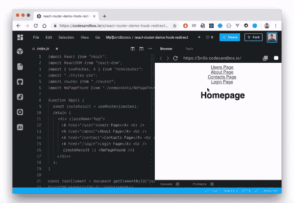
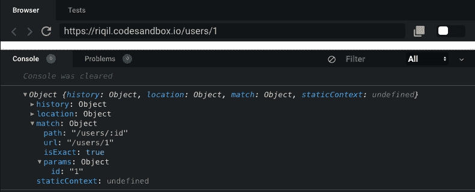

# React 钩子如何取代 React 路由器

> 原文：<https://dev.to/bnevilleoneill/how-react-hooks-can-replace-react-router-4if8>

[](https://res.cloudinary.com/practicaldev/image/fetch/s--zjx3OtBn--/c_limit%2Cf_auto%2Cfl_progressive%2Cq_auto%2Cw_880/https://thepracticaldev.s3.amazonaws.com/i/xtl1fzv16ikyhjxp0feq.png)

自从 React 钩子出现以来，很多事情都变了。一些我们以前没有争议的事情已经开始引起关注。钩子带来的特性和可能性重新定义了我们在 React 中处理某些概念的方式，路由恰好是其中之一。

在我们继续之前，我想提一下这篇文章并不是以任何方式攻击 React 路由器或者贬低它的重要性。相反，我们将探索其他可能性，看看我们如何使用钩子来改善 React 应用程序中的路由体验。

为此，出于演示目的，我们将参考 React 路由器和 [hooksrouter](https://github.com/Paratron/hookrouter) 。首先，让我们仔细看看 React 路由器。

[](https://logrocket.com/signup/)

## React 路由器

React Router 是 React 应用程序中管理路由的一种流行的声明方式。它消除了在 React 应用程序中为所有页面和屏幕手动设置路径所带来的压力。React 路由器输出三个主要组件来帮助我们实现路由——路由、链路和浏览器路由器。

## React 路由器中的路由

如果您正在构建一个 React 应用程序，并且您有三个页面，下面是您通常如何使用 React 路由器实现路由:

```
import Users from "./components/Users";
import Contact from "./components/Contact";
import About from "./components/About";
function App() {
  return (
    <div>
      <Router>
        <div>
          <Route path="/about" component={About} />
          <Route path="/users" component={Users} />
          <Route path="/contact" component={Contact} />
        </div>
      </Router>
    </div>
  );
} 
```

<svg width="20px" height="20px" viewBox="0 0 24 24" class="highlight-action crayons-icon highlight-action--fullscreen-on"><title>Enter fullscreen mode</title></svg> <svg width="20px" height="20px" viewBox="0 0 24 24" class="highlight-action crayons-icon highlight-action--fullscreen-off"><title>Exit fullscreen mode</title></svg>

从 React Router 包中导入的`<Route/>`组件接受两个道具，一个是引导用户到指定路径的`path`,另一个是定义该路径内容的`component`。

## 钩子替代路由

感谢[克里斯·恩格尔](https://www.reddit.com/user/chris_engel/)提供的 [hookrouter](https://www.npmjs.com/package/hookrouter) 工具，我们将重点讲解这个工具，让大家了解这些演示。hookrouter 模块导出一个`useRoutes()`钩子，该钩子评估预定义的 routes 对象并返回结果。在 routes 对象中，您将路由定义为键，它们的值作为函数，当路由匹配时将调用这些函数。这里有一个实际的演示:

```
import React from "react";
import Users from "./components/Users";
import Contact from "./components/Contact";
import About from "./components/About";
const routes = {
  "/": () => <Users />,
  "/about": () => <About />,
  "/contact": () => <Contact />
};
export default routes; 
```

<svg width="20px" height="20px" viewBox="0 0 24 24" class="highlight-action crayons-icon highlight-action--fullscreen-on"><title>Enter fullscreen mode</title></svg> <svg width="20px" height="20px" viewBox="0 0 24 24" class="highlight-action crayons-icon highlight-action--fullscreen-off"><title>Exit fullscreen mode</title></svg>

我个人喜欢这个方法。为什么？因为我们不用做那么多工作。使用 React Router，我们必须在应用程序中为所有单独的路由呈现`<Route/>`组件。更不用说我们传递给它的所有道具了。回到钩子，我们可以在我们的应用程序中使用这个定义的`Routes`，只需将它传递给`useRoutes()`钩子:

```
import {useRoutes} from 'hookrouter';
import Routes from './router'

function App() {
  const routeResult = useRoutes(Routes)
  return routeResult
} 
```

<svg width="20px" height="20px" viewBox="0 0 24 24" class="highlight-action crayons-icon highlight-action--fullscreen-on"><title>Enter fullscreen mode</title></svg> <svg width="20px" height="20px" viewBox="0 0 24 24" class="highlight-action crayons-icon highlight-action--fullscreen-off"><title>Exit fullscreen mode</title></svg>

这为我们提供了与 React 路由器路由演示完全相同的结果，但实现更简洁、更轻便。
[https://codesandbox.io/embed/1j8jc](https://codesandbox.io/embed/1j8jc)

## React 路由器导航

React Router 还让我们可以访问`<Link/>`组件。它帮助我们在 React 应用程序中定制路线导航和管理交互式路线。我们有一个包含三条路线的 react 应用程序，让我们在屏幕上呈现这些路线，并在单击时导航到它们:

```
import { Route, Link, BrowserRouter as Router } from "react-router-dom";
import Users from "./components/Users";
import Contact from "./components/Contact";
import About from "./components/About";

function App() {
  return (
    <div className="App">
      <Router>
        <div>
          <ul>
            <li>
              <Link to="/about">About</Link>
            </li>
            <li>
              <Link to="/users">Users</Link>
            </li>
            <li>
              <Link to="/contact">Contact</Link>
            </li>
          </ul>
          <Route path="/about" component={About} />
          <Route path="/users" component={Users} />
          <Route path="/contact" component={Contact} />
        </div>
      </Router>
    </div>
  );
} 
```

<svg width="20px" height="20px" viewBox="0 0 24 24" class="highlight-action crayons-icon highlight-action--fullscreen-on"><title>Enter fullscreen mode</title></svg> <svg width="20px" height="20px" viewBox="0 0 24 24" class="highlight-action crayons-icon highlight-action--fullscreen-off"><title>Exit fullscreen mode</title></svg>

这就创建了我们在应用程序中从一个页面到另一个页面所需的导航。这是我们正在做的事情的直观表示。

[T4】](https://res.cloudinary.com/practicaldev/image/fetch/s--U14c5Mx0--/c_limit%2Cf_auto%2Cfl_progressive%2Cq_66%2Cw_880/https://i1.wp.com/blog.logrocket.com/wp-content/uploads/2019/07/reactrouterdemohook.gif%3Fresize%3D600%252C418%26ssl%3D1)

[https://codesandbox.io/embed/uq9je](https://codesandbox.io/embed/uq9je)

## 钩子替代反应式导航

hookrouter 模块将 HTML 锚标记`<a/>`包装为`<A/>`。它可以作为一个 react 组件来访问，并且与本机`<a/>`标签完全兼容。唯一的区别是，它将导航推送到历史堆栈，而不是实际加载一个新页面。

```
const routes = {
  "/user": () => <Users />,
  "/about": () => <About />,
  "/contact": () => <Contact />
};

function App() {
  const routeResult = useRoutes(routes);
  return (
    <div className="App">
      <A href="/user">Users Page</A>
      <A href="/about">About Page</A>
      <A href="/contact">Contacts Page</A>
      {routeResult}
    </div>
  );
} 
```

<svg width="20px" height="20px" viewBox="0 0 24 24" class="highlight-action crayons-icon highlight-action--fullscreen-on"><title>Enter fullscreen mode</title></svg> <svg width="20px" height="20px" viewBox="0 0 24 24" class="highlight-action crayons-icon highlight-action--fullscreen-off"><title>Exit fullscreen mode</title></svg>

[](https://res.cloudinary.com/practicaldev/image/fetch/s--U14c5Mx0--/c_limit%2Cf_auto%2Cfl_progressive%2Cq_66%2Cw_880/https://i1.wp.com/blog.logrocket.com/wp-content/uploads/2019/07/reactrouterdemohook.gif%3Fresize%3D600%252C418%26ssl%3D1) 
[https://codesandbox.io/embed/5omyh](https://codesandbox.io/embed/5omyh)

## 程序化导航

hookrouter 模块让我们可以访问一个`navigate()`钩子函数，我们可以将一个 URL 传递给它，它会将用户导航到那个 URL。对`navigate()`函数的每一次调用都是一次前进导航，因此，用户可以点击浏览器的后退按钮返回到上一个 URL。

```
navigate('/user/'); 
```

<svg width="20px" height="20px" viewBox="0 0 24 24" class="highlight-action crayons-icon highlight-action--fullscreen-on"><title>Enter fullscreen mode</title></svg> <svg width="20px" height="20px" viewBox="0 0 24 24" class="highlight-action crayons-icon highlight-action--fullscreen-off"><title>Exit fullscreen mode</title></svg>

这是默认情况下发生的。但是，如果您需要不同的行为，您可以进行替换导航。怎么会？你可能会问，`navigation()`钩子主要接受三个参数— `navigate(url, [replace], [queryParams])`第二个参数用于影响替换行为。它会删除当前的历史记录条目，并用新条目替换它。要达到这种效果，只需将其参数设置为`true`。

```
navigate('/user', true); 
```

<svg width="20px" height="20px" viewBox="0 0 24 24" class="highlight-action crayons-icon highlight-action--fullscreen-on"><title>Enter fullscreen mode</title></svg> <svg width="20px" height="20px" viewBox="0 0 24 24" class="highlight-action crayons-icon highlight-action--fullscreen-off"><title>Exit fullscreen mode</title></svg>

## 反应路由器交换机

通常，当定义的导航路线不匹配时，React Router 使用`<Switch/>`组件来呈现默认页面。通常，它会呈现一个 404 页面，让用户知道所选的路线没有在应用程序中定义。为此，我们将所有呈现的路线包装在`<Switch/>`组件中，并呈现 404 页面，而不为其定义`path`道具:

```
import { Route, Link, BrowserRouter as Router, Switch } from "react-router-dom";
import Users from "./components/Users";
import Contact from "./components/Contact";
import Home from "./components/About";
import NoPageFound from "./components/NoPageFound.js";

function App() {
  return (
    <div className="App">
      <Router>
        <div>
          <ul>
            <li>
              <Link to="/">Home</Link>
            </li>
            <li>
              <Link to="/users">Users</Link>
            </li>
            <li>
              <Link to="/contact">Contact</Link>
            </li>
          </ul>
          <Switch>
            <Route exact path="/" component={Home} />
            <Route path="/users" component={Users} />
            <Route path="/contact" component={Contact} />
            <Route component={NoPageFound} />
          </Switch>
        </div>
      </Router>
    </div>
  );
} 
```

<svg width="20px" height="20px" viewBox="0 0 24 24" class="highlight-action crayons-icon highlight-action--fullscreen-on"><title>Enter fullscreen mode</title></svg> <svg width="20px" height="20px" viewBox="0 0 24 24" class="highlight-action crayons-icon highlight-action--fullscreen-off"><title>Exit fullscreen mode</title></svg>

这样，无论何时到达未定义的路径，React Router 都会呈现`NopageFound`组件。这是一种非常敏锐的方式，让用户在浏览 React 站点时随时知道他们在哪里，正在发生什么。
[https://codesandbox.io/embed/nvux9](https://codesandbox.io/embed/nvux9)

## 用钩子替代开关

因为我们定义了一个保存所有路线路径的`routes`对象，并简单地将该对象传递给`useRoutes()`钩子，所以有条件地呈现路线变得非常简单。如果我们定义了一个`NoPageFound`文件，默认情况下，当一个选择的路线没有被定义时，我们只需要把这个文件和我们的结果函数一起传递，如下所示:

```
import { useRoutes, A } from "hookrouter";
import routes from "./router";
import NoPageFound from "./components/NoPageFound";
function App() {
  const routeResult = useRoutes(routes);
  return (
    <div className="App">
      <A href="/user">Users Page</A> <br />
      <A href="/about">About Page</A>
      <br />
      <A href="/contact">Contacts Page</A> <br />
      {routeResult || <NoPageFound />}
    </div>
  );
} 
```

<svg width="20px" height="20px" viewBox="0 0 24 24" class="highlight-action crayons-icon highlight-action--fullscreen-on"><title>Enter fullscreen mode</title></svg> <svg width="20px" height="20px" viewBox="0 0 24 24" class="highlight-action crayons-icon highlight-action--fullscreen-off"><title>Exit fullscreen mode</title></svg>

[](https://res.cloudinary.com/practicaldev/image/fetch/s--zTWk-4eC--/c_limit%2Cf_auto%2Cfl_progressive%2Cq_66%2Cw_880/https://i2.wp.com/blog.logrocket.com/wp-content/uploads/2019/07/alternativetoswitch.gif%3Fresize%3D600%252C423%26ssl%3D1)

与使用 React Router 中的`<Switch>`组件来呈现默认页面相比，我认为这似乎更干净，可读性更好。
[https://codesandbox.io/embed/nfqew](https://codesandbox.io/embed/nfqew)

## React 路由器重定向

当我们希望动态地将用户从一个路由引导到另一个路由时，就会发生重定向。例如，在登录期间，当用户成功登录时，我们希望将他们从`('/login')`路由重定向到`('/dashboard')`路由。

有了 React Router，我们可以用几种方式做到这一点——使用历史对象或`<Redirect/>`组件。例如，如果我们有一个登录表单，当用户登录时，我们可以利用浏览器的历史对象将用户推到`'/dashboard'`路径:

```
import React from 'react'
class Login extends React.Component {
  loginUser = () => {
  // if (user is logged in successfully)
    this.props.history.push('/dashboard')
  }
  render() {
    return (
      <form>
        <input type="name" />
        <input type="email" />
        <button onClick={this.loginUser}>Login</button>
      </form>
    )
  }
}
export default Login 
```

<svg width="20px" height="20px" viewBox="0 0 24 24" class="highlight-action crayons-icon highlight-action--fullscreen-on"><title>Enter fullscreen mode</title></svg> <svg width="20px" height="20px" viewBox="0 0 24 24" class="highlight-action crayons-icon highlight-action--fullscreen-off"><title>Exit fullscreen mode</title></svg>

因此，我们也可以使用 React Router 中可用的`<Redirect/>`组件来动态重定向用户。

## 钩子替代重定向

hookrouter 模块导出一个`useRedirect()`钩子，它可以将源路由和目标路由作为参数。

```
useRedirect('/user', '/dashboard'); 
```

<svg width="20px" height="20px" viewBox="0 0 24 24" class="highlight-action crayons-icon highlight-action--fullscreen-on"><title>Enter fullscreen mode</title></svg> <svg width="20px" height="20px" viewBox="0 0 24 24" class="highlight-action crayons-icon highlight-action--fullscreen-off"><title>Exit fullscreen mode</title></svg>

每当`'/user'`路径匹配时，这将自动将用户重定向到`'/dashboard'`路径。例如，如果我们不想显示任何用户，而是自动将用户从重定向到他们的`'/dashboard'`，我们可以这样定义我们的应用:

```
import {useRoutes, useRedirect} from 'hookrouter';
import dashboard from "./components/Dashboard";
const routes = {
    '/home': () => <Users />,
    '/dashboard': () => <Dashboard />
};
const Users = () => {
    useRedirect('/user', '/dashboard');
    const routeResult = useRoutes(routes);
    return routeResult
} 
```

<svg width="20px" height="20px" viewBox="0 0 24 24" class="highlight-action crayons-icon highlight-action--fullscreen-on"><title>Enter fullscreen mode</title></svg> <svg width="20px" height="20px" viewBox="0 0 24 24" class="highlight-action crayons-icon highlight-action--fullscreen-off"><title>Exit fullscreen mode</title></svg>

这是这个过程的视觉输出:

[](https://res.cloudinary.com/practicaldev/image/fetch/s--uksJBJDe--/c_limit%2Cf_auto%2Cfl_progressive%2Cq_66%2Cw_880/https://i1.wp.com/blog.logrocket.com/wp-content/uploads/2019/07/alternativestoredirects.gif%3Fresize%3D600%252C414%26ssl%3D1)

值得注意的是,`useRedirect()`钩子触发了替换导航意图。因此，导航历史记录中将只有一个条目。这意味着如果从`'/user'`到`'/dashboard'`发生重定向，就像我们在上一个片段中显示的那样，`'/user'`路由将不会出现在浏览历史中。我们将只有`'/dashboard'`路线。

## 用 React 路由器处理 URL 参数

URL 参数帮助我们根据组件的动态 URL 来呈现组件。它的工作方式与嵌套路由类似，但是在这种情况下，路由并没有完全改变，而是在更新。

例如，如果我们的应用程序中有不同的用户，用他们各自的路线来区分他们是有意义的，比如`'user/user1/'`和`'users/user2/'`等。为此，我们需要使用 URL 参数。在 React Router 中，我们简单地将一个以冒号开头的占位符(如`id`)传递给`<Route/>`组件
中的`path`属性

```
<Route path="users/:id" component={Users} /> 
```

<svg width="20px" height="20px" viewBox="0 0 24 24" class="highlight-action crayons-icon highlight-action--fullscreen-on"><title>Enter fullscreen mode</title></svg> <svg width="20px" height="20px" viewBox="0 0 24 24" class="highlight-action crayons-icon highlight-action--fullscreen-off"><title>Exit fullscreen mode</title></svg>

现在，如果您在浏览器上导航到`'users/1'`，这个特定的用户将出现在您的`Users.js`道具中。

[](https://res.cloudinary.com/practicaldev/image/fetch/s--rMAOzYPC--/c_limit%2Cf_auto%2Cfl_progressive%2Cq_auto%2Cw_880/https://i2.wp.com/blog.logrocket.com/wp-content/uploads/2019/07/alternativestorouter.png%3Fresize%3D791%252C320%26ssl%3D1)

## 钩子替代处理 URL 参数

与 React Router 相比，hookrouter 处理 URL 参数的方式没有太大区别。构造是相同的(例如，您可以使用冒号和参数名将 URL 参数传递给目标路由)。

然而，路由挂钩的工作方式仍然有所不同。它读取所有的 URL 参数，并将它们放入一个对象中。它使用您在 routes 对象中定义的键来实现这一点。然后，所有命名的参数将作为组合对象转发到您的路径结果函数。

```
const routes = {
  '/user/:id': ({id}) => <User userId={id} />
} 
```

<svg width="20px" height="20px" viewBox="0 0 24 24" class="highlight-action crayons-icon highlight-action--fullscreen-on"><title>Enter fullscreen mode</title></svg> <svg width="20px" height="20px" viewBox="0 0 24 24" class="highlight-action crayons-icon highlight-action--fullscreen-off"><title>Exit fullscreen mode</title></svg>

使用对象析构，我们只需从 props 对象中获取`id`属性，然后将它应用到我们的组件上。这样，我们可以获得与 React 路由器完全相同的结果。

## 结论

正如我在本文开头所说，目的是为您提供 React 项目中的另一种路由方式。React 路由器是一个很棒的工具，但是，我认为随着钩子的出现，React 中的很多东西都发生了变化，这也包括路由的工作方式。如果在较小的项目中处理路线，这个基于钩子的模块提供了一个更加灵活和干净的方法。如果你像我一样喜欢尝试新工具，我鼓励你尝试一下。还有很多其他方面我们还没有在这篇文章中涉及，比如这两个工具如何处理嵌套路由等等。点击了解更多关于 hookrouter 模块[的信息。](https://github.com/Paratron/hookrouter)

* * *

## Plug: [LogRocket](https://logrocket.com/signup/) ，一款适用于网络应用的 DVR

[](https://logrocket.com/signup/)

[log rocket](https://logrocket.com/signup/)是一个前端日志工具，让你重放问题，就像它们发生在你自己的浏览器中一样。LogRocket 不需要猜测错误发生的原因，也不需要向用户询问截图和日志转储，而是让您重放会话以快速了解哪里出错了。它可以与任何应用程序完美配合，不管是什么框架，并且有插件可以记录来自 Redux、Vuex 和@ngrx/store 的额外上下文。

除了记录 Redux 动作和状态，LogRocket 还记录控制台日志、JavaScript 错误、stacktraces、带有头+体的网络请求/响应、浏览器元数据、自定义日志。它还使用 DOM 来记录页面上的 HTML 和 CSS，甚至为最复杂的单页面应用程序重新创建像素级完美视频。

[免费试用](https://logrocket.com/signup/)。

* * *

关于 React 钩子如何取代 React 路由器的帖子最先出现在[的博客](https://blog.logrocket.com)上。