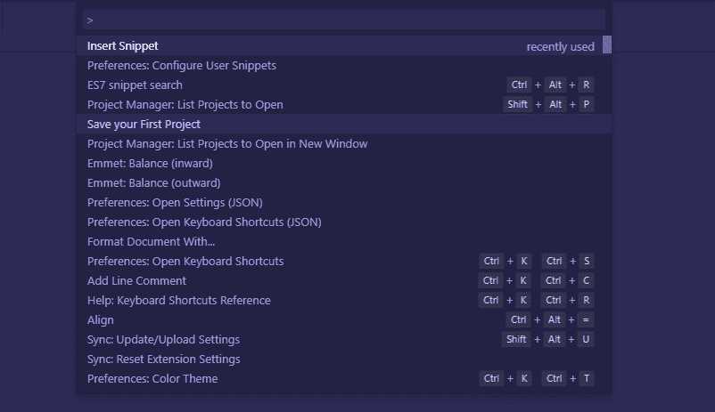
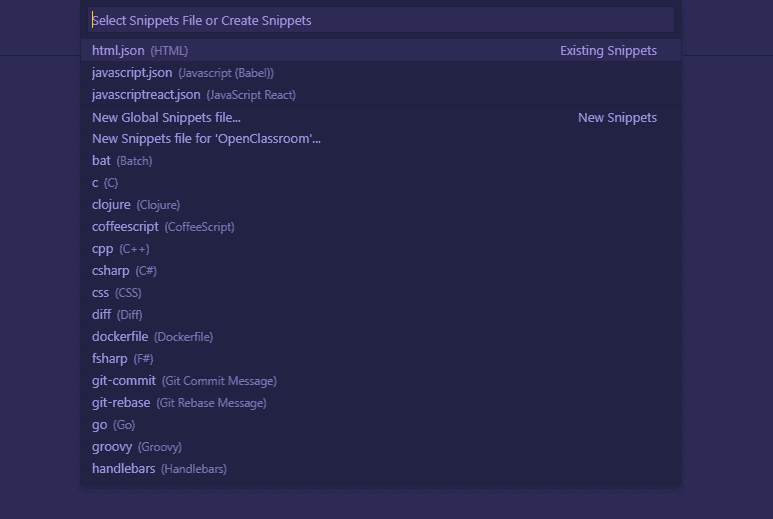

# Was not able to comment out jsx in react, so I made my own snippets

> 原文：[https://dev.to/raisaugat/was-not-able-to-comment-out-jsx-in-react-so-i-made-my-own-snippets-2853](https://dev.to/raisaugat/was-not-able-to-comment-out-jsx-in-react-so-i-made-my-own-snippets-2853)

While I was on a react project, I was not able to comment out jsx which was really frustrating.

The way we comment out jsx is
`{/* comment */}`

But the default comment function on vscode doesnot comment out jsx. So, I made my own snippets to comment out jsx.

First, open command palette

Search for configure user snippets. But before choosing, look for the language type on your work file.

Then choose javascript or javascriptreact.

After that you will see some examples of how you can make a snippets. Copy below code and paste it.

`"Comment out jsx": {
"prefix": "jsx",
"body": [
"{/*",
"${TM_SELECTED_TEXT}",
"*/}"
],
"description": "Comment out jsx"
}`

Save the file and you are good to go.

Select the code you want to comment and insert snippets.