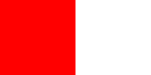
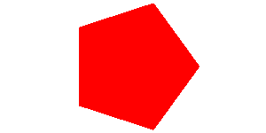
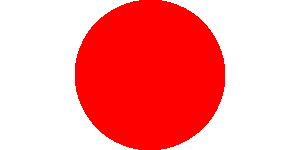
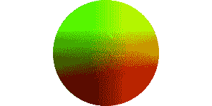
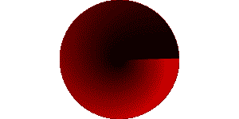

# 着色器变化

> 原文：<https://dev.to/lesnitsky/shader-varyings-2p0f>

## 第四天。着色器变化

这是一系列与 WebGL 相关的博文。每天都会有新帖子

[](https://github.com/lesnitsky/webgl-month)
[T6】](https://twitter.com/lesnitsky_a)

[加入邮件列表](http://eepurl.com/gwiSeH),让新邮件直接进入你的收件箱

[此处提供源代码](https://github.com/lesnitsky/webgl-month)

建造于

[](https://github.com/lesnitsky/git-tutor)

* * *

昨天我们学习了如何渲染线条和三角形，所以让我们开始做作业吧

如果 webgl 只能渲染三角形，我们怎么画矩形？我们应该把一个矩形分成两个三角形

```
-------
|    /|
|  /  |
|/    |
------- 
```

很简单，对吧？

让我们定义三角形顶点的坐标

📄src/webgl-hello-world.js

```
 gl.uniform4fv(colorUniformLocation, [255, 0, 0, 255]);

  const triangles = [
-     0, 0, // v1 (x, y)
-     canvas.width / 2, canvas.height, // v2 (x, y)
-     canvas.width, 0, // v3 (x, y) +     // first triangle
+     0, 150, // top left
+     150, 150, // top right
+     0, 0, // bottom left
+     
+     // second triangle
+     0, 0, // bottom left
+     150, 150, // top right
+     150, 0, // bottom right
  ];

  const positionData = new Float32Array(triangles); 
```

[](https://res.cloudinary.com/practicaldev/image/fetch/s--IJf1XHFV--/c_limit%2Cf_auto%2Cfl_progressive%2Cq_auto%2Cw_880/https://git-tutor-assets.s3.eu-west-2.amazonaws.com/rectangle.png)

太好了，我们现在可以渲染矩形了！

现在让我们画一个六边形。这有点难以手工绘制，所以让我们创建一个辅助函数

📄src/webgl-hello-world.js

```
 150, 0, // bottom right
  ];

+ function createHexagon(center, radius, segmentsCount) {
+     
+ }
+ 
  const positionData = new Float32Array(triangles);

  const positionBuffer = gl.createBuffer(gl.ARRAY_BUFFER); 
```

我们需要以单个线段角度为步长迭代(360 度线段角度)

📄src/webgl-hello-world.js

```
 gl.uniform2fv(resolutionUniformLocation, [canvas.width, canvas.height]);
  gl.uniform4fv(colorUniformLocation, [255, 0, 0, 255]);

- const triangles = [
-     // first triangle
-     0, 150, // top left
-     150, 150, // top right
-     0, 0, // bottom left
-     
-     // second triangle
-     0, 0, // bottom left
-     150, 150, // top right
-     150, 0, // bottom right
- ];
- 
- function createHexagon(center, radius, segmentsCount) {
- + const triangles = [createHexagon()];
+ 
+ function createHexagon(centerX, centerY, radius, segmentsCount) {
+     const vertices = [];
+ 
+     for (let i = 0; i < Math.PI * 2; i += Math.PI * 2 / (segmentsCount - 1)) {
+         
+     }
+ 
+     return vertices;
  }

  const positionData = new Float32Array(triangles); 
```

应用一些简单的学校数学

[](https://res.cloudinary.com/practicaldev/image/fetch/s--eimu-yxb--/c_limit%2Cf_auto%2Cfl_progressive%2Cq_auto%2Cw_880/https://git-tutor-assets.s3.eu-west-2.amazonaws.com/hexagon.png)

📄src/webgl-hello-world.js

```
 gl.uniform2fv(resolutionUniformLocation, [canvas.width, canvas.height]);
  gl.uniform4fv(colorUniformLocation, [255, 0, 0, 255]);

- const triangles = [createHexagon()];
+ const triangles = createHexagon(canvas.width / 2, canvas.height / 2, canvas.height / 2, 6); 
  function createHexagon(centerX, centerY, radius, segmentsCount) {
      const vertices = [];
+     const segmentAngle =  Math.PI * 2 / (segmentsCount - 1); 
-     for (let i = 0; i < Math.PI * 2; i += Math.PI * 2 / (segmentsCount - 1)) {
- +     for (let i = 0; i < Math.PI * 2; i += segmentAngle) {
+         const from = i;
+         const to = i + segmentAngle;
+ 
+         vertices.push(centerX, centerY);
+         vertices.push(centerX + Math.cos(from) * radius, centerY + Math.sin(from) * radius);
+         vertices.push(centerX + Math.cos(to) * radius, centerY + Math.sin(to) * radius);
      }

      return vertices; 
```

现在我们如何渲染圆形？
其实一个圆也可以用同样的功能来建造，我们只需要增加“段”的数量

📄src/webgl-hello-world.js

```
 gl.uniform2fv(resolutionUniformLocation, [canvas.width, canvas.height]);
  gl.uniform4fv(colorUniformLocation, [255, 0, 0, 255]);

- const triangles = createHexagon(canvas.width / 2, canvas.height / 2, canvas.height / 2, 6);
+ const triangles = createHexagon(canvas.width / 2, canvas.height / 2, canvas.height / 2, 360); 
  function createHexagon(centerX, centerY, radius, segmentsCount) {
      const vertices = []; 
```

[](https://res.cloudinary.com/practicaldev/image/fetch/s--0TiP9kqw--/c_limit%2Cf_auto%2Cfl_progressive%2Cq_auto%2Cw_880/https://git-tutor-assets.s3.eu-west-2.amazonaws.com/circle.png)

## 变化多端

好吧，接下来呢？让我们添加一些颜色🎨
正如我们已经知道的，我们可以通过`uniform`
将颜色传递给片段着色器，但这不是唯一的方法。
顶点着色器可以为每个顶点传递一个`varying`给片段着色器，该值将被插值

听起来有点复杂，让我们看看它是如何工作的

我们需要在顶点和片段着色器中定义一个`varying`。确保类型匹配。例如，如果顶点着色器中的`vec3`和片段着色器中的`vec4`，那么`gl.linkProgram(program)`将会失败。您可以检查程序是否与`gl.getProgramParameter(program, gl.LINK_STATUS)`成功链接，如果是假的–`gl.getProgramInfoLog(program)`,看看发生了什么

📄src/webgl-hello-world.js

```
 attribute vec2 position;
  uniform vec2 resolution;

+ varying vec4 vColor;
+ 
  #define M_PI 3.1415926535897932384626433832795

  void main() {
      vec2 transformedPosition = position / resolution * 2.0 - 1.0;
      gl_PointSize = 2.0;
      gl_Position = vec4(transformedPosition, 0, 1);
+ 
+     vColor = vec4(255, 0, 0, 255);
  }
  `;

  const fShaderSource = `
      precision mediump float;
-     uniform vec4 color; + 
+     varying vec4 vColor; 
      void main() {
-         gl_FragColor = color / 255.0; +         gl_FragColor = vColor / 255.0;
      }
  `;

  const positionPointer = gl.getAttribLocation(program, 'position');
  const resolutionUniformLocation = gl.getUniformLocation(program, 'resolution');
- const colorUniformLocation = gl.getUniformLocation(program, 'color'); 
  gl.uniform2fv(resolutionUniformLocation, [canvas.width, canvas.height]);
- gl.uniform4fv(colorUniformLocation, [255, 0, 0, 255]); 
  const triangles = createHexagon(canvas.width / 2, canvas.height / 2, canvas.height / 2, 360); 
```

现在让我们试着根据`gl_Position`给我们的圆着色

📄src/webgl-hello-world.js

```
 gl_PointSize = 2.0;
      gl_Position = vec4(transformedPosition, 0, 1);

-     vColor = vec4(255, 0, 0, 255);
+     vColor = vec4((gl_Position.xy + 1.0 / 2.0) * 255.0, 0, 255);
  }
  `; 
```

[](https://res.cloudinary.com/practicaldev/image/fetch/s--pjwjCdCj--/c_limit%2Cf_auto%2Cfl_progressive%2Cq_auto%2Cw_880/https://git-tutor-assets.s3.eu-west-2.amazonaws.com/colorized-circle.png)

看起来很酷，对吧？

但是我们如何从 js 中传递一些特定的颜色呢？

我们需要创建另一个属性

📄src/webgl-hello-world.js

```
 const vShaderSource = `
  attribute vec2 position;
+ attribute vec4 color;
  uniform vec2 resolution;

  varying vec4 vColor;
      gl_PointSize = 2.0;
      gl_Position = vec4(transformedPosition, 0, 1);

-     vColor = vec4((gl_Position.xy + 1.0 / 2.0) * 255.0, 0, 255);
+     vColor = color;
  }
  `;

  gl.useProgram(program);

- const positionPointer = gl.getAttribLocation(program, 'position');
+ const positionLocation = gl.getAttribLocation(program, 'position');
+ const colorLocation = gl.getAttribLocation(program, 'color');
+ 
  const resolutionUniformLocation = gl.getUniformLocation(program, 'resolution');

  gl.uniform2fv(resolutionUniformLocation, [canvas.width, canvas.height]);
  const stride = 0;
  const offset = 0;

- gl.enableVertexAttribArray(positionPointer);
- gl.vertexAttribPointer(positionPointer, attributeSize, type, nomralized, stride, offset); + gl.enableVertexAttribArray(positionLocation);
+ gl.vertexAttribPointer(positionLocation, attributeSize, type, nomralized, stride, offset); 
  gl.drawArrays(gl.TRIANGLES, 0, positionData.length / 2); 
```

为此属性设置缓冲区

📄src/webgl-hello-world.js

```
 }

  const positionData = new Float32Array(triangles);
+ const colorData = new Float32Array(colors); 
  const positionBuffer = gl.createBuffer(gl.ARRAY_BUFFER);
+ const colorBuffer = gl.createBuffer(gl.ARRAY_BUFFER);
+ 
+ gl.bindBuffer(gl.ARRAY_BUFFER, colorBuffer);
+ gl.bufferData(gl.ARRAY_BUFFER, colorData, gl.STATIC_DRAW); 
  gl.bindBuffer(gl.ARRAY_BUFFER, positionBuffer);
  gl.bufferData(gl.ARRAY_BUFFER, positionData, gl.STATIC_DRAW); 
```

用数据填充缓冲区

📄src/webgl-hello-world.js

```
 gl.uniform2fv(resolutionUniformLocation, [canvas.width, canvas.height]);

  const triangles = createHexagon(canvas.width / 2, canvas.height / 2, canvas.height / 2, 360);
+ const colors = fillWithColors(360); 
  function createHexagon(centerX, centerY, radius, segmentsCount) {
      const vertices = [];
      return vertices;
  }

+ function fillWithColors(segmentsCount) {
+     const colors = [];
+ 
+     for (let i = 0; i < segmentsCount; i++) {
+         for (let j = 0; j < 3; j++) {
+             if (j == 0) { // vertex in center of circle
+                 colors.push(0, 0, 0, 255);
+             } else {
+                 colors.push(i / 360 * 255, 0, 0, 255);
+             }
+         }
+     }
+ 
+     return colors;
+ }
+ 
  const positionData = new Float32Array(triangles);
  const colorData = new Float32Array(colors); 
```

并设置属性指针(属性从缓冲区读取数据的方式)。

📄src/webgl-hello-world.js

```
 gl.enableVertexAttribArray(positionLocation);
  gl.vertexAttribPointer(positionLocation, attributeSize, type, nomralized, stride, offset);

+ gl.bindBuffer(gl.ARRAY_BUFFER, colorBuffer);
+ 
+ gl.enableVertexAttribArray(colorLocation);
+ gl.vertexAttribPointer(colorLocation, 4, type, nomralized, stride, offset);
+ 
  gl.drawArrays(gl.TRIANGLES, 0, positionData.length / 2); 
```

注意这个`gl.bindBuffer`在属性相关调用之前。`gl.vertexAttribPointer`点属性到最近绑定的缓冲区，不要忘记这一步，这是一个常见的错误

[](https://res.cloudinary.com/practicaldev/image/fetch/s--MEw7BeXw--/c_limit%2Cf_auto%2Cfl_progressive%2Cq_auto%2Cw_880/https://git-tutor-assets.s3.eu-west-2.amazonaws.com/colored-circle-2.png)

### 结论

我们已经学习了另一种将数据传递给片段着色器的方法。这对于逐顶点颜色和纹理很有用(我们稍后会用到纹理)

### 作业

渲染一个 7 边形并用彩虹色给每个三角形上色🌈

明天见👋

* * *

[](https://github.com/lesnitsky/webgl-month)
[T6】](https://twitter.com/lesnitsky_a)

[加入邮件列表](http://eepurl.com/gwiSeH),让新邮件直接进入你的收件箱

[此处提供源代码](https://github.com/lesnitsky/webgl-month)

建造于

[](https://github.com/lesnitsky/git-tutor)