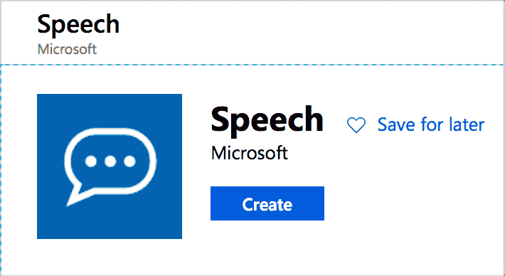

# 构建实时字幕工具-第 1 部分

> 原文：<https://dev.to/azure/building-a-live-caption-tool-part-1-482e>

我已经开通了一个 [Twitch 流，每周三英国时间中午 12 点我都在学习 Python](https://twitch.tv/jimbobbennett) 。我想让我的流更容易理解的一个方法是在我讲话时有现场字幕。

我需要的是一个工具，将流字幕的东西，我可以添加到我的 OBS 场景，但也可以定制。许多现成的语音转文本模型都很棒，但我需要一些可以根据我的声音和口音以及我使用的任何特殊词语(如技术工具和术语)进行调整的东西。

Azure 认知服务有这样一个工具——除了使用标准的语音到文本模型，你还可以为你的声音、口音、背景噪音和特殊单词定制模型。

在这一部分，我将展示如何开始用 Python 构建一个实时字幕。在下一部分，我将展示如何定制输出。

## 创建语音资源

要开始，首先需要在 Azure 中创建一个语音资源。你可以在 Azure 门户上点击[这个链接](https://portal.azure.com/?WT.mc_id=devto-blog-jabenn#create/Microsoft.CognitiveServicesSpeechServices)来完成。我正在使用一个免费层——毕竟我们都喜欢免费的东西！

> 如果你没有 Azure 帐户，你可以在 azure.microsoft.com/free 创建一个免费帐户，并获得前 30 天 200 美元的免费点数和一年的免费服务。学生和教职员工可以在 azure.microsoft.com/free/students[大学](https://azure.microsoft.com/free/students/?WT.mc_id=devto-blog-jabenn)注册，获得为期一年的 100 美元以及 12 个月的免费服务，并且可以在学生时代每年更新。

[](https://res.cloudinary.com/practicaldev/image/fetch/s--oGNO_oGZ--/c_limit%2Cf_auto%2Cfl_progressive%2Cq_auto%2Cw_880/https://thepracticaldev.s3.amazonaws.com/i/3watoqecinwpff9q5jg7.png)

创建资源时，记下**概述**选项卡中端点的第一部分。端点会是类似于`https://uksouth.api.cognitive.microsoft.com/sts/v1.0/issuetoken`的东西，你想要的位是 api.microsoft.com 之前的部分，所以在我的例子中是`uksouth`。这将是您在其中创建资源的区域的名称。你们还需要从**键**标签中抓取一个键。

一旦你有了你的演讲资源，下一步就是用它来创建字幕。

## 创建标题

鉴于我的流都是关于学习 Python 的，我想用 Python 来构建标题会很有趣。所有的微软认知服务都有[Python API](https://azure.microsoft.com/resources/samples/cognitive-services-python-sdk-samples/?WT.mc_id=devto-blog-jabenn)，这使得它们很容易使用。

我启动了 VS Code(由于有了 [Python 扩展](https://code.visualstudio.com/docs/languages/python/?WT.mc_id=devto-blog-jabenn)，它拥有出色的 Python 支持)，并创建了一个新的 Python 项目。Speech SDK 可以通过`pip`获得，所以我使用
通过终端安装它

```
pip install azure-cognitiveservices-speech 
```

<svg width="20px" height="20px" viewBox="0 0 24 24" class="highlight-action crayons-icon highlight-action--fullscreen-on"><title>Enter fullscreen mode</title></svg> <svg width="20px" height="20px" viewBox="0 0 24 24" class="highlight-action crayons-icon highlight-action--fullscreen-off"><title>Exit fullscreen mode</title></svg>

为了识别语音，你需要创建一个`speechRecognizer`，通过一个`speechConfig`告诉它你的资源的细节。

```
import azure.cognitiveservices.speech as speechsdk

speech_config = speechsdk.SpeechConfig(subscription=speech_key, region=service_region)
speech_recognizer = speechsdk.SpeechRecognizer(speech_config=speech_config) 
```

<svg width="20px" height="20px" viewBox="0 0 24 24" class="highlight-action crayons-icon highlight-action--fullscreen-on"><title>Enter fullscreen mode</title></svg> <svg width="20px" height="20px" viewBox="0 0 24 24" class="highlight-action crayons-icon highlight-action--fullscreen-off"><title>Exit fullscreen mode</title></svg>

在上面的代码中，用语音资源中的键替换`speech_key`，用区域名替换`service_region`。

> 这将使用默认麦克风创建语音识别器。如果要更改麦克风，您需要知道设备 id，并使用它来创建用于创建识别器的 AudioConfig 对象。你可以在[文档](https://docs.microsoft.com/azure/cognitive-services/speech-service/how-to-select-audio-input-devices/?WT.mc_id=devto-blog-jabenn)中读到更多相关信息。

语音识别器可以一次性运行，监听单个语音块，直到找到断点，或者可以连续运行，通过事件提供恒定的文本流。为了连续检测，需要连接一个事件来收集文本。

```
def recognizing(args):
    # Do something 
speech_recognizer.recognizing.connect(recognizing)
speech_recognizer.start_continuous_recognition() 
```

<svg width="20px" height="20px" viewBox="0 0 24 24" class="highlight-action crayons-icon highlight-action--fullscreen-on"><title>Enter fullscreen mode</title></svg> <svg width="20px" height="20px" viewBox="0 0 24 24" class="highlight-action crayons-icon highlight-action--fullscreen-off"><title>Exit fullscreen mode</title></svg>

在上面的代码中，每当识别出一些文本时，就会触发`recognizing`事件。对于同一组单词，该事件被触发多次，随着时间的推移，随着模型优化输出，文本逐渐增多。休息后，它将重置并发送新的文本。

`args`参数是一个`SpeechRecognitionEventArgs`实例，具有一个名为`result`的属性，包含识别的结果。这个结果有一个名为 text 的属性，带有已识别的`text`。

例如，如果您运行这个程序并说“您好，欢迎使用语音字幕”，这个事件可能会被调用 7 次:

```
hello
hello and
hello and welcome
hello and welcome to
hello and welcome to the
hello and welcome to the speech
hello and welcome to the speech captioner 
```

<svg width="20px" height="20px" viewBox="0 0 24 24" class="highlight-action crayons-icon highlight-action--fullscreen-on"><title>Enter fullscreen mode</title></svg> <svg width="20px" height="20px" viewBox="0 0 24 24" class="highlight-action crayons-icon highlight-action--fullscreen-off"><title>Exit fullscreen mode</title></svg>

如果你停下来说“这个有效”,它会被再叫两次，而且只有新单词。

```
this
this works 
```

<svg width="20px" height="20px" viewBox="0 0 24 24" class="highlight-action crayons-icon highlight-action--fullscreen-on"><title>Enter fullscreen mode</title></svg> <svg width="20px" height="20px" viewBox="0 0 24 24" class="highlight-action crayons-icon highlight-action--fullscreen-off"><title>Exit fullscreen mode</title></svg>

随着对单词的分析，文本被细化，因此文本可以随着时间而改变。例如，如果您说“这是一个实时字幕测试”，您可能会返回:

```
this
this is
this is alive
this is a live caption
this is a live caption text 
```

<svg width="20px" height="20px" viewBox="0 0 24 24" class="highlight-action crayons-icon highlight-action--fullscreen-on"><title>Enter fullscreen mode</title></svg> <svg width="20px" height="20px" viewBox="0 0 24 24" class="highlight-action crayons-icon highlight-action--fullscreen-off"><title>Exit fullscreen mode</title></svg>

请注意，在第三个结果中有单词“alive ”,随着模型理解更多的上下文，该单词被拆分为“a live”。

该模型不理解句子，而在现实中，人类很少用连贯的句子说话，这些句子的结构很容易被模型打断，因此，为什么你不会看到句号或大写字母。

`start_continuous_recognition`调用将在后台运行识别，因此应用程序将需要一种方法来保持运行，例如循环睡眠或使用 Tkinter 之类的 GUI 框架的应用程序循环。

我用 Tkinter 用这段代码创建了一个 GUI 应用程序。我的应用程序将在屏幕底部放置一个半透明的窗口，在标签中有一个标题的实时流。标签是用来自`recognizing`事件的文本更新的，所以将在我讲话时更新，然后在每个文本块结束和新的文本块开始后清除。

你可以在 [GitHub](https://github.com/jimbobbennett/TwitchCaptioner) 上找到它，使用它将你的密钥和区域添加到 *config.py* 文件中，从 *requirements.txt* 文件中安装`pip`包，并通过 Python 运行 *captioner.py* 。

在下一部分中，我将展示如何根据我的声音和我使用的术语定制模型。