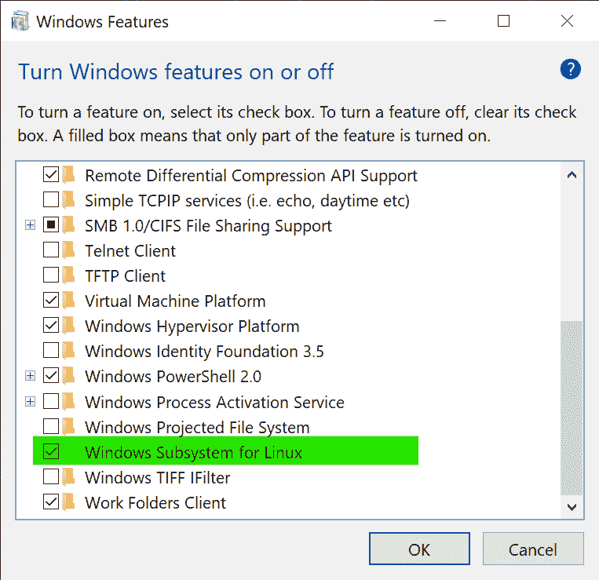
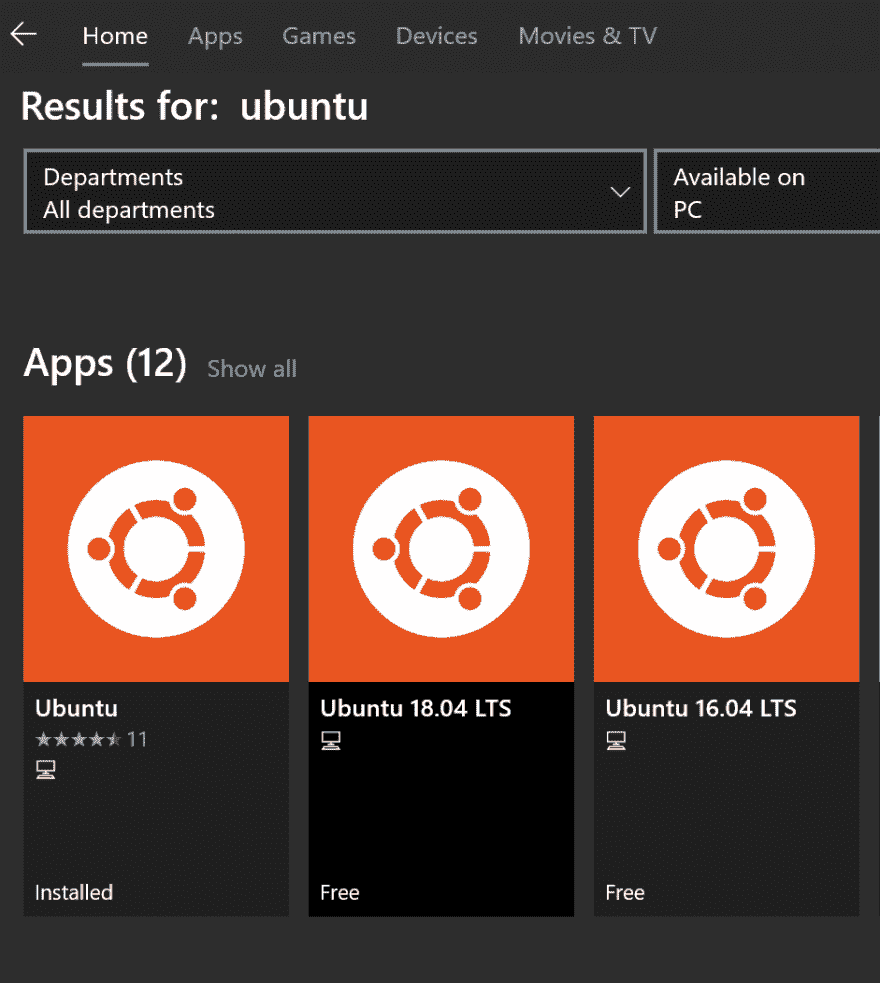

# VS Code and WSL => Godmode

> 原文：[https://dev.to/itminds/vs-code-and-wsl-godmode-1njb](https://dev.to/itminds/vs-code-and-wsl-godmode-1njb)

Going from Linux to Windows is not easy. When it came to working, nothing could beat the power of the commandline and my legendary vim config (as i so fitted has named it).

## Why Windows?

I recently bought me a Dell XPS 15\. Really nice computer. However it seems that Dell has implemented some nice features, which to my knowledge only works on a Windows distribution. Sucks when i spent so much time mastering the vim+zsf.

The linux subsystem for windows brought light to my weary bones though, and i will teach you how you can harness the true power of Windows (Which is a linux VM).

To harness the power of the linux gods you will have to finish the tasks of three.

1.  Activate The linux subsystem for windows.
2.  Install a linux distro from the windows store(i use ubuntu)
3.  Install the WSL extension for VSCode.

## Activate the linux subsystem

This is done by searching for "Turn windows features on or off" and checking the linux subsystem option.
[](https://res.cloudinary.com/practicaldev/image/fetch/s--rohVZcqr--/c_limit%2Cf_auto%2Cfl_progressive%2Cq_auto%2Cw_880/https://thepracticaldev.s3.amazonaws.com/i/antjxp0vdidjw605i91a.png).

## Install the linux

Simple, get it, run it, love it.
[](https://res.cloudinary.com/practicaldev/image/fetch/s--myj5Oawy--/c_limit%2Cf_auto%2Cfl_progressive%2Cq_auto%2Cw_880/https://thepracticaldev.s3.amazonaws.com/i/4o2najis0z78kis8rcpq.png).

### Notes on the linux distro

this will come with git preinstalled, but i have compiled a set of nice to have features which you can copy paste to your WSL terminal to get to the godlike level of linux terminal control.

*   Oh my ZSH *[link](https://github.com/robbyrussell/oh-my-zsh)*

```
sh -c "$(curl -fsSL https://raw.githubusercontent.com/robbyrussell/oh-my-zsh/master/tools/install.sh)" 
```

*   Node version manager *[link](https://github.com/nvm-sh/nvm)*

```
curl -o- https://raw.githubusercontent.com/nvm-sh/nvm/v0.34.0/install.sh | bash 
```

**NOTE:** if you installed oh my zsh first, it will add the NVM to the path.

*   Yarn package manager *[link](https://yarnpkg.com/lang/en/docs/install/#debian-stable)*

```
curl -sS https://dl.yarnpkg.com/debian/pubkey.gpg | sudo apt-key add -
echo "deb https://dl.yarnpkg.com/debian/ stable main" | sudo tee /etc/apt/sources.list.d/yarn.list
sudo apt-get update && sudo apt-get install --no-install-recommends yarn 
```

We will use the --no-install-recommends since we use NVM as our node host. Otherwise delete the flag.

*   Node and NPM *[link](https://nodejs.org/en/)*

```
nvm install <version number> 
```

## The Visual Studio code part

Now this is where the magic happends, in VS Code install the plugin WSL
[](https://res.cloudinary.com/practicaldev/image/fetch/s--D5uHkxJY--/c_limit%2Cf_auto%2Cfl_progressive%2Cq_auto%2Cw_880/https://thepracticaldev.s3.amazonaws.com/i/cl74tj95b5wpbv0vebl2.png).

Now Simple ctrl-shift-p and search WSL and click open vscode in wsl.

VS code will then start a server in WSL and keep VSCode as a frontend.

If you open a terminal in the new vs code window it will open in the linux bash, and you are now free to keep bash or install zsh and be a linux god on Windows.

This should cover all the basic of getting to use WSL in Windows.
If you like WSL in windows with VS code, leave a comment below or show some love!