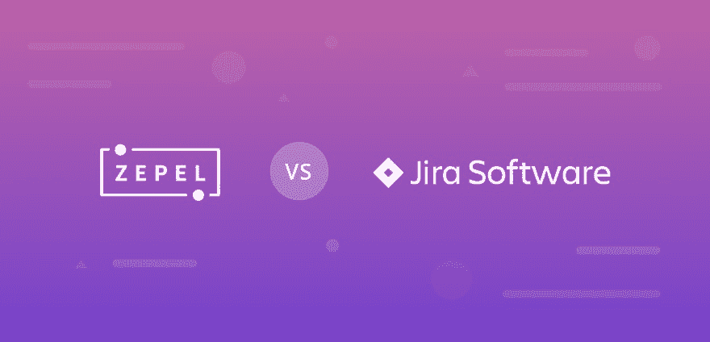
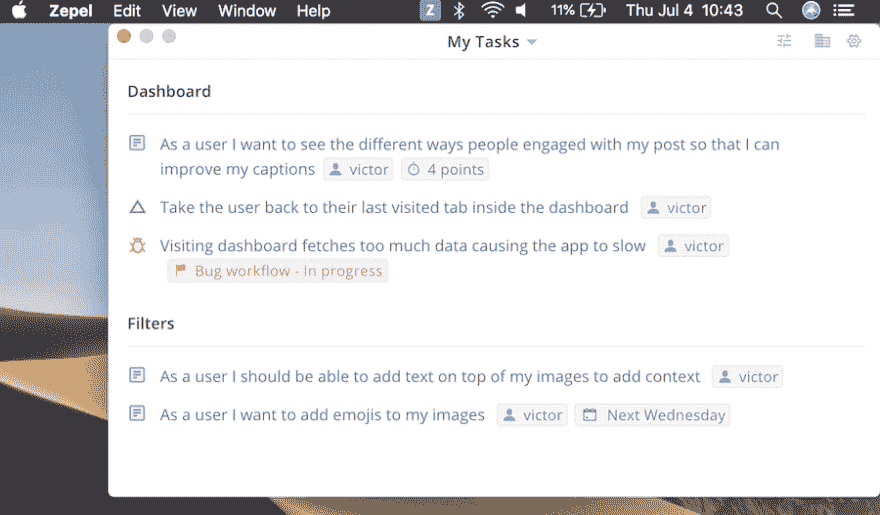
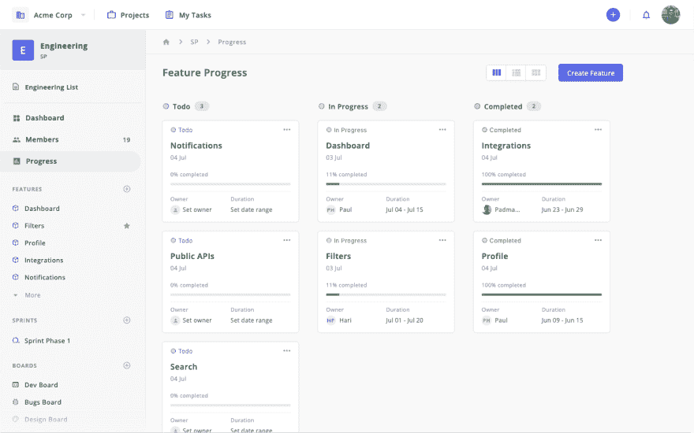
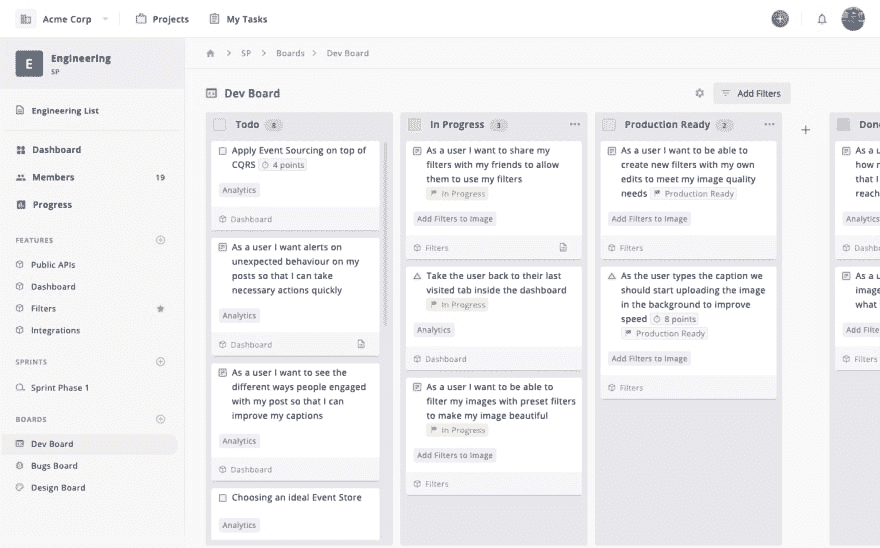
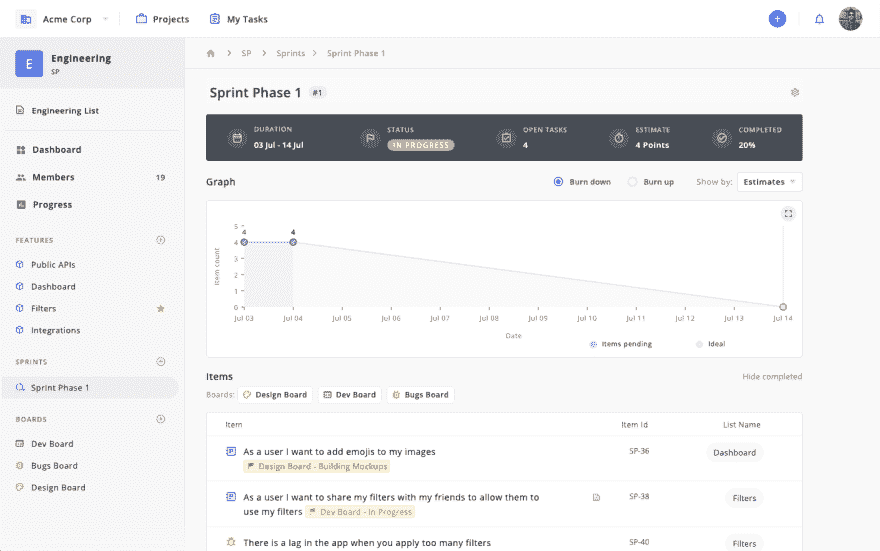
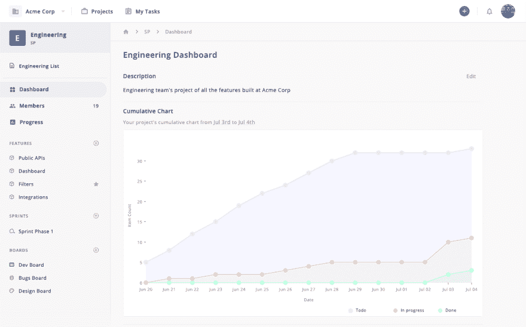
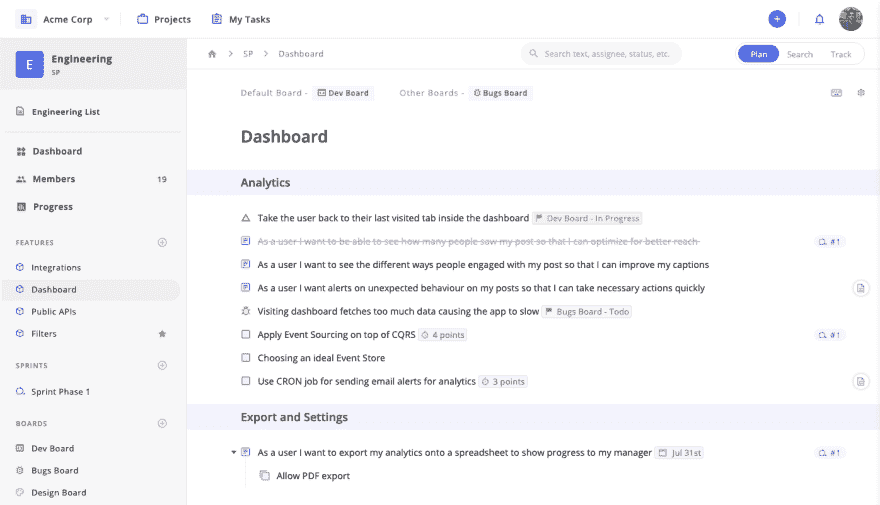
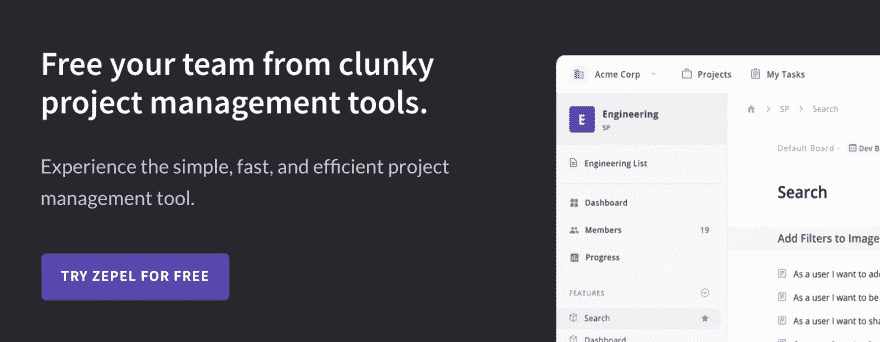

# JIRA 软件替代方案——为什么 Zepel 是您的团队需要的项目管理工具

> 原文：<https://dev.to/svikashk/jira-alternative-why-zepel-is-the-project-management-tool-your-team-needs-cg0>

如果你正在寻找一个 JIRA 的替代品，它速度快，不碍事，并且帮助你计划和跟踪你的团队正在构建的特性，那么你就找对地方了。

JIRA 在塑造行业方面创造了奇迹。但是世界已经变了。今天，团队不仅仅想要一个实用的工具。他们还想要一个对开发人员友好的项目管理工具，并为速度和效率而构建。

> 有了 JIRA，你可以写一份问题清单，开始写你的专题。
> 
> 但是你不能让你的团队关心和更新进度，除非你拿枪指着他们的头。

不要忘记，在创建一个用户故事之前，您必须经历的配置地狱。

你需要一个 JIRA 的替代品，让你可以跨团队与成员一起工作，计划和跟踪特性，更重要的是让你做你最擅长的事情——编写代码和构建特性。

现在，你可能想知道是什么让 Zepel 成为 JIRA 的绝佳替代品。当然，有一些功能差异。我一会儿会谈到这一点。

但是最根本的区别是 Zepel 是为软件产品团队而构建的。

这意味着 Zepel 不会试图取悦所有人。Zepel 不会让你在创建一个用户故事之前做一百件事情。它当然不会让你把你的用户故事称为一种问题！

如果您想要计划、跟踪功能、获得跨团队的可见性，并构建让您的客户满意的可靠功能，我们将全力支持您。

* * *

## 为什么团队更喜欢 Zepel 作为 JIRA 的替代品

### 一个人人都懂的界面

JIRA 最大的局限是它很难理解以及随之而来的混乱。对于没有花几个小时尝试学习这个工具的人来说，让他们更新你的用户故事的进度几乎是不可能的。

在 Zepel 上工作是如此之快，你会认为你是在一个文档上写东西。想要委派工作或设置截止日期和状态吗？就像输入`/`一样简单。

在几分钟内创建、组织并开始处理项目，并随时观察您的团队更新进度。

### 你的代码编辑器旁边的一个桌面小部件

开发人员将大部分时间花在代码编辑器上。那么，为什么要在工具之间来回切换以保持更新呢？

Zepel 的桌面小部件让您的团队可以在舒适的桌面上查看、编辑和更新他们的进度。并且通过 **Slack** 、 **Github** 和 **Bitbucket integration** ，PR merges 可以自动完成 Zepel 上的项目，并让每个人保持更新。

### 您需要的一切，减去杂乱的配置

当您需要管理级别的仪表板时，配置会很有帮助。但是如果仪表板让你的团队如此困惑，以至于他们甚至不想更新进度，那么它有什么用呢？

如果你的团队在日常生活中不使用像 Epics 这样的术语，你最终会疏远你的团队，让他们更难采用你的项目管理工具。

Zepel 使用简单的术语，比如特性，并且不会在你的团队中强加一个过程。通过你队友的代码编辑器旁边的桌面小部件，你的工作总是被更新，你的报告将 ***最终*** 有意义。

### 让每个人都以自己喜欢的方式工作

在 JIRA，建立和理解多重董事会是很难的。更不用说将物品从一个板子移动到另一个板子了。

使用 Zepel，创建电路板就像点击一个 **( + )** 按钮一样轻松。想要将一个项目从一个棋盘移动到另一个棋盘？简单的改变状态。

不，真的。简单说就是 ***。无需编码或设置规则。***

### 一流短跑打造完美功能

在 Sprint 中添加跨功能的项目，让您的团队专注于最重要的事情。多选它们，然后右键单击将它们全部添加到一个 sprint 中。

最精彩的部分？当您的团队成员使用适合他们工作流程的板并更新进度时，您可以看到这一切是如何与您的功能进度相关联的。

### 简单的报告，不要混淆

每个公司都可以为你的项目提供报告。有了 Zepel，您可以更进一步，获得不会让您困惑的报告。而是帮助你前进。

无论您需要放大并查看特定功能的进度，还是后退一步查看整个项目的进度，Zepel 都有适合您的报告。

## 为什么您的团队需要 JIRA 替代品

有很多项目管理工具。为什么要为软件产品团队再准备一个？“我听到你问了。

关于构建功能和产品的事情是，有大量的移动部分。你的团队会随着你的成长而重组。您将采用新的流程来增加团队间的可见性，并提高结果的质量。

此时您最不想要的就是一个将流程强加给团队的工具。

不像 JIRA 和所有其他的替代者，Zepel 不会强迫你的团队进行一个过程。无论你想运行 **Sprints** ，使用**看板**，两者的结合，甚至是**简单的** **任务管理**，Zepel 适合并适应你团队的成长过程。

更重要的是，无论您采用什么流程，Zepel 都是快速的，并配备了您的团队完成最佳工作所需的所有简单性和灵活性。

