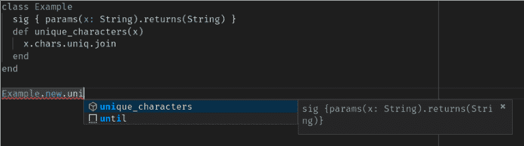

# 第一印象的果汁冰糕，红宝石类型的检查

> 原文：<https://dev.to/aaronc81/first-impressions-of-sorbet-a-ruby-type-checker-3ef7>

[Sorbet](https://sorbet.org) 是 Ruby 的类型检查器，由 Stripe 打造。它的发布已经被期待很久了，已经在一些 Ruby 会议上讨论过，并且可以在[一个叫做 sorbet.run](https://sorbet.run) 的在线游乐场测试。

现在它已经作为一个开源项目发布了，我已经迫不及待地开始使用它了。我首先要说的是，总的来说，我对冰糕的体验是非常积极的。

我一直是静态类型的粉丝，Ruby 中缺乏静态类型有时会让我放弃用它编写大型项目。冰糕可能足以吸引我回来——但只有在它被赋予一点时间来成熟之后。在这篇文章中，我将深入讨论我对冰糕的想法。

## 我喜欢什么

### 还是红宝石！

这是果汁冰糕最棒的地方之一，Ruby 灵活多样的语法使之成为可能。使用 Sorbet 的 Ruby 代码仍然只是 Ruby。类型签名是通过每个定义上面的方法调用添加的:

```
sig { params(a: Integer, b: Integer).returns(Integer) }
def add_ints(a, b)
  a + b
end 
```

Enter fullscreen mode Exit fullscreen mode

运行它所需要的是`sorbet-runtime` gem，它定义了`sig`和其他一些有时用于声明类型的调用。

这与 TypeScript 的方法形成了鲜明的对比，后者是一种编译成 JavaScript 的全新语言。创建一种新的语言会增加一个全新的构建步骤，并使事情变得有些复杂。(在许多方面，TypeScript 之于 JavaScript 与 Sorbet 之于 Ruby 非常相似，所以我将在这里对它们进行一些比较。)

### 这是渐进的

一旦您将 Sorbet 添加到您的项目中，您不需要立即检查并添加每个方法的类型签名。(不过，不要脸的塞，[我的项目会那样做的](https://github.com/AaronC81/sord)如果你有院子文档的话！)

相反，您可以逐渐将类型添加到您现有的代码库中，Sorbet 将只检查具有类型签名的方法。

### 它带来了一个令人敬畏的语言服务器

Sorbet 需要对你的代码库结构有深刻的理解才能完成它的工作，作为一个很棒的额外特性，它通过[语言服务器协议](https://microsoft.github.io/language-server-protocol/specification)公开这些信息。这意味着您的编辑器可以看到这些信息，并提供丰富的自动完成、跳转到定义等功能。

有了 Visual Studio 代码的 Sorbet 扩展，我在 Ruby 编辑器中获得了我所见过的最好的自动完成功能。我在 VS 代码中为 Ruby 尝试过的其他解决方案甚至都无法与之媲美；我要说的是，冰糕和 RubyMine 完成的差不多，如果不是更好的话。

[](https://res.cloudinary.com/practicaldev/image/fetch/s--PupKaGt9--/c_limit%2Cf_auto%2Cfl_progressive%2Cq_auto%2Cw_880/https://thepracticaldev.s3.amazonaws.com/i/fj2z0vmfyrp7dfrpx7lc.png)

### 它使代码更安全

显然，作为一个静态类型系统，Sorbet 为您的 Ruby 代码带来了静态类型的所有优点。在类型检查器的帮助下，准确的类型签名可以发现您正在编写的代码中的许多常见错误。

## 我不太喜欢什么

### 不支持结构化接口

我觉得这是目前冰糕最大的弱点之一。TypeScript 真正脱颖而出的一个方面是支持人们在 JavaScript 中经常做的所有事情。

像 Ruby 一样，JavaScript 是一种可塑性很强的语言，但是 TypeScript 能够包含几乎所有的 JavaScript 行为。它通过使用带有接口的[结构类型](http://wiki.c2.com/?NominativeAndStructuralTyping)来实现这一点。程序员可以创建一个定义属性和方法的接口类型，然后所有包含这些属性和方法的对象自动匹配该接口类型。

举个例子，就拿这段打字稿代码:

```
interface CanSpeak {
  speak: (msg: String) => any;
}

class Person {
  constructor(public name: String) {}

  speak(msg: String) {
    console.log(msg);
  }
}

var speakable: CanSpeak = new Person("Aaron");
speakable.speak("Hello!"); 
```

Enter fullscreen mode Exit fullscreen mode

虽然我们没有明确说`Person`实现了`CanSpeak`接口所需的方法，但是 TypeScript 编译器可以自己确定这一点，类型检查成功。

另一方面，Sorbet 使用一个主格类型系统，更类似于你在 C#或 Java 中发现的。接口实现必须是显式的，正如你在这个 Ruby with Sorbet 的代码片段中看到的:

```
module CanSpeak
  extend T::Helpers
  extend T::Sig

  interface!

  sig { abstract.params(msg: String).returns(T.untyped) }
  def speak(msg); end
end

class Person
  extend T::Sig
  include CanSpeak # <-- explicit interface inclusion

  def initialize(name)
    @name = name
  end

  sig { params(msg: String).void }
  def speak(msg)
    puts msg
  end
end

speakable = T.let(Person.new("Aaron"), CanSpeak) 
```

Enter fullscreen mode Exit fullscreen mode

如果没有`include CanSpeak`行，这个代码片段就不能通过类型检查。

这个系统的问题是，它意味着部分代码可能必须完全重构，以包含特定的接口。更大的问题是，如果代码不是你自己的，你不能编辑它来包含接口！当在依赖于 gems 的大型代码库中采用 Sorbet 时，这可能会导致棘手的情况。

### 它不太支持选项散列

众所周知，一个方法接受一个选项散列是非常常见的做法:一个散列参数包含该方法的任何无关选项。例如，在一个 API 库中，你可能会看到一个类似于
的方法定义

```
def connect(endpoint, opts={})
  # ...
end 
```

Enter fullscreen mode Exit fullscreen mode

您可以在`opts`散列中指定像 API 键这样的值。对于有大量可选参数的方法，这有助于保持方法签名的简洁。

令人失望的是，Sorbet 不太支持这样的散列。对于在类型签名中使用什么，您有几个选项，但没有一个是完美的:

*   `Hash`，它只接受任何键或值。这几乎就像根本没有类型检查一样。
*   `T::Hash[Symbol, T.untyped]`，它将键限制为符号，但仍然允许任何值，并且不强制指定某些键。
*   使用一个[形状](https://sorbet.org/docs/shapes)，它允许指定键和值类型。然而，你不能有可选的键，这是这些选项散列最常见的用例之一。

## 哪些东西还没准备好，阻碍了我到处使用冰糕

### 大多数宝石还没有类型

冰糕刚刚发布，因此它还没有被大多数项目采用。这种采用需要时间，而且我毫不怀疑 Ruby 社区会立刻团结起来为大多数流行的 gem 添加类型签名。

### 插件还没准备好

Ruby 丰富的元编程驱动的领域特定语言是 Ruby 如此特别的原因之一。自然，使用传统的类型系统来添加类型安全是不可能的，所以 Sorbet 将有一个插件系统来允许动态生成类型。

这个插件系统目前还没有完成，有一些严重的缺陷。也就是说，一旦插件系统完全实现并成熟，看看静态类型如何在现有的 Ruby 工具中广泛应用将会非常有趣。

## 总之

在为 Ruby 添加静态类型方面，Sorbet 是一个极好的开端；Stripe 的团队干得非常出色！目前它对许多小项目来说很棒，但对于更大的项目，我相信它需要时间来完全成熟并建立一个社区追随者。我很期待在不久的将来看到冰糕是如何发展的。