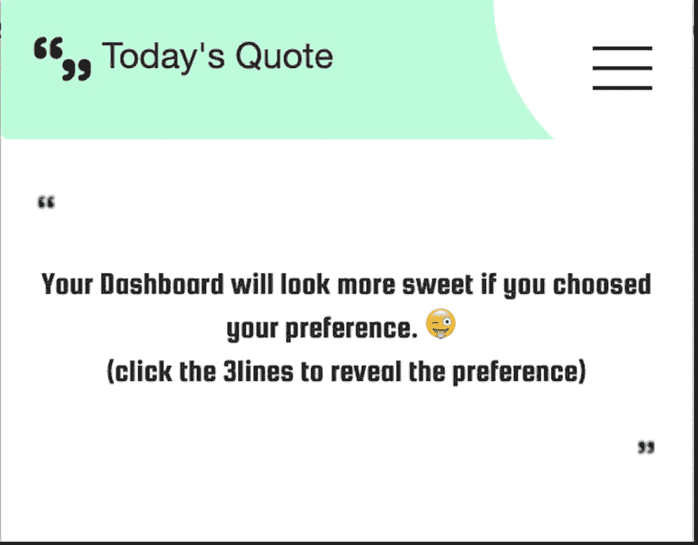
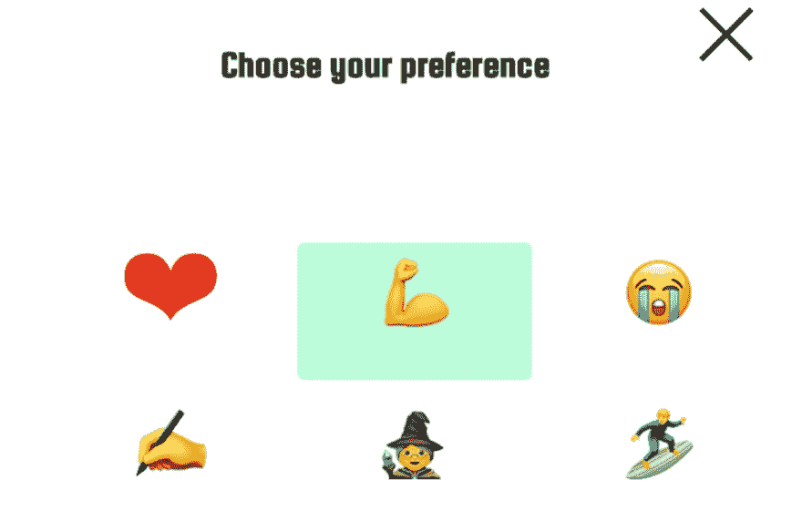
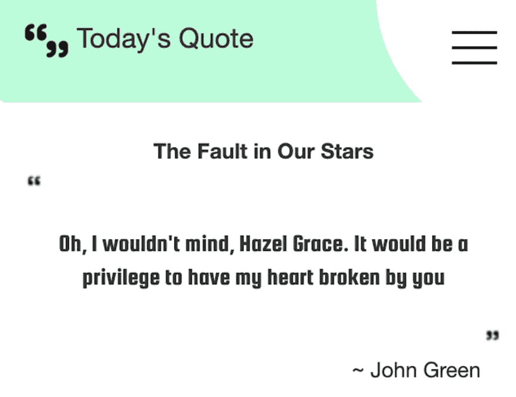

# My First Extension 👨🏻‍💻

> 原文：[https://dev.to/chintukarthi/my-first-extension-2gfp](https://dev.to/chintukarthi/my-first-extension-2gfp)

There was a time when everybody in the class was doing something badass and getting appreciation from the lectures in the electrical lab. I, on the other hand despite being an electrical engineer, was a joke when it comes to viva. I used to play around these two words: current and voltage to save my ass from getting kicked out 😅. That doesn't stop me from scoring good grades. Even though I had a first class with distinction in my bachelor's all my interest were on the computer field because of the exemplary lecturers I came across.

Now Being a software engineer, I thought of giving back to the community that helped me (helping me) in my growth as a software engineer 👨🏻‍💻.

Since my love for javascript kept growing on and on over years, I had this crazy idea of creating a chrome extension. Which was inspired by my senior([https://dev.to/gokatz](https://dev.to/gokatz)). Back in my college days, he was a great inspiration when it comes to coding (still he's an inspiration 😇).

After a long time of thinking about the concept to develop an extension, I settled down to create an extension which will give a daily customized quote from top rated books. (what else you can expect from a Bibliophilia 😝)

It wasn't easy 🙃. I had tough days balancing both professional life and personal life. Still, here I am, writing an article about the same extension which I wanted to create.

Below is the screenshot of the extension.

1) This is the home page, where the users will see the quotes.

2) This page allows the users to select their preference so that they can get a customized quote on their home page.

3) This is the view when a preference is selected.

The quote displayed on the third image is my personal favorite 😉.

You can get the extension from the below URL.

[https://chrome.google.com/webstore/detail/todays-quote/bicpefioihdlhhhfgjajcebodhhkkach](https://chrome.google.com/webstore/detail/todays-quote/bicpefioihdlhhhfgjajcebodhhkkach)

Here is a link to the extension that was developed by my senior ([https://dev.to/gokatz](https://dev.to/gokatz)) - [https://chrome.google.com/webstore/detail/muze/cgffahicpmdghffiephekgikaajnlilm](https://chrome.google.com/webstore/detail/muze/cgffahicpmdghffiephekgikaajnlilm)

Planning to make the code open source in a few weeks.

Suggestions about the user-experience are welcome 👾