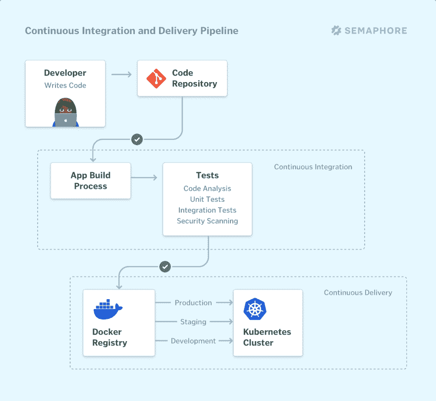

# 解释了持续集成

> 原文：<https://dev.to/markoa/continuous-integration-explained-59f9>

持续集成使迭代软件开发成为可能，减少了缺陷带来的风险，并使开发人员生产率更高。

## 什么是持续集成？

持续集成(CI)是一种软件开发实践，在这种实践中，开发人员每天多次将他们的变更合并到主分支中。每一次合并都会触发一个自动化的代码构建和测试序列，[，理想情况下在不到 10 分钟内运行](https://dev.to/markoa/what-is-proper-continuous-integration-585c)。一个成功的 CI 构建可能会导致后续阶段的持续交付。

如果构建失败，CI 系统会阻止它进入下一阶段。团队收到报告并快速修复构建，通常只需几分钟。

今天所有有竞争力的技术公司都在实践持续集成。通过在小的迭代中工作，软件开发过程变得可预测和可靠。开发人员可以迭代地构建新功能。产品经理可以更快地将合适的产品推向市场。开发人员可以快速修复 bug，通常会在用户发现之前就发现它们。

持续集成要求所有参与项目的开发人员都致力于此。结果需要对所有团队成员透明，并且在开发人员更改代码时向他们报告构建状态。如果主代码分支未能构建或通过测试，通常会向整个开发团队发出警告，他们应该立即采取行动，使其恢复到“绿色”状态。

## 为什么我们需要持续集成？

在商业中，尤其是在新产品开发中，通常**我们不能预先确定所有事情**。迈出更小的步伐有助于我们更准确地估计和更频繁地验证。反馈回路越短，意味着迭代次数越多。**驱动学习的是迭代的次数，而不是投入的时间。**

对于软件开发团队来说，在长反馈循环中工作是有风险的，因为它增加了错误的可能性以及将变更集成到工作版本软件中所需的工作量。

可控的小变化经常发生是安全的。通过自动化所有集成步骤，开发人员可以避免重复性工作和人为错误。CI 工具监视中央代码库，并在每次提交时运行所有自动化测试，而不是让人们决定何时以及如何运行测试。基于测试的总结果，它要么接受要么拒绝代码提交。

## 分机连续交货

一旦我们自动构建并测试了我们的软件，**发布它会变得更加容易。因此，持续集成通常通过持续交付来扩展，在这个过程中，代码变更也自动为发布(CI/CD)做好准备。**

在一个微调的 CI/CD 流程中，在 CI 阶段完成后，所有代码更改都将被部署到一个阶段环境、一个生产环境或两者。

连续交付可以是完全自动化的工作流程。在这种情况下，它通常被称为**连续部署**。或者，可以在关键点通过手动步骤实现部分自动化。这两种场景的共同点是，开发人员总是有一个来自 CI 阶段的发布工件，它已经通过了标准化的测试过程，并准备好进行部署。

## CI 和 CD 管道

CI 和 CD 通常被表示为一个管道，新代码从一端进入，流经一系列阶段(构建、测试、阶段化、生产)，并在另一端作为新的生产版本发布给最终用户。

CI/CD 管道的每个阶段都是交付流程中的一个逻辑单元。开发人员通常将每个单元分成一系列子单元，这些子单元按顺序或并行运行。

我在 dev.to 上分享了一篇关于 CI/CD 管道的更详细的帖子:

 [## CI/CD 管道:温和的介绍

### 马尔科·阿纳斯塔索夫 5 月 8 日 194 分钟阅读

#cicd #devops #productivity #beginners](/markoa/ci-cd-pipeline-a-gentle-introduction-2n8k)

## 做持续集成的先决条件

实施持续集成的基本前提条件包括:

*   自动化构建；
*   自动化测试；
*   更频繁地提交到单个源代码存储库，以及
*   向团队提供流程的可见性和对 CI 状态的实时访问。

尚未实践 CI 的团队应该采取小步骤，持续改进，并以有助于组织成长的方式迭代代码和流程。

在通往完全 CI/CD 的旅程中，每走一步，开发团队的生产力都会提高，整个业务的速度也会提高。

## 典型的开发工作流程

您可以在大多数软件项目中应用持续集成，包括 web 应用程序、云原生微服务、移动应用程序、系统软件、物联网/嵌入式系统等。

例如， [Semaphore](https://semaphoreci.com) 与 GitHub 集成，将 CI/CD 引入标准的基于拉请求的开发流程。

下面是 Semaphore 用户日常实践的一个典型的持续集成工作流:

*   开发人员在 GitHub 中创建新的代码分支，对代码进行更改，并提交它们。
*   当开发人员将她的工作推给 GitHub 时，Semaphore 构建代码，然后运行自动化测试套件。
*   如果 Semaphore 在 CI 管道中检测到任何错误(状态:红色)，开发人员会收到一个 Slack 通知，或者在 Semaphore 的个人指示板上看到一条消息。
    *   如果开发人员打开了一个 pull 请求，Semaphore 还会在 GitHub 的 pull 请求页面上报告 CI 状态。
*   否则，用户会收到 CI 已通过的通知(状态为绿色)。Semaphore 自动启动下一个管道，将应用程序的新版本部署到一个临时服务器。这允许 QA 或团队中的任何其他人在类似生产的环境中测试变更。
*   一旦另一个开发人员在同行评审中验证了变更，作者就可以将新的代码分支合并到主分支中。
*   Semaphore 在主分支上运行另一个构建和测试管道，当它通过时，它会将新版本的代码部署到生产中。团队通过 Slack 得到一个关于新版本的通知。

## 持续集成最佳实践

**对待主版本，就像你随时都要发布一样**。这意味着团队范围内的一些禁忌:

*   不要注释掉失败的测试。提出问题并解决它们。
*   不要在一个不完整的构建上签入，也不要在一个不完整的构建上回家。

**保持快速构建:最多 10 分钟**。走得慢是好的，但是不能让[有一个足够快的反馈回路](https://dev.to/markoa/what-is-proper-continuous-integration-585c)。

**并行测试**。首先根据类型(例如单元和集成)进行划分，然后采用可以并行化每种类型的工具。

让所有开发人员每天至少向 master 提交 10 次代码。避免导致大合并的长时间运行的特征分支。迭代地构建新特性，并使用特性标志向最终用户隐藏正在进行的工作。

**在打开拉取请求**之前，等待测试通过。请记住，根据定义，拉请求是对另一个开发人员审查您的代码的调用。留意他们的时间。

在生产环境的克隆中进行测试。例如，您可以[用 Docker 映像](https://semaphoreci.com/product/docker)定义您的 CI 环境，并使 CI 环境与生产 100%匹配。另一种方法是定制 CI 环境，这样几乎不会出现因生产差异而导致的错误。

使用 CI 来维护你的代码。例如，运行计划的工作流来检测较新版本的库并升级它们。

**跟踪关键指标**:总的 CI 构建时间(包括队列时间，您的 CI 工具应该将该时间保持为零)以及您的 master 出现的频率。

* * *

你觉得这个帖子有用吗？让我知道由❤️-ing 或🦄-在下面！

关于 CI/CD，您下一步想了解什么？请在评论中告诉我。

感谢阅读。🙏