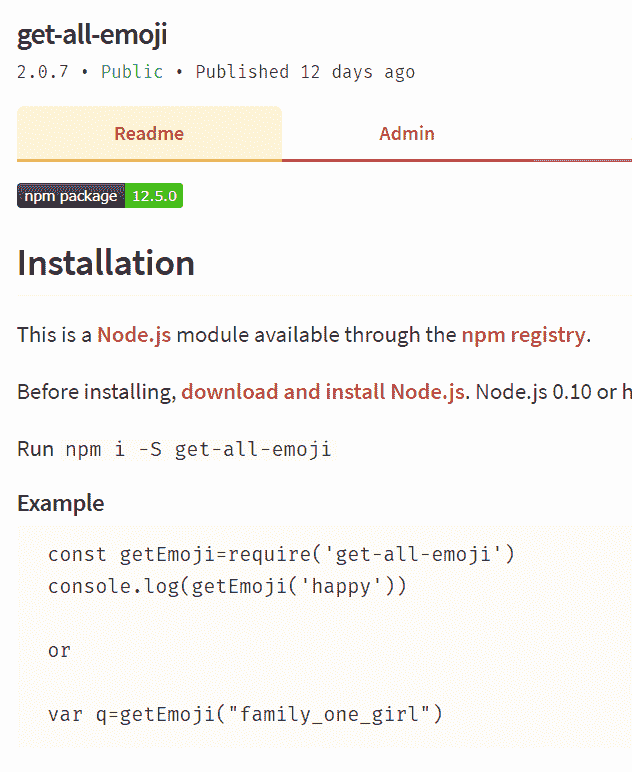
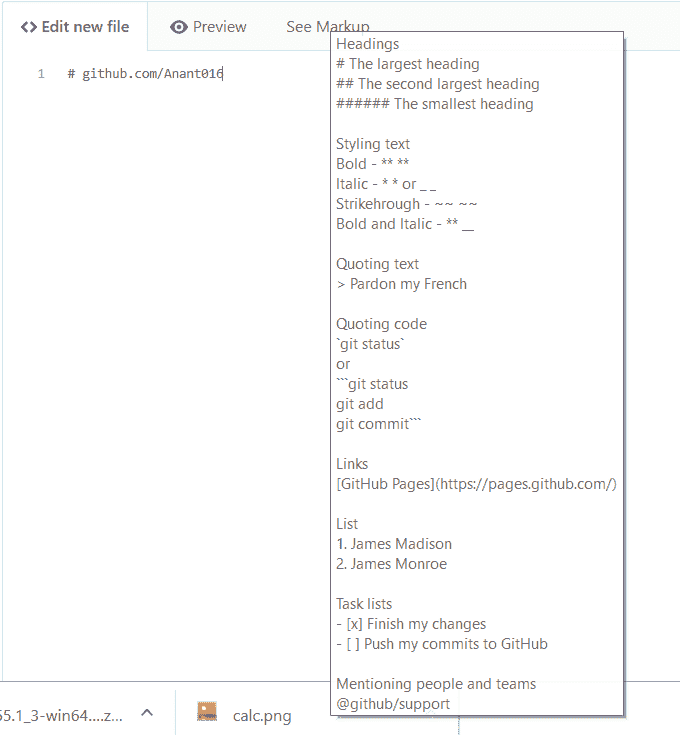
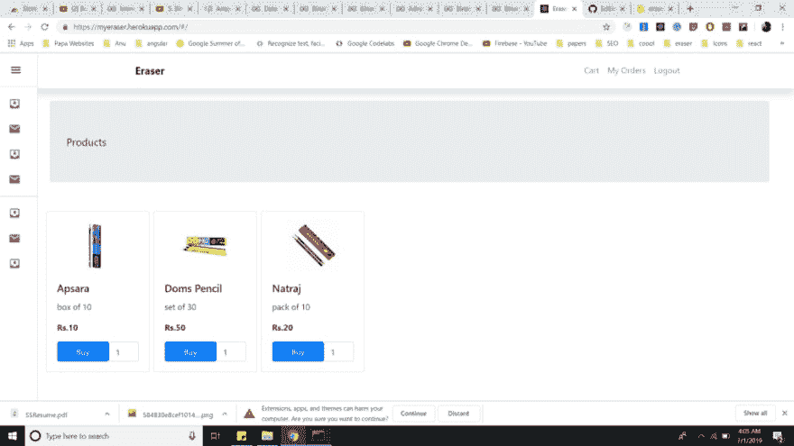
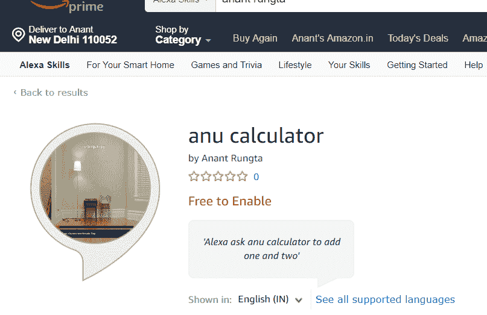

# 五大最酷的 Github 项目

> 原文：<https://dev.to/coolanant/top-5-cool-github-projects-1cda>

简而言之，给出的项目大多是关于相关的主题——***Alexa Skills、JavaScript、React、Redux、Firebase、GCP、Chrome 扩展。*T3】**

> 寻找开源酷项目？
> 
> 你来对地方了。:)

### 1。Npm 包——获取全部表情符号

*   ***下载***——【https://www.npmjs.com/package/get-all-emoji】
*   ***源代码***——【https://github.com/Anant016/get-all-emoji】

### 2。Github Readme Markdown — Chrome 扩展

*   ***可以从这里下载***——[https://chrome . Google . com/web store/detail/github-readme-markdown/paacehodnnonmhogoclomamladkpag？hl=en & authuser=0](https://chrome.google.com/webstore/detail/github-readme-markdown/paacehodnnofnmhogoclomamladkpabg?hl=en&authuser=0)
*   ***源代码***——【https://github.com/Anant016/Github-Readme-Chrome-Extension】

### 3。电子商务网站——使用 React、Redux、Firebase、GCP 制作

*   ***演示***——【https://myeraser.herokuapp.com】T4
*   ***源代码—***【https://github.com/Anant016/E-commerce-website-react】T4

### 4。针对初学者的 React 课程

*   ***演习文件***——【https://github.com/Anant016/React-for-beginners-course】
*   ***讲解*** 从头到尾—[https://medium . com/coolant 999/create-your-first-react-app-your-online-portfolio-and-deploying-3 BC 6 Fe 2701d 9？source=your_stories_page](https://medium.com/coolanant999/create-your-first-react-app-your-online-portfolio-and-deploying-3bc6fe2701d9)

### 5。Alexa 技能—带 APL

*   ***Demo***——[https://www . Amazon . in/Anant-Rungta-anu-calculator/DP/b 07t 8m 797j/ref = Sr _ 1 _ 1？关键词= anant+rungta&qid = 1562168235&s =数字技能& sr=1-1](https://www.amazon.in/Anant-Rungta-anu-calculator/dp/B07T8M797J/ref=sr_1_1?keywords=anant+rungta&qid=1562168235&s=digital-skills&sr=1-1)
*   给我发邮件要源代码。

*这是我出演过的前 5 个项目，* *出演你喜欢的—*

*寻找免费赠品—*【https://github.com/Anant016/Free-swags T2】

*传播和分享知识。如果这篇文章激起了你的兴趣，如果你是个善良的人，给这篇文章一个***的掌声吧。关注我的简介获取更多* ***开源素材*** *。**