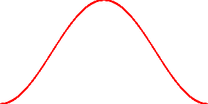
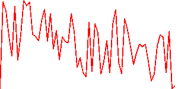
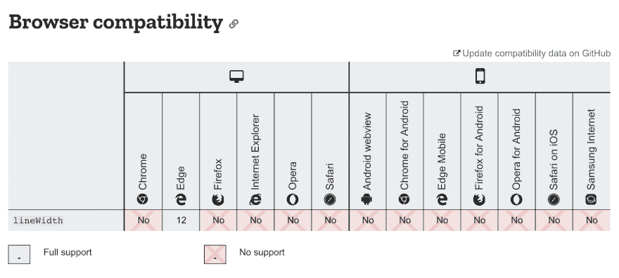
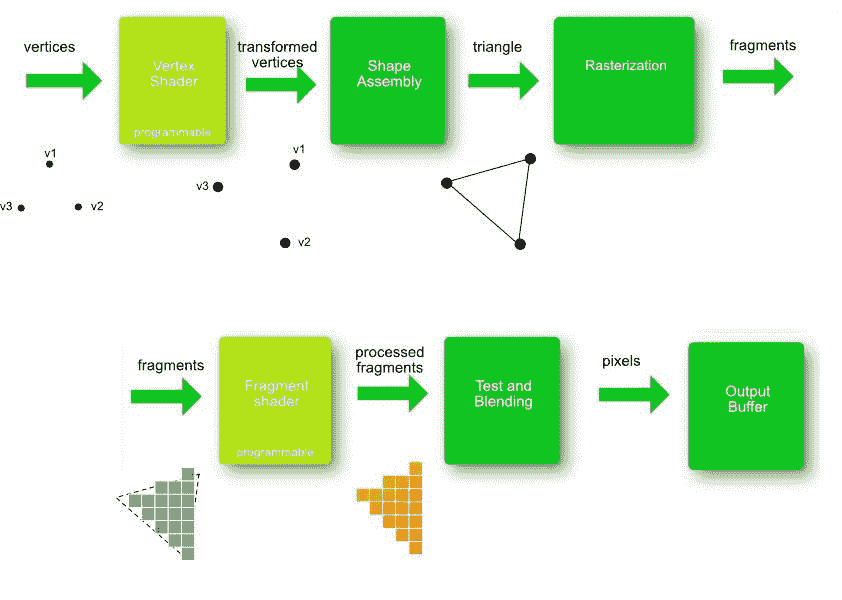

# 着色器制服、线条和三角形

> 原文：<https://dev.to/lesnitsky/webgl-month-day-3-shader-uniforms-lines-and-triangles-5dof>

## 第三天。着色器制服、线条和三角形

这是一系列与 WebGL 相关的博文。每天都会有新帖子

[](https://github.com/lesnitsky/webgl-month)
[T6】](https://twitter.com/lesnitsky_a)

[加入邮件列表](http://eepurl.com/gwiSeH),让新邮件直接进入你的收件箱

[此处提供源代码](https://github.com/lesnitsky/webgl-month)

建造于

[](https://github.com/lesnitsky/git-tutor)

* * *

昨天我们画出了单纯形本原可能点。先解决“作业”

我们需要删除硬编码的点数据

📄src/webgl-hello-world.js

```
 const positionPointer = gl.getAttribLocation(program, 'position');

- const positionData = new Float32Array([
-     -1.0, // top left x
-     -1.0, // top left y
- 
-     1.0, // point 2 x
-     1.0, // point 2 y
- 
-     -1.0, // point 3 x
-     1.0, // point 3 y
- 
-     1.0, // point 4 x
-     -1.0, // point 4 y
- ]); + const points = [];
+ const positionData = new Float32Array(points); 
  const positionBuffer = gl.createBuffer(gl.ARRAY_BUFFER); 
```

迭代画布的每一垂直像素行`[0..width]`

📄src/webgl-hello-world.js

```
 const positionPointer = gl.getAttribLocation(program, 'position');

  const points = [];
+ 
+ for (let i = 0; i < canvas.width; i++) {
+ 
+ }
+ 
  const positionData = new Float32Array(points);

  const positionBuffer = gl.createBuffer(gl.ARRAY_BUFFER); 
```

将值从`[0..width]`转换为`[-1..1]`(还记得 webgl 坐标网格吗？这是最左边和最右边的坐标)

📄src/webgl-hello-world.js

```
 const points = [];

  for (let i = 0; i < canvas.width; i++) {
- +     const x = i / canvas.width * 2 - 1;
  }

  const positionData = new Float32Array(points); 
```

计算`cos`并将 x 和 y 加到`points`数组中

📄src/webgl-hello-world.js

```
 for (let i = 0; i < canvas.width; i++) {
      const x = i / canvas.width * 2 - 1;
+     const y = Math.cos(x * Math.PI);
+ 
+     points.push(x, y);
  }

  const positionData = new Float32Array(points); 
```

图形看起来有点奇怪，让我们修复我们的顶点着色器

📄src/webgl-hello-world.js

```
 attribute vec2 position;

  void main() {
-     gl_PointSize = 20.0;
-     gl_Position = vec4(position / 2.0, 0, 1); +     gl_PointSize = 2.0;
+     gl_Position = vec4(position, 0, 1);
  }
  `; 
```

尼利斯😎我们现在有花式 cos 图！

[](https://res.cloudinary.com/practicaldev/image/fetch/s--y96I15MU--/c_limit%2Cf_auto%2Cfl_progressive%2Cq_auto%2Cw_880/https://git-tutor-assets.s3.eu-west-2.amazonaws.com/cos-graph.png)

我们用 javascript 计算了`cos`，但是如果我们需要为大型数据集计算一些东西，JavaScript 可能会阻塞渲染线程。为什么不会促进 GPU 的计算能力(并行计算每个点的 cos)。

GLSL 没有`Math`名称空间，所以我们需要定义`M_PI`变量
`cos`函数😏

📄src/webgl-hello-world.js

```
 const vShaderSource = `
  attribute vec2 position;

+ #define M_PI 3.1415926535897932384626433832795
+ 
  void main() {
      gl_PointSize = 2.0;
-     gl_Position = vec4(position, 0, 1); +     gl_Position = vec4(position.x, cos(position.y * M_PI), 0, 1);
  }
  `;

  for (let i = 0; i < canvas.width; i++) {
      const x = i / canvas.width * 2 - 1;
-     const y = Math.cos(x * Math.PI);
- 
-     points.push(x, y); +     points.push(x, x);
  }

  const positionData = new Float32Array(points); 
```

我们在 cycle 中有另一个 JavaScript 计算，我们将像素坐标转换为范围，如何将它转移到 GPU 呢？
我们已经知道我们可以用`attribute`传递一些数据给着色器，但是`width`是常数，它不会在点之间改变。

有一种特殊的变量——`uniforms`。将 uniform 视为一个全局变量，该变量在 draw 调用之前只能赋值一次，并且对所有“点”保持不变

让我们定义一个`uniform`

📄src/webgl-hello-world.js

```
 const vShaderSource = `
  attribute vec2 position;
+ uniform float width; 
  #define M_PI 3.1415926535897932384626433832795 
```

要给制服赋值，我们需要做 smth，类似于我们对 attribute 所做的。我们需要找到制服的位置。

📄src/webgl-hello-world.js

```
 gl.useProgram(program);

  const positionPointer = gl.getAttribLocation(program, 'position');
+ const widthUniformLocation = gl.getUniformLocation(program, 'width'); 
  const points = []; 
```

有很多方法可以给制服分配不同类型的值

*   `gl.uniform1f`–给彩车制服分配一个号码(`gl.uniform1f(0.0)`)
*   `gl.uniform1fv`–将长度为 1 的数组分配给浮点制服(`gl.uniform1fv([0.0])`)
*   `gl.uniform2f` -分配两个数字给一个 vec2 制服(`gl.uniform2f(0.0, 1.0)`)
*   `gl.uniform2f` -将一个长度为 2 的数组分配给一个 vec2 制服(`gl.uniform2fv([0.0, 1.0])`)

等等

📄src/webgl-hello-world.js

```
 const positionPointer = gl.getAttribLocation(program, 'position');
  const widthUniformLocation = gl.getUniformLocation(program, 'width');

+ gl.uniform1f(widthUniformLocation, canvas.width);
+ 
  const points = [];

  for (let i = 0; i < canvas.width; i++) { 
```

最后，让我们将 js 计算转移到一个着色器中

📄src/webgl-hello-world.js

```
 #define M_PI 3.1415926535897932384626433832795

  void main() {
+     float x = position.x / width * 2.0 - 1.0;
      gl_PointSize = 2.0;
-     gl_Position = vec4(position.x, cos(position.y * M_PI), 0, 1); +     gl_Position = vec4(x, cos(x * M_PI), 0, 1);
  }
  `;

  const points = [];

  for (let i = 0; i < canvas.width; i++) {
-     const x = i / canvas.width * 2 - 1;
-     points.push(x, x); +     points.push(i, i);
  }

  const positionData = new Float32Array(points); 
```

### 渲染线条

现在让我们尝试渲染线条

我们需要用线的起点和终点坐标来填充我们的位置数据

📄src/webgl-hello-world.js

```
 gl.uniform1f(widthUniformLocation, canvas.width);

- const points = [];
+ const lines = [];
+ let prevLineY = 0; 
- for (let i = 0; i < canvas.width; i++) {
-     points.push(i, i); + for (let i = 0; i < canvas.width - 5; i += 5) {
+     lines.push(i, prevLineY);
+     const y =  Math.random() * canvas.height;
+     lines.push(i + 5, y);
+ 
+     prevLineY = y;
  }

- const positionData = new Float32Array(points);
+ const positionData = new Float32Array(lines); 
  const positionBuffer = gl.createBuffer(gl.ARRAY_BUFFER); 
```

我们还需要将`y`转换成 WebGL 剪辑空间，所以让我们传递画布的分辨率，而不仅仅是宽度

📄src/webgl-hello-world.js

```
 const vShaderSource = `
  attribute vec2 position;
- uniform float width; + uniform vec2 resolution; 
  #define M_PI 3.1415926535897932384626433832795

  void main() {
-     float x = position.x / width * 2.0 - 1.0; +     vec2 transformedPosition = position / resolution * 2.0 - 1.0;
      gl_PointSize = 2.0;
-     gl_Position = vec4(x, cos(x * M_PI), 0, 1); +     gl_Position = vec4(transformedPosition, 0, 1);
  }
  `;

  gl.useProgram(program);

  const positionPointer = gl.getAttribLocation(program, 'position');
- const widthUniformLocation = gl.getUniformLocation(program, 'width'); + const resolutionUniformLocation = gl.getUniformLocation(program, 'resolution'); 
- gl.uniform1f(widthUniformLocation, canvas.width);
+ gl.uniform2fv(resolutionUniformLocation, [canvas.width, canvas.height]); 
  const lines = [];
  let prevLineY = 0; 
```

最后一件事——我们需要将原始类型改为`gl.LINES`

📄src/webgl-hello-world.js

```
 gl.enableVertexAttribArray(positionPointer);
  gl.vertexAttribPointer(positionPointer, attributeSize, type, nomralized, stride, offset);

- gl.drawArrays(gl.POINTS, 0, positionData.length / 2);
+ gl.drawArrays(gl.LINES, 0, positionData.length / 2); 
```

酷！我们现在可以渲染线条了👍

[](https://res.cloudinary.com/practicaldev/image/fetch/s--NmkDUrj---/c_limit%2Cf_auto%2Cfl_progressive%2Cq_auto%2Cw_880/https://git-tutor-assets.s3.eu-west-2.amazonaws.com/line-graph.png)

让我们试着把线弄粗一点

与磅值不同，线宽应该从 javascript 设置。有一种方法`gl.lineWidth(width)`

让我们试着使用它

📄src/webgl-hello-world.js

```
 gl.bindBuffer(gl.ARRAY_BUFFER, positionBuffer);
  gl.bufferData(gl.ARRAY_BUFFER, positionData, gl.STATIC_DRAW);
+ gl.lineWidth(10); 
  const attributeSize = 2;
  const type = gl.FLOAT; 
```

什么都没变😢但是为什么呢？？

这就是为什么😂

[](https://res.cloudinary.com/practicaldev/image/fetch/s--aF7GfaoX--/c_limit%2Cf_auto%2Cfl_progressive%2Cq_auto%2Cw_880/https://git-tutor-assets.s3.eu-west-2.amazonaws.com/line-width-support.png)

没人在乎。

因此，如果你需要一个带定制线帽的花式线—`gl.LINES`不适合你

但是我们如何渲染花式线呢？

结果是——一切都可以在下一个 WebGL 图元的帮助下进行渲染——三角形。这是可以用 WebGL 渲染的最后一个图元

从三角形构建一条定制宽度的线可能看起来是一项艰巨的任务，但是不要担心，有很多包可以帮助你渲染定制的 2d 形状(甚至 svg)

其中一些工具:

*   SVG 路径轮廓
*   [cdt2d](https://www.npmjs.com/package/cdt2d)
*   [自适应贝塞尔曲线](https://www.npmjs.com/package/adaptive-bezier-curve)

以及其他等等

从现在开始，记住:一切都可以用三角形来构建，这就是渲染的工作原理

1.  输入–三角形顶点
2.  顶点着色器–将顶点转换到 webgl 剪辑空间
3.  光栅化–计算哪些像素在某个三角形内
4.  计算每个像素的颜色

以下是来自[https://opentechschool-Brussels . github . io/intro-to-webGL-and-shaders/log1 _ graphic-pipeline](https://opentechschool-brussels.github.io/intro-to-webGL-and-shaders/log1_graphic-pipeline)的该过程的图示

[](https://res.cloudinary.com/practicaldev/image/fetch/s--OWO-XIWc--/c_limit%2Cf_auto%2Cfl_progressive%2Cq_auto%2Cw_880/https://opentechschool-brussels.github.io/intro-to-webGL-and-shaders/assets/log1_graphicPipeline.jpg)

> 披露者:这是引擎盖下发生的事情的简化版本，[阅读这个](https://www.khronos.org/opengl/wiki/Rendering_Pipeline_Overview)以获得更详细的解释

所以让我们最后渲染一个三角形

同样，我们需要更新我们的头寸数据

并更改原始类型

📄src/webgl-hello-world.js

```
 gl.uniform2fv(resolutionUniformLocation, [canvas.width, canvas.height]);

- const lines = [];
- let prevLineY = 0; + const triangles = [
+     0, 0, // v1 (x, y)
+     canvas.width / 2, canvas.height, // v2 (x, y)
+     canvas.width, 0, // v3 (x, y)
+ ]; 
- for (let i = 0; i < canvas.width - 5; i += 5) {
-     lines.push(i, prevLineY);
-     const y =  Math.random() * canvas.height;
-     lines.push(i + 5, y);
- 
-     prevLineY = y;
- }
- 
- const positionData = new Float32Array(lines); + const positionData = new Float32Array(triangles); 
  const positionBuffer = gl.createBuffer(gl.ARRAY_BUFFER);

  gl.enableVertexAttribArray(positionPointer);
  gl.vertexAttribPointer(positionPointer, attributeSize, type, nomralized, stride, offset);

- gl.drawArrays(gl.LINES, 0, positionData.length / 2);
+ gl.drawArrays(gl.TRIANGLES, 0, positionData.length / 2); 
```

还有一件事...让我们从 javascript 传递一个颜色，而不是在片段着色器中硬编码它。

我们将需要经历与分辨率一致相同的步骤，但是在片段着色器中声明该一致

📄src/webgl-hello-world.js

```
 `;

  const fShaderSource = `
+     uniform vec4 color;
+ 
      void main() {
-         gl_FragColor = vec4(1, 0, 0, 1); +         gl_FragColor = color / 255.0;
      }
  `;

  const positionPointer = gl.getAttribLocation(program, 'position');
  const resolutionUniformLocation = gl.getUniformLocation(program, 'resolution');
+ const colorUniformLocation = gl.getUniformLocation(program, 'color'); 
  gl.uniform2fv(resolutionUniformLocation, [canvas.width, canvas.height]);
+ gl.uniform4fv(colorUniformLocation, [255, 0, 0, 255]); 
  const triangles = [
      0, 0, // v1 (x, y) 
```

等等，什么？一个错误🛑😱

```
No precision specified for (float) 
```

那是什么？

事实证明，glsl 着色器支持不同的浮点精度，您需要指定它。
通常`mediump`既有表现力又精确，但有时你可能想用`lowp`或`highp`。但是要小心，`highp`不被一些移动 GPU 支持，也不能保证你不会得到任何高精度的怪异渲染

📄src/webgl-hello-world.js

```
 `;

  const fShaderSource = `
+     precision mediump float;
      uniform vec4 color;

      void main() { 
```

### 作业

使用三角形渲染不同的形状:

*   矩形
*   六边形
*   圆

明天见👋

* * *

[](https://github.com/lesnitsky/webgl-month)
[T6】](https://twitter.com/lesnitsky_a)

[加入邮件列表](http://eepurl.com/gwiSeH),让新邮件直接进入你的收件箱

[此处提供源代码](https://github.com/lesnitsky/webgl-month)

建造于

[](https://github.com/lesnitsky/git-tutor)