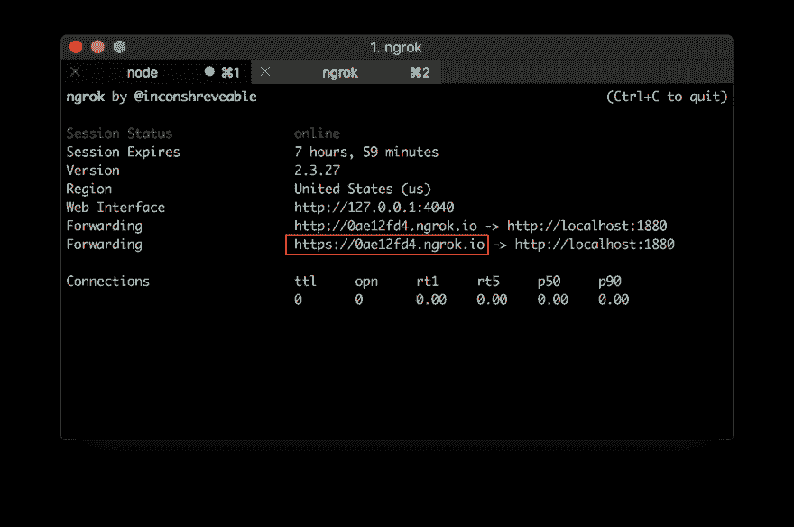
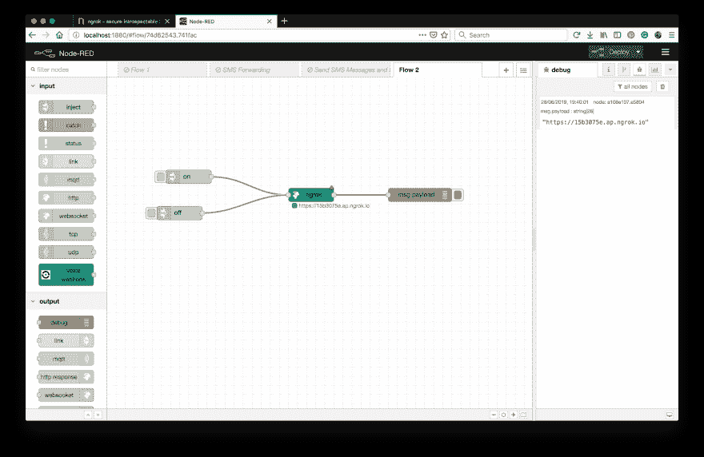
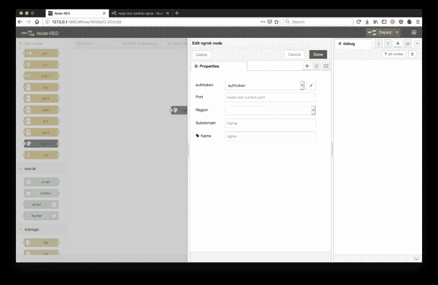
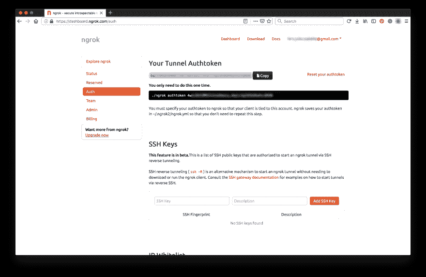
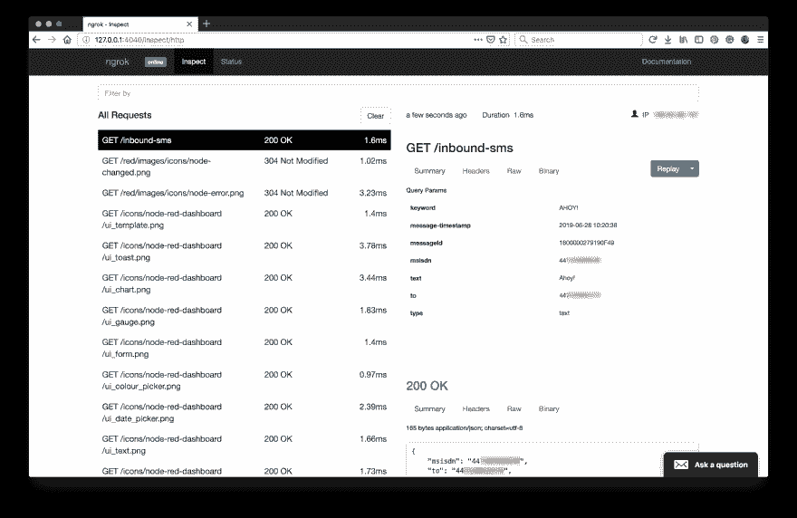
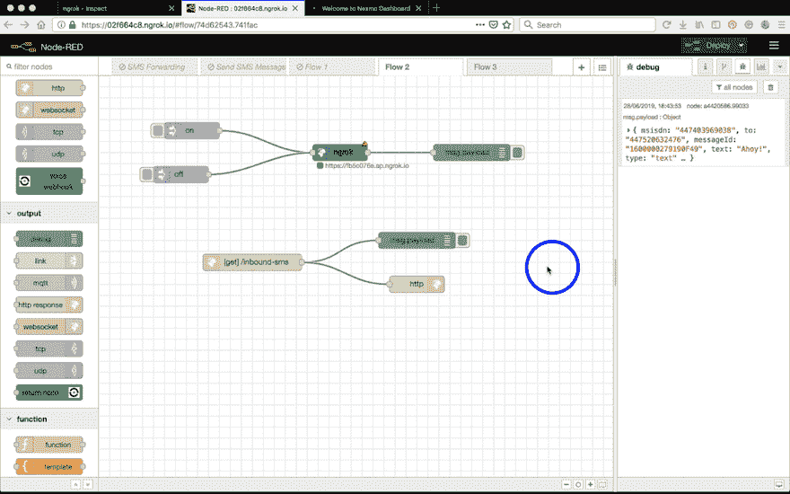

# Node-RED 中的 Ngrok 入门

> 原文：<https://dev.to/vonagedev/getting-started-with-ngrok-in-node-red-4cn7>

如果您已经涉足了 Nexmo APIs 的世界，那么您可能已经遇到了 webhooks。太好了！它们是一种获得事件通知的完美方式，如收到短信、送货收据和各种语音通话事件。不过，有个问题。在构建 webhook 消费者时，您需要一个可公开访问的 URL 来配置 API 服务。如果不把你的服务器暴露在互联网上，就没有办法在你的网络钩子上接收信息。如果您在 localhost 上开发，这就是 [Ngrok](https://ngrok.com/) 发挥作用的地方。

## 什么是 Ngrok，你为什么会用它？

ngrok 是一个跨平台的应用程序，它通过安全隧道将您的本地服务器暴露给一个唯一的 *ngrok.io* 子域。默认情况下，它会创建 HTTP 和 HTTPS 端点，这对于测试与需要有效 SSL/TLS 域的第三方服务或 API 的集成非常有用。

另一种选择是将您的代码部署到远程服务器。尽管使用这些服务越来越容易，但通常需要一些成本和时间。此外，调试时每隔几分钟就重新部署代码可能会有点令人沮丧。

一旦你在本地机器上安装了 ngrok，在你的终端中只需要一个命令就可以将你的本地服务器暴露给互联网。阅读 [Aaron 的博客文章](https://www.nexmo.com/blog/2017/07/04/local-development-nexmo-ngrok-tunnel-dr/)了解更多关于这个选项的信息。

如果您不想离开您的节点红色编辑器，您可以使用 [**`ngrok`** 节点](https://flows.nodered.org/node/node-red-contrib-ngrok)来实现相同的功能。

在您指定 Node-RED 监听的端口(通常是 1880)之后，ngrok 客户端启动到 ngrok 服务器的安全连接，然后任何人都可以通过 ngrok 隧道地址向您的本地服务器发出请求。

* * *

**安全问题**

通过运行该节点，您将向公共互联网公开您的 Node-RED 安装，因此强烈建议您[在编辑器上设置管理员密码](https://nodered.org/docs/security)。

* * *

## 在 Node-RED 中设置 Ngrok

### 安装`node-red-contrib-ngrok`包

首先，您需要安装 ngrok 节点。为此，在你的 Node-RED 编辑器的 hamburger 菜单中打开*管理调色板*，搜索`node-red-contrib-ngrok`包并点击 install。重启编辑器后， **`ngrok`** 节点应该出现在节点面板中。

### 配置 Ngrok

`ngrok`节点将上的字符串**或**上的字符串**作为启动/停止隧道的输入，并将 ngrok 主机地址作为 msg.payload 输出**

最简单的设置方法是连接两个`inject`节点作为`ngrok`节点的输入，一个将字符串的有效负载**连接到**上，另一个将**关闭**。为了更容易使用，您还可以在节点属性中相应地设置这些节点的`Name`，这样就可以清楚它们有什么功能。

接下来，为了在调试工具条中显示主机地址，在`ngrok`后连接一个`debug`节点。

作为点击**部署**前的最后一步，打开`ngrok`节点属性，指定端口号。在 Node-RED 的情况下，默认值为`1880`。默认的 ngrok 地区是美国，但是您也可以将其设置为欧洲或亚洲。如果您有 ngrok 帐户，也可以为其添加 authtoken。如果你不知道，不要担心，只是暂时跳过这一步。节点将警告它未完全配置，但这不是问题。

你都准备好了！点击 deploy 并点击 `inject`节点上的**按钮后，导航到调试区域显示的 URL，在公共地址找到您的节点红色编辑器。**

这个隧道将存在 8 个小时，你的编辑器现在可以在互联网上公开使用。8 小时后，你需要重新启动你的隧道，你将获得另一个随机生成的 ngrok 子域。

这也是快速分享本地演示或概念验证应用的好方法，但不要忘记，任何知道 URL 的人都可以修改你的流程。因此强烈建议[在编辑器上设置一个管理员密码](https://nodered.org/docs/security)。

### 额外步骤

尽管你的 ngrok 隧道已经建立并运行，而且到目前为止你所做的一切都不需要你有一个 ngrok 帐户，但是仍然值得[创建一个](https://dashboard.ngrok.com/get-started)。

如果您选择注册一个免费帐户，那么您可以通过提供您的`authtoken`在`ngrok`节点中使用 ngrok 进行认证，并且您的隧道将不再限于 8 小时。子域名仍将随机生成，但保持不变。从 https://dashboard.ngrok.com/auth 的[中获取你的`authtoken`，并将其粘贴到你的`ngrok`节点属性中。](https://dashboard.ngrok.com/auth)

该软件包带有 1 个在线 ngrok 进程、4 个隧道/ngrok 进程和 40 个连接/分钟。对于快速演示和简单的隧道需求来说，这是一个很好的解决方案。

如果你正在寻找更多的功能，包括自定义子域、保留主机名、IP 白名单、增加进程/隧道/连接数量等，你也可以查看他们的付费[订阅计划](https://dashboard.ngrok.com/billing/plan)。

## 有用的 Ngrok 特性

### 仪表盘

这个 web 界面在您的机器上本地运行，通常在[端口 4040](http://127.0.0.1:4040/) 上，提供了对您的隧道的有价值的洞察。您可以轻松地检查您的隧道的状态、通过它发出的请求的详细信息以及收到的响应，包括所有标题内容。确保你仔细查看了 *inspect* 选项卡下的所有内容，因为这在调试 API 交互时非常有价值。

### 重放请求

仪表板最棒的部分是什么？您可以**重放**请求，或者通过修改重放它们**。例如，如果您有一个从 Nexmo SMS API 捕获入站消息的流，而不是必须发送另一个 SMS 来触发 webhook，那么您可以简单地重放最后一个入站 SMS 请求。那就是厉害！**

## 下一步去哪里？

在本教程中，您已经学习了如何使用 Node-RED 的能力将您的本地服务器暴露给互联网。想看看实际情况吗？选择一个我们的节点红色教程并继续！

如果你已经完成了这一步，那么你已经有了一个运行中的隧道，所以请随意跳过*将你的本地服务器暴露给互联网*部分。

*   [如何使用 Node-RED 进行文本语音通话](https://dev.to/nexmo/how-to-make-text-to-speech-phone-calls-with-node-red-2nfj)
*   [如何用 Node-RED 接听电话](https://dev.to/nexmo/how-to-receive-phone-calls-with-node-red-3ihc)
*   [如何用 Node-RED 发送短信](https://dev.to/nexmo/how-to-send-sms-messages-with-node-red-2l2o)
*   [如何用 Node-RED 接收短信](https://dev.to/nexmo/how-to-receive-sms-messages-with-node-red-55ll)

### 更多关于 Ngrok

*   [工作原理](https://ngrok.com/product)
*   [文档](https://ngrok.com/docs)