# 🤯超列表:一个列表来统治他们所有人。19 年 6 月

> 原文：<https://dev.to/xenoxdev/ultra-list-one-list-to-rule-them-all-june-19-31b8>

好吧好吧好吧！我知道，这次参加派对有点晚了。但迟做总比不做好，嗯？😏这一个月真是难熬。发生了这么多事情，我发现了这么多很酷的开源项目。这让我充满了喜悦，因为我热衷于保持自由互联网的精神。事实上，XenoX 团队本月推出了另一款开源产品。在最后一部分检查一下。等到你来到**图书馆**展区，你会爱上它的。这是迄今为止 Ultra 列表中最大的一个！

不浪费任何时间，让我们开始吧！

### 赠品🎁

像每个月一样，我们先从免费赠品开始。享受吧，别忘了感谢制作者！他们在这些事情上投入了大量的工作，所以我们至少可以认可他们的努力。💖

#### *Fonts*

这次我给你买了一些很有个性的时尚字体。看看他们。

**1。万达尼创意的 Sallim 签名**👉🏼[链接](https://www.dafont.com/sallim-signature.font)

[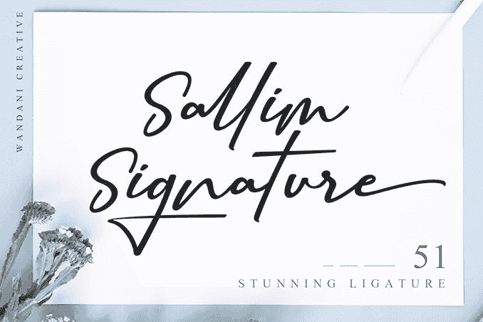](https://res.cloudinary.com/practicaldev/image/fetch/s--z8Dfg4jc--/c_limit%2Cf_auto%2Cfl_progressive%2Cq_auto%2Cw_880/https://thepracticaldev.s3.amazonaws.com/i/h22putlgthp1af1qapb8.png)

**2。国家公园**由室外设计👉🏼[链接](https://nationalparktypeface.com)

[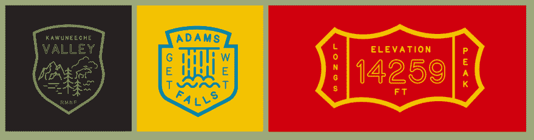](https://res.cloudinary.com/practicaldev/image/fetch/s--rzp3vqGB--/c_limit%2Cf_auto%2Cfl_progressive%2Cq_auto%2Cw_880/https://thepracticaldev.s3.amazonaws.com/i/ihqpk03emrxu1rwnj7a2.png)

**3。无咖啡因请字体**由 Reg 席尔瓦艺术商店👉🏼[链接](https://creativemarket.com/wedgienet/3829570-Decaf-Please-Font)

[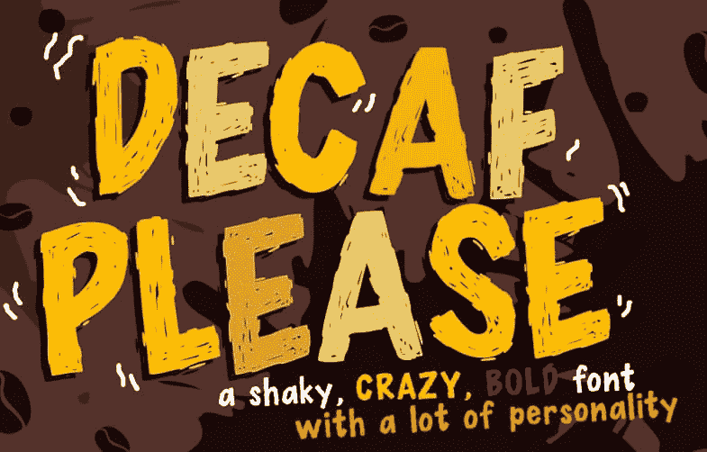](https://res.cloudinary.com/practicaldev/image/fetch/s--p4vaw_l---/c_limit%2Cf_auto%2Cfl_progressive%2Cq_auto%2Cw_880/https://thepracticaldev.s3.amazonaws.com/i/jblyjga5ieh2i6wdw1m3.png)

**4。Atipo Foundry 生产的 Basier Mono** 👉🏼[链接](http://atipofoundry.com/fonts/basier-mono)

* * *

#### *图标*

你也是图标收藏者吗？那么这里有一些很酷的给你！

**1。由 Freepik 制作的书呆子免费平面图标**👉🏼[链接](https://pixelbuddha.net/freebie/nerd-free-flat-icons)

[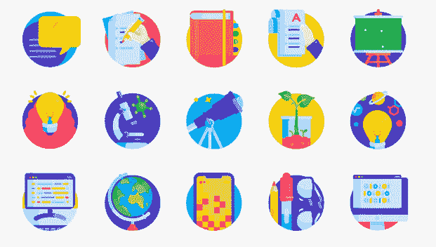](https://res.cloudinary.com/practicaldev/image/fetch/s--kSUwGlJk--/c_limit%2Cf_auto%2Cfl_progressive%2Cq_auto%2Cw_880/https://thepracticaldev.s3.amazonaws.com/i/qjvp99r6kt0ul4hc33we.png)

**2。图标俱乐部-免费图标应用**👉🏼[链接](https://shapedfonts.com/iconclub/)

[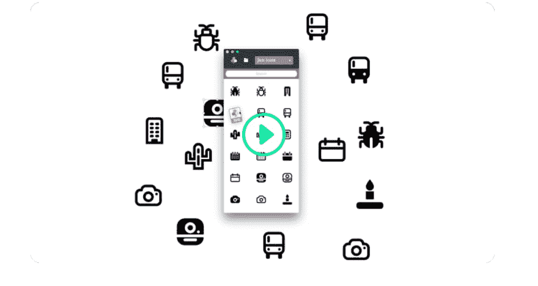](https://res.cloudinary.com/practicaldev/image/fetch/s--4uCb8mVh--/c_limit%2Cf_auto%2Cfl_progressive%2Cq_auto%2Cw_880/https://thepracticaldev.s3.amazonaws.com/i/1azxbvmsuhacuwu8ffso.png)

* * *

#### *产品*

以下是我这个月发现的一些最好的产品。这里有适合每个人的东西。

**1。CSS 网格生成器** 🧮生成基本的 CSS 网格代码来制作动态布局！👉🏼[链接](https://cssgrid-generator.netlify.com)

[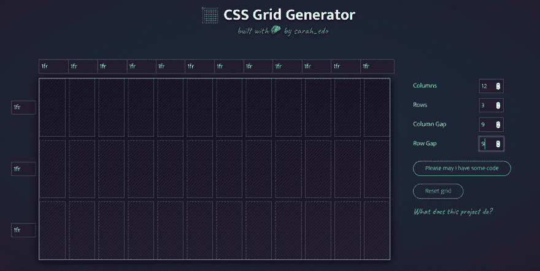](https://res.cloudinary.com/practicaldev/image/fetch/s--2D5cs2mq--/c_limit%2Cf_auto%2Cfl_progressive%2Cq_auto%2Cw_880/https://thepracticaldev.s3.amazonaws.com/i/aw5z10xnler63lmk242k.png)

**2 .lorem picsum**the lorem ipsum for photos .👉🏼[链接](https://picsum.photos/)

[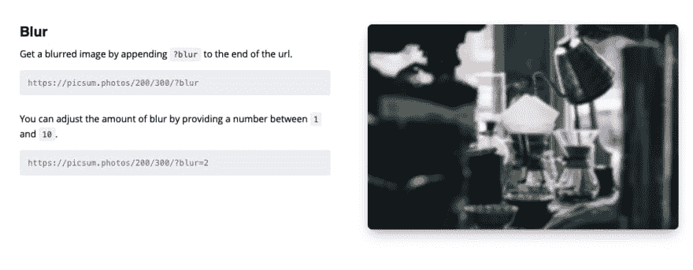](https://res.cloudinary.com/practicaldev/image/fetch/s--hferNmQK--/c_limit%2Cf_auto%2Cfl_progressive%2Cq_auto%2Cw_880/https://thepracticaldev.s3.amazonaws.com/i/5gv3fu6f1aupx2vkusy5.png)

**3。Pika**Pika CDN 旨在为 60，000 多个以 es 模块(ESM)语法编写的 npm 包提供服务。👉🏼[链接](https://www.pika.dev/cdn)

[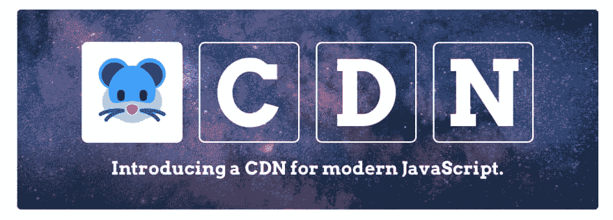](https://res.cloudinary.com/practicaldev/image/fetch/s--Q9moXk_g--/c_limit%2Cf_auto%2Cfl_progressive%2Cq_auto%2Cw_880/https://thepracticaldev.s3.amazonaws.com/i/vbu6x6uh9jkmyfqakim7.png)

**4。404 插图**新潮，随时可以为你的 404 页面使用图片👉🏼[链接](https://www.kapwing.com/404-illustrations)

[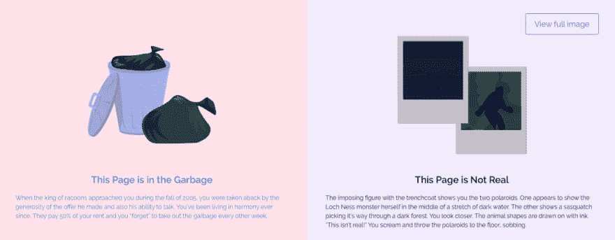](https://res.cloudinary.com/practicaldev/image/fetch/s--QqvhMzkW--/c_limit%2Cf_auto%2Cfl_progressive%2Cq_auto%2Cw_880/https://thepracticaldev.s3.amazonaws.com/i/f0cct6ornj5u5sjvxcsf.png)

**5。Screenzy** 美化你的截图👉🏼[链接](https://screenzy.io)

[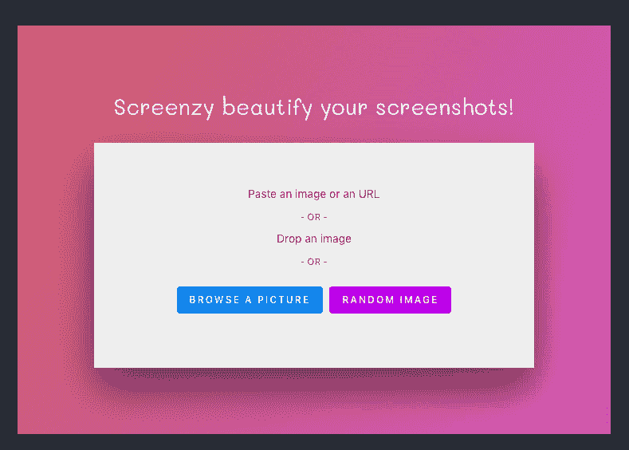](https://res.cloudinary.com/practicaldev/image/fetch/s--3jAZdzoX--/c_limit%2Cf_auto%2Cfl_progressive%2Cq_auto%2Cw_880/https://thepracticaldev.s3.amazonaws.com/i/lxoyiu567d14fyv5hv18.png)

* * *

#### *杂项*

**1。桀骜不驯的着陆页插图**由像素佛👉🏼[链接](https://pixelbuddha.net/freebie/unruly-landing-page-illustrations/)

**2。404 Awwwards 错误页面收集**👉🏼[链接](https://www.awwwards.com/awwwards/collections/404-error-page/)

**3。Nataly Birch 的免费静态 HTML 网站👉🏼[链接](https://designmodo.com/static-website-templates/)**

[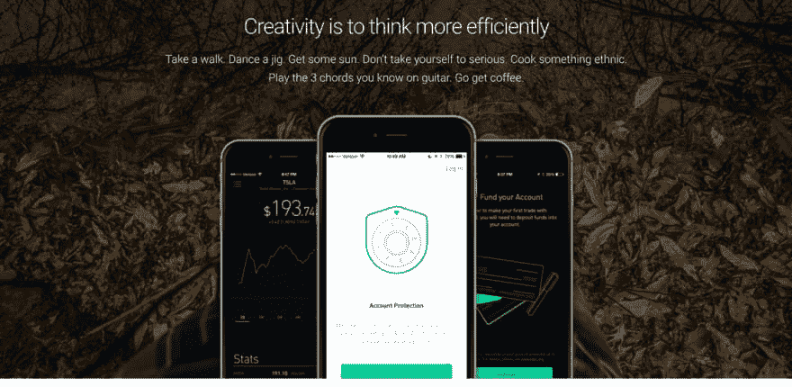](https://res.cloudinary.com/practicaldev/image/fetch/s--GzXER929--/c_limit%2Cf_auto%2Cfl_progressive%2Cq_auto%2Cw_880/https://thepracticaldev.s3.amazonaws.com/i/8h72062k32sl6plj4y00.png)

**4。28 个 CSS 选择框**👉🏼[链接](https://freefrontend.com/css-select-boxes/)

[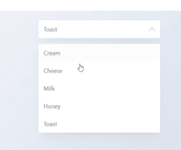](https://res.cloudinary.com/practicaldev/image/fetch/s--bNEBN49e--/c_limit%2Cf_auto%2Cfl_progressive%2Cq_auto%2Cw_880/https://thepracticaldev.s3.amazonaws.com/i/dpw4xtc8b9xzy7d04oj9.png)

* * *

### VS 代码素材👩🏻‍💻

是时候向您展示我最喜欢的 IDE VS 代码的一些引人注目的主题了。给你的工作站添加一些爵士乐，使用一个好的主题。

**1。维克托单声道编程字体**👉🏼[链接](https://rubjo.github.io/victor-mono/)

[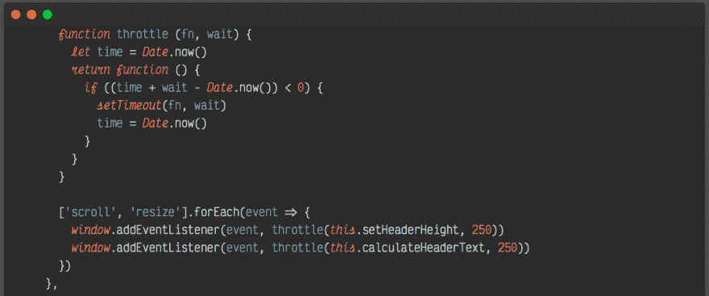](https://res.cloudinary.com/practicaldev/image/fetch/s--dnnbaQK9--/c_limit%2Cf_auto%2Cfl_progressive%2Cq_auto%2Cw_880/https://thepracticaldev.s3.amazonaws.com/i/qzuu4m62pnr319zf3149.png)

**2。夜狼**👉🏼[链接](https://marketplace.visualstudio.com/items?itemName=juanmnl.vscode-theme-1984)

[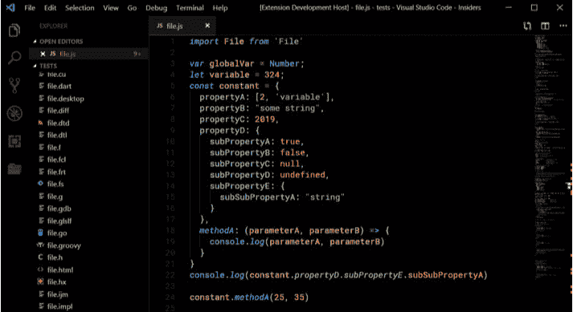](https://res.cloudinary.com/practicaldev/image/fetch/s--8kNmf4D0--/c_limit%2Cf_auto%2Cfl_progressive%2Cq_auto%2Cw_880/https://thepracticaldev.s3.amazonaws.com/i/9iy0lytufu3kwwz5xm9o.png)

**3。✨乐队的流行乐主题曲**👉🏼[链接](https://marketplace.visualstudio.com/items?itemName=Luxcium.pop-n-lock-theme-vscode)

* * *

### 图书馆🗃

**1。Embetty** Embetty 显示远程内容，如推文或 YouTube 视频，而不会损害您的隐私。👉🏼[链接](https://github.com/heiseonline/embetty)

[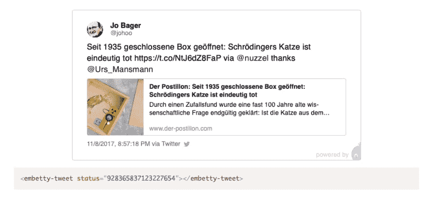](https://res.cloudinary.com/practicaldev/image/fetch/s--znSXrXLC--/c_limit%2Cf_auto%2Cfl_progressive%2Cq_auto%2Cw_880/https://thepracticaldev.s3.amazonaws.com/i/6hbdkffp884kb9v0auv5.png)

**2。PapaParse** 快速而强大的 CSV(分隔文本)解析器，可以优雅地处理大文件和格式错误的输入。👉🏼[链接](https://github.com/mholt/PapaParse)

[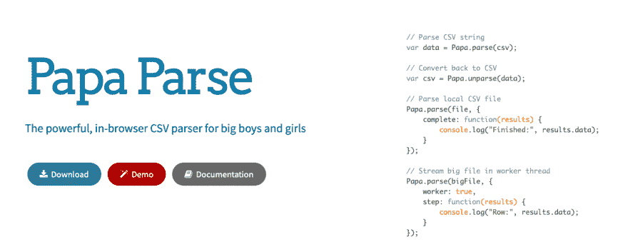](https://res.cloudinary.com/practicaldev/image/fetch/s--B6VfjOWV--/c_limit%2Cf_auto%2Cfl_progressive%2Cq_auto%2Cw_880/https://thepracticaldev.s3.amazonaws.com/i/ifitkv6231mrjttt1kqg.png)

**3。Cube.js** 📊Cube.js -开源分析框架👉🏼[链接](https://cube.dev)

[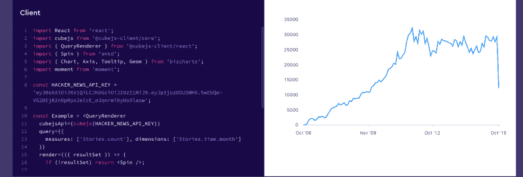](https://res.cloudinary.com/practicaldev/image/fetch/s--URSrpoDY--/c_limit%2Cf_auto%2Cfl_progressive%2Cq_auto%2Cw_880/https://thepracticaldev.s3.amazonaws.com/i/ksl0fx3e3f7a3c1k57tg.png)

**4。Spotlight** Web 上最容易集成的 lightbox 图库。超轻量级，卓越性能，无依赖性。👉🏼[链接](https://github.com/nextapps-de/spotlight)

[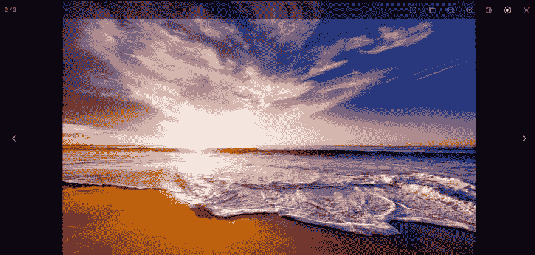](https://res.cloudinary.com/practicaldev/image/fetch/s--yV-2r3Jh--/c_limit%2Cf_auto%2Cfl_progressive%2Cq_auto%2Cw_880/https://thepracticaldev.s3.amazonaws.com/i/j0cvntdf6gfda2p3imql.png)

**5。自述 md 发生器**📄生成漂亮的 README.md 文件的 CLI👉🏼[链接](https://github.com/kefranabg/readme-md-generator)

[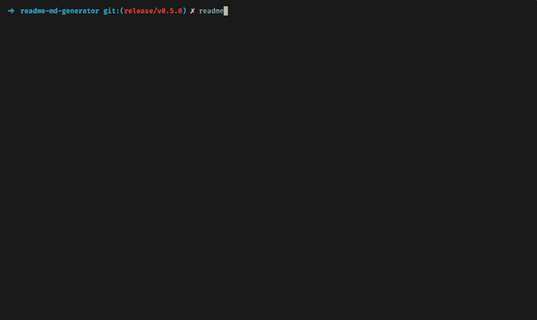](https://res.cloudinary.com/practicaldev/image/fetch/s--JGY8oAU2--/c_limit%2Cf_auto%2Cfl_progressive%2Cq_66%2Cw_880/https://user-images.githubusercontent.com/9840435/60266022-72a82400-98e7-11e9-9958-f9004c2f97e1.gif)

**6。Darkmode.js** 🌓在几秒钟内给你的网站添加一个黑暗模式/夜间模式👉🏼[链接](https://darkmodejs.learn.uno)

[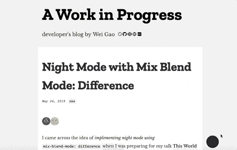](https://i.giphy.com/media/W4it0TNyWWjtAxLYth/giphy.gif)

7 .**。freeze frame . js**freeze frame . js 是一个暂停动画的库。gif 并使它们能够在鼠标悬停/鼠标点击/触摸事件时动画化，或者具有触发/释放功能。👉🏼[链接](https://github.com/ctrl-freaks/freezeframe.js/)

* * *

### 指南/备忘单📓

因为一切都不必如此艰难，不是吗？

**1。挖掘显示属性**👉🏼[链接](https://dassur.ma/things/when-workers/)

[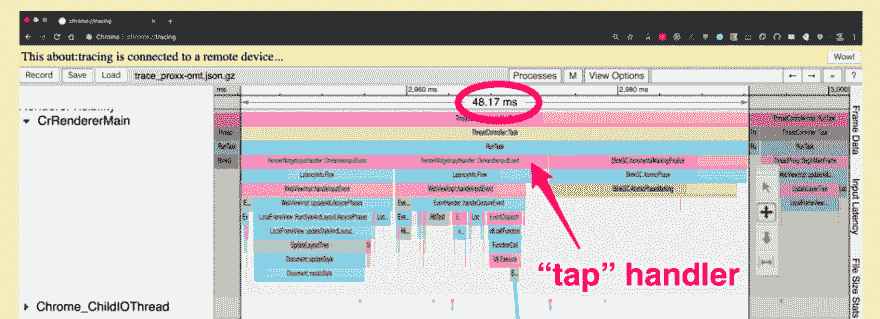](https://res.cloudinary.com/practicaldev/image/fetch/s--bRpD1Hle--/c_limit%2Cf_auto%2Cfl_progressive%2Cq_auto%2Cw_880/https://thepracticaldev.s3.amazonaws.com/i/ialjyoblykh375zdo5uk.png)

**2。您在 Lighthouse 的第一份绩效预算**👉🏼[链接](https://bitsofco.de/your-first-performance-budget-with-lighthouse/)

[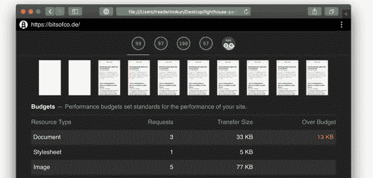](https://res.cloudinary.com/practicaldev/image/fetch/s--bTzQsykm--/c_limit%2Cf_auto%2Cfl_progressive%2Cq_auto%2Cw_880/https://thepracticaldev.s3.amazonaws.com/i/it2ec120817o4z277pgo.png)

### 摇滚音乐响起来🎧

好音乐可以极大地提升情绪。这当然有助于我保持活跃，所以让我与你分享一些。这是我当前的锻炼播放列表。

[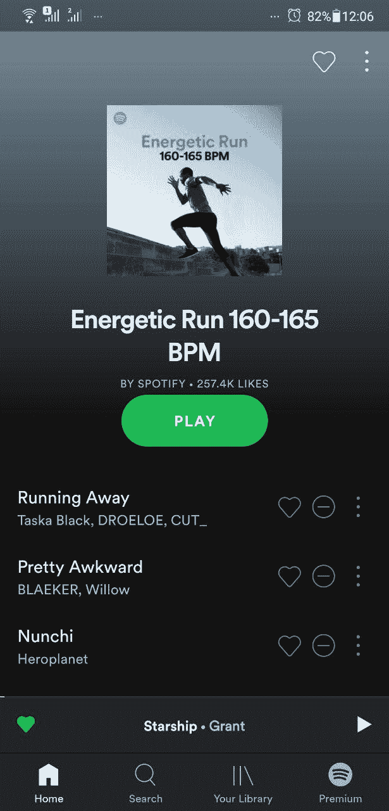](https://open.spotify.com/user/spotify/playlist/37i9dQZF1DWT6anPZiHuxz?si=K6Wj99jnTuG-Pys9zh7NLw)

### 来自 XenoX 团队🔥

**1。程序-** 这个月，我们为你最喜欢的照片建立了一个开源的、自托管的图库。我们想要 Instagram 般的美感和滤镜，但没有跟踪和社交媒体功能。所以我们做了一个程序。你可以用它向人们展示你生活的快照，最棒的是你可以在任何地方托管它！
如果你喜欢，就去叉它，让它成为你自己的！以下是我对未来的一些设想:

*   可变过滤强度
*   视频编辑
*   GIF 编辑(因为我们都爱 GIFS！)
*   故事
*   基本编辑选项，如亮度、锐化、饱和度等。

<figure>

[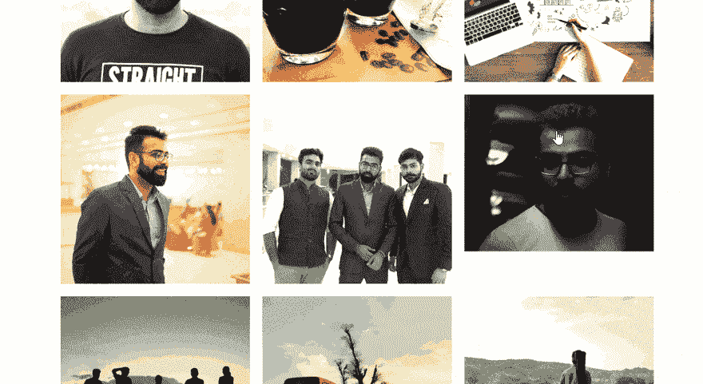](https://res.cloudinary.com/practicaldev/image/fetch/s--Z5GpFFeR--/c_limit%2Cf_auto%2Cfl_progressive%2Cq_66%2Cw_880/https://thepracticaldev.s3.amazonaws.com/i/t67zj25071u44uh8ljze.gif)

<figcaption>Check out Utkarsh's ProGram profile. Pretty cool, isn't it?</figcaption>

</figure>

我在另一篇文章中写了更多。

## 文章不再可用

前几天，ProGram 在 ProductHunt 上也表现不错。你可以在这里查看！

[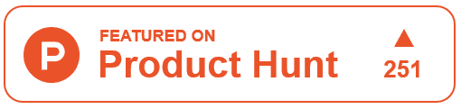](https://www.producthunt.com/posts/program)

**2。XenoX 多元宇宙-** 是时候让事情更上一层楼了。从今天开始，这将是 XenoX 的全部内容。XenoX 中所有合作的项目和开发人员都将在这里列出。要加入我们，你需要做的就是:

*   叉回购。
*   将您的名字添加到自述文件中。
*   生成拉取请求。

##  [【团队异种】](https://github.com/teamxenox) / [异种多篇](https://github.com/teamxenox/XenoXMultiverse)

### 🔥🚀XenoX 集合！！

<article class="markdown-body entry-content container-lg" itemprop="text">

[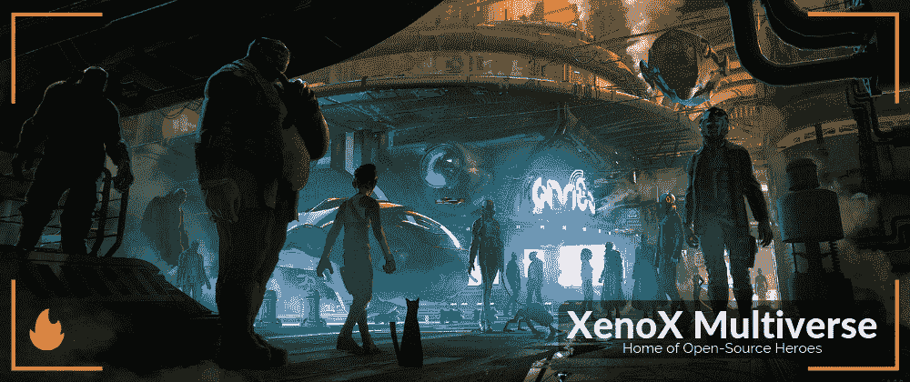](https://camo.githubusercontent.com/4a339cf0ab8e6df5b11d356b973993b9c2e5e9d5e54e1359f3c90ed944a1df9f/68747470733a2f2f692e696d6775722e636f6d2f6f576b534b576f2e706e67)

# XenoX 多元宇宙

随着 XenoX 多元宇宙的开始，我们正在使事情正式化。XenoX 团队最初是我的梦想，只是一个开发人员的小团队，为了好玩而从事开源项目。但几个月来，它变得越来越大，越来越强。因此，我想正式宣布团队 XenoX 开源计划。这是 XenoX 上所有项目和所有合作开发人员的主列表。

如果你也想成为开源英雄，只需写下你的名字，你就可以加入并开始贡献自己的力量！

## 如何加入团队？💪🏼

1.  叉回购。
2.  把你的名字加到这个文件上。
3.  提交拉取请求。

就是这样。你都准备好了。团队中会有人联系你，正式欢迎你加入团队。干杯！

## 接缝

*   萨尔萨克·夏尔马 <g-emoji class="g-emoji" alias="fire" fallback-src="https://github.githubassets.cimg/icons/emoji/unicode/1f525.png">🔥</g-emoji>
*   [乌特卡什塔尔瓦尔](https://github.com/sarthology)🎸
*   [拉杰特·夏尔马](https://github.com/sharmarajat01) <g-emoji class="g-emoji" alias="headphones" fallback-src="https://github.githubassets.cimg/icons/emoji/unicode/1f3a7.png">🎧</g-emoji>
*   [rajesh main Ali](https://github.com/Stereoraj)
*   帕万 …

</article>

[View on GitHub](https://github.com/teamxenox/XenoXMultiverse)

如果你喜欢我们的工作，就加入我们的团队，和我们一起改变世界，每天一点一滴。让我们释放开源开发的力量。💪XenoX 团队总是为想要做好事的开发人员敞开大门，无论是新手还是老手。如果你自己有一些很棒的开源项目想法，想要合作，只要把你的名字加到列表中。👆

## 感谢

好了，这次到此为止，伙计们。希望你喜欢这个。下期帖子再见！如果你喜欢这篇文章，把它分享给你的朋友和家人，他们会从中受益。如果你想在下一篇文章中加入一些你自己的东西，请在 Twitter 上发消息给我。或者有什么建议，欢迎在下面评论。

再见！

