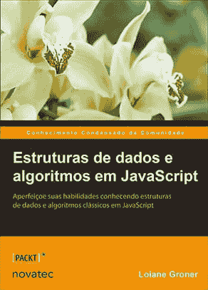

# Trabalho remoto no 外部#2 -代码挑战

> [https://dev . to/luckilante/remote work-non-exterior-2 code-challenges-4m 5g](https://dev.to/lucascavalcante/trabalho-remoto-no-exterior-2-code-challenges-4m5g)

您好，这是《远程工作》系列中的第二篇文章(读这里的第一篇，这次我将带来一些与**代码挑战**网站相关的提示。

正如我在上一篇文章中所说，2017 年，我开始进行英语面试，尝试到国外工作，无论是远程工作还是面对面工作。在大多数访谈中，当我能够通过技术测试时，我会收到一封电子邮件，其中包含指向一个站点的链接，该站点将自动验证测试并在预先确定的时间内完成测试。也称为代码挑战。

此类测试与其他测试稍有不同，因为我在前面提到过自动化，而且在概念部分(如数据结构、故障排除、分布式系统、算法、数学等)需要更多的知识。

对于那些只习惯于每天处理软件的人来说不管是请求、回答还是 ORM 之类的你都会像我一样受到惩罚。虽然在大学里学习过很多这样的科目，但我并不经常在白天申请，知识最终会随着时间的推移而流失。

其中一些测试非常实用，比如“做这个”和编译，都通过了。其他人已经发送了一个 breafing，∞需要创建一个函数，创建单元测试，最后平台仍运行自己的测试来验证代码的断言性。(而且经过所有这些测试后，公司仍会给你回电话，说你没有通过下一阶段的审批，你会明白的。)

好吧，随着时间的推移，我们将采取方法，提高我们在这些挑战中的收益。但是，当然，我们需要研究并获得一些提示，这些提示将有助于我们完成这一过程。因此，我将为此列出我的学习过程:

*   [30 天的代码黑客排名](https://www.hackerrank.com/domains/tutorials/30-days-of-code):hacker rank 是企业用来通过代码挑战来评估其知识的一个这样的平台。但她最大的区别之一是你有一份挑战清单随时都可以做。按语言、概念、困难程度等组织起来。并且从零开始，我太推荐**【30 天的代码】**，它将从简单的“Hello World”到更复杂的主题(如队列、堆栈、二叉树等)进行说明。

*   [编码](https://app.codility.com/programmers/lessons/1-iterations/):编码的目的与前一个相同，但其学习部分稍小，除了对**算法有相当强的侧重**。在练习中，我们会发现欧几里得、斐波纳契、伊拉斯托斯坦的后代等的算法。

*   书[JavaScript 中的数据结构和算法](https://www.youtube.com/watch?v=4-A07R_B8sU):本书迄今为止是葡萄牙语中最佳的**主题参考**。作者虽然专注于一种语言(Javascript)，但却以如此独裁和简单的方式处理主题，即使不熟悉 Javascript，也可以轻松地处理此处介绍的内容。

这就是今天的提示。如果您知道有任何其他平台和/或书籍可以帮助您完成此旅程，请与我们分享。:)