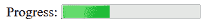
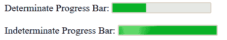
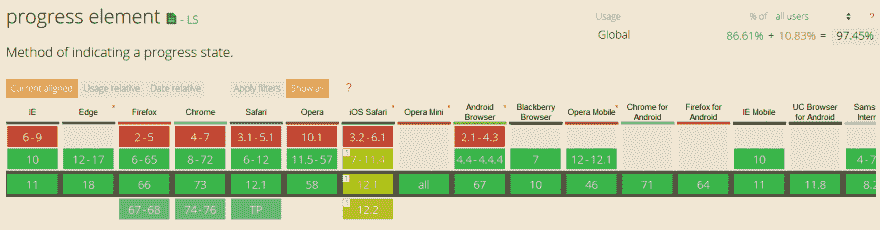
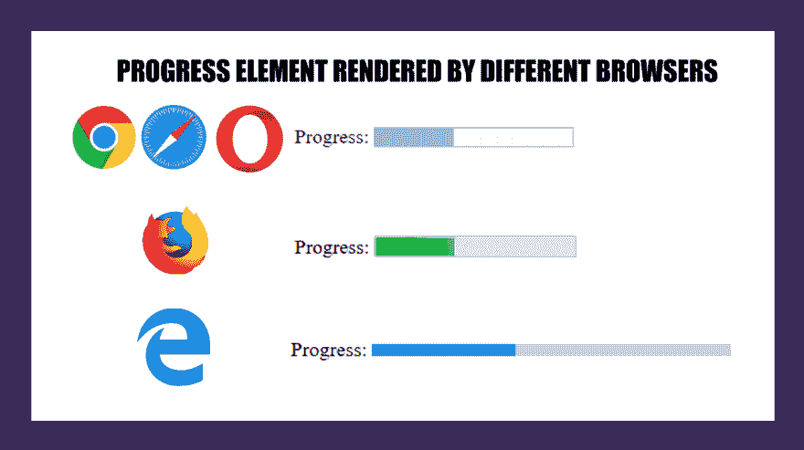
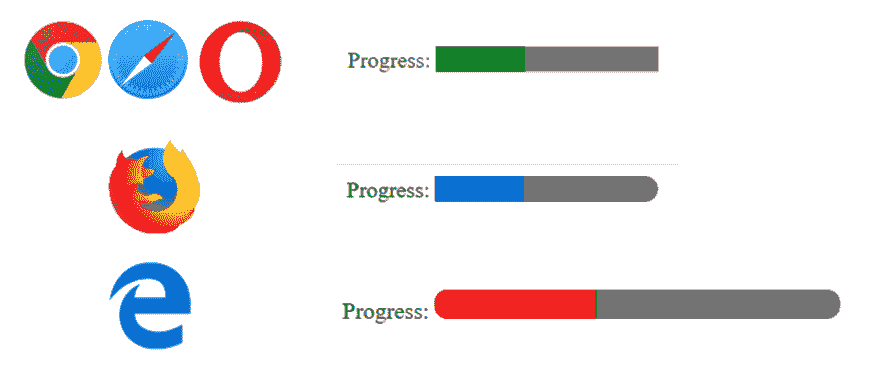
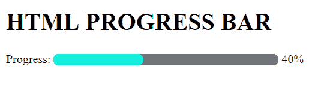
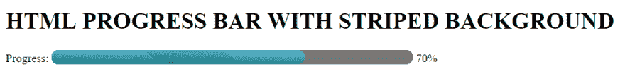
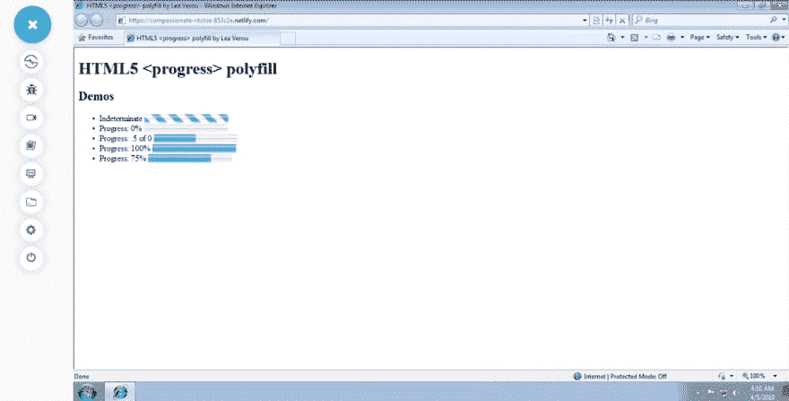
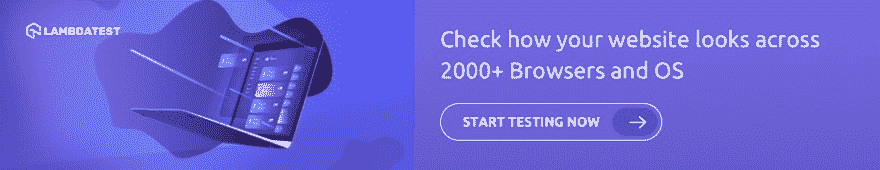

# 如何创建跨浏览器兼容的 HTML 进度条？

> 原文：<https://dev.to/lambdatest/how-to-create-a-cross-browser-compatible-html-progress-bar-5ai4>

你在互联网上遇到的任何现代网站的关键元素之一是 HTML 进度条。HTML5 progress 元素已经成为 web 设计的基本部分，用于各种任务，例如显示文件下载/上传状态、文件传输、注册、安装或任何正在进行中的任务。然而，编写一个提供跨浏览器兼容性的 HTML 进度条自古以来就给开发者带来了棘手的挑战。HTML5 没有使用 div 标签来创建进度条，而是通过使用 HTML5 <进度>标签来提供一种极其巧妙的方式。在本文中，我们将讨论什么是 HTML5 progress 元素，如何使用 CSS 样式化它，如何使用 JavaScript/jQuery 动画化它，用于创建 HTML 进度条的[跨浏览器兼容性解决方案](https://www.lambdatest.com/blog/fixing-javascript-cross-browser-compatibility-issues/?utm_source=dev&utm_medium=Blog&utm_campaign=Nikhil-03072023&utm_term=Nikhil)，以及最后对不支持的浏览器的回退。事不宜迟，我们开始吧！

## HTML5 <进度>元素

语义 HTML5 < progress >元素用作显示任务完成或进展状态的指示器，即尚未完成的工作量。HTML5 < progress >元素为用户提供了一个可视化的反馈演示，让用户能够跟踪正在进行的给定任务的进度状态。通常，它以进度条的形式显示，并标有数字或百分比值。

**注意:**如果您希望显示一个量表(磁盘空间或存储)，HTML5 progress 元素将不是正确的选择。你应该用 **HTML <米尺>标签**代替。

### 创建 HTML 进度条的语法

`< progress value="" max="" >< /progress >`

< progress tag >有两个关键属性——值和最大值。这两个属性定义了总任务(最大值)目前已经完成的部分(值)。

*   **值:**值属性表示任务完成的数量，为当前值。它可以是 0 到 max 属性之间的任何数字。如果缺少 max 属性，该值的范围可以从 0 到 1。如果缺少 value 属性，那么 HTML 进度条将是不确定的。它将不再指示当前的完成状态。
*   **Max:** max 属性表示完成一项任务所需的总工作量。最大值不能小于 0，默认情况下设置为 1。

这是一个简单的 HTML 进度条演示，使用了 HTML5 的 progress 元素–

```
<!DOCTYPE html>
<html>
 <head>
   Progress Bar
 </head>
 <body>
   <span>Progress:</span>
   <progress value="40" max="100"></progress>
 </body>
</html> 
```

Enter fullscreen mode Exit fullscreen mode

[](https://res.cloudinary.com/practicaldev/image/fetch/s--2OG1uX2b--/c_limit%2Cf_auto%2Cfl_progressive%2Cq_auto%2Cw_880/https://www.lambdatest.com/blog/wp-content/uploads/2019/04/progress-bar.png)

### html 5 进度元素的不确定与确定状态

正如我们上面讨论的，进度元素可以有两种状态——不确定或确定。这完全取决于是否在< progress >标签中提到了 value 属性。如果没有指定 value 属性，那么结果将是一个不确定的 HTML 进度条，它不显示进度的当前状态。在确定的 HTML 进度条的情况下，情况正好相反。

这两种情况都有一个例子—

```
<!DOCTYPE html>
<html>
 <head>
   Progress Bar
 </head>
 <body>
   <span>Indeterminate Progress Bar:</span>
   <progress max="100"></progress>
   <br><br>
   <span>Determinate Progress Bar:</span>
   <progress value="35" max="100"></progress>
 </body>
</html> 
```

Enter fullscreen mode Exit fullscreen mode

[](https://res.cloudinary.com/practicaldev/image/fetch/s--p5eiSU8k--/c_limit%2Cf_auto%2Cfl_progressive%2Cq_auto%2Cw_880/https://www.lambdatest.com/blog/wp-content/uploads/2019/04/determinate-progress-bar.png)

## HTML5 进度元素-跨浏览器兼容性

[](https://res.cloudinary.com/practicaldev/image/fetch/s--2XJEVifW--/c_limit%2Cf_auto%2Cfl_progressive%2Cq_auto%2Cw_880/https://www.lambdatest.com/blog/wp-content/uploads/2019/04/progress-element.png)

如上所述，HTML5 Progress 元素跨浏览器兼容所有主要的桌面和移动浏览器，截至 2019 年 3 月，覆盖了 97.45%的互联网用户群。唯一的主要例外是 IE9 及以下版本。在本文的后面，我们将探索不同的方法来编写必要的回退代码，通过使用 polyfill 添加对 IE8-9 的支持来提升我们的 HTML 进度条跨浏览器兼容性。

## 样式化 HTML 进度条

对 HTML progress 元素进行样式化是一项极其艰巨的任务。这里的挑战主要是因为每个浏览器对< progress >标签的解释都不一样。它们都使用自己特定的伪类来设计 HTML 进度条的样式。你可以在下图中看到不同的浏览器如何以不同的方式呈现一个基本的 HTML 进度条。您需要为三种具有不同渲染引擎的浏览器分别添加样式规则

*   Blink/Webkit 浏览器–谷歌 Chrome、Opera 和 Safari
*   Moz 浏览器–Mozilla Firefox
*   微软公司出品的 web 浏览器

如果您希望了解更多关于现代浏览器如何工作以及为什么浏览器呈现内容不一致的信息，您可以看看我以前的一篇关于跨浏览器兼容性的特性检测的文章。

[](https://res.cloudinary.com/practicaldev/image/fetch/s--CnAOPWk4--/c_limit%2Cf_auto%2Cfl_progressive%2Cq_auto%2Cw_880/https://www.lambdatest.com/blog/wp-content/uploads/2019/04/progress-element-rendering-1.png)

在讨论特定于浏览器的规则之前，让我们先看看基本的 HTML5 progress 元素选择器。我们可以使用进度选择器(或进度[值]选择器)来改变进度条的背景颜色、高度和边框半径。

```
progress{
            color: red; /*Works only with edge. Not applied to webkit and mozilla*/
            background-color: #6e6e6e; /*not applied to webkit. Works with firefox and Edge*/
            border: 0;
            width: 100px;
            height: 20px; /*works with all browsers*/
            border-radius: 9px; /*Not appied to value part in firefox. Works with Edge*/
        } 
```

Enter fullscreen mode Exit fullscreen mode

然而，如下所示，背景颜色和边框半径将无法与 Google Chrome 和其他 WebKit/Blink 浏览器一起使用。事实上，他们将删除默认的原生样式，代之以绿色进度条和深灰色背景。在 Firefox 中，背景颜色和边框半径规则应用于外部进度条，但不适用于值。Microsoft Edge 一如既往地遵守所有规则。[](https://res.cloudinary.com/practicaldev/image/fetch/s--JK6hmuJt--/c_limit%2Cf_auto%2Cfl_progressive%2Cq_auto%2Cw_880/https://www.lambdatest.com/blog/wp-content/uploads/2019/04/image4-1-1.png)

现在，为了创建一个跨浏览器兼容的 HTML 进度条，在所有浏览器上具有统一的外观，我们需要针对 Webkit 浏览器(Chrome、Opera 和 Safari)和 Firefox 的伪类。

1.  Webkit 浏览器使用 2 个伪类来定位 HTML5 进度元素: **-webkit-progress-bar** 和 **-webkit-progress-value** 。
    *   **-WebKit-进度条:**用于样式化外部进度条(容器)。你可以使用这个伪类改变进度条的背景颜色、边框半径和边框阴影属性。
    *   **-webkit-progress-value :** 用于样式化内部数值栏。你可以使用这个伪类来改变进度条数值部分的颜色。
2.  Mozilla Firefox 使用一个伪类: **-moz-progress-bar** 来设置 HTML 进度条的 value 元素的样式。
3.  微软 Edge 和 IE 使用: **-ms-fill** 伪类给进度条的值部分添加类似渐变背景的样式。

总而言之，我们现在有了下面的 CSS 选择器来为我们的 HTML 进度条添加样式规则—

```
 /* NON BROWSER SPECIFIC*/
       progress {
       }
       /* FOR WEBKIT BROWSERS*/
       progress::-webkit-progress-bar {
       }
       progress::-webkit-progress-value {
       }
       /* FOR FIREFOX */
       progress::-moz-progress-bar {
       }
       /* FOR MICROSOFT EDGE AND IE */
       custom-progress::-ms-fill {
       } 
```

Enter fullscreen mode Exit fullscreen mode

不要忘记重置默认的浏览器样式。为此，你必须将外观和边框属性设置为 none，如下所示–

```
progress {
            /* RESETS */
            -webkit-appearance: none;
            -moz-appearance: none;
            appearance: none;
            border: none;
        } 
```

Enter fullscreen mode Exit fullscreen mode

### 基本 HTML 进度条

现在使用这些 WebKit 和 Mozilla firefox 伪类，我们终于可以创建我们的基本进度条了，它有浅灰色背景(#777)，浅蓝色值进度部分`( rgb(20, 240, 221) )`，圆角`( border-radius: 20px )`。

```
 <!DOCTYPE html>
<html>

<head>
    Progress Bar
    <style>
        /* IE and EDGE */
        progress {
            /* RESETS */
            -webkit-appearance: none;
            -moz-appearance: none;
            appearance: none;
            border: none;

            width: 300px;
            height: 15px;
            border-radius: 20px;
            background-color: #777;
            color: rgb(20, 240, 221);
        }

        /* WEBKIT BROWSERS - CHROME, OPERA AND SAFARI */
        progress::-webkit-progress-bar {
            background-color: #777;
            border-radius: 20px;
 }

        progress::-webkit-progress-value {
            background-color: rgb(20, 240, 221);
            border-radius: 20px;
        }

        /* MOZILLA FIREFOX */
        progress::-moz-progress-bar {
            background-color: rgb(20, 240, 221);
            border-radius: 20px;
        }
    </style>
</head>

<body>
   <h1>HTML PROGRESS BAR </h1>
   <span>Progress:</span>
   <progress value="40" max="100"></progress>
   <span> 40%</span>
</body>

</html> 
```

Enter fullscreen mode Exit fullscreen mode

[](https://res.cloudinary.com/practicaldev/image/fetch/s--IquRIHmp--/c_limit%2Cf_auto%2Cfl_progressive%2Cq_auto%2Cw_880/https://www.lambdatest.com/blog/wp-content/uploads/2019/04/html-progress-bar.png)

### 带条纹渐变背景的 HTML 进度条

我们可以更进一步，创建一个带有条纹和渐变背景的 HTML 进度条。只需将 **-webkit-linear-gradient** 和 **-moz-linear-gradient** 样式规则添加到 **::-webkit-progress-value** 和 **::-moz-progress-bar** 伪类中。

```
 /* WEBKIT BROWSERS - CHROME, OPERA AND SAFARI */
       progress::-webkit-progress-bar {
           background-color: #777;
           border-radius: 20px;
       }

       progress::-webkit-progress-value {
           background-image:
               -webkit-linear-gradient(45deg, transparent 40%, rgba(0, 0, 0, .1) 40%, rgba(0, 0, 0, .1) 70%, transparent 70%),
               -webkit-linear-gradient(top, rgba(255, 255, 255, .25), rgba(0, 0, 0, .25)),
               -webkit-linear-gradient(left, #1abc9c, #3498db);
           border-radius: 20px;
       }

       /* MOZILLA FIREFOX */
       progress::-moz-progress-bar {
           background-image:
               -moz-linear-gradient(45deg, transparent 33%, rgba(0, 0, 0, 0.1) 40%, rgba(0, 0, 0, 0.1) 70%, transparent 70%),
               -moz-linear-gradient(top, rgba(255, 255, 255, 0.25), rgba(0, 0, 0, 0.25)),
               -moz-linear-gradient(left, #1abc9c, #3498db);
           border-radius: 20px;
       }

       /* MICROSOFT EDGE & IE */
       .custom-progress::-ms-fill {
           border-radius: 18px;
           background: repeating-linear-gradient(45deg, #1abc9c, #1abc9c 10px,#3498db 10px, #3498db 20px);
       } 
```

Enter fullscreen mode Exit fullscreen mode

[](https://res.cloudinary.com/practicaldev/image/fetch/s--W2c6g1xv--/c_limit%2Cf_auto%2Cfl_progressive%2Cq_auto%2Cw_880/https://www.lambdatest.com/blog/wp-content/uploads/2019/04/html-progress-bar-with-striped-background.png)

## 动画 HTML 进度条

现在你已经学会了如何使用 HTML progress 元素创建和设计进度条，最后一步是添加动画。在大多数情况下，HTML 进度条与 JavaScript 或 jQuery 同时使用。我们将使用 JavaScript 添加从 0 值到最大值的向右扩展动画，以预定义的步长递增。我们将使用之前制作的相同的条纹渐变进度条，并添加动画——首先我们将创建一个名为“progress”的变量。将 id 为“custom-bar”的 progress 元素的值存储在其中。将 HTML Progress 元素的“value”和“max”属性分别设置为 0 和 100。只要变量“progress”的值小于最大属性值，“progress”变量就会每 1 秒钟递增 10。所以在 10 秒钟内进度条填充从 0 到最大值 100。

```
 <!DOCTYPE html>
<html>

<head>
  <meta charset="utf-8">
  HTML5 Progress Bar
  <style>
      /* CROSS BROWSER SELECTOR*/
      .custom-progress {
          /* RESETS */
          -webkit-appearance: none;
          -moz-appearance: none;
          appearance: none;
          border: none;

          width: 100%;
          height: 30px;
          border-radius: 20px;
          background-color: #777;
          color: #e74c3c;
      }

      /* WEBKIT BROWSERS - CHROME, OPERA AND SAFARI */
      .custom-progress::-webkit-progress-bar {
          background-color: #777;
          border-radius: 20px;
      }

      .custom-progress::-webkit-progress-value {
          background-image:
              -webkit-linear-gradient(45deg, transparent 40%, rgba(0, 0, 0, .1) 40%, rgba(0, 0, 0, .1) 70%, transparent 70%),
              -webkit-linear-gradient(top, rgba(255, 255, 255, .25), rgba(0, 0, 0, .25)),
              -webkit-linear-gradient(left, #f1c40f, #e74c3c);
          border-radius: 20px;
      }

      /* MOZILLA FIREFOX */
      .custom-progress::-moz-progress-bar {
          background-image:
              -moz-linear-gradient(45deg, transparent 33%, rgba(0, 0, 0, 0.1) 40%, rgba(0, 0, 0, 0.1) 70%, transparent 70%),
              -moz-linear-gradient(top, rgba(255, 255, 255, 0.25), rgba(0, 0, 0, 0.25)),
              -moz-linear-gradient(left, #f1c40f, #e74c3c);
          border-radius: 20px;
      }

      /* MICROSOFT EDGE & IE */
      .custom-progress::-ms-fill {
          border-radius: 18px;
          background: repeating-linear-gradient(45deg,
          #f1c40f,
          #f1c40f 10px,
          #e74c3c 10px,
          #e74c3c 20px);
      }
  </style>
  <style>
      .wrapper {
          width: 70%;
          margin: 0 auto;
          text-align: center;
      }
  </style>
</head>

<body>
  <div class="wrapper">
      <h1>Animating HTML Progress Bar Using JavaScript</h1>
      <progress id="custom-bar" class="custom-progress" max="100" value="0">0%</progress>
  </div>

  <script>
      setInterval(function () {
          var progress = document.getElementById('custom-bar');

          if (progress.value < progress.max) {
              progress.value += 10;
          }

      }, 1000);
  </script>
</body>

</html> 
```

Enter fullscreen mode Exit fullscreen mode

[](https://res.cloudinary.com/practicaldev/image/fetch/s--6jeGAiE0--/c_limit%2Cf_auto%2Cfl_progressive%2Cq_66%2Cw_880/https://www.lambdatest.com/blog/wp-content/uploads/2019/04/ezgif.com-video-to-gif.gif)

### 带有增量/减量控件的 HTML 进度条

您可以继续使用 JavaScript/jQuery，通过添加手动递增/递减触发控件来增加或减少进度值，从而创建有趣的 HTML 进度条变体。这将非常类似于范围滑块。每点击一次按钮，进度条的当前值就会增加或减少 5。

```
<!DOCTYPE html>
<html>
<head>
    Progress Bar
    <style>
        body {
            background: #777;
        }

        h1 {
            color: #eee;
            font: 30px Helvetica, Arial, sans-serif;
            text-shadow: 0px 1px black;
            text-align: center;
            margin-bottom: 50px;
            -webkit-font-smoothing: antialiased;
        }

        p {
            text-align: center;
        }

        button {
            background: #FFF;
            width: 25px;
            margin: 0 10px;
            color: #555;
        }
progress {
            display: block;
            height: 25px;
            width: 500px;
            margin: 1rem auto;
            padding: 5px;
            border: 0 none;
            background: #444;
            border-radius: 10px;
        }

        progress::-moz-progress-bar {
            border-radius: 10px;
            background: #FFF;
        }

        progress::-webkit-progress-bar {
            background: transparent;
        }

        progress::-webkit-progress-value {
            border-radius: 10px;
            background: #FFF;
        }
    </style>
</head>

<body>
    <h1>HTML5 Progress Bar with Javascript Controls </h1>
    <progress max="100" value="20"></progress>
    <p>
        <button type="button" id="less">-</button> <button type="button" id="more">+</button>
    </p>

    <!------ JQuery 3.3.1 ------>
    <script src="https://code.jquery.com/jquery-3.3.1.min.js"
        integrity="sha256-FgpCb/KJQlLNfOu91ta32o/NMZxltwRo8QtmkMRdAu8=" crossorigin="anonymous"></script>
    <script>
        $('#more').on('click', function () {
            $('progress').val($('progress').val() + 5);
            return false;
        });
        $('#less').on('click', function () {
            $('progress').val($('progress').val() - 5);
            return false;
        });
    </script>
</body>

</html> 
```

Enter fullscreen mode Exit fullscreen mode

[](https://res.cloudinary.com/practicaldev/image/fetch/s--kGrHZph1--/c_limit%2Cf_auto%2Cfl_progressive%2Cq_66%2Cw_880/https://www.lambdatest.com/blog/wp-content/uploads/2019/04/ezgif.com-video-to-gif2.gif)

## IE9 及以下版本中跨浏览器兼容 HTML5 进度元素的回退

除 IE9 及以下版本外，所有主流浏览器都支持 HTML5 Progress 元素。要为这些浏览器添加功能，一种方法是使用 div 标签编写回退代码。然而，这导致了额外的代码重复和开发人员的工作量。一个直观的替代方法是使用由 **Lea Verou** 创建的最流行和最广泛使用的 progress polyfills。

为了确保 IE9 和 8 的 HTML5 **progress 元素的[跨浏览器兼容性，只需将 **progress-polyfill.js** 和 **progress-polyfill.css** 文件添加到您的项目中。下面是使用 LambdaTest 实时测试在 IE8 上运行的示例代码。](https://www.lambdatest.com/blog/finding-cross-browser-compatibility-issues-in-html-and-css/?utm_source=dev&utm_medium=Blog&utm_campaign=Nikhil-03072022&utm_term=Nikhil)** 

```
<!DOCTYPE html>
<html>

<head>

    <meta charset="utf-8" />
    HTML5 &lt;progress&gt; polyfill by Lea Verou
    <link href="http://lea.verou.me/polyfills/progress/progress-polyfill.css" rel="stylesheet" />
    <script>
        document.createElement('progress');
    </script>
</head>

<body>

    <h1>HTML5 &lt;progress&gt; polyfill</h1>

    <h2>Demos</h2>
    <ul>
        <li>
            <label>Indeterminate
                <progress max="100"></progress>
            </label>
        </li>
        <li>
            <label for="progress1">Progress: 0%</label>
            <progress max="10" value="0" id="progress1"></progress>
        </li>
        <li>
            <label for="progress2">Progress: .5 of 0</label>
            <progress max="0" value="0.5" id="progress2"></progress>
        </li>
        <li>
            <label for="progress3">Progress: 100%</label>
            <progress max="3254" value="3254" id="progress3"></progress>
        </li>
        <li>
            <label>Progress: 75%
                <progress max="0.8" value="0.6"></progress>
            </label>
        </li>
    </ul>

    <script src="http://lea.verou.me/polyfills/progress/progress-polyfill.js"></script>

</body>

</html> 
```

Enter fullscreen mode Exit fullscreen mode

[](https://res.cloudinary.com/practicaldev/image/fetch/s--9RMIxMaf--/c_limit%2Cf_auto%2Cfl_progressive%2Cq_auto%2Cw_880/https://www.lambdatest.com/blog/wp-content/uploads/2019/04/pasted-image-0-22.png)

*HTML Progress 元素现在支持 IE9&IE8–LambdaTest 实时跨浏览器测试*

上面提到的是演示 IE9 的 HTML5 progress polyfill 的截图。我使用了 LambdaTest，这是一个基于云的跨浏览器测试工具，提供了 2000 多个真实的浏览器和浏览器版本，运行在不同的移动和桌面设备上。通过在 LambdaTest 上执行[跨浏览器测试](https://www.lambdatest.com/?utm_source=dev&utm_medium=Blog&utm_campaign=Nikhil-03072021&utm_term=Nikhil)，您可以确保您的网站或网络应用程序在不同浏览器之间无缝呈现。有了内置的开发工具，你可以很容易地[调试和测试你的代码的跨浏览器兼容性](https://www.lambdatest.com/blog/how-to-fast-track-cross-browser-testing-and-debugging-with-lambdatest/?utm_source=dev&utm_medium=Blog&utm_campaign=Nikhil-03072020&utm_term=Nikhil)。

也就是说，如果你想了解更多的资源，请访问 Lea Verou 的[网站](http://lea.verou.me/2011/07/a-polyfill-for-html5-progress-element-the-obsessive-perfectionist-way/)或 [polyfill 页面](http://lea.verou.me/polyfills/progress/)。

## 结论

对于许多开发人员来说，不使用任何 jQuery 插件或库，只使用简单的 HTML 和 CSS 来创建高度可定制的现代 HTML 进度条将是一个巨大的启示。尽管 HTML5 progress element 享有出色的浏览器支持，但开发人员仍然需要注意由不同呈现引擎导致的跨浏览器的巨大差异，并确保样式的一致性得到正确实施。继续探索复杂的渐变模式，创造性的 CSS 样式加上基于 JavaScript 滚动的动画，这有助于将 HTML 进度条的极限推向顶点。

最初发布:[**LambdaTest**T3】](https://www.lambdatest.com/blog/how-to-create-a-cross-browser-compatible-html-progress-bar/?trashed=1&ids=745?utm_source=dev&utm_medium=Blog&utm_campaign=Nikhil-03072026&utm_term=Nikhil)

[](https://accounts.lambdatest.com/register/?utm_source=dev&utm_medium=Blog&utm_campaign=Nikhil-03072019&utm_term=Nikhil)

**相关岗位**:

[**2019 年 11 大 JavaScript 框架**](https://www.lambdatest.com/blog/top-javascript-frameworks-for-2019/?utm_source=dev&utm_medium=Blog&utm_campaign=Nikhil-03072027&utm_term=Nikhil)

[**已经 2019 年了！让我们结束图标字体 vs SVG 图标**T3 的争论](https://www.lambdatest.com/blog/its-2019-lets-end-the-debate-on-icon-fonts-vs-svg-icons/?utm_source=dev&utm_medium=Blog&utm_campaign=Nikhil-03072028&utm_term=Nikhil)