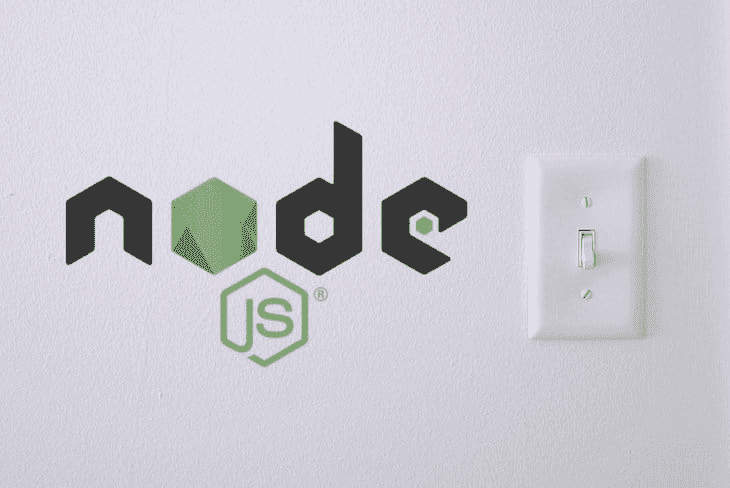

# 开发期间在节点版本之间切换

> 原文：<https://dev.to/bnevilleoneill/switching-between-node-versions-during-development-3c2l>

[](https://res.cloudinary.com/practicaldev/image/fetch/s--Zkgubq-8--/c_limit%2Cf_auto%2Cfl_progressive%2Cq_auto%2Cw_880/https://thepracticaldev.s3.amazonaws.com/i/3jegxmmdvigxx39pus24.jpg)

有时似乎几乎每周都会发布 Node.js 的新版本——每隔几周发布一次小版本，每隔几个月发布一次大版本。如果您是需要定期在不同应用程序和项目之间切换的开发人员，您可能会发现需要运行不同版本的 Node。

幸运的是，有几种不错的方法可以安装多个版本并根据需要进行切换。本文将讨论和比较两种流行的节点版本管理器: **NVM for Windows** 和**n Node version manager**for Linux/Mac。

> 提示:Windows 和 Linux/Mac 有不同的 NVM 实现；但是，n npm 包只在 Linux/Mac 上受支持。

为了便于比较，让我们假设您正在开发两个应用程序。应用 1 是运行在节点 6.17.1 上的 Angular 5 应用。应用 2 是运行在节点 8.16.0 上的 Angular 7 app。以下是您需要完成的任务:

*   修复应用程序 1 上的 bug *x*
*   将应用程序 2 升级到 Angular 8

您实际上需要三个版本的 Node 来完成您的任务，因为 Angular 8 升级将要求您将应用程序 2 升级到 Node 10.9 或更高版本。

[](https://logrocket.com/signup/)

## 用于 Windows 的 NVM

从技术上来说，有两个完全独立的 NVM 项目，它们在不同的操作系统上提供类似的功能，但彼此独立维护:

*   nvm-sh/nvm 是一个 bash 脚本，可用于管理 Linux 和 Mac 上的节点版本
*   [coreybutler/nvm-windows](https://github.com/coreybutler/nvm-windows/tree/1.1.7) 是一个 windows 应用程序(有或没有安装程序),可用于管理 Windows 上的节点版本

这篇文章关注的是用于 Windows 的 NVM。

### 安装

安装非常简单，只需从 GitHub 上下载最新版本的 NVM for Windows installer 即可。在撰写本文时，[1 . 1 . 7(2018 年 8 月)](https://github.com/coreybutler/nvm-windows/releases)是最新版本。下载并解压`nvm-setup.zip`，双击可执行文件进行安装。

安装程序会将 NVM 放在您机器上的适当文件夹中，并更新您的系统环境变量，以便在命令行上可以使用`nvm`和`node`的未来安装。

> 提示:如果你喜欢安装到你自己的文件夹中，下载`nvm-noinstall.zip`并解压到你喜欢的任何地方。运行附带的`install.cmd`来设置必要的系统环境变量。
> 
> 提示:GitHub 上的[提供了详细的安装说明。](https://github.com/coreybutler/nvm-windows)

安装完成后，打开命令窗口并确认 NVM 可用:

```
D:\>nvm version
1.1.7 
```

Enter fullscreen mode Exit fullscreen mode

### 让应用程序 1 运行

如果您还记得，您需要使用三个不同版本的 Node 运行两个不同的应用程序来完成所有任务。首先让应用程序 1 运行起来。一些命令输出被截断(`...`)以节省空间。

```
D:\>nvm list available
|   CURRENT    |     LTS      |  OLD STABLE  | OLD UNSTABLE |
|--------------|--------------|--------------|--------------|
|    12.4.0    |   10.16.0    |   0.12.18    |   0.11.16    |
...
D:\>nvm install 6.17.1
Downloading node.js version 6.17.1 (64-bit)...
Complete
Creating C:\Users\Brian\Downloads\nvm-noinstall\temp

Downloading npm version 3.10.10... Complete
Installing npm v3.10.10...

Installation complete. If you want to use this version, type

nvm use 6.17.1
D:\>nvm use 6.17.1
D:\>nvm list
  * 6.17.1 (Currently using 64-bit executable)    
D:\>node -v
v6.17.1
D:\>cd application1
D:\application1>npm install
...
D:\application1>npm start
> application1@0.0.0 start D:\application1
> ng serve

** Angular Live Development Server is listening on localhost:4200, open your browser on http://localhost:4200/ **
... 
```

Enter fullscreen mode Exit fullscreen mode

以下是 NVM 的一些关键功能，您可以利用这些功能来运行应用程序:

*   `nvm list available`提供了可供安装的节点版本的方便的部分列表
*   `nvm install`安装了所需的节点版本(默认为 64 位版本，因为当前系统的架构是 64 位)
*   激活了刚刚安装的版本
*   `nvm list`确认安装并激活了节点的正确版本(如果存在其他已安装的版本，将会列出)

安装并激活节点后，一切如常。您可以遵循应用程序要求的任何节点/npm 工作流。

> 提示:您的节点版本彼此完全隔离。例如，如果您在一个版本的 Node 上全局安装了一个包，那么该包在其他版本的 Node 上就不可用。

### 让应用程序 2 运行

因此，您已经修复了应用程序 1 中的 bug *x* ，现在您可以着手将应用程序 2 升级到 Angular 8:

```
D:\nvm install 8.16.0
...
D:>nvm use 8.16.0
Now using node v8.16.0 (64-bit)
D:>cd application2
D:\application2>npm install
...
D:\application2>npm start
...
D:\application2>nvm install 10.16.0
...
D:\application2>nvm use 10.16.0
Now using node v10.16.0 (64-bit)
D:\application2>npm i -g @angular/cli@8 ...
D:\application2>ng update @angular/cli @angular/core
...
D:\application2>npm install
...
D:\application2>npm start
... 
```

Enter fullscreen mode Exit fullscreen mode

在 NVM(和 Angular CLI)的帮助下，您可以通过几个命令快速完成升级:

*   `nvm install`和`nvm use`安装并激活了 8.16.0 版，以便您可以在升级前验证应用程序是否按预期工作
*   `nvm install`和`nvm use`安装并激活了 v10.16.0，为升级做准备
*   全局安装了`@angular/cli`包，以访问自动升级 Angular 应用程序的`ng update`命令
*   `npm install`和`npm start`测试新升级的应用程序

## n 节点版本管理器

n 节点版本管理器为节点版本之间的安装和切换提供了更简单的 CLI。它仅在 Linux 或 Mac 操作系统上受支持。

> 提示:详细的安装和使用说明可以在 GitHub 上的 [tj/n 存储库中找到。](https://github.com/tj/n)

### 安装

如果您已经安装了 Node 和 npm 的版本，那么您可以使用`npm install -g n`像安装任何其他 NPM 包一样安装 n。

如果您还没有安装 Node 或 npm 的版本，您可以使用 GitHub 的 bash 脚本安装 n。它看起来是这样的:

> 提示:必须安装 Git 才能用 bash 脚本安装 n。

```
~$ curl -L https://git.io/n-install | bash
...
=== n successfully installed.
  The active Node.js version is: v10.16.0

  Run `n -h` for help.
  To update n later, run `n-update`.
  To uninstall, run `n-uninstall`.

  IMPORTANT: OPEN A NEW TERMINAL TAB/WINDOW or run `. /home/brian/.bashrc`
             before using n and Node.js.
===
~$ . /home/brian/.bashrc
~$ n
node/10.16.0 
```

Enter fullscreen mode Exit fullscreen mode

n 是从 GitHub 下载并运行`n-install`脚本安装的。安装后，运行 n 表明默认情况下安装了 Node 的一个版本。

### 让应用程序 1 运行

应用程序 1 需要 Node v6.17.1，所以您需要首先安装它，然后运行应用程序。

```
~$ n 6.17.1
     install : node-v6.17.1
       mkdir : /home/brian/n/n/versions/node/6.17.1
       fetch : https://nodejs.org/dist/v6.17.1/node-v6.17.1-linux-x64.tar.gz
####################################################################################################################################### 100.0%
installed : v6.17.1
~$ node -v
v6.17.1
~$ cd application1
~/application1$ npm install ...
~/application1$ npm start > application1@0.0.0 start ~/application1 > ng serve

** Angular Live Development Server is listening on localhost:4200, open your browser on http://localhost:4200/ **
... 
```

Enter fullscreen mode Exit fullscreen mode

安装和激活 Node 版本的 n 命令很简单:`n 6.17.1`。你也可以用`n latest`来表示 Node 的最新版本，或者用`n lts`来表示 Node 的最新 LTS 版本。如果已经安装了 Node 的版本，那么 n 将简单地切换到那个版本。

安装 Node 后，应用程序可以照常运行。

> 提示:与 NVM 类似，节点版本彼此完全隔离。例如，全局安装的软件包不会在节点版本之间共享。

### 让应用程序 2 运行

接下来，您需要运行应用程序 2，并继续升级 Angular 8:

```
$ n 8.16.0
...
$ cd application2
~/application2$ npm install ...
~/application2$ npm start ...
~/application2$ n 10.16.0 ...
~/application2$ npm i -g @angular/cli@8
...
~/application2$ ng update @angular/cli @angular/core ...
~/application2$ npm install ...
~/application2$ npm start ... 
```

Enter fullscreen mode Exit fullscreen mode

安装 Node v8.16.0 是为了确保应用程序 2 在升级前正常工作。然后按照 Angular 8 的要求安装节点 v10.16.0。Angular CLI 全局安装，应用程序用`ng update`更新。最后，应用程序在升级后开始测试。

您可能已经注意到，n 使得用一个`n <version>`命令安装和切换到新版本的 Node 稍微快了一些。

### 直接使用节点二进制

n 提供了直接调用特定节点二进制文件的能力，而不必显式切换到该节点版本。NVM 没有类似的功能。

```
~$ echo "console.log('Node version: ' + process.version)" > index.js
~$ node -v
v8.16.0
~$ n use 10.16.0 index.js
Node version: v10.16.0
~$ n use 12.4.0 index.js
  Error: '12.4.0' is not installed
~$ node -v
v8.16.0 
```

Enter fullscreen mode Exit fullscreen mode

在上面的例子中，节点的活动版本是 v8.16.0。当运行`n use 10.16.0 index.js`时，输出表明用于执行脚本的节点版本是 10.16.0。执行后，Node 的活动版本仍然是 v8.16.0。注意,`n use`命令要求 n 已经安装了所请求的 Node 版本。

这种能力在某些情况下很有用。例如，设想一个构建服务器，用于构建不同的应用程序，这些应用程序都有自己所需的节点版本。每个构建都可以用`n use`命令触发，指定该应用程序所需的节点版本。

## 汇总对比

NVM for Windows 和 n 有许多共同的功能和一些独特的功能，这些功能会影响您使用每个工具的方式和位置。以下是一些主要差异的总结:

| **功力**T5】 | **NVM for Windows**T5】 | **n**T5】 |
| 安装 | Windows 安装程序或独立安装 | Bash 脚本或者 npm 包 |
| 操作系统支持 | Windows (可用于 Linux/Mac 的不同实现) | 仅适用于 Linux/Mac 系统 |
| 列出要安装的节点的可用版本？ | 是 | 否 |
| 列出 Node 的已安装版本？ | 是 | 是 |
| 不同节点版本的安装和切换？ | 是 | 是 |
| 直接访问节点二进制？ | 否 | 是 |
| 选择安装哪个架构 (x86， x64)？ | 是 | 是 |

您可以选择在您的 Linux 机器上使用 n，因为它的 API 很简单。或者，您可以在 Windows box 上选择 NVM for Windows，在 Linux 构建服务器上选择 n，并在 Linux 构建服务器上使用 n 来管理不同构建作业之间的节点版本。

无论情况如何，这两个工具都出色地满足了动态切换节点版本的需求。快乐节点版本切换！

* * *

## Plug: [LogRocket](https://logrocket.com/signup/) ，一款适用于网络应用的 DVR

[](https://logrocket.com/signup/)

LogRocket 是一个前端日志工具，可以让你回放问题，就像它们发生在你自己的浏览器中一样。LogRocket 不需要猜测错误发生的原因，也不需要向用户询问截图和日志转储，而是让您重放会话以快速了解哪里出错了。它可以与任何应用程序完美配合，不管是什么框架，并且有插件可以记录来自 Redux、Vuex 和@ngrx/store 的额外上下文。

除了记录 Redux 操作和状态，LogRocket 还记录控制台日志、JavaScript 错误、堆栈跟踪、带有头+正文的网络请求/响应、浏览器元数据和自定义日志。它还使用 DOM 来记录页面上的 HTML 和 CSS，甚至为最复杂的单页面应用程序重新创建像素级完美视频。

[免费试用](https://logrocket.com/signup/)。

* * *

在开发过程中切换节点版本的帖子首先出现在[的博客](https://blog.logrocket.com)上。