# 减少精神疲劳:NestJS + ObjectionJS

> 原文：<https://dev.to/thisdotmedia/reducing-mental-fatigue-nestjs-objectionjs-3aef>

## 导言

你会发现这篇文章的大部分内容都是关于什么让我喜欢我的工作。

但是，您还将弄清楚如何开始对 Nest 使用异议，以及它们都是关于什么的。我不会详细解释 Nest 或 Objection 是如何工作的。我认为这两个文档非常有趣，值得研究，但是我将向您展示如何一起使用它们😌

## ☝️先决条件

您需要在本地安装 PostgreSQL。这可以通过多种方式实现，但我建议两种方法:

1.  你可以安装 docker [ [Windows](https://docs.docker.com/docker-for-windows/install/) 、 [macOS](https://docs.docker.com/docker-for-mac/install/) 、 [Ubuntu](https://linuxize.com/post/how-to-install-and-use-docker-on-ubuntu-18-04/) 并执行本文后面描述的`package.json`脚本。它实际上是在 docker 容器中运行 PostgreSQL，一旦您在终端中点击`ctrl+c`就会破坏它

2.  你可以把它直接安装在你的机器上(如果你还没有安装的话，我推荐选择 1)

## 💆心理疲劳

如今，许多程序员在软件开发中面临精神疲劳。这不仅仅是因为每分钟都会出现新的工具、方法和范例。

对于每个新的软件开发项目(假设是后端应用程序，因为我更像是后端人员)，程序员或团队应该决定各种事情:

*   Web 框架
*   项目结构
*   林挺规则、代码格式(基于谷歌、Airbnb、微软或本土惯例)
*   数据存储(SQL，NoSQL)
*   部署平台(亚马逊、谷歌云、Azure、Netlify 等。)
*   CI/CD
*   测试工具和策略
*   证明文件
*   诸如此类...

正如你所看到的，这个列表会越来越长。这一过程涉及大量高层决策，而不是数百万个小决策。

做出的每一个决定都会耗尽我们的精神能量，即使是微不足道的决定。在做了许多小决定之后，我们就不太可能做出好的重大决定了。

我们现在在 JavaScript 世界中拥有的工具景观是一件好事，同时也是一件坏事。一方面，它使我们做出更多的决定，另一方面，它也为我们带来了许多好的决定，这些决定得到了成千上万开发人员的信任。

那么，为什么我们不能利用这个机会来减少我们的精神疲劳，减少我们通过采纳经过充分证明的意见而做出的决定的数量呢？

通过选择正确的工具，我们有机会开发一个易于推理并让新人参与的项目。

几乎所有的后端项目都是建立在某种 web 框架和 ORM 之上的，它们会严重影响未来的项目架构。

我们将看看它们如何简化我们在头脑中建立的心智模型，并减少我们通常必须做出的决定的数量。我们将为笔记应用程序开发一个简单的(但足以展示 Nest 和 Objection 的强大功能)后端。

## 🕸️网络框架

在 Node.js 领域有很多可用的 web 框架: *Express、哈比神、Koa、Fastify、Restify、*等。他们是灵活的和经过时间考验的人，允许你以多种不同的方式构建一个项目。

因此，您需要决定如何组织路由、处理程序、视图、认证、服务、存储库等。这给了你很多自由，但也有代价。您需要做出大量决策来正确构建应用程序，并且项目的组织方式在任何其他使用相同框架构建的项目中都会有所不同，因为新项目的开发人员做出决策的方式略有不同。

你必须从头再来，掌握这个框架在特定项目中的使用方式。你正在失去你在前一个项目中发展起来的那种熟悉感和意识，或者换句话说，框架知识转换的水平没有那么高。

对我个人来说，这些框架缺少一个重要的东西(尽管我认为它们非常强大)——一个共享的概念基础，在这个基础上，你可以开始发展一个实际的业务逻辑，这个基础将在项目之间重复，并允许新开发人员快速熟悉代码库。

这样的概念基础允许增加框架的知识转换，并减少开始使用它所需的脑力劳动。

我说的**概念基础**是什么意思？它是框架给你的一组最小的概念或构建块。如果这些构建块与您需要开发的东西很好地结合起来，那么就很容易对项目进行推理，并将其不同的部分传达给其他团队成员(无论是经验丰富的开发人员还是新手)。

对我来说，这样的框架就是[巢](https://nestjs.com)！它是用打字稿写的，有很好的、简洁的文档。所以对于那些不喜欢阅读冗长手册的人(我不喜欢)，这篇文档提供了足够的信息和例子来完成这项工作——不多也不少。

Nest 的模块系统深受 Angular 的启发，所以 Angular 开发人员阅读 Nest 代码应该会很舒服。Angular 和 Nest 通常是一个很好的组合，因为它们的概念基础有很高的交集，你可以将你的一些角度知识转移到 Nest。

我不想重复这些文件，鼓励你自己去看一看。

尽管我将描述 Nest 的主要构件:

*   [Guard](https://docs.nestjs.com/guards) -保护系统免受未经认证/未经授权的访问
*   [拦截器](https://docs.nestjs.com/interceptors)——拦截传入的请求或传出的响应
*   [控制器](https://docs.nestjs.com/controllers) -处理请求
*   提供者(Provider)——这基本上是一个服务，专门用于一些任务集，由于 Nest 内置的依赖注入功能，它可以被注入列表中的任何其他内容
*   [管道](https://docs.nestjs.com/pipes) -转换/验证传入的请求体
*   [中间件](https://docs.nestjs.com/middleware) -中间件的目的是拦截请求，执行一些逻辑，并将控制流传递给下一个中间件
*   这个东西有助于组织你的应用程序结构，它和 Angular 模块有相同的用途

还有，我建议在 [Nest.js 上按部就班](https://www.bhaidar.dev/2019/06/nestjs-step-by-step-part1)阅读这一系列文章。

> 你可以问我“如果我有中间件，为什么我还需要上面列出的其他东西？”。
> 
> 中间件太普通，而警卫，拦截等。致力于一项特殊的任务。所以听到“守卫”这个词，你就已经知道它负责什么了。
> 
> 如果你想实现这里列出的概念之外的东西，你可能需要中间件。

💥**大爆炸！**
为了简洁起见，我不会描述我们未来项目的每一个文件，而是会一路强调关键概念。

我们从 Nest 应用程序开始，它有所有的管道，但没有数据库。这样就很容易谈论下一步的事情，然后逐渐转向反对。
正如我已经说过的，我们将开发一个 toy notes API。我们的笔记可以有主题和标签。

这是我们的应用程序结构最初的样子:

[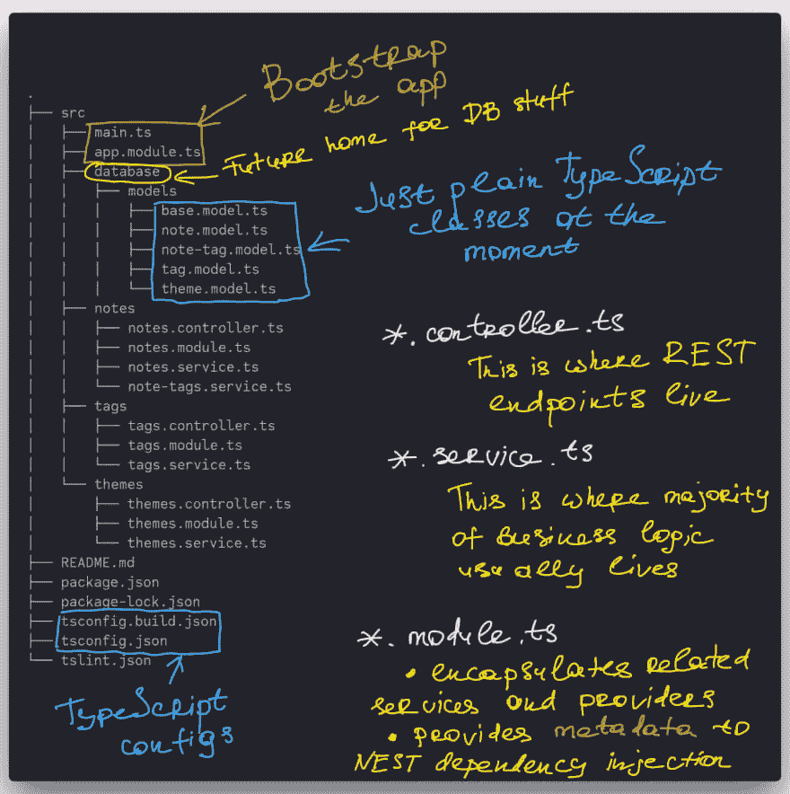](https://res.cloudinary.com/practicaldev/image/fetch/s--KJBVWA8D--/c_limit%2Cf_auto%2Cfl_progressive%2Cq_auto%2Cw_880/https://paper-attachments.dropbox.com/s_1F921D6055F211537012522AC3AED06A165C5605936BC0BA49129723816F6EFE_1560199673077_Image.jpg)

继续调查[我们目前拥有的代码](https://github.com/rychkog/nest-objection-article/tree/31d178d4991f5fce3e76c90c39e83981b0d6307c) ( *代码库目前在* [*初始提交*](https://github.com/rychkog/nest-objection-article/commit/31d178d4991f5fce3e76c90c39e83981b0d6307c)*)。我们将在它的基础上开始建造。*

 *只要看看代码库中的名字，就能立刻清楚不同类的目的和职责。

让我们更详细地看看`notes`文件夹(因为`tags`和`themes`的工作方式完全相同)。

第一件事是`NotesModule`

[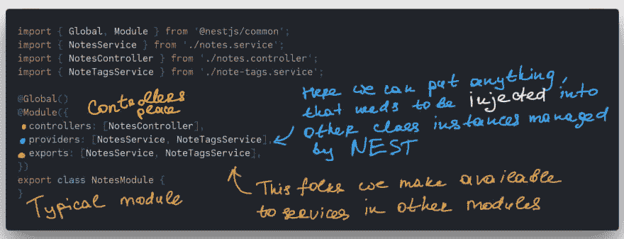](https://res.cloudinary.com/practicaldev/image/fetch/s--ZEnqDxtP--/c_limit%2Cf_auto%2Cfl_progressive%2Cq_auto%2Cw_880/https://paper-attachments.dropbox.com/s_1F921D6055F211537012522AC3AED06A165C5605936BC0BA49129723816F6EFE_1560199752208_Image%2B10.jpg)

在`NotesModule`我们已经注册了`NotesService`。这是它的样子

[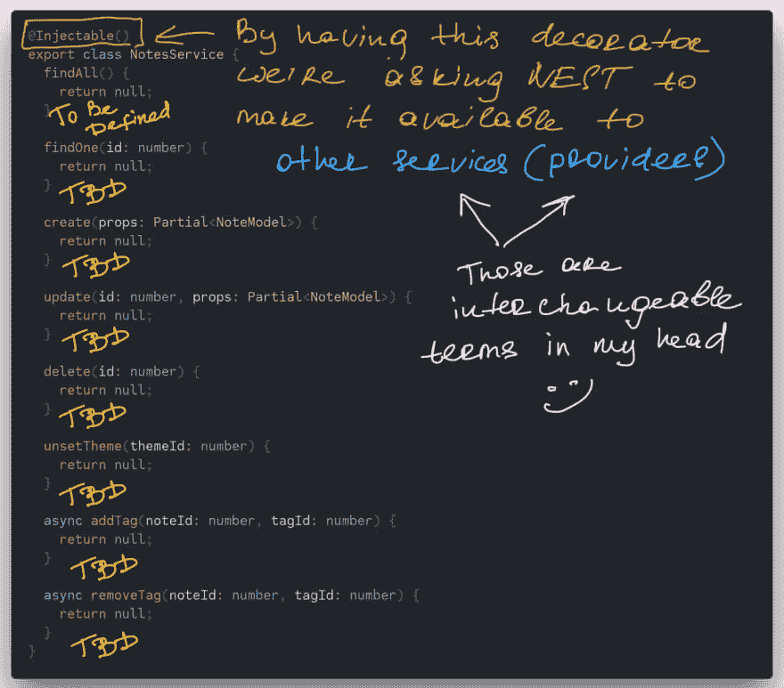](https://res.cloudinary.com/practicaldev/image/fetch/s--DGnZA_An--/c_limit%2Cf_auto%2Cfl_progressive%2Cq_auto%2Cw_880/https://paper-attachments.dropbox.com/s_1F921D6055F211537012522AC3AED06A165C5605936BC0BA49129723816F6EFE_1560199798161_Image%2B12.jpg)

`NotesService`被`NotesController`使用，一旦发现后者依赖于前者，就被 Nest 注入。

[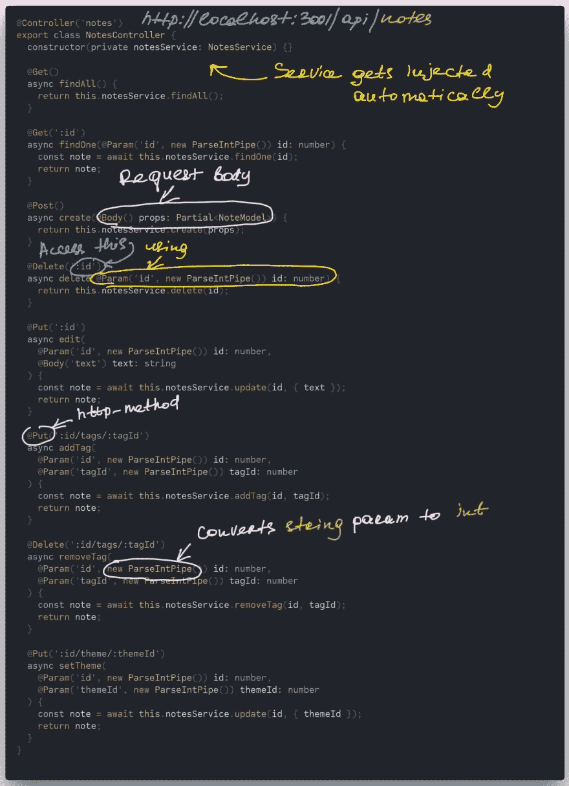](https://res.cloudinary.com/practicaldev/image/fetch/s--kyCKPnjZ--/c_limit%2Cf_auto%2Cfl_progressive%2Cq_auto%2Cw_880/https://paper-attachments.dropbox.com/s_1F921D6055F211537012522AC3AED06A165C5605936BC0BA49129723816F6EFE_1560199822090_Image%2B9.jpg)

您可能已经注意到`NotesService`(以及其他服务)目前只是一个存根，什么也不做。在一次关于 ORM 的小对话之后，我们将很快解决这个问题。

## 蠕虫

历史上，ORMs 的目的是消除[对象关系阻抗不匹配](https://en.wikipedia.org/wiki/Object-relational_impedance_mismatch)。他们通过尽可能抽象出 RDBMS 和关系概念来做到这一点，他们特别擅长对你隐藏 SQL 并强迫你使用他们的 DSL，这仍然很糟糕，因为这是一个[泄漏抽象的突出例子](https://en.wikipedia.org/wiki/Leaky_abstraction)。

我记得在很多情况下，我花了几个小时与这种 DSL 进行斗争，试图模仿一个我已经用 SQL 编写的查询(在这上面花了几分钟)。即使我们成功地编写了一个合适的 DSL，它仍然可能被转换成您无法控制的畸形的(不总是高性能的)SQL。

关系数据库的真正威力来自 SQL 及其声明性表达能力。实际上，我的大多数同事都非常熟悉 RDBMS 概念。对于他们来说，从 SQL 查询的角度来考虑是很舒服的，而且开发人员通常对 DB record 应该如何以他们选择的语言表示为一个对象(字典、地图，等等)有一个直观的理解。

在 ORM 中对开发人员隐藏 SQL 是没有意义的，因为您仍然需要知道它，以便至少从数据库中获取一些东西，但是除此之外，您还需要在头脑中启用一个编译器，将 DSL 转换为 SQL，以便了解最终将生成什么样的查询，以及它是否会给出您想要的结果。

双重工作给你的大脑带来了额外的压力，你的大脑试图保持和协调你正在做的项目中的无数其他小事。

如果你已经精通 SQL，为什么还需要学习另一种语言(DSL)来从数据库中获取/更新数据呢？ORMs 实现一个尽可能接近 SQL 的 API，允许将现有开发人员的 SQL 知识转移到那个 API，拉平学习曲线，不是更好吗？
这样的 API 将利用自动完成和静态代码分析等语言特性，同时仍然接近生成的 SQL。

在我看来，像 Hibernate、TypeORM 和类似的解决方案都是超载、笨重和过于复杂的。

这就是[反对](https://vincit.github.io/objection.js)的原因。与其他 ORM 相比，它没有试图将 SQL 和关系模型隐藏起来。异议开发人员是这样描述他们的产品的:

> Objection.js 是 [Node.js](https://nodejs.org/) 的一个 [ORM](https://en.wikipedia.org/wiki/Object-relational_mapping) ,目的是不碍事，尽可能容易地使用 SQL 和底层数据库引擎的全部功能，同时仍然使常见的东西变得容易和有趣。

## 🍽️将异议与嵌套相结合

**TLDR；**如果你只是想知道应该做些什么才能在 Nest 中获得异议支持，这里是[差异](https://github.com/rychkog/nest-objection-article/commit/5644b3295c8d5064606eff5e7c9296f90f3f2143)，它显示了应该在我们的初始提交之上应用的更改。

1️⃣ **安装所需的依赖项**
`npm i @types/dotenv dotenv objection knex pg`

*   **dotenv** 用`.env`文件中定义的环境变量填充`process.env`
*   **反对**——ORM
*   knex 是 Objection 在幕后使用的一个 SQL 查询构建器。它还提供了*迁移*和*数据播种*支持(我们稍后会谈到这一点)
*   pg 是 PostgreSQL 数据库的客户端。

2️⃣ **关系模型**
下一步是定义我们的关系模型(现在只要熟悉我们将要构建的表)

[](https://res.cloudinary.com/practicaldev/image/fetch/s--cdUcvmQx--/c_limit%2Cf_auto%2Cfl_progressive%2Cq_auto%2Cw_880/https://paper-attachments.dropbox.com/s_1F921D6055F211537012522AC3AED06A165C5605936BC0BA49129723816F6EFE_1560075747688_postgres.png)

*   笔记可能有一个主题
*   注释可以有多个标签
*   一个标签可以属于多个注释

> **knex_migrations** 和 **knex_migrations_lock** 是由 knex 创建和管理的表。
> 它们与我们的数据模型无关。

3️⃣ **用助手脚本扩展 package . JSON**
在我们开始创建迁移之前，让我们添加几个命令到我们的`package.json`
别担心，它们的目的将在后面的部分变得清楚。

[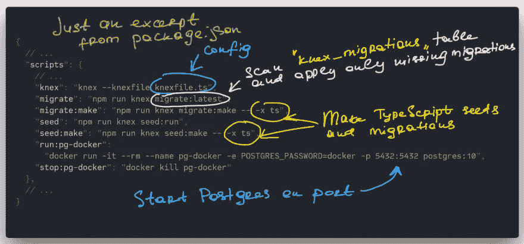](https://res.cloudinary.com/practicaldev/image/fetch/s--xWQyAsCs--/c_limit%2Cf_auto%2Cfl_progressive%2Cq_auto%2Cw_880/https://paper-attachments.dropbox.com/s_1F921D6055F211537012522AC3AED06A165C5605936BC0BA49129723816F6EFE_1560199864056_Image%2B13.jpg)

4️⃣**knex file**T4】在上面的`package.json`节选中，你可能会注意到`--knexfile knexfile.ts`。这是一个指向 Knex 配置文件的参数，所以让我们在项目的根目录下创建它。

[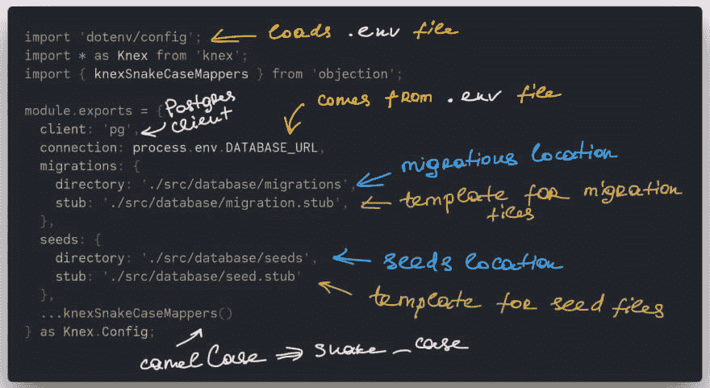](https://res.cloudinary.com/practicaldev/image/fetch/s--0tE8qJXV--/c_limit%2Cf_auto%2Cfl_progressive%2Cq_auto%2Cw_880/https://paper-attachments.dropbox.com/s_1F921D6055F211537012522AC3AED06A165C5605936BC0BA49129723816F6EFE_1560199900514_Image%2B5.jpg)

**knexSnakeCaseMappers** 将代码中的 *camelCase* 名称转换为数据库中的 *snake_case* 名称。
所以在我们的数据库模型中，我们有一个带有 **font_family** 列的**主题**表。为了从代码中更新该列，您可以使用 **fontFamily** 来引用它，映射器将通过自动转换 **font_family → fontFamily** 来完成这项工作，反之亦然。

迁移的*目的是创建一个数据库模式以及随后可能出现的对该模式的更改。这允许对数据库进行版本控制，并在需要时将模式回滚到以前的状态。*

当您需要用一些数据填充数据库时，种子在开发环境中非常有用。

**migration.stub** 和 **seed.stub** 是*模板文件*，Knex 用它来生成我们的迁移和种子。将它们放在配置中指定的`database`文件夹下

[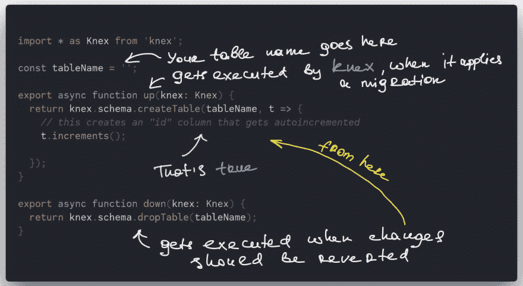](https://res.cloudinary.com/practicaldev/image/fetch/s--MXApxbzl--/c_limit%2Cf_auto%2Cfl_progressive%2Cq_auto%2Cw_880/https://paper-attachments.dropbox.com/s_1F921D6055F211537012522AC3AED06A165C5605936BC0BA49129723816F6EFE_1560199940403_Image%2B6.jpg)

[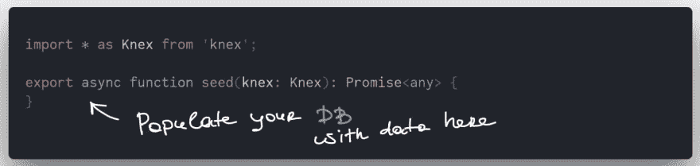](https://res.cloudinary.com/practicaldev/image/fetch/s--xmfhJArs--/c_limit%2Cf_auto%2Cfl_progressive%2Cq_auto%2Cw_880/https://paper-attachments.dropbox.com/s_1F921D6055F211537012522AC3AED06A165C5605936BC0BA49129723816F6EFE_1560199985691_Image%2B14.jpg)

5️⃣ **迁移**
现在，当我们创建了`knexfile.ts`之后，我们可以开始使用之前添加到`package.json`中的 Knex 命令。

*   `npm run migrate:make CreateTags`
*   `npm run migrate:make CreateThemes`
*   `npm run migrate:make CreateNotes`
*   `npm run migrate:make CreateNoteTags`

这些将使用我们的`migration.stub`在`database/migrations`文件夹下生成迁移文件。

是时候定义我们的表了。让我们一起来完成`CreateNotes`迁移吧其他人请看一下[最终解决方案](https://github.com/rychkog/nest-objection-article/tree/master/src/database/migrations)。

[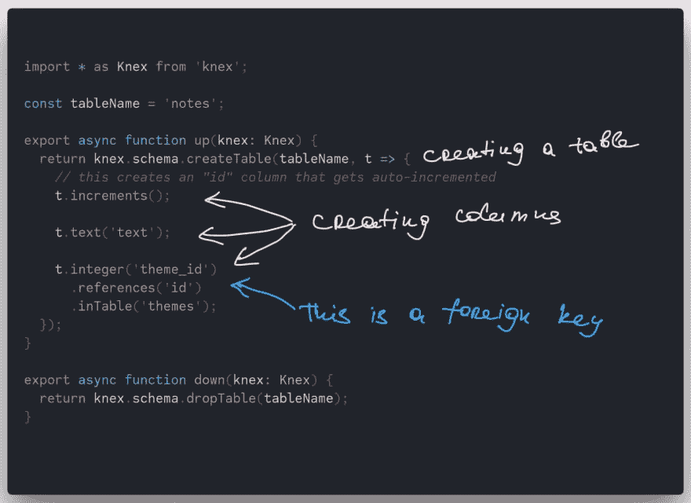](https://res.cloudinary.com/practicaldev/image/fetch/s--pTD-Bfhc--/c_limit%2Cf_auto%2Cfl_progressive%2Cq_auto%2Cw_880/https://paper-attachments.dropbox.com/s_1F921D6055F211537012522AC3AED06A165C5605936BC0BA49129723816F6EFE_1560200028805_Image%2B3.jpg)

6️⃣ **用 object**
连接我们的模型为了在我们的代码中反映关系表，我们需要创建一堆适当的类，称为*模型*。目前，它们只是位于`database/models`目录下的普通类型脚本类，所以让我们在它们上面添加一些*异议*。

**基本型号** ( `base.model.ts`)

[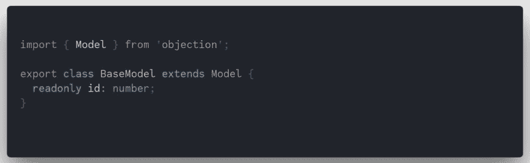](https://res.cloudinary.com/practicaldev/image/fetch/s--WC8tLMcx--/c_limit%2Cf_auto%2Cfl_progressive%2Cq_auto%2Cw_880/https://paper-attachments.dropbox.com/s_1F921D6055F211537012522AC3AED06A165C5605936BC0BA49129723816F6EFE_1560200062684_Image%2B2.jpg)

**TagModel** ( `tag.model.ts`)

[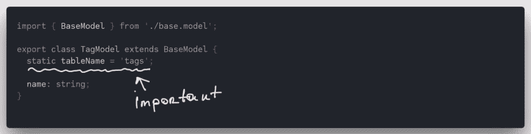](https://res.cloudinary.com/practicaldev/image/fetch/s--YuRyt5ma--/c_limit%2Cf_auto%2Cfl_progressive%2Cq_auto%2Cw_880/https://paper-attachments.dropbox.com/s_1F921D6055F211537012522AC3AED06A165C5605936BC0BA49129723816F6EFE_1560200081764_Image%2B15.jpg)

**NoteTagModel** ( `note-tag.model.ts`)

[](https://res.cloudinary.com/practicaldev/image/fetch/s--j9bzIbmQ--/c_limit%2Cf_auto%2Cfl_progressive%2Cq_auto%2Cw_880/https://paper-attachments.dropbox.com/s_1F921D6055F211537012522AC3AED06A165C5605936BC0BA49129723816F6EFE_1560200097152_Image%2B7.jpg)

**主题模型** ( `theme.model.ts`)

[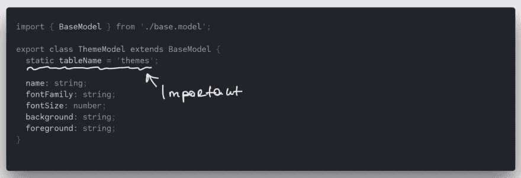](https://res.cloudinary.com/practicaldev/image/fetch/s--5y1X7GCK--/c_limit%2Cf_auto%2Cfl_progressive%2Cq_auto%2Cw_880/https://paper-attachments.dropbox.com/s_1F921D6055F211537012522AC3AED06A165C5605936BC0BA49129723816F6EFE_1560200134180_Image%2B16.jpg)

7️⃣ **映射关系**

[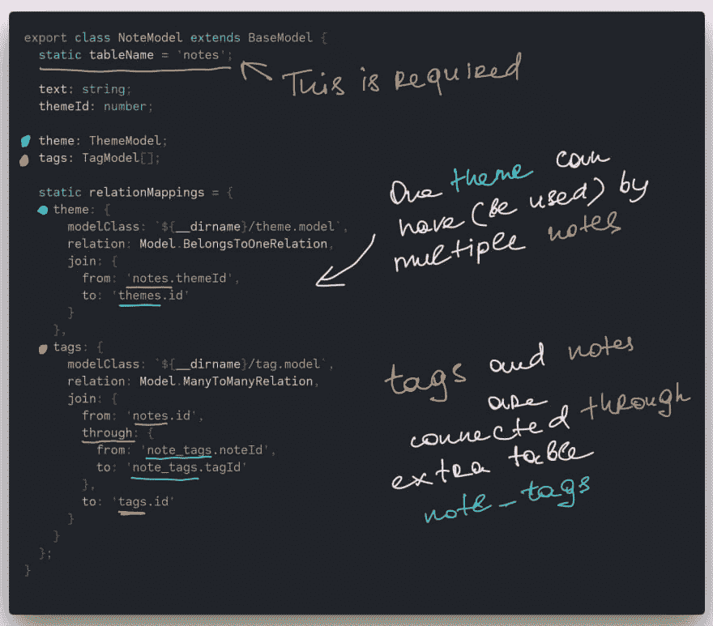](https://res.cloudinary.com/practicaldev/image/fetch/s--eBn6uo49--/c_limit%2Cf_auto%2Cfl_progressive%2Cq_auto%2Cw_880/https://paper-attachments.dropbox.com/s_1F921D6055F211537012522AC3AED06A165C5605936BC0BA49129723816F6EFE_1560200146666_Image%2B8.jpg)

8️⃣ **将模型连接到数据库和 database.module.ts**

每个模型类都可以用来执行各种 SQL 查询，但是为此，我们需要将这些类与 Knex 数据库连接起来。

一旦它们被连接起来，我们就可以将这些类作为可注入的服务公开给其他模块。

[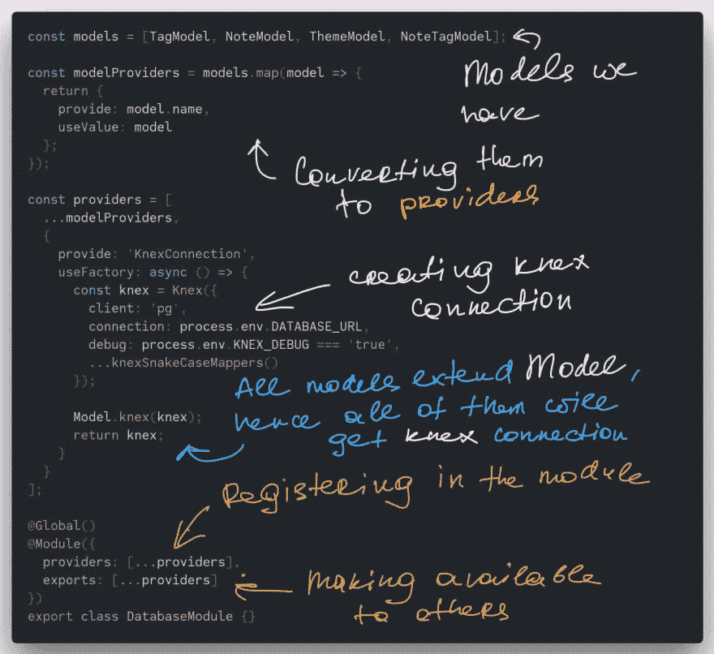](https://res.cloudinary.com/practicaldev/image/fetch/s--EFWMds4l--/c_limit%2Cf_auto%2Cfl_progressive%2Cq_auto%2Cw_880/https://paper-attachments.dropbox.com/s_1F921D6055F211537012522AC3AED06A165C5605936BC0BA49129723816F6EFE_1560200173729_Image%2B4.jpg)

DatabaseModule 需要在主 ApplicationModule 下注册，这样它导出的所有服务都可以用于其他模块。

[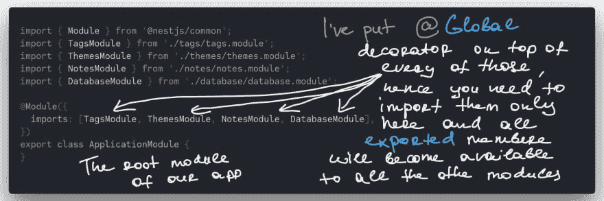](https://res.cloudinary.com/practicaldev/image/fetch/s--vFIak_yi--/c_limit%2Cf_auto%2Cfl_progressive%2Cq_auto%2Cw_880/https://paper-attachments.dropbox.com/s_1F921D6055F211537012522AC3AED06A165C5605936BC0BA49129723816F6EFE_1560200194065_Image%2B1.jpg)

9️⃣ **Implementing.service.ts 文件**
为了开始操作数据库中的数据，我们需要实现 **.service.ts** 文件中定义的方法。

每个服务都依赖于我们在上面通过模块的*输出*公开的模型类。
下面是 NotesService 实现(`notes.service.ts`):

[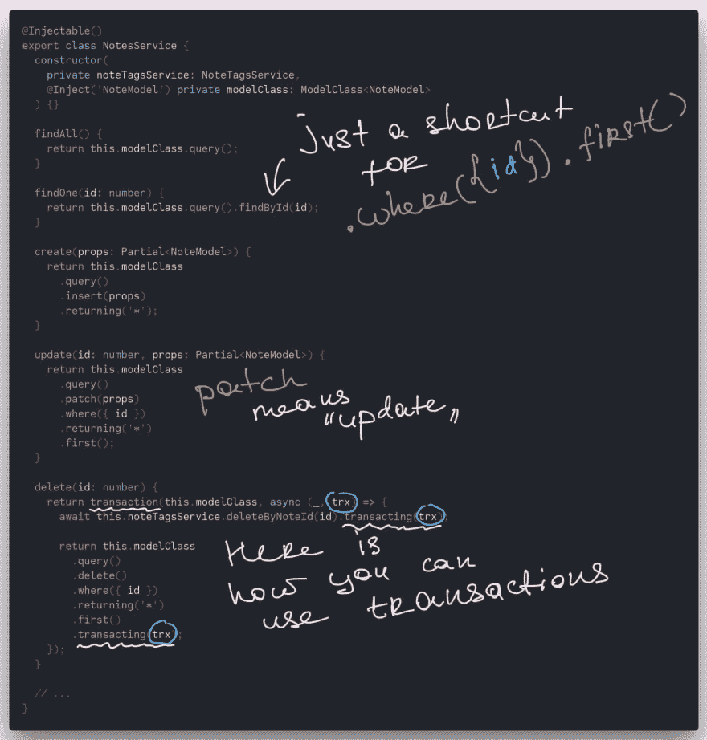](https://res.cloudinary.com/practicaldev/image/fetch/s--AmMdwxXH--/c_limit%2Cf_auto%2Cfl_progressive%2Cq_auto%2Cw_880/https://paper-attachments.dropbox.com/s_1F921D6055F211537012522AC3AED06A165C5605936BC0BA49129723816F6EFE_1560200245958_Image%2B11.jpg)

如您所见，`.query()`方法是构建[丰富查询](https://vincit.github.io/objection.js/guide/query-examples.html#find-queries)的一个途径。
在上面的例子中，我们还有一个事务例子，所以在`transaction`回调中抛出的任何错误都会导致回调中触发的数据库更改回滚。

🔟**加载票据关系**
我们来看看[票据控制器](https://github.com/rychkog/nest-objection-article/blob/master/src/notes/notes.controller.ts#L15)中的`findOne`方法:

[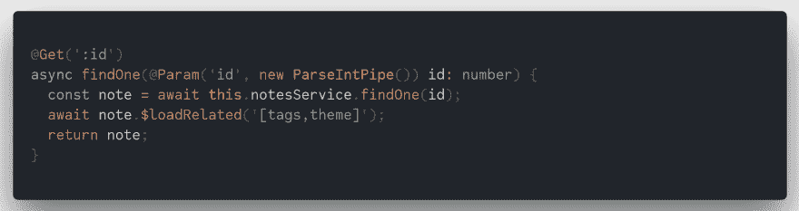](https://res.cloudinary.com/practicaldev/image/fetch/s--vg3CFimi--/c_limit%2Cf_auto%2Cfl_progressive%2Cq_auto%2Cw_880/https://paper-attachments.dropbox.com/s_1F921D6055F211537012522AC3AED06A165C5605936BC0BA49129723816F6EFE_1560200685418_findOne.png)

最显著的变化是`$loadRelated`调用。在这里，我们对这个特殊音符的负载关系提出异议:

[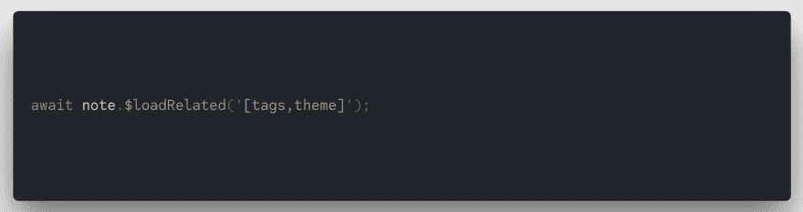](https://res.cloudinary.com/practicaldev/image/fetch/s---DVd4eIL--/c_limit%2Cf_auto%2Cfl_progressive%2Cq_auto%2Cw_880/https://paper-attachments.dropbox.com/s_1F921D6055F211537012522AC3AED06A165C5605936BC0BA49129723816F6EFE_1560200709346_findOne-zoom.png)

`tags`和`theme`是在 **NoteModel** 类中定义的关系的名称。这就是异议如何知道如何获取它们。

所有提取的关系都被转换成适当的模型实例。
一旦获取，Objection 将为这个特定的 note 实例创建**标签**和**主题**字段。

因此，默认情况下，所有关系都是按需加载的。

如果你想获取大量带有加载关系的对象，还有另一种方法[你可以使用](https://github.com/rychkog/nest-objection-article/blob/master/src/notes/notes.controller.ts#L11):

[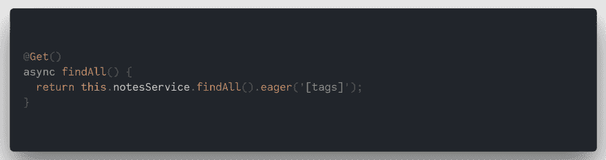](https://res.cloudinary.com/practicaldev/image/fetch/s--eXlfxQf_--/c_limit%2Cf_auto%2Cfl_progressive%2Cq_auto%2Cw_880/https://paper-attachments.dropbox.com/s_1F921D6055F211537012522AC3AED06A165C5605936BC0BA49129723816F6EFE_1560200725807_findAll.png)

在这里，一旦加载了所有注释，异议将加载所有注释的`tags`关系。

1️⃣ 1️⃣ **种子**
现在我们准备生成种子文件:

*   `npm run seed:make 01-Tags`
*   `npm run seed:make 02-Themes`
*   `npm run seed:make 03-Notes`
*   `npm run seed:make 04-NoteTags`

使用我们的`seed.stub`在`database/seeds`文件夹下生成种子。

Knex 按顺序执行种子文件，所以我们必须确保它是正确的。这就是我们在种子文件前面加上数字的原因:我们希望在 note-tags 之前创建标签，因为后者依赖于前者。

让我们来看看`02-Themes.ts` seed 的实现

[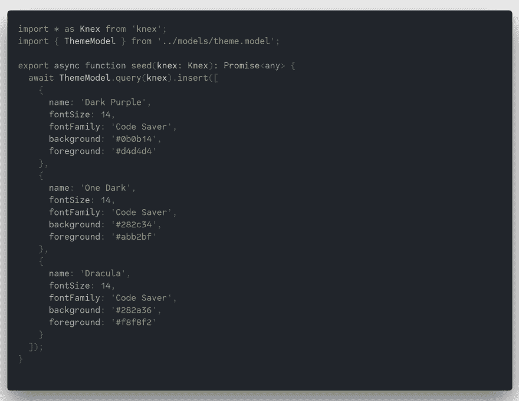](https://res.cloudinary.com/practicaldev/image/fetch/s--mguz_FUB--/c_limit%2Cf_auto%2Cfl_progressive%2Cq_auto%2Cw_880/https://paper-attachments.dropbox.com/s_1F921D6055F211537012522AC3AED06A165C5605936BC0BA49129723816F6EFE_1560092333289_02-Themes.png)

1️⃣2️⃣**dotenv**
[dotenv](https://github.com/motdotla/dotenv)是一个从**加载环境变量的库。env** 文件到`process.env`
中，我们将利用它来定义`DATABASE_URL` env 变量，然后将在整个应用程序中使用，包括迁移和种子脚本。

你只需要

1.  创建一个**。env** 文件，并将这一行 DATABASE _ URL = postgres://postgres:docker @ localhost:5432/postgres

这个连接字符串是基于我们在`package.json`中的命令构建的。Postgres 使用`postgres`作为默认用户和数据库的名称。

[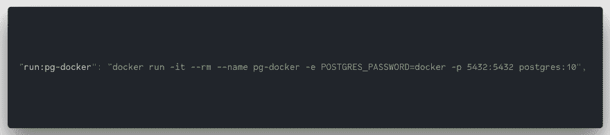](https://res.cloudinary.com/practicaldev/image/fetch/s--sVOMT_n---/c_limit%2Cf_auto%2Cfl_progressive%2Cq_auto%2Cw_880/https://paper-attachments.dropbox.com/s_1F921D6055F211537012522AC3AED06A165C5605936BC0BA49129723816F6EFE_1560200837212_run-docker.png)

1.  在 **knexfile.ts** 和 **main.ts** 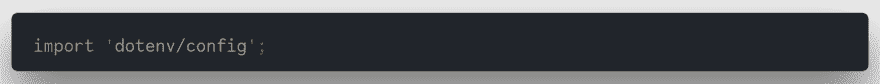的最顶端添加 **dotenv** import

1️⃣ 3️⃣ **运行 PostgreSQL**
此时我们需要启动我们的 PostgreSQL 实例:

```
`npm run run:pg-docker` 
```

然后创建模式(通过执行迁移)并用数据填充它(通过执行种子):

```
`npm run migrate && npm run seed` 
```

## 🚀玩应用程序

现在，您应该有一个支持异议的完全正常工作的 Nest 应用程序了。

您可以使用以下命令运行它

```
`npm run start` 
```

**README.md** 包含示例 http 请求(使用 ***curl*** )，您可以针对服务器修改和执行这些请求。

我们结束了🎉

## 摘要

在这篇文章中，我分享了我对精神疲劳的想法，以及通过正确的工具，可以利用清晰直观的概念来帮助与他人交流和分享知识，从而减轻精神疲劳。

Nest 通过提供一个概念基础来做到这一点，这不仅对于项目的推理，而且对于向其他开发人员传达它的工作方式都是非常好的。

Objection 为您提供了一个框架，允许您用 SQL 术语进行思考，并避免浪费时间调试深奥的 DSL。我称之为“无痛 ORM”。

我希望你喜欢这篇文章，并对如何开始在 Nest 中使用 Objection 有所了解。

你可以在我的 github 上找到[完整项目](https://github.com/rychkog/nest-objection-article)。

*这个帖子由 [ThisDot](https://www.thisdot.co/) 的 Georgii Rychko 撰写。*

需要 JavaScript 咨询、指导或培训帮助吗？在 [This Dot Labs](//thisdot.co) 查看我们的服务列表。*