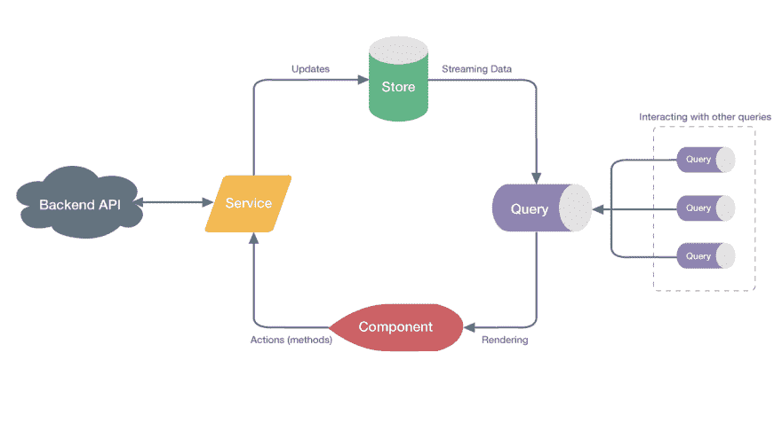

# 用秋田增压你苗条的状态管理

> 原文：<https://dev.to/theblushingcrow/supercharge-your-svelte-state-management-with-akita-4leo>

JS 框架的世界里有了一个新玩家——Svelte。顾名思义，Svelte 就是瘦，非常瘦。事实上，Svelte 的工作方式是在构建阶段将代码编译成(理想的)普通 js，而不是在运行阶段解释它，人们将它描述为非框架，它自己的创造者[称它为语言](https://gist.github.com/Rich-Harris/0f910048478c2a6505d1c32185b61934)，而不是框架。具体来说，它是为描述反应式用户界面而创建的。

我开始和斯维特一起玩，到目前为止，我玩得很开心。创作者 Rich Harris 提供的教程是一个非常愉快的介绍。完成后，我开始想知道[秋田](https://netbasal.com/introducing-akita-a-new-state-management-pattern-for-angular-applications-f2f0fab5a8)，我们在拿督拉马这里创建的国家管理解决方案，将如何与 Svelte 协同工作。

### 苗条+秋田=一个伟大的组合

如果你已经熟悉了 Svelte，你可能会问自己为什么还需要额外的状态管理，因为 Svelte 有内置的反应存储功能。如果你有一个小的应用程序，你可以单独使用 Svelte API。然而，更大、更复杂的应用程序需要成熟的状态管理解决方案。这类似于当我们有了 React 的上下文 API 时，我们需要 Redux。

关于秋田建筑的说明:

Akita 的两个主要组件是存储和查询。您可以将存储想象成数据库中包含数据的表，并且可以对其执行各种操作，如插入、更新等。我的细长组件将被动地从查询中获取数据。因为我希望它保持对其数据源的不可知，所以我不会在组件内部导入存储；相反，我将为组件创建一个服务。

如您所见，Akita 为管理您的状态数据定义了一个严格的模式。它附带了强大的实体管理、一组健壮的插件和开发工具，以及自己的 cli。Svelte 和 Akita 是一个很好的自然组合，因为 Akita 的查询可以返回 observables，Svelte **支持开箱即用**。这里有一个例子可以说明这两者是如何结合使用的:

### 并入秋田

为了将 Akita 添加到我的苗条应用程序中，我通过 npm 安装了它和它的 cli。我从一颗新鲜的[苗条的种子](https://github.com/antony/svelte-seed)开始，继续使用苗条和秋田创建传统的“待办事项”应用程序。

### 待办事宜实体存储

由于我们要处理 TODO 项目，我选择在秋田创建一个实体店。您可以将实体存储视为数据库中的一个表，其中每一行代表一个实体。为此，我使用了 [Akita CLI](https://github.com/datorama/akita/tree/master/cli) 。

为了对我的实体执行 CRUD 操作，存储本身有我需要的所有内置方法。