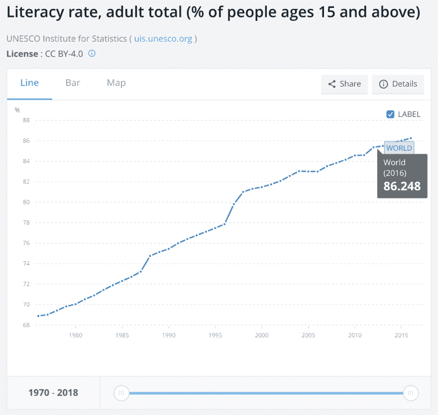
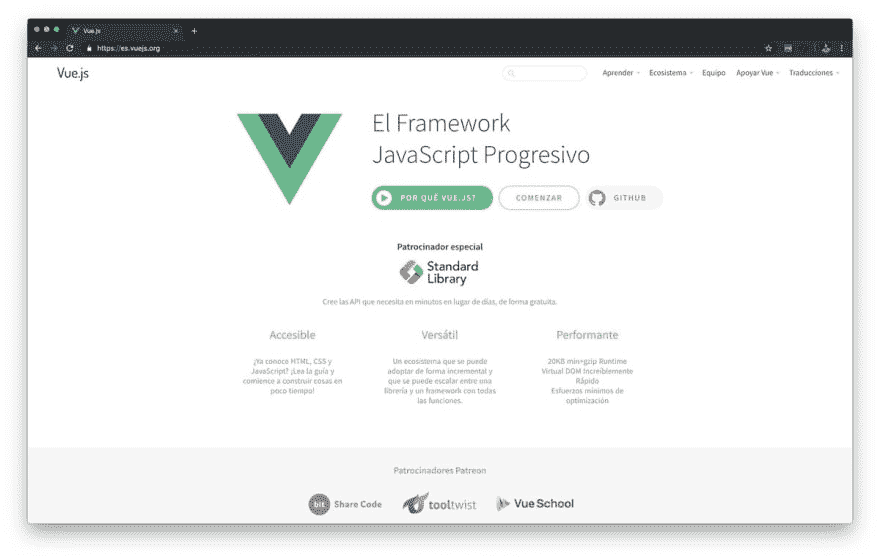

# 翻译 Vue:为什么国际化文档实际上很重要？

> 原文：<https://dev.to/fedekau/translating-vue-why-internationalizing-documentation-actually-matters-8h3>

*最初发表于[斯特里弗的博客](https://www.streaver.com/blog/posts/translating-vue-why-internationalizing-documentation-actually-matters.html)。*

## 如果你正在读这篇文章，那么你是一个相当幸运的人

我们中的大多数人(包括我自己)每天醒来都理所当然地认为我们懂英语，我们不会想太多，我们很幸运，你要么是以英语为母语的人，要么在你的生活中有足够的机会学习英语，由于你在这里，你可能有一份很好的技术工作，当你受阻时，你只需在谷歌上键入一个问题，就会出现一些答案，或者你可以去阅读你最喜欢的编程语言或框架的文档。

简单对吗？

## 你知道有多少人连读写都不会？

如果你的答案是**零**，那么你可以再次认为自己是幸运的，根据世界银行的数据，15 岁以上成年人的[识字率为 86%](https://data.worldbank.org/indicator/SE.ADT.LITR.ZS?name_desc=false&type=shaded) ，但有些国家的这一数字甚至低于 50%。如果你来自这些国家中的一个，那就意味着你的母亲或父亲可能不会读或写。

## 这些人中有多少人能读或写英语？

世界上大约有 25%的人说英语，让我们非常慷慨地假设 90%的技术人员说英语(我找不到这方面的任何数据)。虽然将 10%的技术人员排除在外听起来不算多，但现在想象一下，如果在这 10%的人中有一个人有一个伟大的想法，一个可能彻底改变技术行业的想法，但他/她不能实现它，因为他们没有获得正确的信息或工具。对我来说，10%是一个很大的数字，如果我那样想的话。

语言限制了技术发展，就像饥饿限制了其他领域的发展一样，这在联合国基金会的文章[关注结束饥饿的 5 个理由](https://unfoundation.org/blog/post/5-reasons-care-end-hunger/)中有更好的解释。

## 那你能帮上什么忙？

伟大的库或产品通常有伟大的文档页面，所以最简单的帮助方式可能是联系作者或公司，让他们知道这个问题，向他们要一个`lang.library.com`子域，如果你会说多种语言，就开始翻译。如果你不知道，也许只是在你的圈子里传播这个问题，有人可能会帮助你。你也可以创建/参加本地聚会，并提出这个问题。

这些只是开始的一些方法，也许我们会一点一点地把假设的 10%减少到接近零。

### 翻译 VueJS

如果你去[vuejs.org](https://vuejs.org/)你会看到一个菜单，上面列出了所有官方文档的公共翻译，这些文档完全是由社区制作的，那里的所有人都花了一些时间来帮助翻译这些文档。

几个月前，我们认识的一些人开始致力于西班牙语翻译，只是因为他们想提供帮助，之后，我们加入了这项工作，经过几个月的工作，我们终于建立了一个翻译域，它还没有 100%完成，我们大约完成了 95%，但该域是公开的，你可以在[es.vuejs.org](https://es.vuejs.org/)看到结果。

你可以在 github.com/1950Labs/vuejs.org#spanish 看到所有相关人员，感谢他们，现在说西班牙语的人可以从这些文件中受益了，❤️！

> 费德里科·考夫曼@费德考夫曼经过几个月的工作， [@vuejs](https://twitter.com/vuejs) 文档的西班牙语翻译版已经出炉🚀。说西班牙语的人可以开始利用这一点。在[es.vuejs.org](https://t.co/4Nd5cElFCh)处检查。是时候升级你的游戏了，负责任地学习吧！谢谢你的社区！❤️20:38pm-2019 年 6 月 10 日1857

## 结论

帮助社区可以有很多方式，你不必发明有史以来最伟大的图书馆来成为一个伟大的社区成员，例如，你可以帮助翻译工作，你可以简单地在世界各地寻找有时间帮助的人。通过帮助社区，我们正在建设一个更好的技术世界，通过翻译，我们降低了那些没有那么幸运的人的准入门槛。

散布消息