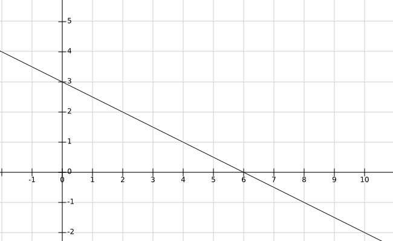

# 函数式编程概述

> 原文：<https://dev.to/drbearhands/a-broad-look-at-functional-programming-3i2f>

在这篇文章中，我的目标是传达对“函数式编程”的一般理解。我还会插入对某些特性或范例有用性的主观价值判断。最后，我会解释为什么你不能“不使用副作用”，因为我看到它问了很多。

我没有包括代码示例，因为在我看来，使用命令式结构来描述函数式编程是完全错误的。

如果你对这篇文章或(纯粹的)函数式编程有任何问题，请在评论中提问！

### “功能性”是什么意思？

“函数式编程”中的“函数”指的是数学函数，而不是“函数式需求”中的“它应该做什么”。

你可能在学校里遇到过函数，比如像`y = 3 - 0.5x`这样的线方程。

<figure>[](https://res.cloudinary.com/practicaldev/image/fetch/s--oCOWcaN_--/c_limit%2Cf_auto%2Cfl_progressive%2Cq_auto%2Cw_880/https://thepracticaldev.s3.amazonaws.com/i/sqdhk1syk7q90fj8fmpk.png) 

<figcaption>直观表示一个函数的</figcaption>

</figure>

 *在这个等式中，我们可以将定义每个`x`的`y`值的函数`f`表示为`f(x) = 3 - 0.5x`。

如你所见，`f(x)`的值完全取决于输入变量`x`，而不取决于任何隐藏状态、随机性、用户输入或 IO。这是数学函数的一个本质属性。在计算机科学中，我们经常假装程序/例程也是函数，所以我们必须区分常规函数(程序)和*纯*函数(数学函数)。

这本身还不是特别有用，但是还有更多！我们也可以使用函数作为其他函数的参数。为了做到这一点，让我们来看看这一切的开端，λ演算:

λ x . x + 1

上面的表达式说:如果你给我某个值 x(“λx .”)，我会用“x + 1”中的那个值代替“x”。所以，如果我们传递给它一个“7”，它用“x”代替“7”，我们得到“7 + 1”。下面是它的一步一步的工作方式:

f = λ x . x + 1

我们试图评估 f 7，所以首先让我们用函数代替它的值:

= (λ x . x + 1) 7

然后我们将 lambda 表达式应用于值 7。我们通过用 7 替换参数 x 来做到这一点:

= 7 + 1
= 8

lambda 表达式定义一个函数，但不像常规函数那样命名它。lambda 表达式只是一个值。因此，它可以是函数的返回类型。我们写可以把函数 add(x，y) = x + y 写成一个 lambda 表达式。

add = λ x . λ y . x + y

这里，第一个 lambda (λ x)表示它接受一个“x”，并返回第二个 lambda 表达式！然后，我们可以向第二个 lambda 表达式传递第二个参数或我们的加法。如果我们想把 3 和 4 相加，我们可以这样调用这个函数:

添加 3 4

别担心，我们在实践中不会编写这样的功能代码。这仅仅是教育。
那么让我们来评价一下这个表达:

加 3 4
= (λ x . λ y . x + y) 3 4

先对 lambda 表达式应用 3:
=(λy . 3+y)4

然后套用 4:
= 3 + 4
= 7

我们不需要立即评估每一个 lambda 表达式，以下是完全有效的:

继任者=添加 1

其计算结果为:
后继者=加 1
= (λ x . λ y . x + y) 1
= λ y . 1 + y

继任者只是另一个功能！

我们也可以接受函数作为输入:

应用 7 = λ f . f 7

我们可以这样评价它:

应用 7 后继者
= (λ f . f 7)后继者
=后继者 7
= (λ y . 1 + y) 7
= 1 + 7
= 8

事实证明，在使用像常规变量这样的函数时，你可以做很多很酷的事情。现在，如果你从未见过 lambda 表达式，你可能应该让你的头脑休息一下。

#### 功能风格 vs 功能纯度

我之前提到过，在 CS 中，我们经常称例程为“函数”。不幸的是，这种误称延续到了“函数式编程”，因此我们必须区分函数式*风格*和函数式*纯度*。

Functional *style* 仅仅意味着将函数视为变量(或多或少)，就像我们上面做的那样。功能上*纯度*和前面一样，说明你的函数是数学函数。

当人们谈论函数式编程时，他们往往指的是函数式*风格*，而不一定是函数纯度。另一方面，当人们谈论函数式编程的数学性质时，他们可能指的是纯粹的*函数式编程。反过来就不正确了，一些谈论功能纯粹性的人很可能也想要功能风格。*

我个人是(双关警戒！无论风格如何，对不纯的编程绝对不感兴趣。为了弄清楚为什么，让我们看看下面不纯的伪代码:

```
routine addLogged(a, b)
  log a
  return a + b

addOne = addLogged 1

seven = addLogged 3 + 4

eight = addOne seven 
```

<svg width="20px" height="20px" viewBox="0 0 24 24" class="highlight-action crayons-icon highlight-action--fullscreen-on"><title>Enter fullscreen mode</title></svg> <svg width="20px" height="20px" viewBox="0 0 24 24" class="highlight-action crayons-icon highlight-action--fullscreen-off"><title>Exit fullscreen mode</title></svg>

日志会是`"1\n3"`还是`"3\n1"`？Lambda 演算没有指定依赖之外的求值顺序，所以没办法讲！一个不纯 FP 的精明捍卫者可能会说“哦，但这只是奉承的结果，这不是 FP 所需要的！”。这是真的，但只是因为为了清楚起见，我举了一个非常简单的例子。核心问题是，您正在创建可能无处不在的函数之间的不明显的依赖关系。这又是一段`goto`式的代码，只不过不是为了指令指针。

另一个支持不纯函数的论点是“一台没有效果的计算机只是一个空间加热器！”。这在技术上是不正确的，没有效果，你的程序甚至永远不会被评估，所以不会产生热量。玩笑归玩笑，我们越来越接近这样一个点，即每一个效应都有一个比看似纯粹计算的隐藏副作用更好的表现。但是对于这篇文章来说，这是一个太高级的话题。容易使用这种新知识的工具也还不存在。

### 数学优势

函数式编程(也就是类型化的 FP)已经被证明在数学中有 3 种不同的方式是“正确的”。我们已经看到了 lambda 演算，但它也对应于逻辑(构造性的和线性的)和范畴理论。

这种对应关系允许函数式程序员学习数学中最基本的领域，而不是某些领域。这可以让关于函数式编程的讨论不时显得令人望而生畏，但是你不需要理解为什么“集合范畴中的`Set`类型构造函数不是一元的” <sup>2</sup> 就可以写函数式代码。这种差异被称为哈斯克尔金字塔。

然而，高等数学是用来使函数式编程更容易。例如，没有任何文档像纯函数的类型签名那样可靠。事实上，根据库里-霍华德同构，变量的类型是一个命题，它的*证明*是它的项(如果你愿意的话，是它的体)。否则，编译器会抛出一个错误。

从范畴理论的角度来看，因为范畴理论是对*组合*的研究，我们知道我们编写(从更基本的指令组合)程序的方式是有效的。至少，对于我们所处的类别来说。

### 但是循环呢？

循环本质上是有状态的，我们设置一个变量，并不断地改变它。如果没有某种形式的循环，一门语言肯定不会是图灵完全的吗？或者甚至是有用的！

我们现在对无类型 lambda 演算的答案不感兴趣，因为函数程序员倾向于真正喜欢类型。在类型化 lambda 演算的情况下，我们使用递归！

f = λ x .
如果 x > 0
那么 1 : f (x - 1)
else []

这会创建一个大小为 x 的 1 的列表。“1”类似于 push_front 函数，只是它是无状态的，所以“x : xs”是说“创建一个以 x 开头的列表，后面跟着一些其他的列表 x”。在我们的例子中，“1 : f (x - 1)”创建一个从 1 开始的列表，后面跟着从“f (x - 1)”出来的任何内容。我们在 f 本身的主体/术语中使用 f！如果条款是证据，那当然是违法的？你是对的，在常规函数式编程中，只有当程序终止时，证明才成立*。但是通过停机问题，我们知道我们不能证明图灵完全语言的终止性。所以大多数人只是接受不终止的风险。其他要求终止证明。在我们的例子中，我们可以得到这样的证明，因为我们的整数 x 逐渐下降，我们有一个停止准则(如果 x > 0)将在某个点触发递归*将*到达。回到这个例子:*

f 3
= (λ x . if x > 0 然后 1 : f (x - 1) else []) 3
= if 3 > 0 然后 1:f(3-1)else[]
= 1:f(3-1)
= 1:f 2
= 1:((λx . if x>0 然后 1 : f (x - 1) else []) 2)
= 1 : (if 2 > 0 然后 1:f(2-1)else[])
= 1:(1:f(2-1))
= 1:(1:f 1)
= 1:(1:((λx . if x>0 然后 1:f(x-1)else[])1))
= 1:(1:(if 1>0 然后 1 : f (1 - 1) else []))
= 1:(1:(1:f(1-1)))
= 1:(1:(1:f 0))
= 1:(1:(1:(λx . if x>0 然后 1:f(x-1)else[])0)】
= 1:(1:(1:(1:(if 0>0 然后 1:f(0-1)else[]))
= 1:(1:(1:[])
= 1:1:[]【1:】

关于递归真的没有太多其他要知道的了。一个函数调用自己，就是这样。

### 关于类型的一个说明

关于类型(安全函数式编程的基石)还有很多要学习的，但是对于这篇已经很长的文章来说，它们是一个太宽泛的主题。

### 比不使用副作用有什么好处？

这是我见过很多的问题。为什么我不能遵循不使用副作用的惯例，继续使用我知道的语言呢？不要误解我的意思，没有副作用通常是一个好的约定，但它和语言强制的功能纯粹性不是一回事。

首先，如果你不打算使用副作用，为什么你要选择使用副作用呢？
想象一下，有人询问你的银行信息，然后告诉你“哦，我不会用它的”。你会信任他们吗？未来和过去的你都是混蛋，不尊重现在的你，永远不应该被信任。
这个问题在大型组织或外包时变得更加明显。在这种情况下，并不是每个人都一样能干，甚至都一样愿意。知识胜于信任。带着纯洁，我*知道*我和其他人都没有因为一些想象中的截止日期而陷入旧习惯和讨厌的习惯。

第二，有了纯度限制，你的*工具*知道你没有副作用。这使得自动版本控制、代码验证、合并请求、文档等成为可能。等等。简单多了。工具不知道你遵循了哪个惯例，也不知道你在什么地方破例了。例如，在 Node.js 中，有一系列的错误会在运行时发生，但只是有时，可能不会在测试期间发生，在 Haskell 中，这些错误会阻止您的代码被编译，从而根本无法部署。

### 脚注

[1]不纯编程的类别是 Kleisli 类别，其中“结果”态射用副作用和底部来修饰。我不认为这种分类对编程有用，因为它像 Kleisli 分类那样隐藏了很多信息。然而，我指的是“绝对”的口语含义。
【2】在 Haskell 中，集合数据结构要求其元素具有某种有序关系，比如≤ for numbers，但并不是每种类型都有这样的顺序。单子没有这样的限制，所以集合不是单子。数学集合不需要顺序，只需要等式(顺便说一句，祝你找到等式的“正确”定义)。*