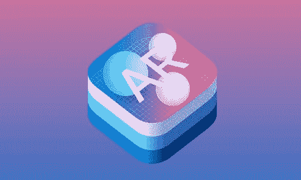
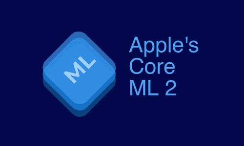
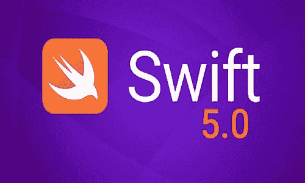
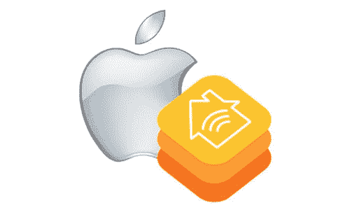

# 2019 年全新 iOS 12 将遵循的 iPhone/iOS 应用程序开发趋势

> 原文：<https://dev.to/zoeylayla/iphone-ios-app-development-trends-to-follow-in-2019-with-all-new-ios-12-55a8>

在早期，智能手机被认为是高端技术设备，对普通移动用户来说应用最少。目前，约有 21 亿移动用户使用智能手机，预计到 2019 年底将达到 50 亿。此外， [**iOS 应用程序开发公司**](https://www.way2smile.ae/iphone-app-development/) 应该立即适应 iOS 12 的最新趋势，否则会失败得很惨。许多移动应用程序开发人员希望通过 iOS 12 进行发展，并喜欢利用尖端技术为企业构建应用程序。

iOS 12 在 iOS 应用开发方面的一些突出进步是 ARKit2、Siri 快捷方式等。iOS 12 的流行被认为是确定无疑的，每个功能都频繁更新，以便企业利用。这将成为每个应用程序开发人员的惯例，了解 iOS 12 的所有功能和趋势，然后为最终用户构建他们梦想的 iOS 应用程序。最后，iOS 应用程序所遵循的趋势应该塑造用户参与的方式。

下面列出了制作 iOS 应用程序时遵循的一些最流行的趋势:

**第 2 页**

增强现实已经有了许多方法来实现用例，然后优化应用程序以实现更高的交互。一旦在苹果为 iPhone 8 和 iPhone X 展示的演示中浏览了一遍，它肯定会重振最终用户的所有信念和 2019 年的预期趋势。ARKit 2 的推出极大地帮助了应用程序开发人员创建创新的 AR 应用程序，这些应用程序描绘了生动的 AR 体验。

**人工智能**

虚拟助手不可避免的应用和它们的机器学习能力吸引了许多企业在 iOS 应用开发上投入巨资，尤其是构建聊天机器人。瞬间，这应该会增加每个移动应用程序开发者对 2019 年的兴趣。iOS 12 中基于人工智能的 Siri 的出现为第三方 iOS 应用在任何给定时刻的即时访问提供了舒适区。这就对应用开发者内部集成 iOS 应用内置的语音助手提出了巨大的需求。不过，移动用户对应用程序的疲劳总是存在的，如果像 Siri 这样的快捷助手可以在早期版本的 iOS 中使用，那么它应该会为企业带来更多的广告和收入。

**核心 ML2**

 
Core ML 是最新 iOS 12 中一个非常显著的特性，因为它具有自然语言处理能力和游戏功能。它赋予了 iOS 应用开发者有效量化 75%训练好的机器学习模型的能力。核心 ML 可以协调和加速苹果神经引擎中存在的每一个本机功能，以实现更快的操作。现在的 iPhones 将获得预测和理解模式的能力，以至于它几乎可以适应每一个用户的体验。它让应用程序开发人员在设计 iOS 应用程序时遇到了便利，这些应用程序本身就具有实时机器学习功能。

**iOS 应用安全**

 
一般来说，iOS 12 的安全级别很高，用于设计各种 iOS 应用程序，包括不断更新，以保持移动操作系统无故障。这也是 iOS 应用开发公司在追随其专用移动应用趋势的同时变得有选择性的一个重要因素。它还能让 iOS 应用程序开发人员定期更新应用程序。

**Swift 5.0**

 
Swift 5.0 及其庞大的库一起提供了运行时编译时应用程序二进制接口的稳定性，这将吸引许多移动应用程序开发人员转向 iOS 应用程序开发。Objective C 在早期主要用于编译，当时 Swift 编程的早期版本中没有 ABI 稳定性。现在，随着 Swift 5.0 的推出，它可能很快就会成为 iOS 开发者的顶级编程语言。据估计，到目前为止，大约有 3，50，000 个 Swift 应用程序被构建并在苹果应用程序商店中发布，这使得 Swift 5.0 的要求非常高。

**物联网和 HomeKit**

 
物联网是当今一代移动用户公认的最流行趋势之一。iOS Apps 在 2019 年的这场马拉松式物联网竞赛中竞争同样出色。Apple Home Kit framework 可以构建应用程序并生成操作，以提供从仪表板的完全控制权。这款家用套件功能强大，可以对支持物联网的移动设备的用户操作进行分组，然后通过 Siri 快捷方式进行访问。在不久的将来，家庭和办公自动化将通过物联网应用程序，特别是控制众多智能设备而受益匪浅。

**总结**
2019 年 iOS 应用开发的趋势将会更加创新，让开发者和移动用户津津乐道。这在苹果从 iPhone、iPad 等生产的许多设备中不会有太大的不同。此外，它应该为 iOS 应用程序社区获得更强大的客户基础。除了 iOS 应用趋势之外，企业友好型应用对于实施 BYOD 和移动性等先进概念至关重要。