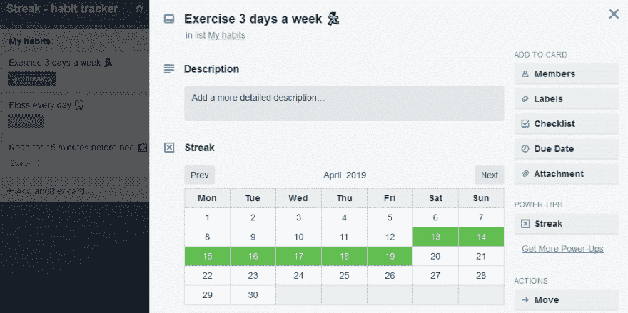

# 特雷罗的条纹习性追踪器

> 原文：<https://dev.to/emma/streak-habit-tracker-for-trello-j8m>

Streak 是一种 Trello 增强功能，允许您在 Trello 板上直接跟踪习惯。

你使用特雷罗卡片上的日历检查你已经完成了你的习惯，然后你可以一眼看到你是如何通过卡片正面的小徽章跟踪你的所有习惯的。

我最初在 Heroku 的免费计划上托管这个，但是过了一会儿它会让你的应用程序休眠，所以我转到 Github 页面免费托管。

这是我第一次启动 Trello，整个过程非常简单——我通过一个表格提交了启动，他们返回了一些反馈，它已经在 Trello 的启动目录中提供了几个月了！

如果您有任何功能建议或问题，请告诉我！