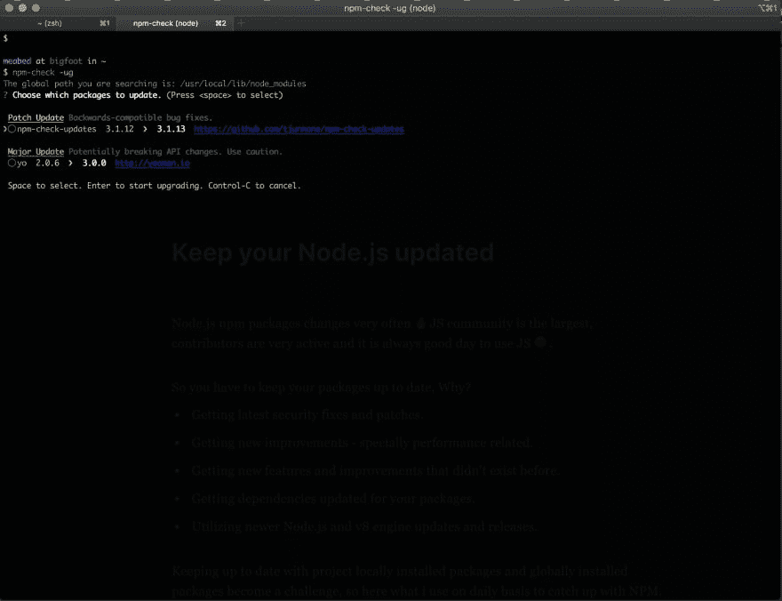
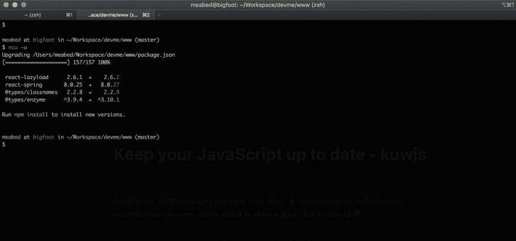
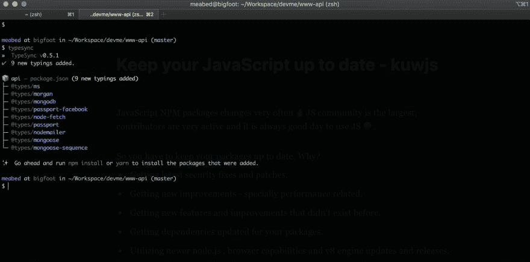

# 让你的 JavaScript 保持最新

> 原文：<https://dev.to/meabed/keep-your-javascript-up-to-date-kuwjs-1d0d>

JavaScript NPM 包经常变化🔥JS 社区是最大的，贡献者非常活跃，使用 JS 总是一件好事😆。

所以你必须保持你的包是最新的，为什么？

*   获取最新的安全修补程序和补丁。
*   获得新的改进—特别是与性能相关的改进。
*   获得以前不存在的新功能和改进。
*   为您的包更新依赖项。
*   利用较新的 node.js、浏览器功能和 v8 引擎更新和版本。

保持项目本地安装包和全局安装包的更新成为一个挑战。

## 我最喜欢的 3 个工具，我每天都用它们来跟上 JS。

## [1-NPM-检查](https://github.com/dylang/npm-check)

让您的全局 node.js npm 包保持最新。

```
 $ npm install -g npm-check

# check global installed packages and display existing version, new version and link to changelog or website.

$ npm-check -ug 
```

<svg width="20px" height="20px" viewBox="0 0 24 24" class="highlight-action crayons-icon highlight-action--fullscreen-on"><title>Enter fullscreen mode</title></svg> <svg width="20px" height="20px" viewBox="0 0 24 24" class="highlight-action crayons-icon highlight-action--fullscreen-off"><title>Exit fullscreen mode</title></svg>

[](https://res.cloudinary.com/practicaldev/image/fetch/s--os8lpP66--/c_limit%2Cf_auto%2Cfl_progressive%2Cq_auto%2Cw_880/https://meabed.com/conteimg/2019/07/image-3.png)
[T6】](https://res.cloudinary.com/practicaldev/image/fetch/s--i8OUrPud--/c_limit%2Cf_auto%2Cfl_progressive%2Cq_auto%2Cw_880/https://meabed.com/conteimg/2019/07/image-4.png)

## [2-NPM-检查-更新](https://github.com/tjunnone/npm-check-updates)

让 node.js npm 本地项目包保持最新。

```
 $ npm install -g npm-check-updates

# check locally project installed packages and updgrade packages.json

$ ncu -u 
```

<svg width="20px" height="20px" viewBox="0 0 24 24" class="highlight-action crayons-icon highlight-action--fullscreen-on"><title>Enter fullscreen mode</title></svg> <svg width="20px" height="20px" viewBox="0 0 24 24" class="highlight-action crayons-icon highlight-action--fullscreen-off"><title>Exit fullscreen mode</title></svg>

[](https://res.cloudinary.com/practicaldev/image/fetch/s--SvewfA9N--/c_limit%2Cf_auto%2Cfl_progressive%2Cq_auto%2Cw_880/https://meabed.com/conteimg/2019/07/image-5.png)

## [三型同步](https://github.com/jeffijoe/typesync)

保持您的类型同步和最新的-我最喜欢的节省时间和生产力的软件包之一！

```
 $ npm install -g typesync

# check locally project installed packages and add or update all types needed.

$ typesync 
```

<svg width="20px" height="20px" viewBox="0 0 24 24" class="highlight-action crayons-icon highlight-action--fullscreen-on"><title>Enter fullscreen mode</title></svg> <svg width="20px" height="20px" viewBox="0 0 24 24" class="highlight-action crayons-icon highlight-action--fullscreen-off"><title>Exit fullscreen mode</title></svg>

[](https://res.cloudinary.com/practicaldev/image/fetch/s--AbOM-yKm--/c_limit%2Cf_auto%2Cfl_progressive%2Cq_auto%2Cw_880/https://meabed.com/conteimg/2019/07/image-6.png)

如果您有任何其他有用的想法或建议来提高生产力或保持您的系统更新，我很乐意听到并分享它，请随时在评论中留下或 [@meabed](https://twitter.com/meabed)

快乐编码🤞