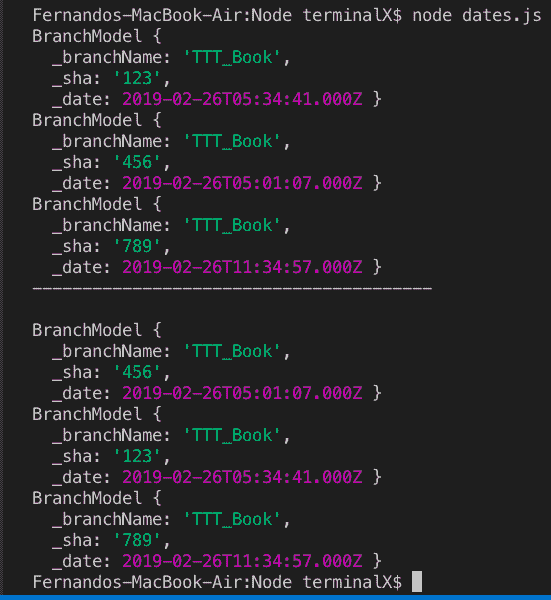
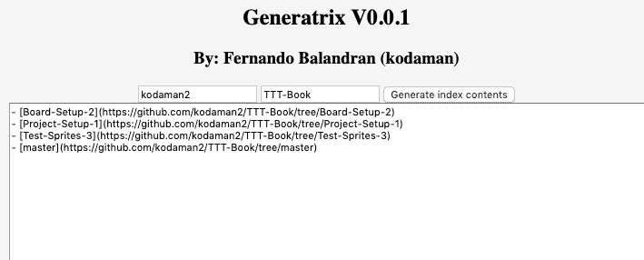
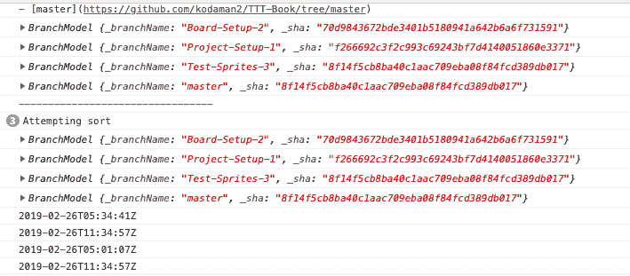

# Javascript 中按日期排序数组

> 原文：<https://dev.to/thefern/sorting-arrays-in-javascript-by-date-16bk>

我正在做一个小项目，给你一个 git 回购分支列表，并生成链接标记。目标是当有人创建一个教程时，他们可以为渐进的步骤创建分支，然后在完成后轻松地生成内容列表，并粘贴到自述文件中。我知道这很傻。我可以在终端用 git 很容易地做到这一点，也许还可以用一个小的 python 程序或 bash 脚本来打印 markdown。

我几乎没有做过任何网站开发，所以请原谅我 1995 年的网页，对我的 js 温柔一点可能很难看。我以前从来没有做过任何 javascript，也没有异步的东西。不管怎样，我在本地写了一个小的 js 文件，用 node 运行，我可以按日期对我的对象数组进行排序，但是同样的函数不能用于我的 generatrix 站点，即使调用了排序函数。

总母线使用带有回调函数的 github api 提取任何 repo 的引用，然后用另一个回调函数检查每个分支日期。最后要做的是按日期排序，并以链接 markdown 格式输出到文本区域。任何帮助都将不胜感激。

[回购来了](https://github.com/kodaman2/generatrix)

我也添加了一些控制台日志。

正如你在控制台上看到的，排序不起作用。:(
设置-01 比设置-02 旧

