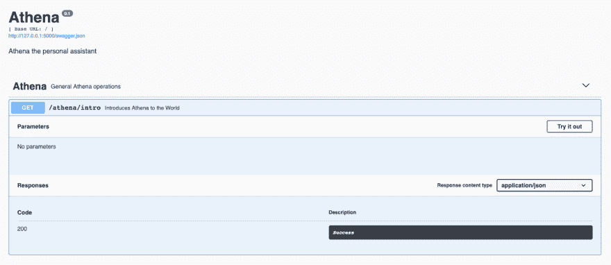
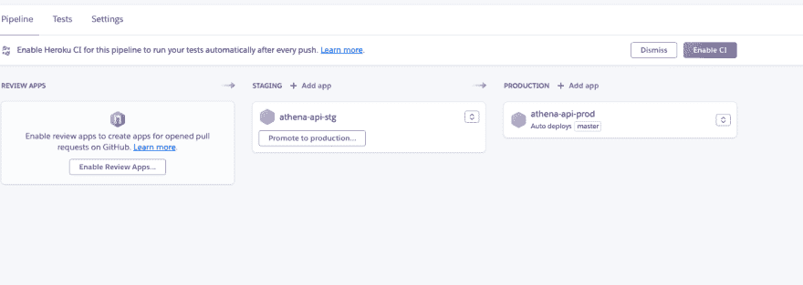
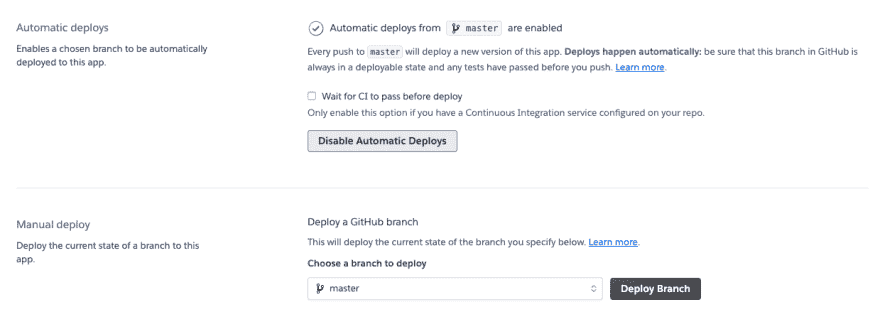
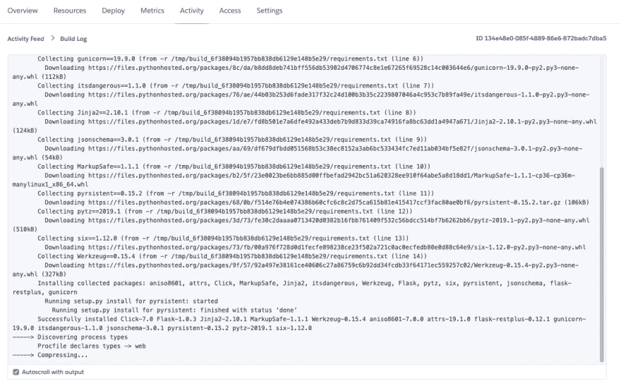
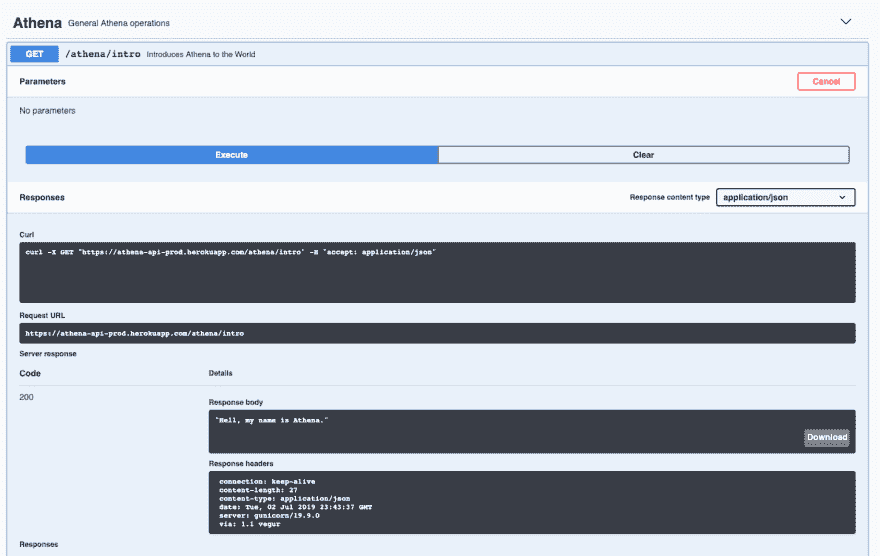
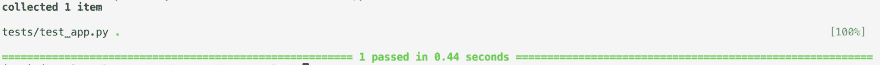
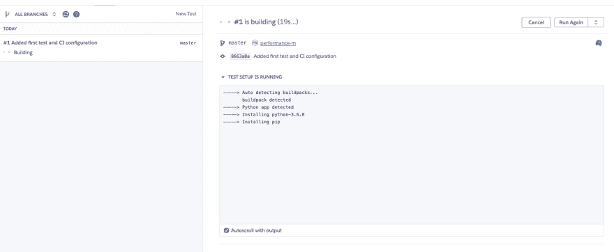
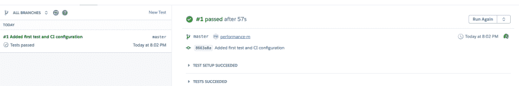
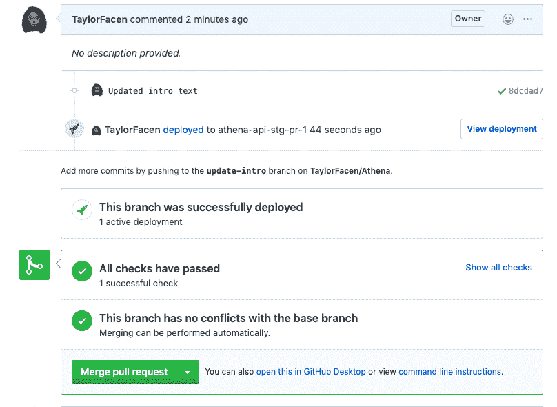

# 为我的私人助理 Athena 设置后端

> 原文：<https://dev.to/itstayfay/setting-up-the-backend-for-athena-my-personal-assistant-4mb2>

如果我要建造一个全功能的、人工智能驱动的、非常棒的个人助理机器人，我需要有一个坚实的基础。这里有一个帖子概述了所有相关的技术和我最初的 flask 应用程序设置。如果您想了解项目在不同阶段的情况，请点击代码检查点链接，进入 Github 中的提交页面。

## 目录

*   [技术堆栈](#stack)
*   [初始提交](#start)
*   与 Heroku 一起部署
*   [测试...1、2、3](#testing)
*   [雅典娜，告诉我更多关于你自己的事情](#add-intro)

### 当前技术堆栈

*   [Github 回购](https://github.com/TaylorFacen/Athena)
*   Heroku
*   Python(烧瓶)

### 初始提交

[代码检查点](https://github.com/TaylorFacen/Athena/tree/9404bf53f03e240d0614a34c6d3963632f4f3e19)

啊，谁不喜欢通过打字来启动项目呢？首先，我从一个基本的 Hello World flask 应用程序开始，通过 flask-restplus 提供 Swagger 文档。虽然 restplus 不是部署 flask 应用程序的必要条件，但我发现让服务为我提供文档要简单得多。此外，它允许在不使用 curl 或 IDE 的情况下测试端点。

与任何 Python 项目一样，我从添加一个虚拟环境开始。这一步对于确保我在计算机上看到的和我在部署时看到的是一样的是至关重要的(这样像你这样的人就可以轻松地复制我的代码)。

**Flask 应用工厂**
Flask 建议使用应用工厂有两个主要原因:

*   易于测试
*   拥有同一个(或稍有改动)应用程序的多个实例

你可以在这里阅读更多关于这个方法的内容。

**文件夹层次和 App 结构**
老实说，我还在学习 flask 的最佳组织方法，以便项目易于跟踪和更新。这是我在这一点上的结构:

。
雅典娜
|**init**。py□□□□□□□□□□□□□□□□□□□□□□□□□□□□□□□□□□□□□□□□□□□□□□□□□□□□□□□□□□□py
| > general . py
env
|(插入虚拟环境的所有隐藏魔法)-我...。
。git ignore
requirements . txt
run . py

因为 Athena 将有多个组件(因为没有人的生活只与一个领域相关)，api 将有多个名称空间(想想文件夹)来组织类似的端点。我从“一般”部分开始，包含所有基本的 api 调用和活动..

设置好项目后，这是应用程序在本地部署时的样子

```
python run.py 
```

[](https://res.cloudinary.com/practicaldev/image/fetch/s--XyhEcCH7--/c_limit%2Cf_auto%2Cfl_progressive%2Cq_auto%2Cw_880/https://thepracticaldev.s3.amazonaws.com/i/qox06ksfoi6bb4vyxgtc.png)

浏览器中的/athena/intro 标题显示如下响应
[](https://res.cloudinary.com/practicaldev/image/fetch/s--W3ql6euu--/c_limit%2Cf_auto%2Cfl_progressive%2Cq_auto%2Cw_880/https://thepracticaldev.s3.amazonaws.com/i/qpqt3morigtf2zeck8ph.png)

### 与 Heroku 一起部署

[代码检查点](https://github.com/TaylorFacen/Athena/tree/a403eeac3627b5991d63026996121f7e0e81a289)

好了，现在是时候向公众推广了。我使用 Heroku 来托管我的应用程序，原因如下:

*   我可以将一个分支连接到我的应用程序，这样每当代码被推送到远程时，就会部署一个包含新更改的新应用程序
*   自动化测试
*   应用程序管道
*   界面非常友好
*   当有拉取请求时，Heroku 可以用 pr 中的代码自动部署一次性版本的应用程序
*   再加上一百万个理由

**Pipeline**
我为我的两个开发环境创建了一个包含两个应用的管道:

*   生产:这是我每天都要接触的东西
*   阶段化:这是我将部署已经完成开发但可能还没有 100%准备好公开的代码的地方(例如，已经完成的子功能需要在整个部分完成之前完成另一个子功能)

[](https://res.cloudinary.com/practicaldev/image/fetch/s--a-PvBlnV--/c_limit%2Cf_auto%2Cfl_progressive%2Cq_auto%2Cw_880/https://thepracticaldev.s3.amazonaws.com/i/hragi0jf3ux020r7n8js.png)

整个管道连接到我的项目回购，我的 prod 应用程序专门连接到我的主分支。一旦创建了 staging 分支，我将继续将该分支连接到 staging 应用程序(不想超越自己)。

[](https://res.cloudinary.com/practicaldev/image/fetch/s--ewxpGz0y--/c_limit%2Cf_auto%2Cfl_progressive%2Cq_auto%2Cw_880/https://thepracticaldev.s3.amazonaws.com/i/yzdtbx4u1e2po45304jd.png)

prod 应用程序设置为每次推送时自动部署。然而，在第一次部署之前，我需要向应用程序添加一些东西，以使其为 Heroku 做好准备。

**变化**

*   添加的 Procfile(文件)
*   已安装的 gunicorn(包)
*   在 run.py 中创建了应用程序实例

添加这些更改后，我在我的终端中运行`heroku local`,以确保一切设置正确。

在将我的修改推送到 Github 的几秒钟内，Heroku 开始将我的修改部署到应用程序中。

[](https://res.cloudinary.com/practicaldev/image/fetch/s--O8yFDXzN--/c_limit%2Cf_auto%2Cfl_progressive%2Cq_auto%2Cw_880/https://thepracticaldev.s3.amazonaws.com/i/m9is98hr5invv29rxn2x.png)

[](https://res.cloudinary.com/practicaldev/image/fetch/s--WF0nOSLj--/c_limit%2Cf_auto%2Cfl_progressive%2Cq_auto%2Cw_880/https://thepracticaldev.s3.amazonaws.com/i/op1163r44f2z5kk2v41i.png)

瞧啊。雅典娜是公共的！

### 测试...1, 2, 3

[代码检查点](https://github.com/TaylorFacen/Athena/tree/8663a8a54f7cef33ffba387ad8c66db1e91b2e4e)

在我的编码之旅中，我学到了一件事，那就是在开始一个项目的时候，把测试放在心上，可以节省很多时间。Heroku 和 pytest 可以轻松确保每次推送都是一个功能完整的应用程序。

首先，让我们添加一个测试来确保应用程序正常工作。

**变化**

*   已安装的 pytest(包)
*   添加了包含测试的测试文件夹
*   管道中已启用的配置项
*   为测试配置添加了 app.json 文件
*   添加了 pytest.ini(文件)

安装 pytest 后，我添加了一个简单的测试来查看应用程序是否正在运行。一种快速的方法是检查对“/”的 GET 请求是否返回状态码 200。

`test_app.py`

```
from athena import create_app

import pytest

@pytest.fixture
def app():
    app = create_app()
    return app

def test_app(app):
    client = app.test_client()

    resp = client.get('/')
    assert resp.status_code == 200 
```

**提示**
如果你在 Python 3 . 0 中使用过 pytest。# virtualenv 之前，你可能见过下面这个错误:

```
DeprecationWarning: Using or importing the ABCs from 'collections' instead of from 'collections.abc' is deprecated, and in 3.8 it will stop working
    from collections import Hashable 
```

为了确保这样的弃用警告不会暂停整个应用程序，您可以添加一个包含以下内容的`pytest.ini`文件:

```
[pytest]
filterwarnings = ignore::DeprecationWarning 
```

在终端中运行`pytest`后，显示以下输出。
[](https://res.cloudinary.com/practicaldev/image/fetch/s--q2VwXCb3--/c_limit%2Cf_auto%2Cfl_progressive%2Cq_auto%2Cw_880/https://thepracticaldev.s3.amazonaws.com/i/2r946hc52m0c80oxzzt5.png)

下一步是添加 app.json 文件，以便 Heroku 知道如何测试应用程序。之后，我可以在管道上启用 CI，然后部署变更以进行测试。这是按下遥控器后屏幕上显示的内容。

[](https://res.cloudinary.com/practicaldev/image/fetch/s--e3s9I1YP--/c_limit%2Cf_auto%2Cfl_progressive%2Cq_auto%2Cw_880/https://thepracticaldev.s3.amazonaws.com/i/rhbvpjvlcnt5gbp0jct1.png)

这是所有测试通过后显示的内容。
[T3】](https://res.cloudinary.com/practicaldev/image/fetch/s--XTDOtzPy--/c_limit%2Cf_auto%2Cfl_progressive%2Cq_auto%2Cw_880/https://thepracticaldev.s3.amazonaws.com/i/k9gbbxwrr5jltwx4wai5.png)

### 雅典娜，多说说你自己吧

[代码检查点](https://github.com/TaylorFacen/Athena/tree/8dcdad7983f239e89f88ecb9dfecedf3c3f7a4eb)
好了，设置基本完成。我们有自动部署和测试，以及坚实的应用程序组织结构。最后，我将继续为未来的特性创建一个临时应用程序。此外，为了给本教程增加一点趣味，让我们尝试提交第一个功能更改，以便我们可以一瞥 Heroku 的评论应用程序的威力。

**变化**

*   添加了临时分支
*   通过自动部署将暂存分支连接到暂存应用程序
*   向 GET /athena/intro 请求添加了更多详细信息

在启用 Review Apps(从 staging application 继承 config vars)、更改对 intro 请求的响应并提交 pull 请求之后，创建并启动了一个应用程序，让我可以实时查看更改。pull request 页面显示了所有通过的测试，并提供了一个查看部署的链接(也可以从 heroku 仪表板上看到)。
[T3】](https://res.cloudinary.com/practicaldev/image/fetch/s--IDghr8tC--/c_limit%2Cf_auto%2Cfl_progressive%2Cq_auto%2Cw_880/https://thepracticaldev.s3.amazonaws.com/i/wyn8cufrnb2566788yx1.png)

哇哦。所有测试都通过了，我的介绍文本也更新了。是时候接受 pr，将更改推送到 master，并发布我的应用程序的 v0.1 了！

[](https://res.cloudinary.com/practicaldev/image/fetch/s--Jf39n_as--/c_limit%2Cf_auto%2Cfl_progressive%2Cq_auto%2Cw_880/https://thepracticaldev.s3.amazonaws.com/i/ozv8qheq760fcu96rwyn.png)

感谢您的阅读！接下来，我会给 Athena 设置一个程序，让她每天早上叫我起床。

[雅典娜 v0.1](https://github.com/TaylorFacen/Athena/releases/tag/v0.1)