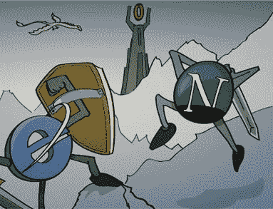
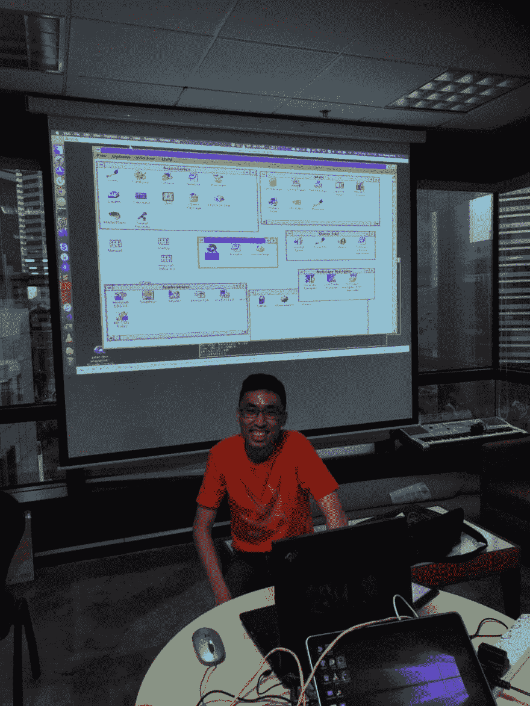
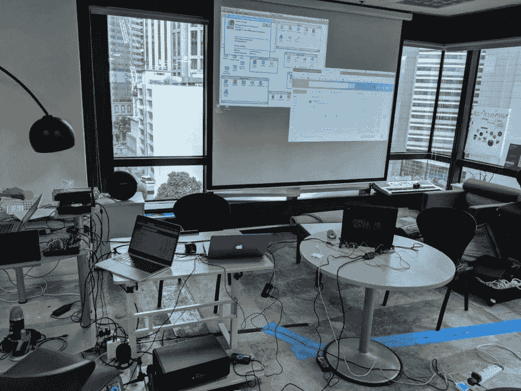
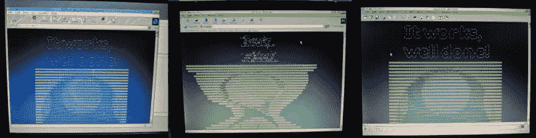
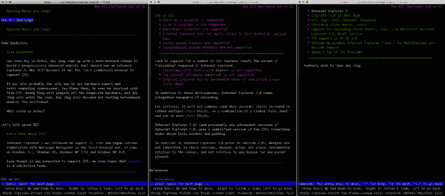
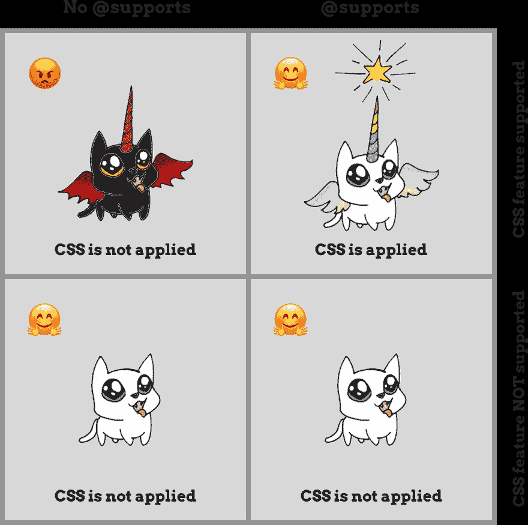
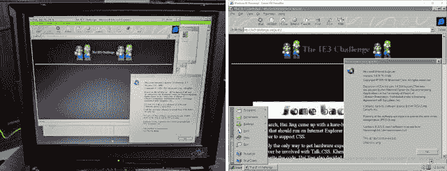
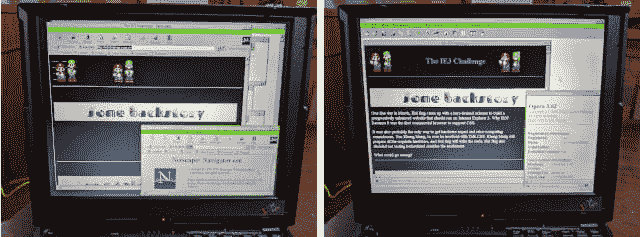
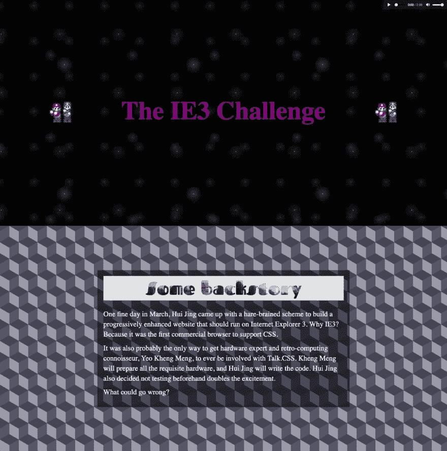

# Internet Explorer 3，跨浏览器兼容性的冒险

> 原文：<https://dev.to/huijing/internet-explorer-3-an-adventure-in-cross-browser-compatibility-50ok>

你们中的一些人可能知道我负责 CSS meetup，Talk。CSS 和我最好的伙伴[魏](https://dev.to/wgao19)在新加坡。如果你没有，你现在有了。也许你已经推断出我真的很喜欢 CSS。但你知道我还喜欢什么吗？90 年代。更确切地说，是 90 年代的计算机。

我在之前就写过这个，关于我记忆中的第一台电脑是我客厅里的一台 486，以及我如何花几个小时玩在 MS-DOS 和 Windows 3.1 上运行的电脑游戏。所以不可避免的是，我会和 [Kheng Meng](http://yeokhengmeng.com/) ，复古计算爱好者和 [Hackware meetup](http://www.meetup.com/Hackware/) 的共同组织者相处得很好。

我们之前在 2017 年的首届[超级愚蠢黑客马拉松](https://supersillyhackathon.sg/)上合作过，发现我们[组成了一个非常好的团队](https://www.chenhuijing.com/blog/hardware-hacks-super-silly-hackathon)。作为一个硬件人员而不是真正的 web 开发人员，我从来没有充分的理由让 Kheng Meng 来参加 Talk.CSS。

[](https://res.cloudinary.com/practicaldev/image/fetch/s--O_rMAuFx--/c_limit%2Cf_auto%2Cfl_progressive%2Cq_auto%2Cw_880/https://www.chenhuijing.com/asseimg/posts/ie3-challenge/ie3b-1280.jpg)

当我有了另一个轻率的计划时，一切都变了。我知道 Kheng Meng 完全有能力安装 Windows 3.1 的工作版本，包括网络功能和我想要的任何适用软件，我请他为我安装一个原始版本的 Internet Explorer 3。

## 为什么选择 ie 3

[Internet Explorer 3](http://www.kompx.com/en/internet-explorer-3.htm) 于 1996 年 8 月 13 日发布，随 [Windows 95 OSR 2](https://winworldpc.com/product/windows-95/osr-2) 一起发货。这差不多是第一次浏览器大战的时代。IE3 作为第一个支持层叠样式表(CSS)的商业浏览器而闻名。

这也是对 IE2 的一次重大升级，IE2 本质上是基于 Spyglass Mosaic 源代码构建的[。此时，Internet Explorer 中仍有部分 Spyglass 代码。这也是第一次支持](https://ericsink.com/Browser_Wars.html) [JScript](https://en.wikipedia.org/wiki/JScript) (微软的 Javascript 实现)的时候。

<figure>

[](https://res.cloudinary.com/practicaldev/image/fetch/s--L-8rcLqJ--/c_limit%2Cf_auto%2Cfl_progressive%2Cq_auto%2Cw_880/https://www.chenhuijing.com/asseimg/posts/ie3-challenge/ie-vs-netscape.jpg)

<figcaption>Source: [Holy Browser Wars!](https://web.archive.org/web/20190630101029/http://royalmulti.blogspot.com/2012/07/holy-browser-wars.html)</figcaption>

</figure>

当然，术语“支持”是一个相当主观的术语，我很快就会知道。在这个实验中，我实际上没有使用任何 JScript 或 Javascript，但也许未来的迭代会使用，尽管我不确定它对我来说是否同样有趣。

## 自我要求

这个实验的目的是建立一个基于单一代码库的网站，它在任何浏览器上都看起来不错。公平地说，“任何”是一个相当高的要求，“体面”也是如此，所以我发表了免责声明，这个实验要么以壮观结束，要么以壮观的失败告终。

不管最终结果如何，我认为这将是一个相对有趣的演讲。CSS #39 ，这是我唯一一次邀请像 Kheng Meng 这样的非 web 开发人员、硬件人员参加 CSS meetup。

[](https://res.cloudinary.com/practicaldev/image/fetch/s--7DRYI4k2--/c_limit%2Cf_auto%2Cfl_progressive%2Cq_auto%2Cw_880/https://www.chenhuijing.com/asseimg/posts/ie3-challenge/ie3e%402x.jpg)

请注意，没有人希望让网站在每个浏览器中看起来都一样，因为这没有抓住要点。就我个人而言，我发现一个单一的代码库可以在不同的浏览器中给你不同的结果，这很有趣。我可以真切地感受到来自各地函数式编程爱好者的鄙视。

你说 bug，我说 feature。就像李小龙说的，要像水一样。[适用于网页设计](https://www.chenhuijing.com/slides/43-view-source-2018/)，IMHO。

## 硬件和系统管理员的东西

Kheng Meng 在 2016 年为 Hackware meetup 做了这件事，那是我第一次正式遇见他的地方。所以我确信我手头上有一个带有网络功能的原始 Windows 3.11 的工作副本。

我只需要他给我安装一份 ie 3。他也从未想过他会在 2019 年提到 Internet Explorer 5 时看到“非常先进”的字眼。

[](https://res.cloudinary.com/practicaldev/image/fetch/s--XtbcsnFj--/c_limit%2Cf_auto%2Cfl_progressive%2Cq_auto%2Cw_880/https://www.chenhuijing.com/asseimg/posts/ie3-challenge/ie3a%402x.png)

考虑到我们在演讲中的表现。CSS，所有的谈话都会被记录，AV 的设置比正常的要复杂一点。就一点点。多几台机器和几根电缆算什么吧？

[](https://res.cloudinary.com/practicaldev/image/fetch/s--5qS_hsQy--/c_limit%2Cf_auto%2Cfl_progressive%2Cq_auto%2Cw_880/https://www.chenhuijing.com/asseimg/posts/ie3-challenge/ie3d-1280.jpg)

造成线缆混乱的一个原因是将机器接入互联网这个不那么简单的问题。最初尝试通过 PCMCIA/Cardbus 网络适配器来做这件事失败了，因为 IBM 的 Cardbus 插槽 DOS 驱动程序不工作。

b 计划的时间到了。在这种情况下，并行端口网络适配器(我们使用 Xircom Pocket Ethernet PE3-10BT)连接到 Wifi-以太网桥。洒上一些手动 DNS 配置，瞧，互联网的魔力。

还有协议的问题。尽管 IE3 支持 HTTPS，但它使用 SSL3，鉴于其安全性问题，SSL 3 是一种不推荐使用的协议。无论如何，我没有处理那些证书之类的东西，而是选择了 HTTP，并把我的页面放在了 [Surge](https://surge.sh/) 上，在这里，HTTPS 是自愿加入的，而不是被迫的。

[](https://res.cloudinary.com/practicaldev/image/fetch/s--grajInTq--/c_limit%2Cf_auto%2Cfl_progressive%2Cq_auto%2Cw_880/https://www.chenhuijing.com/asseimg/posts/ie3-challenge/ie3c-1280.jpg)

尽管我拒绝在 meetup 之前查看我在 IE3 上的实际项目页面，但我确实抛出了一个测试页面，只是为了确保东西可以加载。这并不美好，但事情成功了。除了 IE3，Kheng Meng 还折腾出了网景 Navigator 4.08 和 Opera 3.62，堪称 90 年代浏览器展。

## 流程

公平地说，Kheng Meng 确实提议把实际的机器借给我用于测试目的，但因为我擅长做当时听起来像个好主意的事情(除了它们实际上不是)，我拒绝了他。这就像是黑暗中的代码，除了没有糟糕的 EDM 音乐和倒计时的压力。

顺便说一句，我一点也不知道我会在 [JSConf 的黑暗会议中托管代码。亚洲](https://2019.jsconf.asia/)。这是漫长的一天，快结束时我变得暴躁。如果你愿意，可以问我。

[](https://res.cloudinary.com/practicaldev/image/fetch/s---CCnCscA--/c_limit%2Cf_auto%2Cfl_progressive%2Cq_auto%2Cw_880/https://www.chenhuijing.com/asseimg/posts/ie3-challenge/jsconf-1280.jpg)

请记住，我想要一个单一的代码库，它可以为最新的每夜构建一直运行到 96 年的浏览器。因此，对于设计和最终的标记，需要一些规划。我在想，不要太花哨，只要一个关于这个项目和 Internet Explorer 3 的网页。

但是我也想在新的浏览器中使用现代的 CSS 效果，比如渐变、混合模式和网格布局模型。挑战是用有限的 CSS 尽可能地美化 IE3 版本。

### 思考标记

相信我，当我处理这个项目时，我几乎屈服于 HTML 表格的诡计。公平地说，如果你[看一下代码](https://github.com/huijing/ie3-challenge/blob/master/index.html)，我确实使用了一些 HTML 表格，只是为了测试我如何使用现代 CSS 来修改它。

我认为这样做肯定不是最佳实践，但这就是为什么这是一个实验。我必须弄清楚的一件事是浏览器将如何对不支持的 HTML 元素做出反应。我的假设是他们会被忽略。

根据[规范](https://html.spec.whatwg.org/multipage/custom-elements.html#custom-elements)，

> …作者总是可以在他们的文档中使用非标准元素，通过脚本或类似方式在事后添加特定于应用程序的行为…

事后，我了解到 HTML5 Shiv 存在的原因是为了处理 IE6 之前的遗留版本的 Internet Explorer。[约翰·瑞西格](https://johnresig.com/)解释说 IE 不知道如何在它不能识别的元素上渲染 CSS [。](https://johnresig.com/blog/html5-shiv/)

经过一番挖掘，我发现了这个由 [Sjoerd Vissche](http://w3future.com/weblog/) 写的帖子，它解释了如果你想让 CSS 规则应用于未知元素，使用

```
document.createElement(elementName) 
```

<svg width="20px" height="20px" viewBox="0 0 24 24" class="highlight-action crayons-icon highlight-action--fullscreen-on"><title>Enter fullscreen mode</title></svg> <svg width="20px" height="20px" viewBox="0 0 24 24" class="highlight-action crayons-icon highlight-action--fullscreen-off"><title>Exit fullscreen mode</title></svg>

会让 CSS 引擎知道这个元素。

* * *

*更新:*

[Nicholas stimp son](https://dev.to/alohci)善意地指出`document.createElement(elementName)`更改 HTML 解析器来识别元素并将其添加到浏览器的内部对象模型中。CSS 处理元素的事实是解析变化的结果。显著的区别是 JS 也能够操作创建的元素。

* * *

对于我来说，我很高兴传统浏览器忽略了现代元素，这样我就可以在网页的基线版本中单独使用它们。

有一个失败的标记涉及 IE 的条件注释，我想知道这是不是因为我把它用于`audio`标签还是什么，但我不得不用 CSS 破解这一部分。

```
<!--[if !IE]> -->
<audio controls class="annoying">
  <source src="audio/tetoroika.mp3" type="audio/mpeg">
</audio>
<!-- <![endif]--> 
```

<svg width="20px" height="20px" viewBox="0 0 24 24" class="highlight-action crayons-icon highlight-action--fullscreen-on"><title>Enter fullscreen mode</title></svg> <svg width="20px" height="20px" viewBox="0 0 24 24" class="highlight-action crayons-icon highlight-action--fullscreen-off"><title>Exit fullscreen mode</title></svg>

尽管如此，我仍然喜欢查看该网站在 Lynx 中的外观。

[](https://res.cloudinary.com/practicaldev/image/fetch/s--mJOmTX8K--/c_limit%2Cf_auto%2Cfl_progressive%2Cq_auto%2Cw_880/https://www.chenhuijing.com/asseimg/posts/ie3-challenge/lynx-1280.png)

### 思考 CSS

这是这个项目的核心。CSS 的第一个版本没有给我们太多可玩的东西。但是如果只有这些，生活就会变得简单。

不，事实证明，当 IE3 声称支持 CSS1 时，他们是在相当宽松地使用这个术语。甚至 W3C [也有额外的信息](https://www.w3.org/Style/CSS/msie/)解释“CSS 实现中的漏洞”。

Braden N. McDaniel 为那些想在自己的网页上使用 CSS 以便用 IE3 浏览的作者出版了一份完整的参考资料,因为它确实是一个漏洞百出的实现。

显然也有适用于麦金塔电脑的 IE3 版本，并且[埃里克·迈耶](https://meyerweb.com/)给[写了一份类似的文件](https://web.archive.org/web/20080126234516/http://www.case.edu/dms/homes/eam3/css1/msie-css1.html)列出了哪些属性受支持，哪些不受支持。

一些缺失的功能包括:

*   `em`不支持数值(即相对于字体大小的长度单位)。这对于编写从一种分辨率扩展到另一种分辨率的样式表很重要。
*   没有文档化的方法让用户提供他们的个人样式表。
*   不支持`margin`(复合属性)和`margin-bottom`
*   不支持`padding`属性
*   不支持`border`属性
*   不支持伪元素(但支持伪类！)

我也喜欢这些虫子:

*   行距也被添加到格式化元素的最后一行，这就是为什么标题周围有这么多的空间。应该只在行间添加间距
*   列表后的垂直间距有时会很奇怪

考虑到这些限制，我选择不要太疯狂，采用保守的单页设计，分成几个部分。带`<hr>`元素。朋友们，香草也是一种味道。

## 代码概述

如果你想看的话，整件事都在 GitHub 上[。我会讲一些可能有趣也可能不有趣的内容。我对这个项目没有很高的期望，你可以从我的一些提交信息中看到。_(ツ)_/](https://github.com/huijing/ie3-challenge)

### 基线样式

```
body {
  color: white;
}

table {
  text-align: center;
  width: 100%;
}

td p,
td li {
  width: 100%;
}

h1 {
  color: purple;
  text-align: center;
}

h2 {
  color: black;
}

img {
  text-align: center;
}

a { color: yellow }
a:visited { color: silver }

p,
li {
  font-size: 120%;
  width: 640px;
  margin: 0 auto;
  text-align: left;
}

p span {
  text-align: right;
  color: green;
  font-size: smaller;
}

section > div {
  text-align: center;
}

footer p {
  text-align: center;
} 
```

<svg width="20px" height="20px" viewBox="0 0 24 24" class="highlight-action crayons-icon highlight-action--fullscreen-on"><title>Enter fullscreen mode</title></svg> <svg width="20px" height="20px" viewBox="0 0 24 24" class="highlight-action crayons-icon highlight-action--fullscreen-off"><title>Exit fullscreen mode</title></svg>

如你所见，没有 CSS 类。你可能会问，为什么不呢？因为根据[对级联样式表的支持，Level 1](http://endoframe.com/css/ie3.html) 的文章，“支持类作为选择器”。但对我来说不是这样。

*免责声明，我确实有一个安装了 IE3 的 Windows 95 VirtualBox 实例，所以也许这并不像你在黑暗中编写代码那样是盲目的。姑且称之为重度近视楼吧。*

没关系，设计如此普通的一个重要原因是因为我不想求助于内联样式，因为那会使新浏览器的 CSS 真正出错。不要做所有的事情。求你了。还有，不支持的元素会被浏览器自动忽略(我觉得)。

下一点是因为 Internet Explorer 经过多年的发展，开始更好地支持 CSS，比如`display`属性。还有，IE9 开始使用`audio`元素。我选择加入一个`<bgsound>`标签作为玩笑，因为如果它不起作用，没人会知道。

确实如此。

每个版本的 IE 都支持。我为非 IE 浏览器添加了`audio`元素，以重现许多 90 年代网站的背景音乐。所以对于 IE9-11，我想把它藏起来，让`<bgsound>`发挥它的魔力。

```
@media \0screen\,screen\9 {
  .blend {
    display: none;
  }

  .lg-title {
    margin-top: 1em;
  }
}

@media screen and (min-width:0\0) and (min-resolution: +72dpi) {
  .blend {
    display: none;
  }

  .lg-title {
    margin-top: 1em;
  }

  audio {
    display: none;
  }
} 
```

<svg width="20px" height="20px" viewBox="0 0 24 24" class="highlight-action crayons-icon highlight-action--fullscreen-on"><title>Enter fullscreen mode</title></svg> <svg width="20px" height="20px" viewBox="0 0 24 24" class="highlight-action crayons-icon highlight-action--fullscreen-off"><title>Exit fullscreen mode</title></svg>

剩下的大部分代码都包装在特性查询中。如果你熟悉`@supports`规则，你可能会以某种形式遇到这个矩阵。

<figure>

[](https://res.cloudinary.com/practicaldev/image/fetch/s--UwCYHzu---/c_limit%2Cf_auto%2Cfl_progressive%2Cq_auto%2Cw_880/https://www.chenhuijing.com/asseimg/posts/opera-mini/matrix%402x.png)

<figcaption>Uni-kitty © Jen Simmons</figcaption>

</figure>

IE11(以及之前的版本)在许多新的 CSS 特性方面属于第一象限。作为网页设计师，你必须做出一个执行决定，让这些“中间”浏览器的用户体验到一个稍微不那么花哨的网站版本。我不认为这是一件坏事。

每个 CSS 特性和相关的样式都在它们自己的`@supports`块中，因为我认为这样会更整洁。这只是几个例子来说明我的意思:

```
@supports (display: contents) {
  table,
  tbody {
    display: contents;
  }
}

@supports (animation-name: pulse) {
  .pulse {
    animation: pulse 3s ease-in-out infinite;
  }

  @keyframes pulse {
    50% { color: greenyellow }
  }
} 
```

<svg width="20px" height="20px" viewBox="0 0 24 24" class="highlight-action crayons-icon highlight-action--fullscreen-on"><title>Enter fullscreen mode</title></svg> <svg width="20px" height="20px" viewBox="0 0 24 24" class="highlight-action crayons-icon highlight-action--fullscreen-off"><title>Exit fullscreen mode</title></svg>

`display: contents`的原因是因为我想看看我能在多大程度上取消用于布局的 HTML 表格。事实证明，你可以，但同样，一般不好的做法，不要这样做。

## 不堪入目的揭露

我们开始吧。Kheng Meng 在活动开始前偷偷看了一眼，从他的表情我知道最终的结果是糟糕的。但是从好的一面来看，`<bgsound>`工作起来非常有魅力。所以我们一直开着它，把它当作“心跳”来确保电脑没有崩溃。

IE3 版本看起来很糟糕。🤣好吧，特别是 Windows 3.1 上的 IE3 版本看起来像一堆便便。不知何故，Windows 95 VirtualBox 版本看起来稍微好一点。我需要研究这是为什么。

[](https://res.cloudinary.com/practicaldev/image/fetch/s--qqkfLfBg--/c_limit%2Cf_auto%2Cfl_progressive%2Cq_auto%2Cw_880/https://www.chenhuijing.com/asseimg/posts/ie3-challenge/ie3f-640.jpg)

以下是两个版本的完整页面:

[https://www.youtube.com/embed/h9AegIdcCq0](https://www.youtube.com/embed/h9AegIdcCq0)

[https://www.youtube.com/embed/a6g6kTUpYUE](https://www.youtube.com/embed/a6g6kTUpYUE)

基本上，在 Win3.1 IE3 上是一个彻底的失败，尽管在 Win 95 版本上还不错。

网景版也好不到哪里去。但 Opera 版本与 Windows 95 版本惊人地不相上下。算是吧。

[](https://res.cloudinary.com/practicaldev/image/fetch/s--5UF1wPE2--/c_limit%2Cf_auto%2Cfl_progressive%2Cq_auto%2Cw_880/https://www.chenhuijing.com/asseimg/posts/ie3-challenge/ie3g-640.jpg)

以及相应的完整页面:

[https://www.youtube.com/embed/Jh8LusizMNA](https://www.youtube.com/embed/Jh8LusizMNA)

[https://www.youtube.com/embed/s_VSm-LOpyE](https://www.youtube.com/embed/s_VSm-LOpyE)

当我们这样做的时候，这是它在 IE11 上的样子。答应背景音乐。

[https://www.youtube.com/embed/ZZ-nxSkv35A](https://www.youtube.com/embed/ZZ-nxSkv35A)

最后是“现代浏览器版”。只是 Firefox Nightly，tbh。你可以在 http://ie3-challenge.surge.sh/亲自看到。随意播放右上方带有音频元素的背景音轨。

[](https://res.cloudinary.com/practicaldev/image/fetch/s--0waa3oVX--/c_limit%2Cf_auto%2Cfl_progressive%2Cq_auto%2Cw_880/https://www.chenhuijing.com/asseimg/posts/ie3-challenge/ie3h-1280.jpg)

## 包装完毕

如果你坚持到了文章的这一部分，哇，谢谢。说真的。这个项目对你的生活没有任何好处，所以我感谢你的时间。

有趣的事实是，在演讲的那天，我的“现代”工作电脑，也就是 2017 年的 13 英寸 MacBook Pro，在演讲中途真的死机了。两次。(╯ □ )╯︵ ┻━┻

IBM Thinkpad 390e 从头到尾都运行良好。

[https://www.youtube.com/embed/dVdBD3SQMl4](https://www.youtube.com/embed/dVdBD3SQMl4)