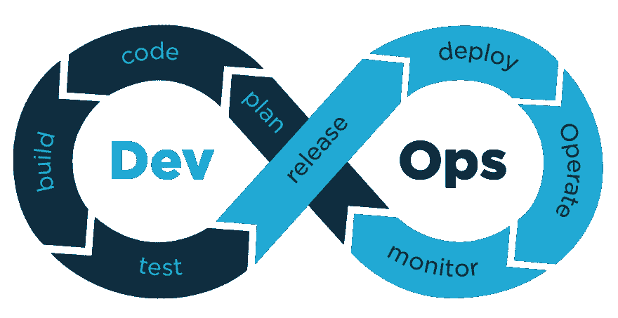
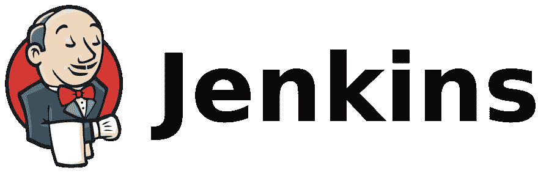

# 我进入 DevOps 的第一步

> 原文：<https://dev.to/rossanodan/my-first-steps-into-devops-4iho>

很久以前我就听说过 DevOps，但我第一次上关于它的第一堂课是在两周前。我不是这方面的专家，但我还是试着写下一些非常基本的东西，给那些可能需要的人。

自 2019 年 1 月以来，我每天都与 DevOps 实践打交道，写下它们可能会帮助我检查我在这几个月中学到了什么。我相信“教学相长”的理念。

DevOps 不是工具，不是编程语言，也不是超级秘密的黑魔法。DevOps 是软件开发中一种新的更聪明的方式。
准确地说，DevOps 是一套**实践**，有助于实现这一运动的目标:**减少产品构思阶段和在生产中发布给客户**(或最终用户)之间的时间。

那些实践是软件开发(编码，测试，...)和操作(部署、监控等)。

DevOps 概念**与敏捷方法**配合得非常好，今天它们被广泛采用来完成持续交付的艰苦工作(小而频繁的软件发布)。

DevOps 也是一种**心态**。它旨在消除软件开发和运营团队之间的孤岛，并用**跨职能团队**取代这种“隔离”。

我可以参考一下我工作中的个人情况:我是一个 9 人团队的一员，在我们内部你可以找到软件工程师、QA 工程师和运营人员。我们协同工作，同步交付软件:规划(了解客户需求)、开发、测试和部署都在我们的团队中进行。我们的工作，与其他团队的工作一起，创造了一个非常棒的东西，叫做*管道*。

这种工作方式有几个优点，如跨学科、团队合作和产品的高质量。如果没有 DevOps 文化，这一切可能都不会发生。

正如我所说，DevOps 并不意味着*工具*但是我们需要工具来操作 DevOps。像**詹金斯**(持续集成) **Docker** (容器化)和 **Nagios** (监控)这样的工具有助于软件交付过程的自动化。**自动化在这个领域非常重要**:流程自动化程度越高，就越不会出错(我们都是人！)而且更快。
