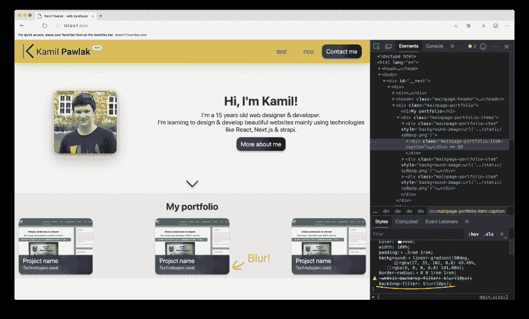

# Chrome 和基于 Chrome 的浏览器具有背景过滤 CSS 属性！(76+)

> 原文：<https://dev.to/ricoet22/announcement-backdrop-filter-css-property-comes-to-chrome-and-chromium-based-browsers-76-4oa8>

CSS 属性允许你为元素后面的区域启用很酷的图形效果，比如模糊。这是制作模糊背景的最简单的方法，这在最近的网页设计项目中更常见。

然而，有一个花招:这个功能只在 Safari、经典的 Microsoft Edge(带有 EdgeHTML 引擎，而不是预览版)中受支持，并且在基于 Chromium 的浏览器中非正式地启用了一个特殊的标志。因为没有一个主流浏览器(我指的是 Chrome 和 Firefox)支持这个功能，**只有大约 15%的互联网用户**可以看到`backdrop-filter`运行。此外，该功能的 beta 版 Chromium 渲染存在问题，降低了整个页面的速度。

但是事情已经改变了。

据[caniuse.com](https://caniuse.com/#feat=css-backdrop-filter)透露，`backdrop-filter`功能是**终于从版本 76 开始正式支持**Chrome，目前处于预览阶段。它应该在几周内变得稳定。其他基于 Chromium 的浏览器，如 Chromium Edge、Opera 等。应该是后来引进的(或者已经引进了)。

这意味着 Chrome 76 稳定后，你将能够使用`backdrop-filter`而不用担心几乎没有人会看不到它的运行——除非你的主要目标是 Firefox 用户。那个浏览器还没有在任何部分实现这个特性😢。

我已经在 Chromium Edge 上测试过`backdrop-filter`,它运行得非常好。
[](https://res.cloudinary.com/practicaldev/image/fetch/s--VPcsJqVI--/c_limit%2Cf_auto%2Cfl_progressive%2Cq_auto%2Cw_880/https://thepracticaldev.s3.amazonaws.com/i/iargpw271z31a9dhewkx.png)

在这些支持改变之后，这里有一个关于如何在你的 CSS 中使用`backdrop-filter`的例子:

```
/* For Chrome & Chromium 76+ */
backdrop-filter: blur(10px);
/* For Safari, classic Edge and Chrome/Chromium <=75 */
-webkit-backdrop-filter: blur(10px); 
```

<svg width="20px" height="20px" viewBox="0 0 24 24" class="highlight-action crayons-icon highlight-action--fullscreen-on"><title>Enter fullscreen mode</title></svg> <svg width="20px" height="20px" viewBox="0 0 24 24" class="highlight-action crayons-icon highlight-action--fullscreen-off"><title>Exit fullscreen mode</title></svg>

我认为浏览器更广泛地采用`backdrop-filter`属性将会带来更加令人惊叹的网站设计，尤其是那些利用了某种背景模糊的网站。开发者可以使用它，而不用担心大多数人会因为他们的浏览器不支持它而看不到它。请随意使用。快乐编码👨🏻‍💻