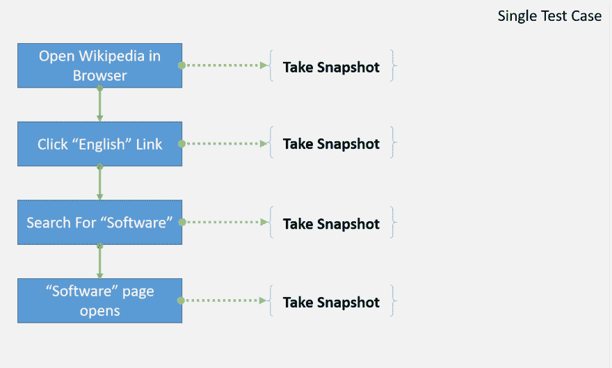
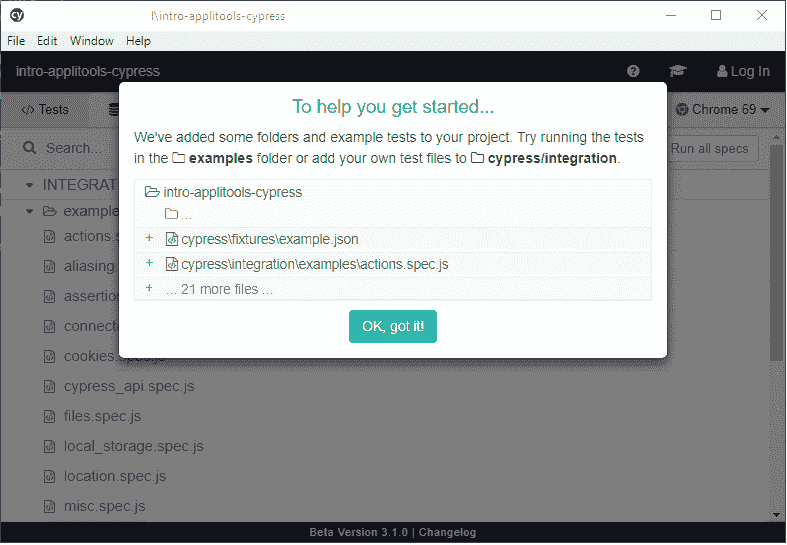
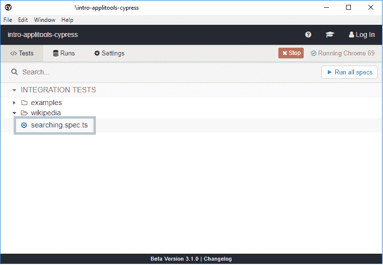
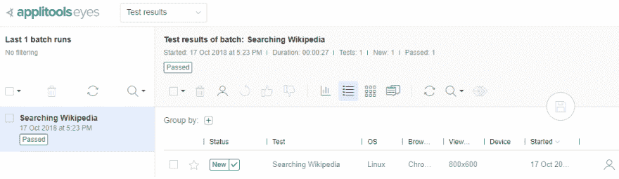
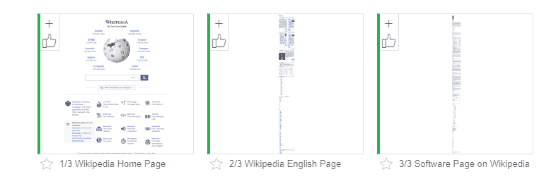
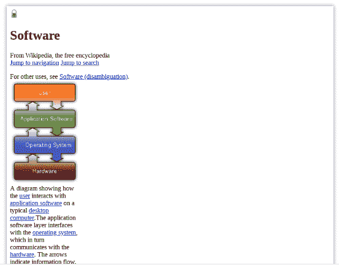
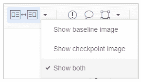
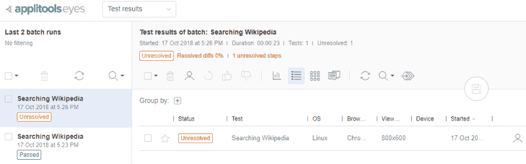
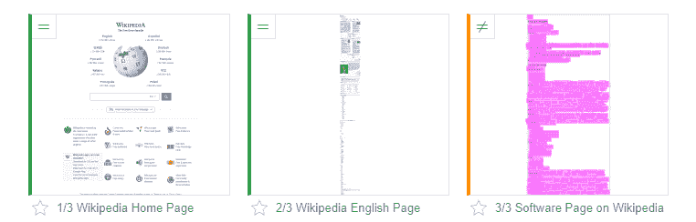
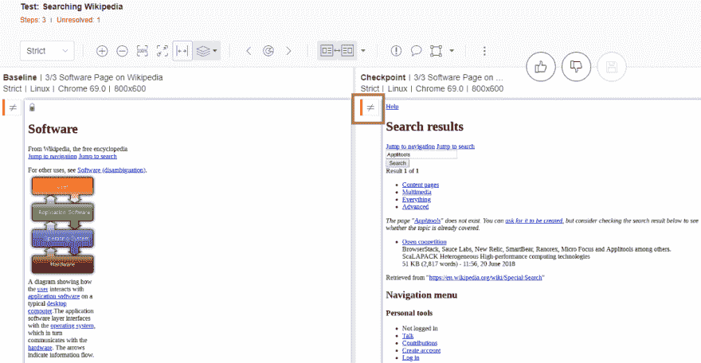

# appli tools——自动化可视化回归测试框架

> 原文：<https://dev.to/thisdotmedia/applitools-the-automated-visual-regression-testing-framework-359d>

Applitools 是一个完全打包的自动化框架，用于可视化 UI 回归测试。无论您是否已经认真对待可视化 UI 测试，并且正在寻找一种简单的方法来为您的 web 和移动应用程序自动化这种类型的测试，或者您刚刚开始研究可视化 UI 测试技术，您可能想要尝试 Applitools 来发现该工具在自动化您的可视化 UI 测试方面提供的优势，其中回归测试是核心！

在这篇文章中，我们将介绍 Applitools 的特性。特别是，我们解释了 Applitools 如何与各种各样的编程语言和技术一起使用，并且我们阐明了可视化回归测试的重要性。您将了解 Applitools 促进运行回归测试过程的独特方式，以及 Applitools 如何轻松地报告测试结果，包括视觉差异，如果没有 Applitools 提供的 AI 引擎，这是非常难以有效自动化的事情。

## UI 测试

使用 UI 测试，您可以通过模拟用户输入来测试 web 应用程序的功能。例如，通过使用 [Cypress.io](https://www.cypress.io/) 测试框架，您可以模拟用户打开 web 浏览器、定位并点击页面上的按钮，甚至在输入字段中输入一些文本的行为。这非常有效，可以通过验证页面的功能以及它们在生产中的表现来帮助测试应用程序的 UI 端。

然而，UI 功能测试只是测试的一个方面，仅此还不足以对应用程序进行全面的可视化测试。我们必须考虑页面上组件的布局、大小或位置的变化，文本格式或内容的变化，以及许多其他用传统功能测试难以检测的视觉变化。对于基于视窗大小改变布局的响应型 web 应用程序来说，尤其如此。

因此，视觉 UI 测试是不可避免的，也是必须的！否则，非预期的 UI 更改(更改 [CSS](https://en.wikipedia.org/wiki/Cascading_Style_Sheets) 、内容等)。)将会在你的测试中被忽略，并影响你的用户。

## 视觉 UI 测试

自动化的可视化 UI 测试是一种回归测试的形式，它遵循一定的步骤，以验证屏幕或页面在不同的测试运行之间没有发生意外的变化。下图描述了一个典型的测试案例，它模拟了用户打开“维基百科”网站并搜索“软件”作为关键词的行为。

[](https://res.cloudinary.com/practicaldev/image/fetch/s--4vnJBArr--/c_limit%2Cf_auto%2Cfl_progressive%2Cq_auto%2Cw_880/https://cdn-images-1.medium.com/max/2800/0%2AgvDrOWBW-zM5tQNK)

进行可视化 UI 测试的过程从创建一个典型的集成测试用例开始，使用的工具和测试套件与您通常在执行这种集成测试时使用的工具和测试套件相同。集成测试是在应用程序屏幕/页面上执行的一系列操作，模拟实际用户。

使用可视化用户界面测试，您可以按照上面相同的步骤进行，但是有所不同:

1.  打开浏览器，导航到“维基百科”网站。

2.  上面的步骤创建了一个“浏览器打开维基百科网站”的新状态。

3.  拍一张这个状态的快照。如果这是测试用例第一次运行，那么您将把这个快照保存为测试用例中这个步骤的一个“[基线](https://help.applitools.com/hc/en-us/articles/360007188691-What-is-a-baseline-and-how-is-a-baseline-created-)”。对于下面的其他快照步骤也是如此。

4.  在搜索框中输入“软件”关键字。

5.  上面的步骤创建了一个新的状态“维基百科英文网站和用关键字 Software 填充的搜索框字段”。

6.  拍一张这个状态的快照。

7.  “维基百科”软件页面打开。

8.  以上步骤创建了一个新的状态“显示给用户的维基百科软件页面”。

9.  拍一张这个状态的快照。

下次您再次运行相同的测试用例时，在获取快照时，您可以将快照与基线进行比较，并报告结果。结果可能是:

*   **无变化**:在这种情况下，新快照相当于基线快照。

*   **变更**:在这种情况下，新的快照与基线快照相比有一些 UI 变更。

可视化 UI 测试人员现在负责比较快照，分析它们，并决定如何解决任何差异。他们可能会接受差异，将新的快照保存为基线，并将其用于即将到来的回归测试。或者，他们可能拒绝差异，并通知开发人员结果中指出的错误和问题。

## appli tools 如何工作

Applitools 使用与上述相同的方法，它提供了一些工具，您可以使用这些工具来拍摄快照、将快照发送到 Applitools 云，并运行 AI 逻辑来将快照与其对应的基线进行比较。

Applitools 为知名的测试套件提供了一套丰富的[软件开发套件(SDK)](https://applitools.com/tutorials)。例如:

*   用于 Cypress.io 的 SDK 端到端测试框架(最近推出)

*   [带 React](https://applitools.com/tutorials/storybook-react.html) 、 [Angular](https://applitools.com/tutorials/storybook-angular.html) 和 [Vue](https://applitools.com/tutorials/storybook-vue.html) 的故事书 SDK(近期推出)

*   几乎所有硒味的 SDK([JavaScript](https://applitools.com/tutorials/selenium-javascript.html)、 [Java](https://applitools.com/tutorials/selenium-java.html) 、 [C#](https://applitools.com/tutorials/selenium-csharp.html) 、 [Ruby](https://applitools.com/tutorials/selenium-ruby.html) 等)。).

*   几乎所有 Appium 口味的 SDK([原生 C#](https://applitools.com/tutorials/appium-native-csharp.html) 、[原生 Java](https://applitools.com/tutorials/appium-native-java.html) 、[原生 PHP](https://applitools.com/tutorials/appium-native-php.html) 等)。).

例如，Applitools for Selenium SDK 包装了 [Selenium WebDriver](https://www.seleniumhq.org/projects/webdriver/) ，并提供了一个新的增强的 WebDriver，您可以使用它来模拟用户在屏幕或页面上的动作。唯一的区别是 Applitools 现在知道您在 Selenium WebDriver 上执行的每一个动作。这使得 Applitools 很容易捕捉针对 WebDriver 执行的操作的结果的快照。

当在测试用例中使用 Applitools SDK 时，您可以随时要求 SDK 捕获应用程序的状态。这个过程如下:

1.  SDK 会拍摄浏览器的快照

2.  生成的快照被发送到 Applitools 服务器

3.  如果没有以前的基线图像，服务器会将该图像存储为基线，以便在将来的测试运行中进行比较

4.  如果有以前的基线图像，服务器运行它的 AI 引擎来比较基线图像和新的快照。引擎会报告图像是否匹配，或者报告两个图像之间的任何差异。

5.  测试完成后，会生成一份详细的报告，说明各种快照及其相应基准之间的差异。

随着最近 Cypress.io 和 Storybook SDKs 的推出，Applitools 采用了一种新的增强的视觉测试方法——appli tools 视觉网格。代替快照图像，DOM 快照被上传到 Applitools 服务器，并且这些快照现在被并行分析。结果是可视化测试套件的速度提高了 30 倍。

## 应用工具测试管理器

此外，Applitools 提供了一个丰富的[测试管理器](https://help.applitools.com/hc/en-us/articles/360007188971-Getting-to-grips-with-the-Applitools-Eyes-Test-Manager-home-screen)仪表板来帮助您管理您运行的所有测试。您可以在一个批处理中运行多个测试用例。

对于每一个测试用例，您会得到一个在测试用例执行过程中拍摄的所有快照的列表。仪表板将通知您任何未解决的测试用例，这意味着测试用例生成的快照可能与存储为基线的快照不同。仪表板提供了将这些变更标记为已接受的工具，并将它们更新为新的基线快照，或者拒绝差异并将这些变更标记为开发人员要解决的 bug。

测试管理器提供了多种特性，使得检查和验证测试用例结果的过程变得简单。

Applitools 背后强大的人工智能引擎可以使用[四种模式匹配算法](https://help.applitools.com/hc/en-us/articles/360007188591-Match-Levels)中的一种，将快照与其对应的基线进行比较。这些算法是:

1.  **精确**:这是一种像素对像素的匹配技术，由于其严格性，一般不推荐使用。

2.  **Strict** :这种匹配技术比较所有内容，包括每个元素的内容(文本)、字体、布局、颜色和位置。该模式忽略人类不可见的渲染变化。用这种比较方式，你通常会得到最好的结果。

3.  **Content** :该选项类似于上面的 strict 选项，只是它只执行内容(文本)比较。

4.  **布局**:这个选项类似于上面的 strict 选项，除了它只执行布局比较。

当查看快照之间的比较结果时，您可以在测试用例代码本身中或者通过测试管理器来指定匹配策略。

## 截图 API

除了选择和使用可用的 SDK 之一，Applitools 还提供了各种编程语言的[截图 API](https://help.applitools.com/hc/en-us/articles/360006914752-Screenshotting) ，可以帮助您拍摄应用程序中任何内容的快照，并将这些快照发送到 Applitools 服务器进行处理并生成比较结果。

可用的截图 API 有:

*   CLI

*   [C#](https://applitools.com/tutorials/screenshots-csharp.html)

*   [Java](https://applitools.com/tutorials/screenshots-java.html)

*   [JavaScript](https://applitools.com/tutorials/screenshots-javascript.html)

*   [PHP](https://applitools.com/tutorials/screenshots-php.html)

*   [红宝石](https://applitools.com/tutorials/screenshots-ruby.html)

*   [XCTest (Objective-C)](https://applitools.com/tutorials/screenshots-xctest-objective-c.html)

*   [XCTest (Swift)](https://applitools.com/tutorials/screenshots-xctest-swift.html)

使用快照 API，您可以轻松地将快照发送到 Applitools 服务器，对快照进行比较，并生成比较结果。因此，快照 API 可以用作通用网关来访问位于 Applitools 服务器后面的 AI 引擎。

## 演示

现在，让我们换个方式，利用用于 Cypress.io 的 Applitools SDK 开发一个简单的测试用例。

在这个测试案例中，我们将模拟导航到“Wikipedia.com”网站、点击该网站的英文版本、在搜索框字段中键入“Software ”,以及最终导航到 Wikipedia 上的“Software”页面的过程。

### 在新文件夹上初始化 NPM

我将首先创建一个新文件夹，并用 NPM 初始化它，以访问 **package.json** 文件。发出以下命令，并遵循生成文件所需的步骤:

`npm init`

### 安装柏包

下一步是安装赛普拉斯 NPM 包及其文件，并开始用赛普拉斯测试您的源代码。发出以下命令:

`npm install cypress --save-dev`

该命令将 Cypress 包作为开发依赖项安装到您的项目中。

现在打开 Cypress 并在本地运行它。发出以下命令:

`npx cypress open`

第一次运行这个命令时，Cypress 用一条警告消息提示您，它将添加一些配置文件和示例测试来帮助您开始。会出现这样的。

[](https://res.cloudinary.com/practicaldev/image/fetch/s--mqGsWnNX--/c_limit%2Cf_auto%2Cfl_progressive%2Cq_auto%2Cw_880/https://cdn-images-1.medium.com/max/2000/0%2A6_3aKfgv-HgMfm0Y)

点击 **Ok，知道了！**按钮继续并在本地运行 Cypress。这里发生了两件事:

1.  在您的项目根文件夹中创建了一个名为 **cypress** 的新文件夹，其中有几个子文件夹，遵循用于运行您的测试的典型 cypress 文件夹配置系统的结构。

2.  Cypress 测试运行程序现在已经打开，您可以开始使用示例测试并运行它们。

单击任何一个测试，熟悉 Cypress 如何在浏览器中运行测试。

### 创建我们的第一个测试用例

让我们继续用 Cypress 创建我们的第一个测试用例。在本文的上下文中，我假设您知道如何编写 Cypress 测试用例。如果出于某种原因，您需要更多信息，您可以访问 Cypress 网站，并通过点击此链接浏览其详细文档: [Cypress 入门](https://docs.cypress.io/guides/core-concepts/introduction-to-cypress.html#Cypress-Is-Simple)。

我们走吧！

1.  在 cypress/integration 文件夹下添加一个名为 **Wikipedia** 的新文件夹。

2.  在您创建的新文件夹下添加一个名为 **searching.spec.ts** 的新 JavaScript 文件。

3.  在新文件
    中包含以下源代码

```
/// <reference types=”Cypress” />

    context(‘Wikipedia’, () => {
      beforeEach(() => {
        // Go to Wikipedia website
        cy.visit(‘https://www.wikipedia.org/')
      });

      it(‘Go to Software page by searching for “Software”’, () => {
        // Find the “English” link and click it
        cy.get(‘#js-link-box-en’).click();

        // Find the search-box control and type “Software”
        cy.get(‘#searchInput’)
          .type(‘Software’) // Type “Software”
          .should(‘have.value’, ‘Software’) // Check for correct value
          .type(‘{enter}’); // press enter

        // check if the element has a class 
        cy.get(‘#firstHeading’).should(‘have.class’, ‘firstHeading’);
      })
    }) 
```

在每个测试用例运行之前，代码指示 Cypress**访问**维基百科网站。本文的测试用例验证了当用户在 Wikipedia 上搜索“软件”时，会被引导到那里的软件页面。

注意，代码首先在维基百科网站上找到**英文**链接并点击它。现在，维基百科处于向用户展示其网站英文版的状态。

测试用例通过 ID 在页面上定位搜索框输入控件。然后，通过使用强大的 chaining/fluent Cypress API，它发出一个命令，在搜索框输入控件中键入文本“Software”。然后，它确保输入控件现在保存“软件”文本。最后，它发出一个 **Enter** 命令来实际提交搜索表单。

最后一行代码假设用户已经被转移到维基百科上的英文页面。它通过 ID 定位一个 HTML DIV，并验证它有一个 CSS 类 **firstHeading** 。

这个测试用例相当简单，但是它让您知道如何使用 Cypress 为您的应用程序编写功能/UI 测试。

让我们通过发出以下命令来运行测试:

`npx cypress open`

在 Cypress 测试运行器上，找到 **searching.spec.ts** 文件并点击它。

[](https://res.cloudinary.com/practicaldev/image/fetch/s--TvdzKyhG--/c_limit%2Cf_auto%2Cfl_progressive%2Cq_auto%2Cw_880/https://cdn-images-1.medium.com/max/2000/0%2ABW6rS_Gz7hnOMrNx)

Cypress 运行选中的测试，并打开 Chrome (headless)浏览器的一个新实例，运行测试用例中的所有命令。

[](https://res.cloudinary.com/practicaldev/image/fetch/s--UWmiH-gb--/c_limit%2Cf_auto%2Cfl_progressive%2Cq_auto%2Cw_880/https://cdn-images-1.medium.com/max/2158/0%2AaLkvvdcwscvNWGnZ)

您可以浏览页面左侧的测试用例步骤，并尝试重放各个步骤，并在页面右侧观察它们是如何动态执行的。

现在让我们用 Applitools 添加一些可视化 UI 测试。

### 加入 Applitools Cypress SDK

让我们首先将 Applitools Cypress SDK 安装到我们的项目中。为此，您可以发出以下命令:

`npm install @applitools/eyes.cypress --save-dev`

上面的 [npm](https://www.npmjs.com/) 命令将安装**[appli tools eyes . cypress](https://www.npmjs.com/package/@applitools/eyes.cypress)**插件作为项目的开发依赖项。(眼睛是 Applitools 的产品名称。)

下一步是通过发出以下命令来配置 **eyes.cypress** 插件:

`npx eyes-setup`

上面的 [npx](https://www.npmjs.com/package/npx) 命令将必要的导入添加到您的 cypress **插件**和**支持**文件中。你可以通过点击这个链接来阅读更多关于如何设置 **eyes.cypress** 的信息: [@applitools/eyes.cypress](https://www.npmjs.com/package/@applitools/eyes.cypress#configure-plugin-and-commands) 。

简而言之，该命令向**插件/index.js** 文件添加了以下代码行:

`require(‘@applitools/eyes.cypress’)(module);`

此外，下面一行代码也被添加到 **support/index.js** 文件中:

`import ‘@applitools/eyes.cypress/commands’`

现在这些包已经安装到项目中，您可以开始享受可视化 UI 测试了！

让我们通过几次调用 **eyes.setup** 插件来修改测试用例，为不同的测试用例状态保存快照，并将它们发送到 Applitools 服务器。

```
 /// <reference types=”Cypress” />

    context(‘Wikipedia’, () => {
      beforeEach(() => {
        // Go to Wikipedia website
        cy.visit(‘https://www.wikipedia.org/')

        // Open a connection with Applitools Servers
        cy.eyesOpen({
          appName: ‘Intro to Applitools Cypress SDK’,
          testName: ‘Searching Wikipedia’,
          browser: { width: 800, height: 600 }
        });

        // Take a snapshot after the browser opens Wikipedia page
        cy.eyesCheckWindow(‘Wikipedia home page’);
      });

      afterEach(() => {
        // Close the connection with Applitools Servers
        cy.eyesClose();
      });

      it(‘Go to Software page when searching for “Software”’, () => {
        // Find the “English” link and click it
        cy.get(‘#js-link-box-en’).click();

        // Take a snapshot of Wikipedia English Page
        cy.eyesCheckWindow(‘Wikipedia English Page’);

        // Find the search-box control and type “Software”
        cy.get(‘#searchInput’)
          .type(‘Software’) // Type “Software”
          .should(‘have.value’, ‘Software’) // Check for correct value
          .type(‘{enter}’); // press enter

        // Take a snapshot of the Software Page on Wikipedia
        cy.eyesCheckWindow(‘Software Page on Wikipedia’);

        // check if the element has a class
        cy.get(‘#firstHeading’).should(‘have.class’, ‘firstHeading’);
      })
    }) 
```

在运行每一个测试用例之前，测试用例使用下面的代码行打开一个到 Applitools 服务器的连接:

```
 cy.eyesOpen({
      appName: ‘Intro to Applitools Cypress SDK’,
      testName: ‘Searching Wikipedia’,
      browser: { width: 800, height: 600 }
    }); 
```

对 **[eyesOpen()](https://applitools.com/docs/api/eyes-sdk/classes-gen/class_eyes/method-eyes-open-selenium-javascript.html)** 方法的调用指定了应用程序的名称、测试用例的名称和浏览器维度。你有很多属性可以包含在这个方法中，你可以点击这个链接查看所有属性: [@applitools/eyes.cypress](https://www.npmjs.com/package/@applitools/eyes.cypress#configure-plugin-and-commands) 。

然后，代码向 **eyes.cypress** 插件发出一个命令，获取测试用例当前状态的快照。

```
 // Take a snapshot after the browser opens Wikipedia page
    cy.eyesCheckWindow(‘Wikipedia home page’); 
```

**[eyesCheckWindow()](https://applitools.com/docs/api/eyes-sdk/classes-gen/class_eyes/method-eyes-checkwindow-selenium-javascript.html)**函数将快照的名称作为输入，并立即将其发送到 Applitools 服务器。

在运行每个测试用例之后，代码还关闭了与 Applitools 服务器的连接:

```
 afterEach(() => {
      // Close the connection with Applitools Servers
      cy.eyesClose();
    }); 
```

在测试用例的主体中，我包括了对 **cy.eyesCheckWindow()** 函数的几次调用，以收集测试用例不同状态的一些快照。

如您所见，使用 **eyes.cypress** 的过程相当简单。

让我们通过发出以下命令再次运行测试:

`npx cypress open`

您可以在 Cypress 运行测试用例时跟踪它。

让我们在 Applitools 测试管理器中查看结果。

### 在 Applitools 测试管理器中查看结果

既然我们已经用 Applitools Cypress SDK 运行了我们的 visual/UI 测试用例，那么让我们探索一下 Applitools Eyes 测试管理器，看看这里发生了什么。

在 [Applitools 网站登录测试管理器。](https://www.applitools.com)

[](https://res.cloudinary.com/practicaldev/image/fetch/s--fU0Yq598--/c_limit%2Cf_auto%2Cfl_progressive%2Cq_auto%2Cw_880/https://cdn-images-1.medium.com/max/2164/0%2AVokfTYd9G880DYOk)

上面显示的图像是您登录 Applitools 测试管理器时看到的。

你会注意到左手边有一批。这是我们执行的测试案例。Applitools 可以在一个批处理中运行多个测试用例。在这种情况下，我们在批处理中只有一个测试用例。

通过点击批处理，测试管理器在屏幕的右侧显示该批处理中的测试用例。

测试用例的状态是“新的”，意味着这是测试用例第一次被执行。因此，没有以前的基准快照可供比较。

通过点击测试用例，您可以看到 Applitools Cypress SDK 在测试用例运行期间拍摄的所有快照。

[](https://res.cloudinary.com/practicaldev/image/fetch/s--YDrb_OcU--/c_limit%2Cf_auto%2Cfl_progressive%2Cq_auto%2Cw_880/https://cdn-images-1.medium.com/max/2000/0%2Axq-A9F8eRM1WOV2R)

单击第三个快照，控制面板会展开图像，以便您可以仔细查看。

[](https://res.cloudinary.com/practicaldev/image/fetch/s--xBOZquom--/c_limit%2Cf_auto%2Cfl_progressive%2Cq_auto%2Cw_880/https://cdn-images-1.medium.com/max/2000/0%2AhS_SnnirCagLJcnQ)

通常，在缩放模式下查看快照时，您有机会在右侧看到当前快照，在左侧看到基线(如果有)。

如果您看不到这两个快照，那么您需要指示测试管理器显示这两个快照，如下图所示:

[](https://res.cloudinary.com/practicaldev/image/fetch/s--gtTbOdVp--/c_limit%2Cf_auto%2Cfl_progressive%2Cq_auto%2Cw_880/https://cdn-images-1.medium.com/max/2000/0%2AGBhVTchD5_zD7MCn)

让我们再次运行测试用例，除了这一次，在运行测试之前，我们将把测试中的搜索词从“软件”更改为类似“Applitools”的东西。这将模仿我们希望 Applitools 检测的测试结果中的视觉回归的效果。

运行测试，然后访问测试管理器，并注意以下结果。

[](https://res.cloudinary.com/practicaldev/image/fetch/s--ffS_z-CU--/c_limit%2Cf_auto%2Cfl_progressive%2Cq_auto%2Cw_880/https://cdn-images-1.medium.com/max/2166/0%2AqV2NCNZwA4iwo3TW)

现在我们可以看到我们运行的两个批次。但是，同一批次的第二次运行的状态为“未解决”。这意味着第二批中拍摄的快照与第一次运行中拍摄的基线快照相比有一些差异。

通过点击屏幕右侧的测试案例，您可以看到以下内容:

[](https://res.cloudinary.com/practicaldev/image/fetch/s--wAlpghXH--/c_limit%2Cf_auto%2Cfl_progressive%2Cq_auto%2Cw_880/https://cdn-images-1.medium.com/max/2000/0%2AX2MPIwRMcejl7Z8Q)

测试管理器显示测试用例中的所有快照。第三个快照显示了此快照与基线快照之间的差异。您可以单击第三个快照，查看不同之处。

[](https://res.cloudinary.com/practicaldev/image/fetch/s--MmPrU9uB--/c_limit%2Cf_auto%2Cfl_progressive%2Cq_auto%2Cw_880/https://cdn-images-1.medium.com/max/2374/0%2A58s-BRab9q1Aq_KM)

您可以注意到被红色矩形包围的**不等于**符号(在上面的快照中添加的矩形突出显示了这一部分)。这个标志清楚地显示了新的快照不同于测试用例的前一次运行中的基线快照。这个演示模拟了一个回归测试循环，在这个循环中，事情发生了变化(内容或其他任何东西),使用 Applitools 测试管理器，您可以检测到这些变化并报告它们。

这只是探索测试管理器的冰山一角。您可以通过访问 [Applitools 网站](https://www.applitools.com)了解更多关于 Applitools 和测试管理器的信息。

## 结论

在本文中，您已经探索了如何编写 UI/集成测试用例，如何使用 Applitools Cypress SDK 将测试用例转换成可视化/UI 测试用例，以及如何使用测试管理器来研究和分析结果。

如果你真的想在你的项目中加入可视化 UI 测试，我推荐你去他们的网站上看看关于 Applitools 的大量信息。

Applitooling 快乐！

*这篇文章是由[比拉勒·海达尔](https://www.twitter.com/bhaidar)写的，他是[这个圆点](http://thisdot.co/labs)的导师。*

需要 JavaScript 咨询、指导或培训帮助吗？在 [This Dot Labs](//thisdot.co) 查看我们的服务列表。